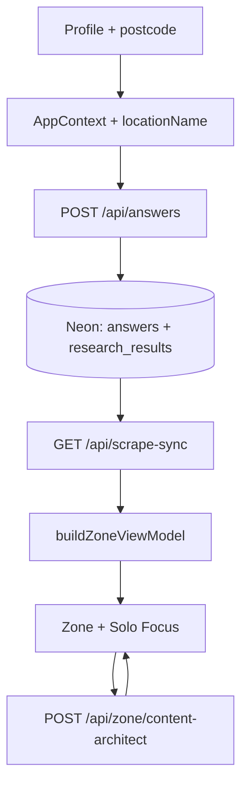

# App Flow And Pipeline (spec)

> **Canonical user-facing doc:** [USER-FLOW-AND-DATA-PIPELINE.md](USER-FLOW-AND-DATA-PIPELINE.md) — keep that file updated for ops and copy contracts. This spec adds structural constraints for architects.

## 1. End-to-end user flow

| Step | Route | User | System |
| --- | --- | --- | --- |
| 1 | `/`, `/intro` | Land, start profile | Motion, optional geocode → `profile_postcode` |
| 2 | `/profile` | Onboarding genome | Context + `POST /api/local-intelligence` → `locationName` |
| 3 | `/profile/summary` | Review totals | Atomic ticker → Zone handoff |
| 4 | `/zone` | 13 category cards | `GET /api/scrape-sync`, `buildZoneViewModel`, mechanical truth |
| 5 | Solo Focus | Open card | Marvin hook H1 + town-based lead + 3-beat prose |
| 6 | Answer | MC / loop | `POST /api/answers`, discovery, optional scrape |
| 7 | Close | Return to grid | Pink on birth; visited → grid only (no loop takeover) |

## 2. Runtime architecture

## 3. Content governance

| Rule | Implementation |
| --- | --- |
| Postcode-first APIs | All research/scrape uses session postcode param |
| Town in UI prose | `lib/zone/localityCopy.ts` — no raw postcode in Solo Focus lead |
| Category isolation | `contentProseSanitize`, `isAcceptableZoneJourneyHeadline` per `journey_key` |
| Warm voice | `lib/zone/zoneVoice.ts` — Gemini + Content Architect; Solo Focus dedupe via `dedupeTrueTipParagraphs` |
| Expanded hook | `EXPANDED_JOURNEY_HOOK` per `journey_key` when DB headline is thin or off-topic |
| Mechanical truth | No fake £/kg without Neon stream (`mechanicalTruth.ts`) |
| HTTPS CTAs | `offerUrlGuard`, `trustedJourneyUrls` |

## 4. Deploy and wake

| Task | Command |
| --- | --- |
| Verify | `npm run verify` |
| Deploy + promote | `npm run deploy` |
| Staged only | `npm run promote` |
| Stack smoke | `npm run stack:verify` |
| Hermes | `npm run hermes:ping` |
| Dev seed (13 journeys) | `npm run pipeline:seed -- YOURPOSTCODE` |

Details: [DEPLOY-VERCEL.md](DEPLOY-VERCEL.md), [HANDBOOK.md](HANDBOOK.md).
