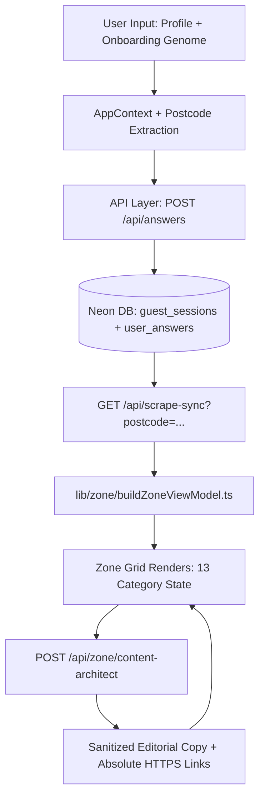

# User Flow and Data Pipeline Specification

This document defines the deterministic user lifecycle and content generation constraints for the 00-ULM application framework.

## 1. End-to-End User Flow Matrix

| Step | Route / Surface | User Interaction | System Operation |
| :--- | :--- | :--- | :--- |
| 1 | `/` / `/intro` | Initial land, triggers optional geocode capture. | Initialises motion wrappers, triggers client-side location vectoring. |
| 2 | `/profile` | Submits answers to core onboarding genome questions. | Writes answers to local state Context and session persistence layers. Locates user via active postcode. |
| 3 | `/profile/summary` | Reviews localized baseline totals framing. | Compiles aggregate impact framing and triggers background generation routines. |
| 4 | `/zone` | Interacts with dashboard grid of 13 separate category cards. | Fetches scraped metrics, groups items by active postcode, enforces a strict visual max of 3 aggregate cards on Home view. |
| 5 | Card Open (Solo Focus) | Triggers active click event into full-screen Overlay view. | Mounts unique article view. Loads specialized loop question, likes container, localized savings data, and ZAI chat context scoped *only* to this article. |
| 6 | Interloop Action | Answers inner loop engagement or updates parameters. | Executes `POST /api/answers`, triggers dynamic Neon mutation, flags card record state. |
| 7 | Solo Focus Close | Returns to primary layout. | If card is unvisited: updates state. If card is visited: visual container turns Pink (#FF00FF). Re-opening visited cards closes strictly to the grid with no loop takeover. |

## 2. Dynamic High-Level Runtime Architecture

## 3. Strict Structural Content Governance Rules

### A. Postcode-First Localization

All regional calculations must stem from the active session's postcode. If a non-local postcode is evaluated, the system must drop static context metrics and calculate fresh local thresholds (e.g., regional utility grid carbon intensity).

### B. Category Domain Isolation

Cross-contamination of metrics is strictly banned. If the active category is `GRANTS` and the topic is `e-bike schemes`, the text engine is explicitly barred from pulling data points, copy, or citations belonging to `Boiler Upgrade Schemes` or `Ofgem`.

### C. System String Sanitization

No raw schema parameters, parenthetical logic instructions, variable handles, or conditional flags (e.g., `(official cap pathway)`) may be rendered in the final user-facing string layers.

### D. Absolute Link Protocols

Outbound target handles and call-to-action endpoints must be normalized with explicit absolute protocols (`https://www.`) rather than plain text web domain fragments.

### E. Visited Card Constraints

- **Unvisited State:** Cards render using clear transparent/white structural boundaries.
- **Visited State:** Cards alter visual state to ULM Pink (#FF00FF). Re-opening a visited card displays the absolute metric asset details but forbids injecting loop takeover questions on close events.

