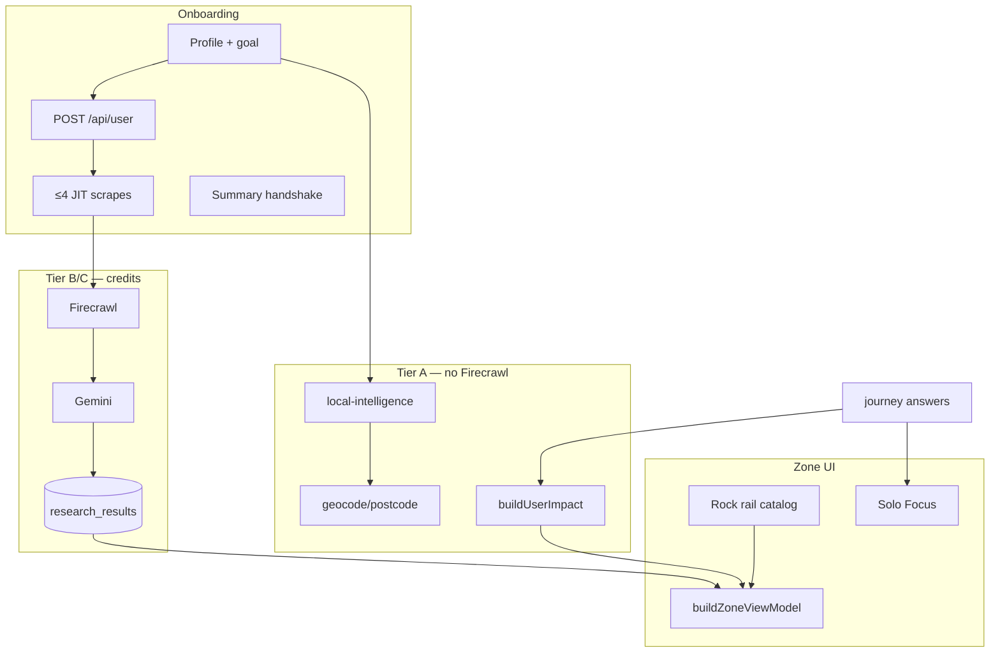

# Zero Zero — complete app overview & testing reference

**Purpose:** One document to understand what the app does, where every piece of content comes from, how £ and carbon are calculated, and how to test each layer.

**Cross-links:** [HANDBOOK.md](HANDBOOK.md) · [PROFILE-FIELDS-GRID-UNLOCKS.md](PROFILE-FIELDS-GRID-UNLOCKS.md) · [INTELLIGENCE-PIPELINE-FINAL.md](INTELLIGENCE-PIPELINE-FINAL.md) · [DEV-TEST-AUDIT.md](DEV-TEST-AUDIT.md)

**Production:** https://www.00-00.online · **Repo:** https://github.com/00app/00-ULM.git

---

## 1. What the app is

Zero Zero is a UK postcode-driven energy and lifestyle auditor. A user provides a **postcode** and short **profile** (household, home type, power type, transport, age, employment, goal). The app builds a personalised **Zone** — a bento grid of **13 journey domains** (home, utilities, grants, solar, travel, etc.) with savings and carbon hints. Tapping a card opens **Solo Focus**: embedded questions, researched copy, and optional **discovery** child cards.

| Metaphor | Role | Implementation |
|----------|------|----------------|
| **Brain** | Reasoning and copy | Gemini — headlines, three prose paragraphs, discovery cards |
| **Stomach** | Ingestion | Firecrawl — UK pages (Ofgem, GOV.UK, grants, tariffs) |
| **Memory** | Persistence | Neon Postgres — users, answers, `research_results` |
| **Nervous system** | Orchestration | Next.js on Vercel — API routes, client VM |
| **Hermes** | Scheduled repair | Weekly cron → `/api/cron/zone-research` |

**Mechanical truth:** Tiles show **COMPUTING — JOURNEY** and £0 until Neon or scrape-sync has **stream data**. No fake marketing £ on an empty database.

---

## 2. User journey (routes)

| Step | Route | What happens | Key APIs / modules |
|------|-------|--------------|-------------------|
| Intro | `/`, `/intro` | Goal choice; optional geolocation postcode | `profile_goal` in localStorage |
| Profile | `/profile` | 8 steps + goal; **`POST /api/user`** on submit | Session cookie, JIT scrapes (≤4) |
| Summary | `/profile/summary` | HELLO → name → locality ticker; research handshake | `runProfileResearchHandshake` |
| Zone | `/zone` | Welcome → profile hero → Today's Tips + Rock → Recommendations bento → signup | `GET /api/scrape-sync`, `buildZoneViewModel`, `buildGroovyGridItems` |
| Solo Focus | Overlay | 1 MC question → answer → result; discovery birth | `POST /api/answers` |
| Solo Focus close | Lifestyle loop question → short pulse → atomic exit → grid | `DiscoveryTakeover` |
| Solo Focus like | Card **stays open**; like button selected state; `offer_signals` + snapshot; Zai may route to `/likes` on first like | `SoloFocusActionTrinity`, `trackZoneLike`, `LikesCardActionTrinity` |
| Solo Focus nope | Offer feedback question → grid; card suppressed | `OfferFeedbackTakeover`, `offer_signals` |
| Zai | `/zai` | Read-only chat (Gemini); no MC birth | `POST /api/zai` |
| Likes / Settings | `/likes`, `/settings` | Liked Zone + Zai picks (not actioned); trinity GET/CLAIM/BUY + unlike + done | `AppContext`, `zz_zai_likes`, `likeCardSnapshots` |

**Canonical path:** Profile → Summary → Zone. Session (`POST /api/user`) is required for SMS and full Neon user rows.

---

## 3. End-to-end data flow



| Stage | Reads | Writes | Costs credits? |
|-------|-------|--------|----------------|
| Postcode geocode | Postcodes.io, Nominatim | `profile_locality_name` | No |
| Local intelligence | Council, carbon, grants context | session / genome | No |
| Zone hydrate | `research_results`, coverage | client state | No (read) |
| Onboarding JIT | Profile snapshot | Neon rows | Yes (≤4 journeys) |
| MC answer | Profile + answers | `journey_answers_jsonb`, discovery | Optional JIT per journey |
| Hermes weekly | Stale rows | repair `research_results` | Yes (batch) |
| Zai chat | Genome + research URLs | transcript | Gemini only |

---

## 4. Where content comes from (UI element matrix)

Use this table when testing: **if X on screen, data must come from Y**.

### 4.1 Journey mother tiles (13 bento cards)

| UI element | Primary source | Fallback | Module |
|------------|----------------|----------|--------|
| **Headline (5–8 words)** | Neon `agent_headline` | Content Architect polish; `profileDrivenJourneyTitle` | `buildZoneViewModel`, `zoneCardHeadlineFromRaw` |
| **SAVE £** | Neon `saving_amount_gbp` if stream | `buildUserImpact` per journey | `mechanicalTruth.journeyHasStreamData` |
| **CARBON kg** | `buildUserImpact` + stream | 0 / `—` when COMPUTING | `lib/brains/calculations.ts` |
| **COMPUTING title** | No stream | `computingJourneyTitle(journey)` | `mechanicalTruth.ts` |
| **CTA / BUY URL** | Neon `offer_url` | Formula URL → `trustedJourneyUrls` → `/zai` | `buildZoneViewModel`, `resolveSoloFocusHandoffUrls` |
| **Prose (Solo Focus)** | Neon `architect_prose` (3 paragraphs) | Warm auditor fallback | `researchAgent.ts` |
| **Audit badge** | LIVE vs ESTIMATED | `vmAuditLive()` | `buildZoneViewModel` |
| **Visited pink** | User closed card / loop | `visitedCards`, server breadcrumbs | `app/zone/page.tsx` |
| **Council grant bar** | `getLocalData(postcode)` | geocode + local-intelligence | Not from MC answers |

### 4.2 Today's Tips (Rock rail)

| UI element | Source | Module |
|------------|--------|--------|
| **Title** | Static habit catalog | `lib/rock/habitsCatalog.ts` |
| **£ / kg on tile** | `habit.money_gbp` / `habit.carbon_kg` | catalog — **not** Neon journey row |
| **Learn URL** | `resolveRockHabitLearnUrl` | slug map → provider map → topic shield |
| **Neon offer merge** | Journey `latestOfferUrl` only if topic-safe | `mergeRockHabitWithJourneyOffer` |
| **Which habits show** | Season + off-wall dedupe | `prepareRockHabitsForRail` (6 visible, 12 cap) |
| **Solo Focus expand** | Habit `insight` only — **never** mother hook/prose | `headlineFromRockHabit` |

### 4.3 Profile summary ticker

| Word | Source |
|------|--------|
| HELLO, name, locality | `buildSummaryStaccatoWords` + `IntroWordCycle` |
| Waste beats | `buildUserImpact` → `summaryWaste` |

### 4.4 SMS (mobile signup)

| Section | Source |
|---------|--------|
| Welcome | `lib/messaging/welcomeSms.ts` (fixed copy) |
| Today's tips | `zoneSignupTips` → `resolveRockHabitLearnUrl` per habit |
| Recommendations | Journey VM rows → `resolveJourneyCardUrl` |

### 4.5 Zai chat

| Input | Source |
|-------|--------|
| Context | `user_genome`, journey answers, `research_results` URLs/£ |
| Scrape | **Only** on Deep Dive “Search deeper” — not on every message |

---

## 5. How £ and carbon are calculated

**Single source of truth:** `lib/brains/buildUserImpact.ts` → `lib/brains/calculations.ts`. **UI must never invent totals.**

### 5.1 Pipeline

1. **Profile** + **journey answers** (from localStorage / Neon `journey_answers_jsonb`)
2. If answers missing for a journey, **synthetic mid-bands** from profile (`lib/brains/profileJourneyBaseline.ts`) — badge stays **ESTIMATED_AUDIT**
3. Per-journey calculator → annual £ and kg
4. Optional **scraped overlay** (≤20% delta) when scrape-sync provides data points
5. **`buildZoneViewModel`** blends impact + Neon `saving_amount_gbp` when stream exists

### 5.2 Per-journey calculators (what answers affect £)

| Journey | Calculator | Key answer fields |
|---------|------------|-------------------|
| **home** | `calculateHome` | `monthly_cost`, `energy_type`, `green_tariff`, providers; policy savings via `tariff_type` from utilities/money |
| **utilities** | `calculateUtilities` | `tariff_type` → April 2026 policy savings |
| **grants** | `calculateGrants` | `boiler_age`, `income_benefits`, `prior_eco_bus` |
| **solar** | `calculateSolar` | `roof_orientation`, `roof_shading`, `daytime_occupancy` |
| **travel** | `calculateTravel` | `commute_distance`, `ev_hybrid` |
| **holidays** | `calculateHolidays` | `annual_flights`, `flight_duration`, `carbon_offsets` |
| **food** | `calculateFood` | `diet_profile`, `organic_shopping` — never wired to onboarding UI; real live signal is loop nudge `food_plant_shift` (2026-07) |
| **shopping** | `calculateShopping` | `retail_channel`, `repair_mindset`, `online_deliveries` — never wired to onboarding UI; real live signal is loop nudge `shopping_repair_first` (2026-07) |
| **money** | `calculateMoney` | `monthly_energy_bill`, `tariff_type`, `green_investments` — `tariff_type` never wired to onboarding UI; real live signal is loop nudge `money_smart_tariff` (2026-07) |
| **tech** | `calculateTech` | `smart_thermostat`, `smart_home`, `smart_meter` — never wired to onboarding UI; real live signal is loop nudge `tech_standby_off` (2026-07) |
| **water** | `calculateWater` | `garden_butt`, `wash_preference`, `rainwater_harvest` |
| **waste** | `calculateWaste` | `food_waste_collection`, `composting`, `soft_plastics` — never wired to onboarding UI; real live signals are loop nudges `waste_compost` + `food_waste_cut` (2026-07; `food_waste_cut`'s `journeyKeys` is `['waste']` despite the name) |
| **carbon** | `calculateCarbon` | `footprint_awareness`, `carbon_removal`, `tonne_reduction_timeline` |

**Dead calculator fields vs. real loop-nudge signals (2026-07):** several calculators above checked for onboarding-question keys (`diet_profile`, `retail_channel`/`repair_mindset`/`online_deliveries`, `tariff_type`, `smart_thermostat`/`smart_home`/`smart_meter`, `food_waste_collection`/`composting`) that were never actually wired to any onboarding UI field — those calculators always fell to their baseline value regardless of what a user answered. Each now also checks the real, live loop-nudge answer for the same topic (the `journey_*_answers` value written when a user answers the MC-close loop question for that category — see `loopQuestions.ts`) as an additional, softer signal alongside the still-dead legacy key. Before assuming a calculator "isn't personalizing," check whether its documented field actually has a live UI path — this table intentionally still lists the legacy keys since they remain in the function signature and would apply if ever wired up.

**Employment physics:** `applyEmploymentFinancialPhysics` adjusts several journeys by employment status.

**Grid carbon:** Electricity kg uses NESO regional intensity (`gridCarbonContextForPostcode`) or live pulse when available.

**Constants:** July 2026 price cap typical **£1,862**; ~**12,000 kWh ≈ 1 tonne CO₂e** framing — `lib/brains/constants.ts`.

### 5.3 Questions that do NOT change calculator £ (scrape + genome only)

- **home:** `property_type`, `insulation_level`, `glazing_type`
- **utilities:** `supplier_switch`, `monthly_energy_band`
- **travel:** `public_transport`
- **food:** `own_produce`

All MC answers still: persist to genome, trigger `runLoopSpawnResearch`, can birth discovery cards, bump `getGenomeModifier`.

### 5.4 When wall shows £0 vs real numbers

| Condition | Wall behaviour |
|-----------|----------------|
| No Neon stream + no profile baseline | **COMPUTING — JOURNEY**, metrics `—` |
| Profile baseline only | Estimated £ from formulas; **ESTIMATED_AUDIT** |
| Neon `saving_amount_gbp` + valid headline/prose | **LIVE_AUDIT**; Neon £ can override formula |
| Utilities without `home_power` | Tile visible but **COMPUTING** until power type set |

**Verify:** `lib/zone/mechanicalTruth.ts` — `journeyHasStreamData`, `hasAnyStreamData`.

---

## 6. Research & scrape pipeline (content birth)

### 6.1 When scrapes fire

| Trigger | API | Cap |
|---------|-----|-----|
| Profile submit | `triggerOnboardingResearchBootstrap` | 4 journeys (home + utilities if power + 2 goal-aligned) |
| Summary exit | `runProfileResearchHandshake` (deduped) | fills gaps |
| MC answer | `POST /api/answers` → `runLoopSpawnResearch` | per answer |
| Journey 3/3 complete | `triggerSupplementalResearch` | full category |
| Solo Focus Tip +1 | `POST /api/scrape-sync` with `journey_key` | one domain (Topic Shield) |
| Hermes | `GET /api/cron/zone-research` | weekly repair batch |

### 6.2 What gets persisted (Neon `research_results`)

| Column | Use |
|--------|-----|
| `category` / journey key | Tile assignment |
| `saving_amount_gbp` | SAVE £ on wall when stream valid |
| `agent_headline` | Bento headline |
| `architect_prose` | Solo Focus prose (3 paragraphs) |
| `offer_url`, `source_url` | CTA and attribution |
| `research_snapshot` | Firecrawl/Gemini invoke metadata |
| `profile_snapshot` | Postcode, employment, goal at scrape time |

### 6.3 Read path

`GET /api/scrape-sync?postcode=&user_id=` → `research_category_coverage` → `neonJourneyResearchFromCoverage` → `buildZoneViewModel`.

**Honest empty:** `{ source: "pending", scraped: [] }` — not fabricated defaults.

---

## 7. Personalization layers

| Input | Effect |
|-------|--------|
| **Postcode** | All scrapes, council, grid carbon, locality in copy |
| **House number** | EPC address match in research |
| **Goal** | JIT journey pick; `goalSortWeights` hero/tip order |
| **Like / nope feedback** | Grid sort weights, scrape avoid hints, Hermes `offer_feedback` | `offerPreference`, `offer_signals` |
| **Power type** | Unlocks utilities tile; utilities JIT; tariff seeds |
| **Employment** | Grant vs agile seeds; `filterTipsForEmployment`; grants title |
| **Household / transport / home type** | Impact baselines, synthetic answers, titles |
| **Age** | Tip persona boost (JUNIOR→tech, RETIRED→home) |
| **MC answers** | Per-journey £; supplemental scrape; discovery birth |

Full profile matrix: [PROFILE-FIELDS-GRID-UNLOCKS.md](PROFILE-FIELDS-GRID-UNLOCKS.md).

---

## 8. Storage map

### 8.1 localStorage (client)

| Key | Content |
|-----|---------|
| `profile_postcode`, `profile_name`, `profile_goal`, … | Profile fields |
| `journey_{key}_answers` | MC answers per journey |
| `zz_research_user_id` | Guest research UUID |
| `zz_onboarding_jit_journeys` | sessionStorage — JIT dedupe |

### 8.2 Neon (server)

| Table / column | Content |
|----------------|---------|
| `users` | name, postcode, mobile, `primary_goal`, session link |
| `user_genome` (JSONB) | house_number, home_power, employment, … |
| `journey_answers_jsonb` | All MC answers |
| `research_results` | Per journey/postcode/user research rows |
| `sessions` | httpOnly auth |

---

## 9. Testing guide (logic & content)

### 9.1 Automated gates (run first)

```bash
npm run verify                  # typecheck + lint
npm run test:mechanical-truth   # honest empty VM, Rock URL alignment, cap lock
npm run db:test                 # Neon connectivity
```

### 9.2 API probes

```bash
# Health + DB
curl -sS https://www.00-00.online/api/health | jq .

# Honest empty (fresh postcode, no rows yet)
curl -sS "https://www.00-00.online/api/scrape-sync?postcode=SW1A1AA" | jq '.source, (.scraped|length), .research_category_coverage'

# After profile + wait ~2min — expect coverage keys for JIT journeys
npm run db:log-research
npm run zone:audit-gates -- YOURPOSTCODE
```

### 9.3 Browser test matrix

| # | Test | Pass criteria | Proves |
|---|------|---------------|--------|
| T1 | New user profile → summary → zone | Session cookie; locality on summary | `POST /api/user`, geocode |
| T2 | Fresh postcode first load | COMPUTING titles, £0 hero | mechanical truth |
| T3 | After JIT (~2 min) | JIT journeys off COMPUTING | Firecrawl+Gemini→Neon |
| T4 | Set power type | Utilities tile unlocks | `utilitiesZoneUnlock` |
| T5 | Goal money vs carbon | Different JIT keys in coverage | `onboardingResearchBootstrap` |
| T6 | Grants OVER_10YR answer | Grants £/URL updates | `calculateGrants` + scrape |
| T7 | Expand Rock tip | Habit insight, catalog £ | not mother prose |
| T8 | Expand journey card | Neon headline/prose or COMPUTING | stream gating |
| T9 | MC answer close | Discovery card in tips | `injectNewDiscoveryCard` |
| T10 | Mobile opt-in | Welcome + tips SMS; URLs topic-aligned | `signupZoneSms` |
| T11 | Employed user | No means-tested grant tips on Rock | `filterTipsForEmployment` |
| T12 | Solo Focus **like** | Card **remains open**; like circle shows selected colours; row on `/likes` with offer CTA | `SoloFocusActionTrinity`, `LikesCardActionTrinity`, `resolveZaiPickHandoff` |
| T13 | Solo Focus **nope** | Card closes; feedback question; card suppressed on wall | `OfferFeedbackTakeover`, `gridOrder`, `offerPreference` |
| T14 | Solo Focus **close (X)** | Lifestyle loop question (not offer feedback) | `DiscoveryTakeover`, `loopQuestions` |
| T15 | Expand any journey card | No ellipsis in H1 or lead | `isTruncatedSentence` guard |
| T16 | Expand any journey card | Lead contains town name | `buildAuditorDetectionParagraph` |
| T17 | Expand Rock tip | Headline is 20–24 words | `headlineFromRockHabit` |
| T18 | Zone wall section order | After pulse: welcome → profile card → today's tips h3 → Rock → recommendations h3 → category grid → signup; headings **not** inside bento flex | `zone-section-*` testids, `wallSectionsReady` |
| T19 | Nav links (≥768px) | Zone rail: Likes / Settings / Zai `<Link>` routes return 200 | `ZoneDesktopNavRail`, `floating-nav--zone-rail-desktop` |
| T20 | `/likes` empty | Title **no likes** only — no intro paragraph | `app/likes/page.tsx` |
| T21 | `/likes` with picks | Top label + headline + SAVE/CARBON + **GET/CLAIM/BUY** → unlike → done | `LikesCardActionTrinity`, `resolveZaiPickHandoff` |

### 9.4 What to check when something looks wrong

| Symptom | Likely cause | Check |
|---------|--------------|-------|
| All tiles COMPUTING forever | No Neon rows; JIT not fired; wrong DB | `db:log-research`, session, `DATABASE_URL` host |
| Fake-looking £ with empty DB | Should not happen — report bug | `mechanicalTruth`, `uk2026Defaults` |
| Wrong CTA URL | Neon offer vs trusted fallback | `research_results.offer_url`, `offerUrlGuard` |
| Rock tip → wrong URL | Journey URL bleed | `resolveRockHabitLearnUrl`, topic shield |
| Utilities locked after pulse | `home_power` dropped from VM rebuild | profile in `vmLive` build |
| SMS but no text | Twilio trial / env | `describeOutboundReadiness`, Vercel env |
| Answers don't change £ | Question not in calculator map | §5.3 above |

---

## 10. Code index (quick)

| Path | Role |
|------|------|
| `app/profile/ProfilePageClient.tsx` | Profile steps, `POST /api/user`, JIT trigger |
| `app/profile/summary/page.tsx` | Ticker, research handshake |
| `app/zone/page.tsx` | Zone orchestrator, scrape-sync hydrate, Rock/SMS payload |
| `app/api/scrape-sync/route.ts` | Research read + JIT trigger |
| `app/api/answers/route.ts` | MC save, discovery, supplemental scrape |
| `app/api/profile/mobile/route.ts` | SMS signup |
| `lib/brains/buildUserImpact.ts` | **Only** £/kg calculator entry |
| `lib/brains/calculations.ts` | Per-journey formulas |
| `lib/zone/buildZoneViewModel.ts` | Zone VM — tiles, sort, filters |
| `lib/zone/mechanicalTruth.ts` | COMPUTING vs stream |
| `lib/agents/researchAgent.ts` | Firecrawl + Gemini persist |
| `lib/rock/habitsCatalog.ts` | Rock habit catalog |
| `lib/rock/resolveRockHabitLearnUrl.ts` | Topic-aligned tip URLs |
| `lib/journeys.ts` | 13×3 question registry |
| `lib/zone/ulmLimits.ts` | 24 cells, 3 injects/journey |
| `lib/zone/offerFeedbackLoop.ts` | Nope feedback beats + Settings log |
| `app/components/OfferFeedbackTakeover.tsx` | Post–**nope** one-shot question (like no longer closes Solo Focus) |
| `app/components/LikesCardActionTrinity.tsx` | Likes wall — offer CTA + unlike + done |
| `lib/zai/resolveZaiLikeHandoff.ts` | Zai pick BUY/GET/CLAIM + partner URL fallback |
| `app/components/DiscoveryTakeover.tsx` | Lifestyle loop + clean birth exit |

---

## 11. Director's Order (product sequence on Zone)

1. Architectural pulse → grid reveal  
2. Journey mother tiles (13)  
3. Solo Focus: question → answer → result → optional discovery  
4. **Close (X):** lifestyle loop question → short pulse (`audit` / `done.`) → atomic shell exit → grid  
5. **Like:** card stays open — user can still read prose and tap GET/CLAIM/BUY; like recorded to `/likes`  
6. **Nope:** offer feedback question → atomic exit → grid (disliked cards suppressed)  
6. Today's Tips (Rock) — visit only, no loop scrape on close  
7. Mobile signup below Rock when grid collapsed  

Pink = visited. Discovery birth only via `POST /api/answers` (canonical).
