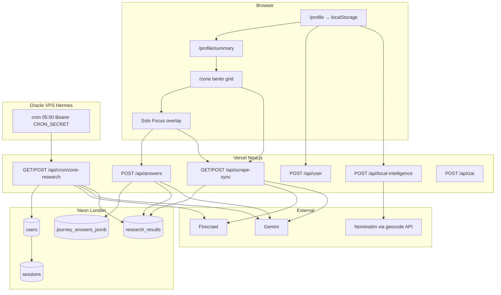
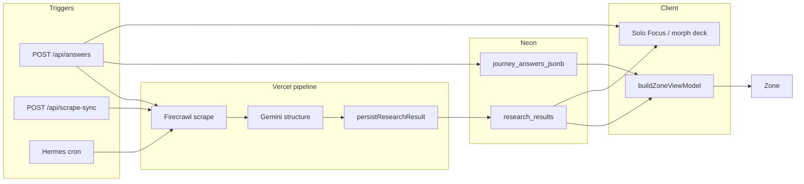
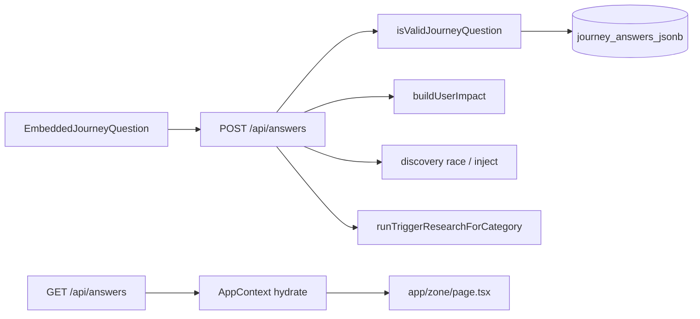
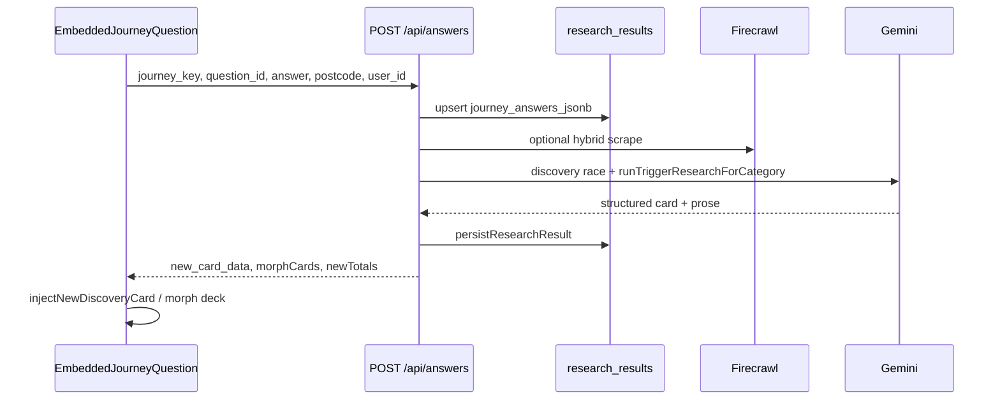
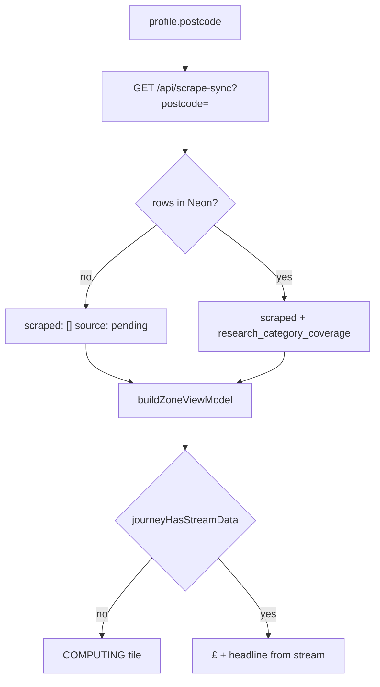

# Zero Zero (00-00) — Full application specification

Operational architecture for the UK postcode-driven energy auditor: what talks to what, where data lives, and how Profile, Zone, Solo Focus, and Neon research fit together.

**Related docs:** [HANDBOOK.md](HANDBOOK.md) · [ZONE-CONTENT-AND-DATA.md](ZONE-CONTENT-AND-DATA.md) · [SENTINEL.md](SENTINEL.md) · [SUPPLEMENTAL-SYSTEMS.md](SUPPLEMENTAL-SYSTEMS.md) · [INTELLIGENCE-LOOP-MANIFEST.md](INTELLIGENCE-LOOP-MANIFEST.md) · [INTELLIGENCE-PIPELINE-FINAL.md](INTELLIGENCE-PIPELINE-FINAL.md) · [PROFILE-ANSWERS-ZONE-TECH.md](PROFILE-ANSWERS-ZONE-TECH.md) · [PROFILE-FIELDS-GRID-UNLOCKS.md](PROFILE-FIELDS-GRID-UNLOCKS.md) · [ZAI-AND-QUESTIONS-RULES.md](ZAI-AND-QUESTIONS-RULES.md)

**Production:** https://www.00-00.online · **Repo:** https://github.com/00app/00-ULM

---

## 1. Product overview

Zero Zero is a UK-first web app. A user provides a **postcode** and a short **profile** (household, transport, goals). The app shows a **Zone** — a bento grid of 13 journey domains (home, grants, solar, travel, etc.) with savings and carbon hints. Tapping a card opens **Solo Focus**: answer embedded questions, see a researched recommendation, then optionally **spawn** a sharper “child” insight.

### 1.1 Metaphor: brain, stomach, memory, nervous system

| Metaphor | Role | Implementation |
|----------|------|----------------|
| **Brain** | Reasoning and copy | **Gemini** — audits, headlines, three prose paragraphs, discovery cards |
| **Stomach** | Ingestion | **Firecrawl** — scrapes trusted UK pages (Ofgem, GOV.UK, grants, tariffs) |
| **Memory** | Persistence | **Neon Postgres** — users, answers, `research_results` per category/postcode |
| **Nervous system** | Orchestration | **Next.js on Vercel** — API routes: scrape → model → persist → JSON to browser |
| **Hermes (VPS)** | External clock | **Oracle VPS** hits `/api/cron/zone-research` daily; does not run AI itself |

Hermes only **wakes** the app. The app uses `DATABASE_URL`, `GEMINI_API_KEY`, and `FIRE_CRAWL_KEY_2` (or `FIRECRAWL_API_KEY`) to execute the pipeline.

---

## 2. High-level architecture



### 2.1 End-to-end intelligence loop



---

## 3. User journey (routes)

| Step | Route | What happens |
|------|--------|----------------|
| Intro | `/`, `/intro` | Logo glitch (Style A) → kinetic words → lockup **CREATE A / PROFILE TO / START.** at **profile H2 scale** → CREATE → profile. Geolocation may seed `profile_postcode`. `?skip=1` skips logo. |
| Profile | `/profile` | Stepped onboarding: name (**given-name**, first token only), **postcode** (+ optional house number), household, home type, **power type**, transport, age, employment. **Goal** from intro (`profile_goal`). Full-sentence fade per step. **`POST /api/user`** on submit → session + capped JIT scrapes. |
| Summary | `/profile/summary` | Kinetic **HELLO → name → locality** (`IntroWordCycle`, opacity ticker only). Impact totals. Handshake scrape. |
| Zone | `/zone` | 13 journey cards + Saving Tips; hydrates from Neon via scrape-sync. |
| Solo Focus | Overlay on Zone | Questions → answer → zip-shut → result / morph card. |
| Zai | `/zai` | Free-form chat (Gemini), separate from MC answer birth path. |
| Other | `/likes`, `/settings` | Saved cards, reset/session. |

There is no separate `/journeys` product route — journeys live on Zone.

**Canonical Zone path:** `app/zone/page.tsx` → `lib/zone/buildZoneViewModel.ts` (facade: `lib/logic/zone.ts`).

### 3.1 Personalization — how questions influence Zone

Every signed-in user who completes profile + summary hits the same **staged** intelligence loop. Questions influence Zone through **four channels** (not every question changes every tile’s £):

| Channel | What moves | Primary inputs |
|---------|------------|----------------|
| **JIT scrape selection** | Which journeys get Firecrawl+Gemini first (cap 4) | Goal, power type, employment seeds |
| **£ / kg maths** | Journey tile SAVE/CARBON when stream exists | Profile + journey MC answers → `buildUserImpact` |
| **Sort / filter / copy** | Hero order, grants headline, Rock tip filter | Goal, employment, age persona, council |
| **Neon synthesis** | Headlines, prose, `offer_url` on mother tiles | Postcode DNA, profile snapshot, answers in prompts |

**Authoritative matrices:** [PROFILE-FIELDS-GRID-UNLOCKS.md](PROFILE-FIELDS-GRID-UNLOCKS.md) (profile + pipeline) · [PROFILE-ANSWERS-ZONE-TECH.md](PROFILE-ANSWERS-ZONE-TECH.md) §1–2 (39 MC questions) · [INTELLIGENCE-PIPELINE-FINAL.md](INTELLIGENCE-PIPELINE-FINAL.md) (triggers + offer URL precedence).

**Offer URL precedence (journey mother tiles):** Neon `offer_url` → formula `claimOfferUrl` (Octopus, EV grant, etc.) → `trustedJourneyUrls` → Ask Zai deep link. **Rock Today's Tips:** habit slug/provider map via `resolveRockHabitLearnUrl` — Neon journey offer merged only when `mergeRockHabitWithJourneyOffer` passes topic shield (no e-bike → Eurostar bleed).

---

## 4. Postcode, profile, and identity

### 4.1 Postcode as geographic anchor

- Stored in **`localStorage`** as `profile_postcode` and on `users.postcode` after signup.
- Zone reads via `readProfilePostcode()` / `AppContext`; passed on every research call.
- Geocoding never runs in the browser:
  - `POST /api/local-intelligence` — council, ward, grant context
  - `GET /api/geocode/postcode` — locality cached as `profile_locality_name`

**Postcode change** → `clearZoneVmLocalCache()` wipes journey answers, hero totals, Solo Focus session keys, locality cache.

**Read order:** URL `?postcode=` → `localStorage profile_postcode` (`lib/zone/safeProfileStorage.ts`).

### 4.2 Profile onboarding → server user

1. User completes steps in `ProfilePageClient.tsx`.
2. **`POST /api/user`** creates `users` row (`gen_random_uuid()`), sets **httpOnly session cookie**, returns locality from `getLocalData(postcode)`.
3. Client mirrors to `localStorage` and `AppContext.refreshProfile()`.

If signup fails, client keeps localStorage and can use a **browser research UUID** (`ensureClientResearchUserId`) for scrape-sync and answers without session.

### 4.3 Research user id (Neon row ownership)

| Priority | Source |
|----------|--------|
| 1 | Session (`users.id` + `sessions` cookie) after successful `/api/user` |
| 2 | Client research id: Gary UUID for BN17, or `crypto.randomUUID()` in `zz_research_user_id` |

Passed as `?user_id=` on **GET scrape-sync** and in **POST** bodies for trigger/answers.

### 4.4 Gary / demo mode (BN17 only)

- Postcode starting with **BN17** pins research to UUID `00000000-0000-4000-a000-000000000000`.
- All scrape-sync calls append `user_id` when active (`lib/zone/garyMode.ts`).
- Links pre-seeded Neon rows to demo — **not** a default for unknown postcodes.

### 4.5 Locality (Summary header)

- `resolveProfileLocalityForPostcode` + Nominatim via geocode API.
- Summary uses current postcode locality, not a fixed demo string (`lib/brains/summaryLogic.ts`).

---

## 5. Journey questions and answers (13 × 3)

**Source of truth:** `lib/journeys.ts`

| Journey key | Example question ids |
|-------------|----------------------|
| `home` | `property_type`, `insulation_level`, `glazing_type` |
| `utilities` | `tariff_type`, `supplier_switch`, `monthly_energy_band` |
| `grants` | `boiler_age`, `income_benefits`, `prior_eco_bus` |
| `solar` | `roof_orientation`, `roof_shading`, `daytime_occupancy` |
| `travel` | `commute_distance`, `ev_hybrid`, `public_transport` |
| `holidays` | `annual_flights`, `flight_duration`, `carbon_offsets` |
| `food` | `diet_profile`, `organic_shopping`, `own_produce` |
| `shopping` | `retail_channel`, `repair_mindset`, `online_deliveries` |
| `money` | `monthly_energy_bill`, `tariff_type`, `green_investments` |
| `tech` | `smart_thermostat`, `smart_home`, `smart_meter` |
| `water` | `garden_butt`, `wash_preference`, `rainwater_harvest` |
| `waste` | `food_waste_collection`, `composting`, `soft_plastics` |
| `carbon` | `footprint_awareness`, `carbon_removal`, `tonne_reduction_timeline` |

- **13 domains**, **3 questions each** (`JOURNEY_ORDER`).
- Question labels are **behavioural** — no £/kg in copy.
- **Next question:** `lib/zone/questionHandler.ts` → `getNextQuestion(journeyId, answers)`.

### 5.1 Where answers are stored

| Layer | Storage |
|-------|---------|
| Browser | `localStorage` → `journey_{journeyId}_answers` |
| Server | `journey_answers_jsonb` — one JSONB blob per user (all journeys) |
| Legacy | `journey_answers` normalized rows |
| Mirror | `user_profiles.journey_answers_jsonb` (optional Hermes/audit) |
| Pre-login | `guest_sessions` by `zz_sid` cookie |

### 5.2 Answer flow diagram



---

## 6. API reference

### 6.1 Identity and profile

| API | Method | Role |
|-----|--------|------|
| `/api/user` | POST | Create user + session from profile payload |
| `/api/user` | GET | Return session user or `null` |
| `/api/auth/login`, `signup`, `logout` | — | Session auth |
| `/api/local-intelligence` | POST | Postcode → council, ward, carbon context, grant hints |
| `/api/geocode/postcode` | GET | Server Nominatim proxy → locality name |

### 6.2 Twilio SMS (Rock mobile signup)

| API | Method | Role | Auth |
|-----|--------|------|------|
| `/api/profile/mobile` | POST | Save E.164 mobile; **welcome SMS** on first/changed number; **Today's Tips + Recommendations** SMS when Twilio ready | **Session required** (401 if guest) |
| `/api/webhooks/twilio` | POST | Inbound STOP / START / delivery status; persists `mobile_sms_opt_in` on `users` | Twilio webhook |

**Request body:** `{ mobile, sms_opt_in: true, tips?, tipSlugs?, recommendations?, userName? }` — **`sms_opt_in` required** (explicit PECR consent; checkbox on `RockMobileSignupCard`).

**Signup SMS copy:** `lib/messaging/signupZoneSms.ts` — dashed sections: Hello + first name → Today's tips (Rock habits via `resolveRockHabitLearnUrl`) → Recommendations (journey mother titles + `resolveJourneyCardUrl` from Zone VM).

**Welcome SMS (separate send):** `lib/messaging/welcomeSms.ts` — opt-in confirmation; fires before tips SMS when mobile is new or changed.

**UI entry:** `RockMobileSignupCard` below Today's Tips — passes `tips`, `tipSlugs`, `recommendations`, `userName` from `app/zone/page.tsx` (`zoneSignupTips`, `zoneSignupTipSlugs`, `zoneSignupRecommendations`).

**Env (Vercel Production + Preview, and `.env.local` for dev):** `TWILIO_ACCOUNT_SID`, `TWILIO_AUTH_TOKEN`, `TWILIO_PHONE_NUMBER`. Optional: `TWILIO_WEBHOOK_URL`, `TWILIO_MESSAGING_ENABLED=0` (kill sends).

**DB:** `users.mobile` · `users.mobile_sms_opt_in` (default **`false`**; STOP sets `false`, START sets `true`). Migration: `db/migrations/020_users_mobile_sms_opt_in.sql`.

**Hermes:** not involved — signup SMS is synchronous on `POST /api/profile/mobile`. Hermes only triggers weekly research repair (`/api/cron/zone-research`).

**Not in env:** User personal mobiles — Neon `users.mobile` per account. Upgrade Twilio off Trial for outbound to any signup mobile (trial = verified numbers only).

**Code:** `lib/messaging/twilioConfig.ts` · `lib/messaging/twilioClient.ts` · `lib/messaging/outboundGate.ts` · `lib/messaging/signupZoneSms.ts` · `lib/rock/resolveRockHabitLearnUrl.ts` · `app/api/webhooks/twilio/route.ts`

### 6.3 Zone hydration

| API | Method | Role |
|-----|--------|------|
| `/api/scrape-sync` | GET | Primary Zone load: `scraped[]`, `research_category_coverage`, unit rates; Tier 2: `category`, `answer`, `question_id` |
| `/api/scrape-sync` | POST | Trigger research: `{ trigger, postcode, category, user_id, profileData }` |
| `/api/scrape-sync` | GET `?repair=1` | Backfill missing headlines/prose without full Firecrawl loop |
| `/api/scrape-sync` | GET `?force=true` | Heavy full research run (slow) |

**Auth for POST scrape-sync:** Bearer `CRON_SECRET` / `SCRAPER_SECRET`, session, or **postcode + valid `user_id`**.

### 6.4 Answer loop (canonical discovery birth)

| API | Method | Role |
|-----|--------|------|
| `/api/answers` | POST | Save answer; recompute impact; discovery race; `runTriggerResearchForCategory`; returns `new_card_data`, `morphCards`, totals |
| `/api/answers` | GET | Hydrate journey answers for logged-in user |

**Auth for POST answers:** session **or** valid `user_id` in body (`lib/answers/resolveAnswersUser.ts`).

**Handler:** `app/api/answers/route.ts`

### 6.5 Supplemental (capped)

| API | Role |
|-----|------|
| `/api/research/question-card` | Free-form Ask → new card (**not** MC answer birth) |
| `/api/zone/injections` | Trap follow-up cards |
| `/api/zone/tips-refresh` | Refresh injected tip tiles |
| `/api/zone/content-architect` | Optional Gemini polish on architect prose |
| `/api/discovery/pulse` | Economy fingerprint for tip £ patches |
| `/api/zone/generate-next` | Morph / next-win hints |

**Cap:** `MAX_DISCOVERY_INJECTIONS_PER_JOURNEY` = **3** per user per journey (`lib/intelligence/manifest.ts`).

### 6.6 Scheduled and operations

| API | Role |
|-----|------|
| `/api/cron/zone-research` | Hermes: batch `runZeroResearchWithProfile` for users with postcode (Bearer `CRON_SECRET`) |
| `/api/health` | DB ping; `?live=1` for liveness only |
| `/api/health/diagnostics` | Neon / Gemini / Firecrawl booleans; session or Bearer gate |

### 6.7 Chat and misc

| API | Role |
|-----|------|
| `/api/zai` | Zai assistant (Gemini + profile/answer context) |
| `/api/pulse/living` | Living pulse proxy (Ofgem + grid; CORS-safe) |
| `/api/summary` | Summary narrative support |
| `/api/likes`, `/api/actioned` | Saved / actioned cards |
| `/api/reset` | Session / cache reset |

### 6.8 CORS rule

The browser must **not** call Ofgem or Nominatim directly. Use `/api/pulse/living`, `/api/geocode/postcode`, `/api/scrape-sync` only.

---

## 7. Zone page — data and view model

**Files:** `app/zone/page.tsx` · `lib/zone/buildZoneViewModel.ts` · `lib/brains/buildUserImpact.ts` · `lib/zone/mechanicalTruth.ts`

### 7.1 Load sequence

1. Hydrate client state — `AppContext`, `localStorage` profile, journey answers, postcode.
2. **`GET /api/scrape-sync?postcode=…&user_id=…`**
   - Reads `research_results` (by `user_id` and/or postcode).
   - Builds `research_category_coverage` per category.
   - Builds `scraped[]` journey rows.
3. **`buildZoneViewModel`** merges profile, answers, Neon coverage, scraped overlay.
4. **Mechanical truth:** no stream → `COMPUTING — <JOURNEY>`, metrics `—`.
5. **Optional:** auto-trigger `POST /api/scrape-sync` for up to 4 unsettled categories (background seed).
6. **Saving Tips** — static habit catalog (`lib/rock/habitsCatalog.ts`) + rotation.

### 7.2 Collapsed bento card fields

| UI field | Source |
|----------|--------|
| Category label | Journey key (`SOLAR`, `TRAVEL`) |
| Headline | `agent_headline` (cleaned via `cleanZonePreviewHeadline`) → `profileDrivenJourneyTitle` → short fallback |
| SAVE / CARBON | Neon `saving_amount_gbp` + impact formulas when `journeyHasStreamData` |
| “Computing…” strip | `!journeyResearchSettled(coverage[journey])` |
| Audit badge | `LIVE_AUDIT` vs `ESTIMATED_AUDIT` when genome incomplete vs research-backed |

**Headline priority:** Neon `agent_headline` only for grid preview — **not** `deep_content_tip` or raw audit prose (avoids kWh/tariff dumps on tiles).

### 7.3 Grid layout

**Wall order:** `WALL_JOURNEY_ORDER` in `app/zone/page.tsx` — same 13 keys, bento grid.

**Motion:** Style B mechanical snap (`STACCATO_*` stagger). See `lib/animations.ts` and `.cursor/rules/mechanical-pulse.mdc`.

---

## 8. Solo Focus and expanded view

**Components:** `JourneyBentoCard` / `ZoneCard` · `SoloFocusOverlay` · `EmbeddedJourneyQuestion`

### 8.1 States

1. User taps card → overlay with **mother** content from Zone VM + coverage.
2. **QUESTION** — `EmbeddedJourneyQuestion` shows next MC question (`getNextQuestion`).
3. User answers → **zip-shut** (`ZIP_SHUTTER_SPRING` / `SOLO_FOCUS_ZIP_SHUT_SEC`).
4. Next question **fade-open** (opacity + y) when `soloFocusZipShut` — no intro shimmer on handoff.

**Session cap:** `SOLO_FOCUS_MAX_QUESTIONS_PER_SESSION` in `lib/animations.ts`.

### 8.2 On answer — server sequence



### 8.3 Expanded view content

| Piece | Source / code |
|-------|----------------|
| H1 (**20–24 words**) | `headlineFromExpandedHook` + `EXPANDED_JOURNEY_HOOK` when DB title weak; `stripExpandedCardTitleNoise` |
| Lead (H4, **≤30 words**) | `resolveSoloFocusDisplayProse` + `buildAuditorDetectionParagraph` (`lib/zone/localityCopy.ts`) |
| Body (optional) | `architect_prose` via `buildResearchResultsTrueTipBody` — max 1 Roboto block when lead present |
| SAVE / CARBON | Verified £ from `research_results` when settled |
| CTA | `offer_url` → `IndustrialHandoffButton` (`resolveRevenueCtaLabel`) |
| Source link | `source_url` / `verifiedAuditSourceUrl` |
| No-offer footer | Calm UK line when no HTTPS partner URL (not “Fresh Audit…”) |
| Fallback CTA | `/zai` if no offer URL |

**Layout:** Marvin hook H1 (20–24 words) + Marvin H4 lead (≤30 words) + optional Roboto body — max 2 prose blocks; metrics row owns £/CO₂. Guards: `isRawResearchDump`, `dedupeTrueTipParagraphs`, `isMechanicalScaffoldParagraph`, `ensureLocalityAuditorLead`.

**Copy resolver:** `resolveExpandedTrueTipInsight` · `buildResearchResultsTrueTipBody` · `toThreeTrueTipParagraphs` · `resolveSoloFocusInsightDisplay`.

---

## 9. Mother card vs child card (Tier 2)

| | Mother card | Child / Tier 2 card |
|--|-------------|---------------------|
| **When** | First open of journey tile | After user answers a question in Solo Focus |
| **Data** | Latest `research_results` for journey category | Scoped re-research for category + specific answer |
| **Trigger** | Zone load / cron / profile handshake | `POST /api/answers` and/or Tier 2 `GET /api/scrape-sync` |
| **UI** | Same tile; journey-level insight | **Morph deck** — new card with sharper offer |
| **Code** | `buildZoneViewModel` | `runTier2MotherChildSwap` (`lib/zone/tier2RecursiveSpawner.ts`) |

### 9.1 Tier 2 sequence

1. User answers child question in Solo Focus.
2. Client: **`runTier2MotherChildSwap`** — persist answer locally + **`GET /api/scrape-sync?postcode&category&answer&question_id&user_id`**.
3. Server: persists to `journey_answers` when `user_id` + valid `question_id`; runs **`runTriggerResearchForCategory`**; returns updated `research_category_coverage`.
4. UI: morph deck append + `zz-tier2-profile-refresh` event → Zone hero totals refresh.

**Canonical birth (server):** `POST /api/answers` → discovery race → `injectNewDiscoveryCard` when API returns `new_card_data` / `grid_pulse_card`.

**Tier 2 fallback:** If POST answers returns 401 (stale bundle / no `user_id`), client can still run Tier 2 GET scrape-sync.

---

## 10. Firecrawl and Gemini

### 10.1 Firecrawl (stomach)

- Crawls configured UK URLs (Ofgem, GOV.UK, council grants, tariff pages).
- Returns **markdown + URLs** for the research pipeline.
- Used in: `runZeroResearchWithProfile`, `runTriggerResearchForCategory`, `runHybridLiveZoneTipForAnswer`, Sentinel, cron batch.
- **Env:** `FIRE_CRAWL_KEY_2` or `FIRECRAWL_API_KEY` (`lib/sentinel/api-config.ts` — primary name wins).

Without Firecrawl configured, trigger routes return **503 Scraper not configured**.

### 10.2 Gemini (brain)

Structures scraped text into:

| Field | Constraint |
|-------|------------|
| `agent_headline` | ~20 words, Zai Senior Auditor voice |
| `architect_prose` | Exactly three paragraphs (what / why / how in prose only) |
| `saving_amount_gbp` | Headline £ saving |
| `offer_url` | HTTPS CTA where possible |
| `source_url` | Verified citation |
| `category` | Journey key |

**Discovery race** on answer: structured pipeline, Zero Hunter, Rebirth vault (`lib/agents/rebirthVaultDiscovery.ts`).

**Persona:** Industrial, direct, UK grants/tariffs — lowercase where natural (`lib/agents/researchAgent.ts`).

**Env:** `GEMINI_API_KEY` (server-only).

### 10.3 Persist

`persistResearchResult` → `research_results` + optional `research_snapshot` JSONB (invoke metadata).

On persist, `saving_amount_gbp` and `verified_saving` are aligned.

---

## 11. Hermes and the Oracle VPS

Hermes is the **scheduled HTTP trigger**, not a separate AI runtime.

### 11.1 Typical setup

1. **~05:00 daily** — VPS shell calls:
   ```
   GET https://www.00-00.online/api/cron/zone-research?limit=20
   Authorization: Bearer <CRON_SECRET>
   ```
2. Handler (`app/api/cron/zone-research/route.ts`) loads users from **`users`** where postcode is set.
3. For each user: **`runZeroResearchWithProfile`** → Firecrawl + Gemini → Neon.
4. Zone clients read rows via **`GET /api/scrape-sync`**.

Hermes needs only **`CRON_SECRET`** on the VPS. The app holds **`DATABASE_URL`** on Vercel.

### 11.2 Manual triggers

```bash
# Fast: liveness + CRON_SECRET auth (no Firecrawl run)
npm run hermes:ping

# Full smoke: one user through zone-research (~2–5 min)
npm run hermes:pulse

# VPS / daily batch (limit=20)
bash scripts/hermes-pulse.sh

bash scripts/curl-scrape-sync-trigger.sh https://www.00-00.online BN17
```

Or `POST /api/scrape-sync` with `{ trigger: true, postcode, category, user_id }`.

**VPS crontab example** (secret file, not in repo):

```cron
0 5 * * * CRON_SECRET_FILE=/home/ubuntu/.hermes/cron.secret /path/to/00-00/scripts/hermes-pulse.sh >> /var/log/hermes-pulse.log 2>&1
```

### 11.3 Four-step loop

1. **Trigger (Hermes):** Cron hits `/api/cron/zone-research`.
2. **Extraction:** Firecrawl scrape → Gemini maps to thirteen journey categories → persist.
3. **Consumption (Zone):** Bento tiles + Solo Focus expanded copy from Neon.
4. **Expansion (user):** `POST /api/answers` → discovery → `injectNewDiscoveryCard`; supplemental Ask/inject paths capped at 3 per journey.

---

## 12. Database schema (Neon)

**Init:** `npm run init-db` applies `lib/schema.sql` + `research_snapshot` migration.

**Pooler:** `DATABASE_URL` host must match `MANIFEST_NEON_POOLER_HOST` in `lib/intelligence/manifest.ts`.

### 12.1 Hot-path tables

#### `users`

| Column | Use |
|--------|-----|
| `id` | UUID primary key |
| `name`, `postcode` | Identity + geography |
| `household`, `home_type`, `transport_baseline` | Profile |
| `age_group`, `employment_status` | Persona |
| `user_genome` | JSONB — goal, Hermes memory, profile_goal |

#### `sessions`

| Column | Use |
|--------|-----|
| `token`, `user_id`, `expires_at` | httpOnly cookie auth |

#### `journey_answers_jsonb`

| Column | Use |
|--------|-----|
| `user_id` | FK to users |
| `answers` | JSONB: all journey question maps |

#### `research_results` (source of truth for cards)

| Column | Use |
|--------|-----|
| `postcode` | Geographic filter |
| `user_id` | Personalization (nullable) |
| `category` | Journey key |
| `saving_amount_gbp`, `verified_saving` | £ on cards |
| `agent_headline` | Short H1 |
| `architect_prose` | Expanded three paragraphs |
| `offer_url` | CTA |
| `source_url` | Verified source link |
| `markdown`, `citations` | Raw scrape |
| `research_snapshot` | JSONB invoke metadata |
| `provider_name` | Attribution (Ofgem, GOV.UK) |
| `elec_unit_rate_gbp_per_kwh`, etc. | Tariff rates when extracted |
| `is_high_impact`, `carbon_impact_kg` | Rebirth / high-impact rows |
| `created_at` | Latest row wins per category lookup |

**Lookup order:** prefer `user_id`, then `postcode` for guest/postcode-only rows.

#### `user_profiles`

Optional mirror of `journey_answers_jsonb` for Hermes / audit-complete flows.

#### `discovery_injections`

Tracks injected discovery cards per user per journey (enforces cap).

#### `scraped_summary`

Legacy hero aggregates when populated.

#### `guest_sessions`

Pre-login profile + answers by `zz_sid` cookie.

### 12.2 Secondary / legacy tables

| Table | Note |
|-------|------|
| `journey_answers` | Normalized per-question rows; dual-write in some paths |
| `journey_questions` | Seeded via `npm run db:evolve-13-domains` |
| `cards`, `micro_answers` | Legacy — not on Zone hot path |
| `user_actioned_cards`, `likes` | User actions |
| `activity_status` | SSO activity visibility |

### 12.3 `insightReady` (scrape-sync)

True when a category row has prose, headline, £, or offer URL — Zone hides “Computing…” once settled.

---

## 13. Mechanical truth

The Zone wall must **not** show placeholder savings when Neon has no research stream.

| Layer | Behaviour |
|-------|-----------|
| `uk2026Defaults` | All `money_value` / `carbon_value` = **0**; leads = **Computing...** |
| `buildUserImpact` | Does **not** back-fill from UK defaults when totals are 0 |
| `mechanicalTruth.ts` | `journeyHasStreamData` — true only when stream has £, prose, or tip |
| `buildZoneViewModel` | Formula £ only if stream exists; else **COMPUTING — JOURNEY** |
| `GET /api/scrape-sync` | Postcode + empty DB → `{ scraped: [], source: "pending" }` |

### 13.1 Data path



### 13.2 Filling the screen

1. `POST /api/scrape-sync` trigger or `?force=true`
2. Hermes cron → `/api/cron/zone-research`
3. User answers in Solo Focus → discovery + category research
4. Zone auto-seed (up to 4 categories after load)

### 13.3 Browser states

| State | Zone hero | Journey tiles |
|-------|-----------|---------------|
| Clean Neon, first load | "Analyzing your postcode…", £0 | 13× **COMPUTING — …**, **—** metrics |
| After research rows | Personalised totals | Real £, headlines, LIVE/ESTIMATED badges |
| Stale client cache | May flash old £ | Hard refresh; `DATA_VERSION` bump clears cache |

---

## 14. Client identity without full login

| Mechanism | Purpose |
|-----------|---------|
| Session cookie | Full POST/GET `/api/answers`, hydrate |
| `zz_research_user_id` | Minted UUID or Gary UUID for scrape-sync triggers |
| `user_id` on scrape-sync GET | Links Neon rows |
| `profile_postcode` | Drives all geography |

---

## 15. Motion DNA (UI contract)

| Surface | Style | Rule |
|---------|-------|------|
| `/` + `/intro` | Style A (Glitch) + decision lockup | ~469ms glitch; decision headline = `.profile-question-headline` H2 (uppercase stack, not desktop H1) |
| `/profile/summary` | Staccato word ticker | `IntroWordCycle` + `opacityTicker`: one word, opacity 0→1 only |
| `/profile` questions | Full-sentence fade | y: 10→0, opacity, `STACCATO_TWEEN` |
| Zone grid | Style B (Mechanical Snap) | `STACCATO_*` stagger; 60px card radius |
| Solo Focus | Zip-shut → fade-open | Answer collapses chamber; next question opacity + y |

**Springs:** `KINETIC_SPRING` + `LAYOUT_SPRING` only.

---

## 16. Environment variables

| Variable | Required for | Notes |
|----------|--------------|-------|
| `DATABASE_URL` | All Neon paths | Pooler host = `MANIFEST_NEON_POOLER_HOST` |
| `GEMINI_API_KEY` | Research, Zai, discovery | Server-only |
| `FIRE_CRAWL_KEY_2` or `FIRECRAWL_API_KEY` | Scraping | Primary name wins |
| `CRON_SECRET` | Hermes cron, diagnostics gate | Min 16 chars |
| `SCRAPER_SECRET` | Optional scrape triggers | |
| `GATEWAY_TOKEN` | Internal inject/pulse webhooks | |
| `NEXT_PUBLIC_APP_URL` | Client URL hints + Twilio webhook base | Must match production domain (`https://www.00-00.online`) |
| `TWILIO_ACCOUNT_SID` | Outbound SMS + webhook auth | Server-only; Vercel Production + Preview |
| `TWILIO_AUTH_TOKEN` | Twilio API + signature validation | Server-only; rotate if exposed |
| `TWILIO_PHONE_NUMBER` | SMS **from** number (E.164) | Not user handsets — Twilio-owned number only |
| `TWILIO_WEBHOOK_URL` | Optional full webhook URL override | Default: `{NEXT_PUBLIC_APP_URL}/api/webhooks/twilio` |
| `TWILIO_MESSAGING_ENABLED` | Optional kill switch | `0` disables sends; credentials may stay loaded |

See `.env.example`. Never commit `.env.local`.

---

## 17. Verification commands

```bash
npm run db:log-research      # latest research_results row
npm run db:test              # Neon connectivity
npm run db:columns           # column listing
npm run db:evolve-13-domains # journey_questions for all 13 keys
bash scripts/verify-env-and-health.sh
npm run twilio:ping          # Twilio credentials (no SMS)
npm run twilio:configure-webhook  # point FROM number at /api/webhooks/twilio
```

**Honest empty Zone:**

```bash
curl -sS "https://www.00-00.online/api/scrape-sync?postcode=BN17" | jq '.source, (.scraped | length), .research_category_coverage'
# pending + 0 scraped + {} coverage ⇒ COMPUTING tiles, not fake £
```

**Health:**

```bash
curl -sS "https://www.00-00.online/api/health"
```

---

## 18. Key source files (index)

| Area | Path |
|------|------|
| Zone page | `app/zone/page.tsx` |
| Zone VM | `lib/zone/buildZoneViewModel.ts` |
| Impact math | `lib/brains/buildUserImpact.ts` |
| Mechanical truth | `lib/zone/mechanicalTruth.ts` |
| Journeys | `lib/journeys.ts` |
| Scrape-sync API | `app/api/scrape-sync/route.ts` |
| Answers API | `app/api/answers/route.ts` |
| Cron / Hermes | `app/api/cron/zone-research/route.ts` |
| Research agent | `lib/agents/researchAgent.ts` |
| Rebirth vault | `lib/agents/rebirthVaultDiscovery.ts` |
| Tier 2 spawner | `lib/zone/tier2RecursiveSpawner.ts` |
| Gary mode | `lib/zone/garyMode.ts` |
| Solo Focus copy | `lib/soloFocusCopy.ts` |
| Solo Focus UI | `app/components/SoloFocusOverlay.tsx`, `EmbeddedJourneyQuestion.tsx`, `JourneyBentoCard.tsx` |
| Profile | `app/profile/ProfilePageClient.tsx` |
| Summary | `lib/brains/summaryLogic.ts` |
| Neon DB | `lib/db/neon.ts` |
| Manifest | `lib/intelligence/manifest.ts` |
| Animations | `lib/animations.ts` |
| Twilio SMS | `lib/messaging/welcomeSms.ts`, `app/api/webhooks/twilio/route.ts`, `app/api/profile/mobile/route.ts` |

---

## 19. Deploy and prep

```bash
npm run prep:live          # db:test + db:evolve-13-domains + build:clean
npm run deploy:force       # vercel deploy --prod (scripts/deploy-production.sh)
```

**Gary DB repair (when needed):** `npx tsx scripts/repair-gary-db-handshake.ts` (uses `DATABASE_URL` only).

---

*Last updated: 2026-05-26 — Twilio SMS (Rock mobile signup, webhook, Vercel env). Prior: 2026-05-30 calc engine fix. For motion and product rules, see `.cursor/rules/zero-zero-prime-directive.mdc` and [HANDBOOK.md](HANDBOOK.md).*
