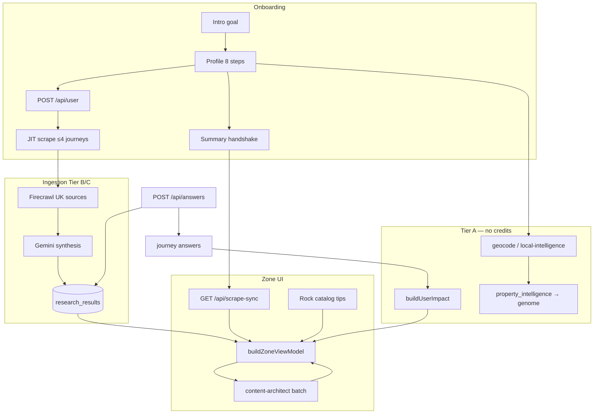

# Guardrails & pipeline — single source of truth

**Mission:** Every UK home gets a **postcode-first**, **mechanically true** audit — real £ and kg from profile + answers + Neon research, never demo leakage or fabricated savings.

This document ties together **rules**, **code gates**, **CI**, and **docs** so one workflow stays honest end-to-end.

---

## 1. Three-layer guardrail stack

| Layer | What enforces it | When it runs |
| --- | --- | --- |
| **A — Agent rules** | `.cursor/rules/*.mdc` (always on in Cursor) | Every edit / agent session |
| **B — Code contracts** | `lib/zone/mechanicalTruth.ts`, `ulmLimits.ts`, `mechanicalTruthEval.ts`, `onboardingGuardrails.ts`, `offerUrlGuard.ts`, `contentProseSanitize.ts` | Runtime + unit eval |
| **C — CI / ship gate** | `npm run verify`, GitHub Actions Lint + Typecheck, `vercel-build-gate.mjs` | Every push / deploy |

**Rule of thumb:** If it must never break in prod, it lives in **B** or **C**. Docs and `.mdc` files explain and remind — they do not replace code gates.

### A — Cursor rules (behavioural law for agents)

| File | Governs |
| --- | --- |
| `postcode-first-architect.mdc` | Dynamic postcode, 12k/1t truth, UI ceilings, deploy order |
| `zero-zero-prime-directive.mdc` | Motion DNA, intelligence loop, discovery birth path |
| `mechanical-pulse.mdc` | Typography, colour, geometry — no shadows |
| `zone-voice-copy.mdc` | Forensic Mate voice, banned phrases |
| `verify-deploy-gate.mdc` | `npm run verify` before commit/deploy |

Index: `.cursor/rules/README.md`

### B — Code gates (canonical modules)

| Concern | Module |
| --- | --- |
| Empty DB → no fake £ | `lib/zone/mechanicalTruth.ts` |
| Rock / offer URL alignment | `lib/rock/resolveRockHabitLearnUrl.ts`, `mechanicalTruthEval.ts` |
| Grid / discovery ceilings | `lib/zone/ulmLimits.ts`, `perCategoryCardCap.ts` |
| £/kg engine (only source) | `lib/brains/buildUserImpact.ts`, `calculations.ts` |
| Profile → research payload | `lib/profile/buildResearchProfilePayload.ts`, `onboardingGuardrails.ts` |
| Goal / loop / sort | `lib/profile/goalWeighting.ts`, `profileGoalPreference.ts`, `loopQuestions.ts` |
| Scrape boundaries | `lib/intelligence/scrapeBoundaries.ts`, `answerFunnelRouter.ts` |
| Prose / headline quality | `contentProseSanitize.ts`, `soloFocusCopy.ts`, `researchGateAudit.ts` |
| Truth ledger audit | `lib/intelligence/buildIntelligenceLedger.ts` |

### C — Ship gate commands

```bash
npm run verify                  # typecheck + lint + mechanical-truth (14 checks)
npm run test:truth-ledger       # ledger gate mapping
npm run test:property-intelligence
npm run verify:logic            # policy savings + profile baseline
npm run db:test                 # Neon schema ping
npm run zone:audit-gates -- POSTCODE   # 13/13 journey settlement
npm run deploy                  # verify → Vercel prod → promote
```

Full UAT matrix: [APP-OVERVIEW-AND-TESTING.md](APP-OVERVIEW-AND-TESTING.md) §9.

---

## 2. Data pipeline (every user, every home)



### Intelligence triggers (when scrapes fire)

| Step | Trigger | Cap / module |
| --- | --- | --- |
| Profile submit | `triggerOnboardingResearchBootstrap` | 4 journeys — `onboardingResearchBootstrap.ts` |
| Summary exit | `runProfileResearchHandshake` | deduped gap-fill — `researchSyncClient.ts` |
| Zone cold start | `runProductionResearchRefresh` | prod bootstrap — `productionResearchBootstrap.ts` |
| MC answer | `runLoopSpawnResearch` | per answer — `loopSpawnResearch.ts` |
| Solo Focus +1 | `POST /api/scrape-sync` + `journey_key` | Topic Shield |
| Weekly repair | `GET /api/cron/zone-research` | Hermes — `CRON_SECRET` |

Detail: [INTELLIGENCE-PIPELINE-FINAL.md](INTELLIGENCE-PIPELINE-FINAL.md)

### Personalization inputs (all flow to scrape + VM)

| Input | Storage | Effect |
| --- | --- | --- |
| Postcode | `profile_postcode`, Neon | All scrapes, council, grid carbon, copy locality |
| Goal | `profile_goal` | JIT pick, grid sort, loop rank, architect emphasis |
| Power type | `profile_home_power` | Utilities unlock + JIT |
| Employment + income | profile / genome | Affluence tone, grant deprioritisation |
| Property intelligence | `user_genome.property_intelligence` | EPC pre-fills, Truth Ledger register |
| Journey answers | `journey_*_answers` | £/kg calculators, supplemental scrape |
| Likes / nope | `offer_signals` | Grid weights, scrape avoid hints |

Detail: [PROFILE-FIELDS-GRID-UNLOCKS.md](PROFILE-FIELDS-GRID-UNLOCKS.md)

### Mechanical truth (never fake)

| State | Wall behaviour |
| --- | --- |
| No Neon stream + no baseline | `COMPUTING — JOURNEY`, metrics `—` |
| Profile baseline only | Estimated £/kg, **ESTIMATED_AUDIT** |
| Neon stream valid | Live £, headline, prose — **LIVE_AUDIT** |
| Always | Both £ and carbon stamped when numbers exist |

---

## 3. Surface checklist (is it ready?)

| Surface | Ready when |
| --- | --- |
| **Onboarding** | Completeness gate → summary → zone; `POST /api/user` session |
| **Zone cards** | 13 journeys from VM; scrape-sync coverage or COMPUTING |
| **Today's Tips** | Rock catalog + topic-safe journey URL merge |
| **Solo Focus** | Card-scoped context; loop after close; discovery via `/api/answers` |
| **Mobile signup** | `POST /api/profile/mobile` + Twilio env in Vercel |
| **Settings** | Engine waste totals, focus switch, headline preview tiles |
| **Truth Ledger** | `/api/intelligence/ledger` + unified grid UI |
| **Likes** | Snapshots + `/likes` |
| **Zai / Ask** | Genome context; read-only chat; card context in Solo Focus |

---

## 4. Doc hierarchy (what to edit, what to purge)

### Edit these first (satellites)

| Priority | File | Topic |
| --- | --- | --- |
| 1 | **This file** | Guardrails + pipeline map |
| 2 | [INTELLIGENCE-PIPELINE-FINAL.md](INTELLIGENCE-PIPELINE-FINAL.md) | Trigger matrix + read path |
| 3 | [PROFILE-FIELDS-GRID-UNLOCKS.md](PROFILE-FIELDS-GRID-UNLOCKS.md) | Field → JIT → grid |
| 4 | [APP-OVERVIEW-AND-TESTING.md](APP-OVERVIEW-AND-TESTING.md) | Content sources + UAT |
| 5 | [ULM-APPLICATION-LOOP.md](ULM-APPLICATION-LOOP.md) | Ceilings, discovery caps |
| 6 | [ZONE-CONTENT-AND-DATA.md](ZONE-CONTENT-AND-DATA.md) | Copy, scrape, Solo Focus |
| 7 | [DEV-TEST-AUDIT.md](DEV-TEST-AUDIT.md) | Local smoke + deploy runbook |

### Ops / infra (edit when deploying)

| File | Topic |
| --- | --- |
| [DEPLOY-VERCEL.md](DEPLOY-VERCEL.md) | CI flakes, promote |
| [HERMES-VPS-SETUP.md](HERMES-VPS-SETUP.md) | Oracle cron |
| [HERMES-ULM-JIT-BRIEF.md](HERMES-ULM-JIT-BRIEF.md) | JIT vs repair |

### Reference only (rarely edit)

| File | Topic |
| --- | --- |
| [PUBLIC-UK-APIS.md](PUBLIC-UK-APIS.md) | Free UK APIs |
| [MOTION-FAMILY.md](MOTION-FAMILY.md) | Motion DNA |
| [SECURITY-AUDIT.md](SECURITY-AUDIT.md) | Security notes |

### Removed (purged Jun 2026)

`APP-FLOW-AND-PIPELINE.md`, `INTELLIGENCE-LOOP-MANIFEST.md`, `PRODUCT-ARCHITECTURE-SPEC.md` — content lives in this file, [USER-FLOW-AND-DATA-PIPELINE.md](USER-FLOW-AND-DATA-PIPELINE.md), [INTELLIGENCE-PIPELINE-FINAL.md](INTELLIGENCE-PIPELINE-FINAL.md), and [FULL-APP-SPEC.md](FULL-APP-SPEC.md).

### Generated / audit mirror

| File | Regenerate |
| --- | --- |
| [HANDBOOK.md](HANDBOOK.md) | `python3 scripts/consolidate-handbook.py` after satellite edits |

---

## 5. Maintenance workflow

1. **Behaviour change** → edit code gate in `lib/` first.
2. **Document** → update the matching satellite (table §4), not HANDBOOK directly.
3. **Regenerate** → `python3 scripts/consolidate-handbook.py`.
4. **Verify** → `npm run verify` + relevant `test:*` scripts.
5. **Audit postcode** → `npm run zone:audit-gates -- POSTCODE`.
6. **Ship** → `npm run deploy`.

**Never:** hardcode a demo postcode in `app/` or `lib/`. Fixtures only in `scripts/` labelled `@fixture-only`.

---

*Last consolidated: Jun 2026 — aligns with `.cursor/rules/` and production gate at `4d0739f`.*
