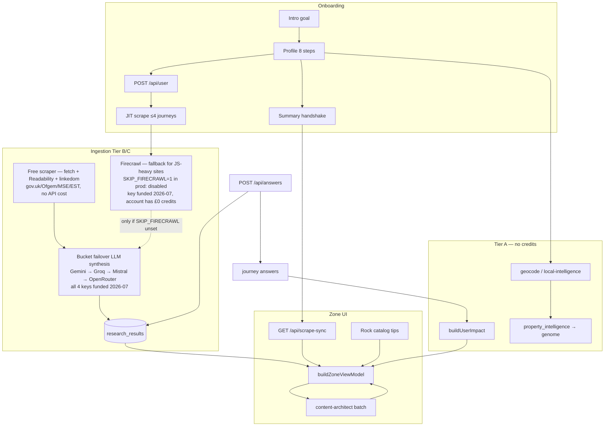

# Guardrails & pipeline — single source of truth

**Mission:** Every UK home gets a **postcode-first**, **mechanically true** audit — real £ and kg from profile + answers + Neon research, never demo leakage or fabricated savings.

This document ties together **rules**, **code gates**, **CI**, and **docs** so one workflow stays honest end-to-end.

---

## 1. Three-layer guardrail stack

| Layer | What enforces it | When it runs |
| --- | --- | --- |
| **A — Agent rules** | `.cursor/rules/*.mdc` (always on in Cursor) | Every edit / agent session |
| **B — Code contracts** | `lib/zone/mechanicalTruth.ts`, `ulmLimits.ts`, `mechanicalTruthEval.ts`, `onboardingGuardrails.ts`, `offerUrlGuard.ts`, `contentProseSanitize.ts` | Runtime + unit eval |
| **C — CI / ship gate** | `npm run verify`, GitHub Actions Lint + Typecheck, `vercel-build-gate.mjs` | Every push / deploy |

**Rule of thumb:** If it must never break in prod, it lives in **B** or **C**. Docs and `.mdc` files explain and remind — they do not replace code gates.

### A — Cursor rules (behavioural law for agents)

| File | Governs |
| --- | --- |
| `postcode-first-architect.mdc` | Dynamic postcode, 12k/1t truth, UI ceilings, deploy order |
| `zero-zero-prime-directive.mdc` | Motion DNA, intelligence loop, discovery birth path |
| `mechanical-pulse.mdc` | Typography, colour, geometry — no shadows |
| `zone-voice-copy.mdc` | Forensic Mate voice, banned phrases |
| `verify-deploy-gate.mdc` | `npm run verify` before commit/deploy |

Index: `.cursor/rules/README.md`

### B — Code gates (canonical modules)

| Concern | Module |
| --- | --- |
| Empty DB → no fake £ | `lib/zone/mechanicalTruth.ts` |
| Rock / offer URL alignment | `lib/rock/resolveRockHabitLearnUrl.ts`, `mechanicalTruthEval.ts` |
| Grid / discovery ceilings | `lib/zone/ulmLimits.ts`, `perCategoryCardCap.ts` |
| £/kg engine (only source) | `lib/brains/buildUserImpact.ts`, `calculations.ts` |
| Profile → research payload | `lib/profile/buildResearchProfilePayload.ts`, `onboardingGuardrails.ts` |
| Goal / loop / sort | `lib/profile/goalWeighting.ts`, `profileGoalPreference.ts`, `loopQuestions.ts` |
| Scrape boundaries | `lib/intelligence/scrapeBoundaries.ts`, `answerFunnelRouter.ts` |
| Prose / headline quality | `contentProseSanitize.ts`, `soloFocusCopy.ts`, `researchGateAudit.ts` |
| Truth ledger audit | `lib/intelligence/buildIntelligenceLedger.ts` |
| LLM provider failover | `lib/intelligence/bucketFailover.ts`, `llmRateLimit.ts` |
| Malformed LLM JSON | `lib/agents/researchAgent.ts` (`sanitizeJsonEmbeddedNewlines`) |
| Content provenance flags | `research_results.is_mechanical_fallback`, `.is_headline_mechanical_fallback` (see §2) |
| Awin affiliate wrapping | `lib/monetization/awinAffiliateLink.ts` |
| Postcode → region | `lib/local/getLocalData.ts` (exact area-code table) |
| Per-category free-scrape seeds | `lib/intelligence/researchProfilePayload.ts` (`JOURNEY_FREE_SEEDS`, `JOURNEY_FIRECRAWL_SEEDS`) — same link-rot risk as `trustedJourneyUrls.ts`, see §1 note below |
| `research_results` read ordering (postcode vs user_id) | `app/api/scrape-sync/route.ts` (`buildScrapedFromResearchResults`) |

**Security (OWASP-aligned):** `SCRAPER_SECRET` authorizes scrape-sync POST only; `CRON_SECRET` is `/api/cron/*` only. Session restore requires HMAC `restore_proof` (no dev UUID bypass). Rate limits on scrape-sync GET (10/min anonymous), likes POST, restore-session — now Neon-backed distributed, not per-instance in-memory (`lib/rateLimitDistributed.ts`). See `lib/security/productionSecrets.ts` and [SECURITY-AUDIT.md](SECURITY-AUDIT.md).

**Re-auditing offer/learn URL liveness (`trustedJourneyUrls.ts`, `resolveRockHabitLearnUrl.ts`, `lib/brains/calculations.ts`, `lib/brains/recommendations.ts`, `habitsCatalog.ts`, `JOURNEY_FREE_SEEDS`/`JOURNEY_FIRECRAWL_SEEDS` in `researchProfilePayload.ts`):** these are hand-maintained hardcoded fallbacks, so they rot as partner sites restructure — worth a periodic sweep, not a one-off. `curl` is not sufficient: several UK retail/corporate sites (RAC, AA, Tesco, Sony, Royal Mail, Tesla, John Lewis, Levi's) run bot-detection that returns 403/404 to any automated non-browser request, live page or not — confirmed directly (`rac.co.uk/drive/advice/fuel-efficiency/` once returned curl 404 while rendering fine in a real browser). Verify with a real Chromium instance instead, and escalate before writing off a link as dead: try forcing HTTP/1.1 (some blocks are protocol-layer, not IP-based — John Lewis and Levi's help center both opened up this way), and when using `site:` search to find where content moved, scope it to the whole domain family including help/support subdomains, not just the apex domain (Levi's GB denim-care content lives on `levihelp.levi.com`, not `levi.com`). Only treat a result as a confirmed dead link when it renders the site's own branded 404 (e.g. "Page not found - GOV.UK") — a generic Akamai/Cloudflare "Access Denied" page means the check was blocked, not that the link is dead; don't guess a replacement in that case. **This isn't hypothetical**: `tech`'s three `JOURNEY_FREE_SEEDS` entries went dead (one genuine branded GOV.UK 404, two unresponsive) and were never caught until a live production trigger showed zero scraped markdown / empty citations for the category (2026-07) — confirmed via the app's own request/response, not curl, since `energysavingtrust.org.uk` 403s curl uniformly (root domain included) yet serves the app's real scraper fine elsewhere. When a category's fallback rate sits persistently high while others don't, check its seed URLs directly before assuming the LLM/provider layer is at fault.

### C — Ship gate commands

```bash
npm run verify                  # typecheck + lint + mechanical-truth (14 checks)
npm run test:truth-ledger       # ledger gate mapping
npm run test:property-intelligence
npm run verify:logic            # policy savings + profile baseline
npm run db:test                 # Neon schema ping
npm run zone:audit-gates -- POSTCODE   # 13/13 journey settlement
npm run deploy                  # verify → Vercel prod → promote
```

Full UAT matrix: [APP-OVERVIEW-AND-TESTING.md](APP-OVERVIEW-AND-TESTING.md) §9.

---

## 2. Data pipeline (every user, every home)



### Intelligence triggers (when scrapes fire)

| Step | Trigger | Cap / module |
| --- | --- | --- |
| Profile submit | `triggerOnboardingResearchBootstrap` | 4 journeys — `onboardingResearchBootstrap.ts` |
| Summary exit | `runProfileResearchHandshake` | deduped gap-fill — `researchSyncClient.ts` |
| Zone cold start | `runProductionResearchRefresh` | prod bootstrap — `productionResearchBootstrap.ts` |
| MC answer | `runLoopSpawnResearch` | per answer — `loopSpawnResearch.ts` |
| Solo Focus +1 | `POST /api/scrape-sync` + `journey_key` | Topic Shield |
| Weekly repair | `GET /api/cron/zone-research` | Hermes — `CRON_SECRET` |
| ZeroAgent (per category) | `runZeroAgent` inside `runTriggerResearchForCategory` | free UK data APIs + tool calling — `lib/agents/zeroAgent.ts` |

**ZeroAgent provider order:** direct Gemini function calling (`GEMINI_API_KEY`, free tier) is primary; OpenRouter (`OPENROUTER_API_KEY`, model from `OPENROUTER_MODEL`) is the fallback, only tried when Gemini errors or is unconfigured. Both share the same tool declarations (`AGENT_TOOL_DECLARATIONS` in `agentTools.ts`) and finalize/citation logic. Runs regardless of `bucket_failover` — it calls free UK APIs, not paid Firecrawl. `GEMINI_AGENT_MODEL` in `zeroAgent.ts` now imports `FLASH_DEFAULT` from `geminiModels.ts` instead of its own hardcoded literal — see the model-name note below, this constant had the exact same staleness bug independently.

**Gemini/OpenRouter model ids go stale — use the `-latest` aliases, not dated ones (2026-07 incident):** `FLASH_DEFAULT` in `lib/intelligence/geminiModels.ts` used to hardcode `gemini-2.5-flash` / `gemini-2.0-flash-lite`. Google retires dated model ids for newer API-key projects ("this model is no longer available to new users") — a fresh `GEMINI_API_KEY` authenticated fine but every direct-API call 404'd, and `bucketFailover` fell through to Groq every time with zero indication Gemini was misconfigured rather than just unlucky. Now uses `gemini-flash-latest` / `gemini-flash-lite-latest`. Three other hardcoded `'gemini-2.5-flash'` duplicates existed outside this constant (`zeroAgent.ts`, `discoveryStructured.ts`, `mechanicalDiagnostics.ts`'s status display) and would have silently drifted from the fix — all now import `FLASH_DEFAULT`/`GEMINI_DIRECT_ZONE` instead of holding their own literal. Same failure mode hit OpenRouter independently: its `OPENROUTER_MODEL` env var pointed at a slug OpenRouter had deprecated for free-tier routing (`404 "unavailable for free"`), fixed by pointing it at the same confirmed-working `google/gemini-2.5-flash` (a real, working slug on OpenRouter specifically, unrelated to Google's own direct-API deprecation of the same string). **If a provider starts 404ing on model-not-found after working fine before, check the model id before assuming the key is bad.**

**Category headline word-count tiers** (`lib/soloFocusCopy.ts`): Today's Tips (Rock catalog) stay at 8–10 words (`MIN/MAX_ZONE_CARD_HEADLINE_WORDS`). Journey mother cards get 9–12 words (`MIN/MAX_JOURNEY_CARD_HEADLINE_WORDS`) — more room for the locality name + a figure without truncating mid-clause. Pass `{ min, max }` bounds explicitly to `clampZoneBentoHeadline`/`enforceHeadlineWordLimits` for journey-card call sites; omit for tips (keeps the tighter default). If you touch the LLM prompt's stated word target, keep it in sync with these constants — a prompt asking for fewer words than the validator's minimum accepts guarantees every real LLM headline gets rejected and replaced by the generic per-journey fallback (`ZONE_BENTO_HOOK`), silently killing locality-specific copy for that category. **This exact drift happened for real (2026-07):** the triplet-extraction prompt in `researchAgent.ts` told the LLM `agent_headline` should be "8 to 10 words" — copied from the *different*, correctly-scoped 8–10 tier that content-architect's `ZONE_CONTENT_ARCHITECT_VOICE` (`zoneVoice.ts`) legitimately uses for its own, narrower Zone-face polish pass — while the journey-card validator it actually feeds requires a 9-word minimum. Any LLM headline that correctly followed its own 8-word-minimum instruction was guaranteed rejected. Fixed to state "9 to 12 words"; `zoneVoice.ts`'s separate 8–10 instruction was left untouched since it's genuinely a different, correctly-matched tier — don't conflate the two when auditing this again.

Detail: [INTELLIGENCE-PIPELINE-FINAL.md](INTELLIGENCE-PIPELINE-FINAL.md)

### Personalization inputs (all flow to scrape + VM)

| Input | Storage | Effect |
| --- | --- | --- |
| Postcode | `profile_postcode`, Neon | All scrapes, council, grid carbon, copy locality — region resolved via `getLocalData.ts`'s exact postcode-area lookup table (postcodes.io primary, OpenStreetMap then this table as emergency fallback only) |
| Goal | `profile_goal` | JIT pick, grid sort, loop rank, architect emphasis |
| Power type | `profile_home_power` | Utilities unlock + JIT |
| Employment + income | profile / genome | Affluence tone, grant deprioritisation |
| Property intelligence | `user_genome.property_intelligence` | EPC pre-fills, Truth Ledger register |
| Journey answers | `journey_*_answers` | £/kg calculators, supplemental scrape |
| Likes / nope | `offer_signals` | Grid weights, scrape avoid hints |
| Home type / power type / transport / tenure | `RockHabit.applicable` gate + `LoopQuestionBeat.applicable` gate | Today's Tips catalog filter — `lib/zone/filterRockHabits.ts` (`filterHabitsByProfile`); loop-question bank filter — `lib/zone/loopQuestions.ts` (`beatMatchesHomeType`/`PowerType`/`Transport`/`Tenure`); same soft-gate semantics in both — missing profile data never excludes a tip or question (added 2026-07: power_type, transport, tenure extend the original home_type-only gate — stops EV-switch questions reaching non-drivers, gas-boiler content reaching all-electric homes, and roof-solar/loft-insulation questions reaching flats or renters who can't act on them) |
| Financial pressure | `profile_financial_pressure` → `users.financial_pressure` | **Required** for `isProfileOnboardingComplete` (added 2026-08). Sentinel for the ranked action wall (§2c) — its presence is what switches a user from the 13-tile category wall to the ranked wall, and it sets the hard `COST_CEILING` (`lib/actions/actionTypes.ts`): TIGHT → FREE only, GETTING_BY → FREE+LOW, DOING_OK → FREE+LOW+HIGH. Asymmetric by design: TIGHT is allowed to restrict, but DOING_OK is never read as "can afford anything" — it's self-reported absence of stress, not disposable income, so free entitlements still rank first regardless |
| Children | `profile_children` → `users.children` | NONE / UNDER_5 / SCHOOL_AGE / BOTH. Gates Healthy Start (under-5, ~£483) and free school meals (school age, ~£500/child) as hard `requires` — deliberately separate from `household` (living arrangement), which used to stand in for this and asserted eligibility the app had never actually asked about |

Detail: [PROFILE-FIELDS-GRID-UNLOCKS.md](PROFILE-FIELDS-GRID-UNLOCKS.md)

**Never clobber local with empty server data.** Any code that rehydrates client state from a server snapshot (`sessionRehydrateApply.ts`, `SessionStateRehydrate`, similar sync-on-mount patterns) must only overwrite a local field when the server value is genuinely non-empty. A stale or not-yet-persisted server session read racing ahead of a fire-and-forget `POST` can return blank fields; a `!= null` check lets an empty string through and wipes data the user just entered. This exact bug caused a full onboarding-completion loop in production (fixed 2026-07 — bounced users back to the postcode question right after they finished). Same principle for any "fill gaps, don't overwrite" merge.

### Profile object identity (AppContext)

`AppContext`'s `profile` and `journeyAnswers` state must keep the previous object reference when the underlying values haven't changed (`refreshProfile` and the `UNIFIED_PROFILE_MEMORY_EVENT` listener both shallow-compare before calling `setProfile`/`setJourneyAnswers`). Effects across the app (Zone's view-model builder, content-architect batching) key off these objects **by reference**, not deep equality — a fresh object on every refresh cascades into redundant re-fetches everywhere a `profile`/`journeyAnswers` dependency exists, even when nothing actually changed. This caused `/api/pulse/living` to fire dozens of times back-to-back for one postcode (2026-07), starving the DB/CPU badly enough that only 1 of 13 research categories ever completed for affected users. If you add a new effect keyed on `state.profile` or `state.journeyAnswers`, either trust the identity stability (do nothing) or add your own dedupe guard for the expensive part specifically — don't assume the effect re-firing is free.

### Mechanical truth (never fake)

| State | Wall behaviour |
| --- | --- |
| No Neon stream + no baseline | `COMPUTING — JOURNEY`, metrics `—` |
| Profile baseline only | Estimated £/kg, **ESTIMATED_AUDIT** |
| Neon stream valid | Live £, headline, prose — **LIVE_AUDIT** |
| Always | Both £ and carbon stamped when numbers exist |

**`is_mechanical_fallback` (added 2026-07):** `research_results` boolean, `false` when the row's £ figure came from real LLM triplet extraction, `true` when the £ fell through to the shared per-category mechanical template (fixed number, same for every user at fallback). `app/api/scrape-sync/route.ts`'s `RESEARCH_COVERAGE_SELECT` reads it and zeroes `sav`/`carbon` on fallback rows so a template row can never masquerade as a real saving; when a postcode has both a genuine and a fallback row for the same journey, the genuine one always wins regardless of £ size. Replaces the old `verified` column, which was a `GENERATED ALWAYS` column that was always `true` and carried no real signal.

**`is_headline_mechanical_fallback` (added 2026-07) — deliberately a separate column, not folded into the one above:** tracks whether the *headline* specifically came from the mechanical template, independent of the £ figure. A row can have a 100% genuine, LLM-computed £ and prose but a too-short headline that gets swapped for the generic per-category template text (two independent code paths do this swap: `mechanicalCategoryTripletFallback`'s own headline output, and `clampZoneBentoHeadline` separately collapsing to `ZONE_BENTO_HOOK` on quality grounds) — before this column existed, that row still reported `is_mechanical_fallback = false` ("real"), which was misleading. **Do not fold this into `is_mechanical_fallback`**: `buildScrapedFromResearchResults` zeroes `sav`/`carbon` whenever `is_mechanical_fallback` is true, so broadening that flag to also cover headline-only templating would wrongly hide a genuine, already-settled £ figure. A row is only fully bespoke when *both* flags are `false`.

**`repairResearchResultsMissingHeadlines` field-clobbering bug (fixed 2026-07):** its repair UPDATE selects rows missing *any one* of headline/prose/£ (the WHERE clause is an OR of five independent conditions), but used to overwrite *all three* fields unconditionally whenever it ran — a row selected only because its headline was too short had its genuine £ and prose silently destroyed and replaced with the generic template's numbers too. Traced to `saving_amount_gbp = COALESCE($4::numeric, saving_amount_gbp)`: since `$4` (the template value) is never null, COALESCE always picked it regardless of whether the existing figure was already genuine — the argument order was backwards. Rewrote as per-field `CASE` expressions so each of headline/prose/£ only takes the template value when *that specific field* was the actual reason the row was selected.

**LLM triplet-JSON parsing (fixed 2026-07):** small/fast bucket models (Groq's `llama-3.1-8b-instant` in particular) emit syntactically-plausible JSON with unescaped literal newlines inside long string fields — spec-invalid, `JSON.parse` throws, and the extraction silently fell through to the mechanical template for every user regardless of profile. `sanitizeJsonEmbeddedNewlines` in `researchAgent.ts` escapes raw `\n`/`\r` only inside quoted-string spans before parsing. If genuinely-different users start seeing near-identical Zone cards again, check `is_mechanical_fallback` **and** `is_headline_mechanical_fallback` on the relevant rows first — that's the fast diagnostic.

**LLM cooldown gate — all, not any:** `isLlmRateLimited(providers)` (`lib/intelligence/llmRateLimit.ts`) must require every listed provider to be cooling down before skipping synthesis, not just one. It used to check `isAnyProviderCoolingDown`, so a single permanently-invalid key (e.g. an expired Gemini key stuck on cooldown) blocked triplet extraction for every user forever even though Groq/Mistral were healthy. `generateWithBucketFailover` already skips a cooling-down provider and tries the next internally — this gate only exists to short-circuit when truly nothing is left to try.

**Mechanical-only mode is one env var away, and used to be silent (fixed 2026-07):** `shouldPreferMechanicalTripletInBucket()` (`scrapeBoundaries.ts`), gated by `ALLOW_LLM_TRIPLET`, short-circuits `researchAgent.ts` straight to the mechanical template with zero LLM attempt whenever it returns true — not rate-limited, not failed, never tried. It's currently set correctly, but nothing logged when it fired, so a silent removal of that env var would have looked identical to "LLM synthesis stopped working" with no trace pointing at the actual cause. Now warns explicitly (`[researchAgent] mechanical-only mode active...`) when it triggers, distinguished from the separate rate-limited short-circuit it used to share a branch with.

**Stale-postcode rows can outrank current research (fixed 2026-07):** `buildScrapedFromResearchResults`'s coverage query matches `rr.user_id = $1 OR postcode matches` for logged-in users, then dedupes per category by `created_at DESC` — meaning a user's own older row for a *different* postcode (house move, typo fix, re-onboarding) could outrank a correct, current-postcode row simply by being more recent. Fixed with a `CASE WHEN postcode matches THEN 0 ELSE 1 END` tiebreaker ahead of `created_at` in the `ORDER BY`, so a postcode-matching row always wins regardless of age.

**Rock-tip content override — second occurrence, mother-card path (fixed 2026-07):** the tip-card expand path (`app/zone/page.tsx` → `SoloFocusOverlay`) was already hardened against category-level `research_results` prose silently overriding a Rock habit's own prose/£/source (`verifiedArchitectProse={null}`/`verifiedAuditMoneyGbp={null}` passed explicitly when the card is a Rock tip — see [ZONE-CONTENT-AND-DATA.md](ZONE-CONTENT-AND-DATA.md) §7). The wall category "mother card" expand path (`JourneyBentoCard.tsx`) has its own, separate Rock-habit fallback (`getNextMorphCard`, fires when a category is opened with no fresher morph data) and had no equivalent guard — `verifiedAuditMatchesJourney` was computed purely from props the parent passes in, with no visibility into whether the component had internally substituted a Rock habit for itself. Fixed with a local `isRockMorphTip` check (`currentMorphData.id` starts with `rock-`) folded into `verifiedAuditMatchesJourney`'s own definition, plus `contentMode="rock"` now threaded to `SoloFocusProseStack` so the body prose resolves via the Rock-specific pipeline (`resolveRockHabitDisplayProse`) instead of the generic journey one. Same root cause hit the **headline** independently, via a separate mechanism: `headlineFromExpandedHook`/`EXPANDED_JOURNEY_HOOK` silently replaces any candidate title under 20 words with one hardcoded sentence per category, and `JourneyBentoCard` had zero exemption from it (`SoloFocusOverlay` only exempted `rock-*` card ids, not `inject-*` discovery/achievement cards — both fixed to route through `headlineFromRockHabitForSoloFocus` instead). That function itself turned out to be broken for short titles — `padRockHeadlineToExpandedBounds` tried to pad a thin title/insight with the category hook, but its first call into `enforceHeadlineWordLimits` already substituted the full generic hook before the padding logic ever ran, so the "prefer real content" path never actually preferred anything real. Live-audited: a Rock tip titled "COMBINE CAR TRIPS." surfaced the generic travel hook verbatim, its own insight text never appearing anywhere. Fixed by padding *before* calling `enforceHeadlineWordLimits`, not after — this is shared logic, so the fix applies to `SoloFocusOverlay`'s original Rock-tip path too, not just the new mother-card one. **If you're chasing a report of "this Rock tip / discovery card shows generic category copy instead of its own," check both expand paths independently — they do not share a guard.**

**Two unauthenticated write endpoints closed (fixed 2026-07):** `POST /api/zone/injections/achievement` had no auth check at all gating the handler — only an optional, secondary DB-persist step checked for a session. The in-memory card append (`appendStoredInjections`) ran unconditionally against a single process-wide array shared across every visitor hitting that Vercel instance, so an unauthenticated request could inject an arbitrary card into other real users' Zone dashboards. `POST /api/memory/flush` was similarly open, with a bare `as MemoryFlushPayload` cast (no runtime validation) on a body that gets written into a global variable later pasted directly into the live Gemini prompt for tip generation — an unauthenticated request could both corrupt the shared context between users on a warm instance and shape what the LLM sees. Both now gate entry on `requireAiRouteAuth` (session or server-issued guest cookie, the same pattern already used by the sibling `/api/zone/injections` route); `memory/flush` also replaced the bare cast with a zod schema (`memoryFlushPostBodySchema` in `lib/api/schemas.ts`) capping field lengths and total payload size. See [SECURITY-AUDIT.md](SECURITY-AUDIT.md) M-11/M-12.

**Rate limiting is now Neon-backed and distributed, not per-instance in-memory (2026-07):** `lib/rateLimitDistributed.ts` (via `lib/rateLimitNeon.ts`) replaces the old in-memory map for `checkRateLimitAsync`, so a limit actually holds across serverless instances instead of resetting per cold start / being trivially bypassed by hitting a fresh lambda. No new vendor — reuses the existing Neon connection.

**Personalization coverage extended across 8 categories + live PVGIS/Carbon Intensity (2026-07):** `trustedJourneyUrls.ts` and `researchAgent.ts`'s `mechanicalCategoryTripletFallback` headline/prose pools were rewritten for solar/food/shopping/money/tech/water/waste/carbon to name real UK schemes (SEG, WaterSure, Too Good To Go, Triodos, TerraCycle, WWF footprint calculator, Restart Project, Vinted, Freegle, Olio) instead of generic homepage links and template copy. Solar and carbon now wire live PVGIS (solar yield) and Carbon Intensity API (grid gCO₂/kWh) data into their category content, not just the dashboard total. Water and travel content is now personalized per-answer. Loop-question answers for FOOD/SHOPPING/TECH/WASTE/MONEY now actually feed back into content generation (previously wired for a subset of categories only); HOLIDAYS branches by `flight_frequency`. A broken `calculateMoney` call on this same path was fixed alongside it. Two related copy bugs caught and fixed in the same sweep: `cleanZonePreviewHeadline`'s report-metadata regex had a bare `WINDOW` alternation meant to catch "regulatory window" that was instead deleting the literal word "window" from any real content ("door and window excluders" → "door and excluders"); country/tenure-aware heat-pump-scheme routing (`homeHeatingSchemeForUser`, `ukCountryFromPostcode` — Scotland / Northern Ireland / England & Wales, owner vs renter) replaced a one-size-fits-all Boiler Upgrade Scheme recommendation that assumed England & Wales homeownership for every user.

**PVGIS solar yield was calling the wrong endpoint and always returning `found:false` (fixed 2026-08):** hit `seriescalc` (raw hourly records only) and read a JSON path (`outputs.totals.E_y`) that only exists on `PVcalc`'s response shape. Every call silently fell back to a flat £450 estimate while still downloading ~15MB of unneeded hourly data per request. Fixed to call `PVcalc` and read `outputs.totals.fixed.E_y` / `outputs.monthly.fixed[].E_m`; verified live against the real API (annual yield 3,403.64 kWh for a test lat/lon) before landing. `lib/intelligence/pvgisClient.ts`.

**SOLAR could win the hero "Biggest annual win" slot for renters and flats, who structurally can't act on it (fixed 2026-08):** reproduced live, then traced to **two independent hero-selection passes** in `buildZoneViewModel.ts` — an already-gated `heroJourney` reduce, and a second, later override (`leadKey`, derived from `computePrimaryMoneyJourneyKeys`) that re-picked the lead journey from scratch with zero gating and silently won regardless of what the first pass decided. Fixing only the first pass did not fix the bug — confirmed by instrumenting both passes directly, since a standalone repro still showed SOLAR winning even after the reduce computed 'shopping' correctly. Both passes now respect a shared `journeyActionableForHero()` gate (SOLAR requires `home_type === 'HOUSE'` and `home_ownership === 'OWNER'`; unknown values pass, so a guest with no tenure recorded isn't penalised). **If you're gating hero/lead selection again, check for other independent selection passes in the same function before declaring it fixed** — this function has that shape more than once.

**Loop-answer personalization for FOOD/SHOPPING/TECH/WASTE/MONEY/HOLIDAYS content was declared but never wired (fixed 2026-08):** the fields those categories' content-generation branches read (`wash_preference`, `flight_frequency`, and five others) were declared on `ResearchProfileData` but nothing ever populated them on the object actually passed into content generation — the £/kg calculator side of the same features was already correctly wired via a separate path (`journey_answers` directly), so only the headline/prose personalization silently no-opped. Added `loopAnswerSignalsFromJourneyAnswers()` (`lib/intelligence/enrichProfileDataFromGenome.ts`), wired at the one choke point that feeds both the loop-spawn research pass and the discovery race (`app/api/answers/route.ts`), pulling from a user's full answer history plus the just-submitted answer. `wash_preference` and `flight_frequency` specifically live in `user_genome`, not the `users` columns this route was already reading — added alongside.

**TRAVEL content checked `transport_baseline` for `'BUS'`/`'TRAIN'` — values that don't exist (fixed 2026-08):** the real onboarding enum is `WALK`/`BIKE`/`PUBLIC`/`CAR`/`MIX` (`app/profile/ProfilePageClient.tsx`). Every public-transport user fell through the dead branch to car-commuter copy. Fixed the check to `mode === 'PUBLIC'` in `lib/agents/researchAgent.ts`.

---

## 2c. Ranked action library (2026-08) — replaces one-card-per-category

The old wall gave every profiled user one card per journey category regardless of relevance — a renter got a SOLAR card, a non-driver got a TRAVEL card. When a slot *must* be filled, the only copy that fits everyone is copy vague enough to say nothing, which is why the wall read as generic even where the underlying £/kg were real. This was built independently of the LLM content pipeline above — **no model call** — as a hand-tagged, deterministically-ranked library instead: same profile in, same twelve cards out, every time, each traceable to a source and a `verifiedOn` date.

**Code map:** `lib/actions/actionTypes.ts` (schema) · `lib/actions/actionLibrary.ts` (63 hand-written actions, each with `source`/`verifiedOn`) · `lib/actions/selectActions.ts` (filter + rank + diversity cap) · `lib/actions/actionCards.ts` (bridges a `ZoneAction` to the wall's `ZoneJourneyCard` shape) · `lib/actions/actionCompletion.ts` (recurrence-aware "I've done this" persistence) · `lib/actions/actionTips.ts` (feeds Today's Tips from the same pool) · `scripts/verify-action-library.ts` (301 assertions, wired into `npm run verify`).

**Trigger:** `buildZoneViewModel.ts` gates on `profile.financial_pressure` specifically, not "a profile object exists" — a postcode-only profile has told the ranker nothing rankable, and ranking against blanks ignores tenure/cost entirely (`selectActionsForProfile` in `lib/zone/buildZoneViewModel.ts`). Guests and partial profiles keep the 13-tile category wall unchanged.

**Three-tier gate model** (`ActionGates` — tenure, financial, household, children, employment, age, heating, transport, wash, countries, loop-question answers), all on one `ZoneAction`:
- **`gates`** — relevance, soft. An unknown profile value **passes**. "More apt if you drive," not a qualifier.
- **`requires`** — eligibility, hard. An unknown profile value **fails**. "Only true if you have a school-age child." This is what makes the wall personalised rather than generic-with-extra-steps: an action gated softly on an unasked field still shows to everyone, which is exactly the failure this exists to close (Healthy Start/free school meals were originally soft-gated on `household === FAMILY`, which describes who you live with, not whether children exist — fixed by moving child-linked entitlements onto `requires` against the dedicated `children` field, added for this).
- **`excludes`** — hard filter, always. Never softened into a ranking penalty, because "unlikely to show" still eventually shows. Checked before scoring, so a renter can never be shown "insulate your loft" regardless of how everything else scores.

**Cost ceiling** (`COST_CEILING`, keyed on the required `financial_pressure` answer): TIGHT sees `FREE` only, GETTING_BY adds `LOW` (~under £30), DOING_OK allows `HIGH`. Nearly every pre-existing tip in the app assumed capital (solar, heat pump, new appliance); this is the axis that was missing entirely, and for someone who just said money is tight, a capital-requiring recommendation isn't just unhelpful, it reads as not having listened.

**Recurrence-aware completion** (`ActionRecurrence`, `isSuppressedByCompletion`): completion hides an action for as long as its own nature says it should stay hidden, not a single global "done" flag — `ONCE` (a one-off claim) never resurfaces; `ANNUAL` (WaterSure reconfirmation, NHS HC2 certificates, 12-month railcards, Warm Home Discount scheme years) comes back after 365 days; `ONGOING` (a habit) never suppresses. Signed-in users persist via the existing `/api/actioned` + `user_actioned_cards` (the same table the Truth vs Potential ledger already used); guests mirror to `localStorage`; merge is newest-per-action so signing up **adds** a guest's history rather than replacing it. Server rows carry no timestamp column, so they're dated to the epoch on merge — an `ANNUAL` action recorded server-side becomes available again rather than permanently buried on a date the system doesn't have.

**Diversity cap shares the grid's own constant:** `MAX_PER_BUCKET` in `selectActions.ts` imports `MAX_CARDS_PER_CATEGORY` from `lib/zone/perCategoryCardCap` rather than defining its own number — an earlier version let the ranker pick 3-per-bucket while the grid capped rendering at 2, so 12 selected cards silently rendered as 9 with no error anywhere. Importing the shared constant makes that specific mismatch unrepresentable rather than merely fixed once.

**Badge cannot lie about the destination (structural, not a check):** `attributionForUrl()` in `actionCards.ts` derives the source badge from the *destination* hostname at render time, rather than trusting a separately-authored `source` string that could drift from the actual `url`. Closes a real bug found in the old system where a DEFRA-aviation-factors badge opened a Eurostar link.

**Follow-up fixes caught after the initial ship, each confirmed live before landing:**
- **Old category-level copy was overwriting library cards (fixed 2026-08).** `applyArchitectEnrichment` mapped generated payloads by `journey_key` — safe when the wall held one card per category, wrong once the ranked wall could hold several MONEY cards at once, since every card in a category then received the *same* generated payload, stamping over verified library title/£/source and making distinct cards render identically. Library-sourced cards are now immune to this enrichment pass; asserted three ways (titles survive, badges survive, no two library cards share a title).
- **Wall cards were repeating (fixed 2026-08).** `buildGroovyGridItems` keyed a `Map` on `journey_key`, which the old model made unique by construction. The ranked wall breaks that deliberately (several MONEY cards is expected), so same-key cards collapsed to whichever came last while the order list still repeated that key once per original card — live symptom was the same MONEY tile printed a dozen times down the wall. Fixed to group by key and walk each group, with an id-level guard as a second line of defence.
- **Ranked-wall visits were all recorded against HOME (fixed 2026-08).** The card-id-to-journey resolver sliced an action card id (`journey-council-tax-reduction`) down to the bare action id and ran it through the category normaliser, which returns `'home'` for anything it doesn't recognise — every ranked-wall visit, like, and journey-progress event was quietly logging against the wrong category, corrupting the data the wall itself uses to decide what someone has already seen. Fixed to resolve the action id to its real bucket first, falling through to category normalisation only for legacy/guest card ids.
- **A postcode change silently wiped every loop answer (fixed 2026-08).** `clearZoneVmLocalCache` dropped all `journey_*_answers` keys on postcode change — reasonable when those keys were purely place-scoped research cache, wrong now that loop answers live in the same keys and gate the action library. Changing address destroyed unlocked cards and reset visible progress. The file now states the rule explicitly: does a key describe the **place** or the **person**? Local research/council context/grid figures are place-scoped and still clear; whether someone composts or has already switched supplier is about them and stays true at the new address. `zz_action_completions` already survived by accident of naming; now covered by the same stated rule rather than by luck.
- **Hero headline didn't match the wall beneath it (fixed 2026-08).** Measured on a broke-renter profile: hero claimed £4.1k while the twelve ranked cards below summed to £8,688 — two unrelated systems, since the hero is assembled from `dynamicJourneyValues` summed across all twelve category calculators roughly 370 lines before the ranked wall exists, so it structurally cannot see the cards it's supposedly summarising. Part of the £4.1k also came from calculators keyed to onboarding fields defined in `lib/journeys.ts` but never rendered in any UI (32 of 47 questions unreachable), returning defaults dressed up as personalised numbers. When the wall is ranked, the hero headline is now the literal sum of what's on it and "biggest win" is the top card — both arithmetic the user could do themselves from what's on screen. Guests and partial profiles are untouched, still on the category wall with its matching calculator totals.

Detail: [ZONE-CONTENT-AND-DATA.md](ZONE-CONTENT-AND-DATA.md) §9.

---

## 3. Surface checklist (is it ready?)

| Surface | Ready when |
| --- | --- |
| **Onboarding** | Completeness gate → summary → zone; `POST /api/user` session |
| **Zone cards** | 13 journeys from VM; scrape-sync coverage or COMPUTING |
| **Today's Tips** | Rock catalog + topic-safe journey URL merge |
| **Solo Focus** | Card-scoped context; loop after close; discovery via `/api/answers` |
| **Mobile signup** | `POST /api/profile/mobile` + Twilio env in Vercel |
| **Settings** | Engine waste totals, focus switch, headline preview tiles |
| **Truth Ledger** | `/api/intelligence/ledger` + unified grid UI |
| **Likes** | Snapshots + `/likes` |
| **Zai / Ask** | Genome context; read-only chat; card context in Solo Focus |

### Likes correctness (fixed 2026-07)

Two related bugs, both root-caused to the same place: how a liked card's identity/journey gets resolved.

- **`/likes` silently dropped likes on cards outside the fixed journey/tip set.** `app/likes/page.tsx`'s `likedCards` filtered liked ids against `viewModel.journeys` (13 fixed journey cards) and `viewModel.tips` (the rotating, capped Today's Tips rail) membership — any card liked via a Rock-merged recommendation tile or a morph/discovery card (ids like `rock-xxx`, `morph-xxx`) never matches either list, so the like was correctly recorded server-side and in the local snapshot (`readLikeCardSnapshot`) but silently excluded from display, showing "no likes" with confirmed likes on the account. Fixed by making the snapshot (saved at like-time with full display data) the primary render source, falling back to viewModel lookup only when no snapshot exists.
- **Liking a non-standard card mislabeled its own journey.** `trackZoneLike` (`app/zone/page.tsx`) derived `journey_key` by searching `viewModel.tips`/`viewModel.journeys` for the card id and defaulted to `'home'` when that search missed — which it always does for the same `rock-xxx`/`morph-xxx` ids above. This mislabeled the like's category and, on `/likes`, drove the wrong text/background colour pairing (`'home'` maps to a yellow-branded card, so a mislabeled card could render near-invisible dark-on-dark text). `JourneyBentoCard`/`SoloFocusOverlay` already resolve the correct journey for whatever card is on screen (`activeJourneyId`/`loopJourneyKey`) for their own `recordOfferSignal` calls — `onLike` now threads that same value through as an explicit 4th argument, and `trackZoneLike` prefers it over its own lookup.

### Zone hero hydration mismatch (fixed 2026-07)

`zoneWelcome` (time-of-day greeting + name) and the Today's Tips heading both computed real text unconditionally during render — but the greeting depends on `new Date()` (server clock vs. browser clock can disagree by timezone, or just drift across a boundary hour) and the name depends on `localStorage` (never available server-side, SSR always saw the "Guest." fallback). Server and the client's first hydration pass produced different text on every full page load — a reliable React error #418. Fixed by gating both behind the existing `hydrated` flag (already used elsewhere for exactly this SSR-safety purpose, flips true in a `useEffect` post-mount) so server and the client's pre-hydration pass render the same deterministic empty placeholder (`ZONE_WELCOME_SSR_SAFE_EMPTY`), then swap to the real values in a normal post-mount update — not a hydration mismatch.

### Monetization (Awin)

`wrapWithAwinAffiliateLink` (`lib/monetization/awinAffiliateLink.ts`) wraps an already-resolved, already-guarded destination URL at click time — three call sites: `IndustrialHandoffButton` (`app/components/ui/Buttons.tsx`), `openOfferUrlInNewTab` (`lib/zone/tier2RecursiveSpawner.ts`), `openZoneExternalHandoff` (`lib/zone/zoneHandoff.ts`). It is a no-op (returns the URL unchanged) unless **both** `NEXT_PUBLIC_AWIN_PUBLISHER_ID` is set **and** the destination host has an entry in `AWIN_MERCHANT_IDS`. As of 2026-07: `backmarket.co.uk` (25205) and `podpoint.com` (73493) are live single-programme hosts; `moneysupermarket.com` runs two programmes on one host (Energy 22713, Money 61791) — `AWIN_MERCHANT_IDS` supports this via a journey-keyed object instead of a plain mid string for multi-programme hosts, and `wrapWithAwinAffiliateLink`/`awinMerchantIdForUrl` take an explicit `journeyKey` param (threaded from the same `activeJourneyId`/`loopJourneyKey` source as the Likes fix above) to disambiguate — a journey with no entry for a multi-programme host resolves to no mid, never guesses the wrong programme. Nine more merchants are pending Awin approval (BT Broadband, Railcard, Rail Discoveries, Project Solar UK, Phones Direct, AO Mobile Phones Direct, Insulation & More, Clove Recycling, EV King) — commented placeholders only, no domain/mid guessed. Add a host → `awinmid` entry (or journey-keyed object for a multi-programme host) as each program is approved; do not guess an ID.

---

## 4. Doc hierarchy (what to edit, what to purge)

### Edit these first (satellites)

| Priority | File | Topic |
| --- | --- | --- |
| 1 | **This file** | Guardrails + pipeline map |
| 2 | [INTELLIGENCE-PIPELINE-FINAL.md](INTELLIGENCE-PIPELINE-FINAL.md) | Trigger matrix + read path |
| 3 | [PROFILE-FIELDS-GRID-UNLOCKS.md](PROFILE-FIELDS-GRID-UNLOCKS.md) | Field → JIT → grid |
| 4 | [APP-OVERVIEW-AND-TESTING.md](APP-OVERVIEW-AND-TESTING.md) | Content sources + UAT |
| 5 | [ULM-APPLICATION-LOOP.md](ULM-APPLICATION-LOOP.md) | Ceilings, discovery caps |
| 6 | [ZONE-CONTENT-AND-DATA.md](ZONE-CONTENT-AND-DATA.md) | Copy, scrape, Solo Focus |
| 7 | [DEV-TEST-AUDIT.md](DEV-TEST-AUDIT.md) | Local smoke + deploy runbook |

### Ops / infra (edit when deploying)

| File | Topic |
| --- | --- |
| [DEPLOY-VERCEL.md](DEPLOY-VERCEL.md) | CI flakes, promote |
| [HERMES-VPS-SETUP.md](HERMES-VPS-SETUP.md) | Vercel Cron (retired Oracle VPS runbook) |
| [HERMES-ULM-JIT-BRIEF.md](HERMES-ULM-JIT-BRIEF.md) | JIT vs repair |

### Reference only (rarely edit)

| File | Topic |
| --- | --- |
| [PUBLIC-UK-APIS.md](PUBLIC-UK-APIS.md) | Free UK APIs |
| [MOTION-FAMILY.md](MOTION-FAMILY.md) | Motion DNA |
| [SECURITY-AUDIT.md](SECURITY-AUDIT.md) | Security notes |

### Removed (purged Jun 2026)

`APP-FLOW-AND-PIPELINE.md`, `INTELLIGENCE-LOOP-MANIFEST.md`, `PRODUCT-ARCHITECTURE-SPEC.md` — content lives in this file, [USER-FLOW-AND-DATA-PIPELINE.md](USER-FLOW-AND-DATA-PIPELINE.md), [INTELLIGENCE-PIPELINE-FINAL.md](INTELLIGENCE-PIPELINE-FINAL.md), and [FULL-APP-SPEC.md](FULL-APP-SPEC.md).

### Generated / audit mirror

| File | Regenerate |
| --- | --- |
| [HANDBOOK.md](HANDBOOK.md) | `python3 scripts/consolidate-handbook.py` after satellite edits |

---

## 5. Maintenance workflow

1. **Behaviour change** → edit code gate in `lib/` first.
2. **Document** → update the matching satellite (table §4), not HANDBOOK directly.
3. **Regenerate** → `python3 scripts/consolidate-handbook.py`.
4. **Verify** → `npm run verify` + relevant `test:*` scripts.
5. **Audit postcode** → `npm run zone:audit-gates -- POSTCODE`.
6. **Ship** → `npm run deploy`.

**Never:** hardcode a demo postcode in `app/` or `lib/`. Fixtures only in `scripts/` labelled `@fixture-only`.

**Before running any migration script against production, check what it actually drops.** `db/migrations/20260521_drop_legacy_unused_tables.sql` was written when `card_views`, `micro_answers`, and `zai_messages` all genuinely had zero application writes — correct at the time. `zai_messages` was reactivated for Zai chat history (`app/zai/page.tsx`, `lib/zai/chatHistory.ts`) without anyone revisiting this migration, and by 2026-08 held 14 real rows in production. Caught before `apply-pending-migrations.ts` was run — a migration file being safe when written is not evidence it's still safe; check current table usage, not the file's own comments, before executing an old DROP.

---

*Last consolidated: Aug 2026 — aligns with `.cursor/rules/` and production gate at `5c25d66`.*
