# Zero Zero (00-00) — Master Handbook

**Single audit document.** Everything below consolidates the product docs in `docs/` into one place so you can verify copy, logic, APIs, questions, loops, and data sources without jumping files.

| | |
|---|---|
| **Repo** | `https://github.com/00app/00-ULM.git` |
| **Production** | `https://00-ulm.vercel.app` |
| **Rules in code** | `.cursor/rules/` · `lib/journeys.ts` · `lib/zone/ulmLimits.ts` |

**How to use this file**

1. Read **Quick start** and **Master checklist** before a release.
2. Skim the **synthesized** sections (loop, mechanical truth, Director's Order).
3. Drill into **annexes** for full API tables, every question ID, scrape triggers, deploy runbooks.
4. When behaviour changes, edit the **satellite** `docs/*.md` first, then run `python3 scripts/consolidate-handbook.py`.

**Do not commit secrets.** Postcodes in examples are `@fixture-only` in `scripts/` only — never hardcode BN17 in `app/` or `lib/`.

---

## Master checklist (release audit)

| Area | Verify |
|------|--------|
| **Postcode-first** | All locality flows use user `profile.postcode` / session — no demo postcode in UI |
| **Mechanical truth** | Empty Neon → `COMPUTING — JOURNEY`, metrics `—`, not fake £12k |
| **Copy** | Per-journey headlines (`EXPANDED_JOURNEY_HOOK`), no generic spring H1 on every card |
| **Prose** | Max 2 blocks in Solo Focus (lead + 1 body); no duplicate payoff; no generic “policy and tariff pressure…” |
| **Questions** | 13 journeys × 3 in `lib/journeys.ts`; Solo Focus = 1 Q; loop = `loopQuestions.ts` |
| **Discovery birth** | Only `POST /api/answers` → `injectNewDiscoveryCard` (cap 3/journey) |
| **Zai** | Read-only on chat; scrape only on Deep Dive **Search deeper** |
| **Deploy** | `npm run verify` → `npm run deploy` → `npm run promote` if Staged |
| **Hermes** | Weekly `repair-mechanical` — not daily broad scrape in bucket mode |

---

## Quick start

```bash
npm install
cp .env.example .env.local   # never commit
npm run init-db
npm run dev                  # http://127.0.0.1:3000
npm run verify               # typecheck + lint (Vercel gate)
npm run deploy               # verify → remote build → promote
```

| Command | Purpose |
|---------|---------|
| `npm run db:test` | Neon connectivity |
| `npm run db:log-research` | Latest `research_results` row |
| `npm run db:evolve-12-domains` | Seed `journey_questions` for all 13 keys |
| `npm run promote` | Promote Staged Vercel deployment |
| `npm run dev:pipeline-ready` | Env + health; optional `--seed POSTCODE` |
| `bash scripts/verify-env-and-health.sh` | Prod smoke (`BASE_URL=…`) |

**Required env (production):** `DATABASE_URL`, `GEMINI_API_KEY`, `FIRE_CRAWL_KEY_2` or `FIRECRAWL_API_KEY`, `CRON_SECRET` (≥16 chars). **Bucket mode:** `MODEL_STRATEGY=bucket_failover`, `MAX_ITERATIONS=5`.

---

## Core principles (always true)

| Principle | Meaning | Code |
|-----------|---------|------|
| **Postcode-first** | Council, grants, scrape, copy tied to user postcode | `AppContext`, `/api/scrape-sync`, `research_results` |
| **12k / 1t** | ~12,000 kWh ≈ 1 tonne CO₂e annual baseline for auditor framing | `ULM_KWH_PER_TONNE_CO2E`, `lib/brains/constants.ts` |
| **Mechanical truth** | No fake £/kg on wall without Neon stream | `lib/zone/mechanicalTruth.ts`, `buildZoneViewModel` |
| **Mechanical pulse UI** | Yellow `#FDFD00`, pink `#FF00FF`, purple `#7800ce`; no drop shadows | `app/globals.css`, `lib/journeyColors.ts` |
| **Use less, more** | Max 2 cards/category on wall; 24 bento cells; 3 discovery injects/journey | `lib/zone/ulmLimits.ts`, `perCategoryCardCap` |

### Journey order (13 domains)

`home` → `utilities` → `grants` → `solar` → `travel` → `holidays` → `food` → `shopping` → `money` → `tech` → `water` → `waste` → `carbon`

**Utilities tile** appears on Zone only when profile **power type** is set (`lib/zone/utilitiesZoneUnlock.ts`).

---

## Table of contents

### Synthesized (read first)

- [Quick start](#quick-start) · [Core principles](#core-principles-always-true) · [Master checklist](#master-checklist-release-audit)
- [Journey questions & the loop](#journey-questions-the-loop)
- [Mechanical truth](#mechanical-truth-zone--carbon)
- [Enforced loop & credit boundaries](#enforced-loop--credit-boundaries)
- [Pipeline audit — APIs, scrape URLs, credit](#pipeline-audit--apis-connections-scrape-urls-credit-control)
- [Data & view model](#data--view-model)
- [Neon hot path](#neon-hot-path-what-actually-fills)
- [Director's Order](#directors-order-zone--frozen-product-sequence)
- [Launch verification](#launch-verification-senior-gate--no-drift)
- [Zai Active Auditor](#zai-active-auditor-persona-brain-stomach--logic)
- [Security](#security)

### Annexes (full source docs — complete detail)

- [User flow & runtime pipeline](#annex-user-flow--runtime-pipeline)
- [Zone content, scrape & presentation](#annex-zone-content-scrape--presentation)
- [Profile, questions & mechanical truth](#annex-profile-journey-questions--mechanical-truth)
- [Zai, Deep Dive & question registry](#annex-zai-deep-dive--question-registry)
- [Intelligence loop](#annex-intelligence-loop-hermes-neon-verify)
- [ULM ceilings & spawn](#annex-ulm-ceilings--spawn)
- [Hybrid data pipeline](#annex-hybrid-data-pipeline-cost-tiers)
- [Full app spec (APIs, DB)](#annex-full-app-spec-architecture-apis-db)
- [Supplemental systems](#annex-gary-mode-pattern-shift-rebirth-vault)
- [Sentinel](#annex-sentinel-live-layer)
- [Hermes vs JIT](#annex-hermes-vs-jit-scrape) · [Hermes VPS setup](#annex-hermes-vps-setup)
- [Motion DNA](#annex-motion-dna) · [Deploy Vercel](#annex-vercel-deploy--checks)
- [Dev test & audit](#annex-dev-test--audit-runbook) · [UK public APIs](#annex-uk-public-apis)
- [Pipeline audit & credit control](#annex-pipeline-audit--apis-boundaries-scrape-urls-credit-control) (full URL tables)

**Regenerate annexes:** `python3 scripts/consolidate-handbook.py`

<!-- SYNTHESIZED:START -->
---

## Journey questions (“the loop”)

- **Definitions:** `lib/journeys.ts` — **13 domains**, **3 questions each** (`JOURNEY_ORDER`). Profile leading question **`home_power`** (GAS / ELECTRIC / MIX / OTHER) seeds utilities + `home.energy_type`. Question labels are behavioural only — **no £/kg in copy**.
- **Next question:** `lib/zone/questionHandler.ts` — `getNextQuestion(journeyId, answers)` returns the first unanswered registry question.
- **Solo Focus UI:** `JourneyBentoCard.tsx` — **one** registry question per open (`getSoloFocusNextQuestion`); after MC answer → **RESULT**; after **close** → **`DiscoveryTakeover`** (one loop per journey). **Do not** `markCardVisited` on close — pink only in **`completeCleanBirth`** after loop + discovery birth.
- **Persist:** `POST /api/answers` — canonical discovery birth → `injectNewDiscoveryCard`. **Hydrate:** `GET /api/answers`.
- **Full question tables:** see annex [Zai, Deep Dive & question registry](#annex-zai-deep-dive--question-registry) (profile 8 steps, 13×3 MC, loop bank, tip verification).

---

## Mechanical truth (Zone £ / carbon)

| Layer | Behaviour |
|-------|-----------|
| **`uk2026Defaults`** | Shape only — not fake savings |
| **`buildUserImpact`** | Single source of £/kg (`lib/brains/buildUserImpact.ts`) |
| **`mechanicalTruth.ts`** | `journeyHasStreamData` — true only with Neon/scrape row |
| **`buildZoneViewModel`** | No stream → **COMPUTING — JOURNEY**, metrics **—** |
| **`GET /api/scrape-sync`** | Empty DB → `{ scraped: [], source: "pending" }` |

---

## Enforced loop & credit boundaries

| Area | Rule | Code |
|------|------|------|
| Discovery birth | **`POST /api/answers`** only (cap **3**/journey) | `injectNewDiscoveryCard`, `manifest.ts` |
| Supplemental | `/api/zone/injections`, `/api/research/question-card` | Capped, not MC birth |
| Bucket mode | `MODEL_STRATEGY=bucket_failover` blocks broad `?force=true` | `scrapeBoundaries.ts` |
| Hermes | Weekly **`repair-mechanical`** backfill — not daily broad scrape | `HERMES-VPS-SETUP` annex |
| Visited close | No loop / no inject burn | `patternShiftClose.ts`, `visitedCards.ts` |
| Zai chat | Read-only; no Firecrawl | `chatBoundaries.ts` |
| Deep Dive scrape | **Search deeper** only | `AskZaiDeepDiveSheet` |

**Ceilings:** `MAX_ZONE_BENTO_CELLS` = 24 · `MAX_DISCOVERY_INJECTIONS_PER_JOURNEY` = 3 · Rock rail 6→12 (`lib/zone/ulmLimits.ts`).

---

## Pipeline audit — APIs, connections, scrape URLs, credit control

**Full tables:** [PIPELINE-AUDIT-CREDIT.md](PIPELINE-AUDIT-CREDIT.md) (also annex below after `python3 scripts/consolidate-handbook.py`).

### How it connects (one screen)

```
/profile → local-intelligence + geocode (free)
    → /zone → GET /api/scrape-sync → buildUserImpact + buildZoneViewModel
    → Solo Focus answer → POST /api/answers → (optional) POST /api/scrape-sync [surgical]
         → Firecrawl (1 journey) → Gemini triplet → Neon research_results
    → /zai → POST /api/zai (read Neon only — NO Firecrawl)
Hermes (weekly) → GET /api/cron/zone-research?repair=1 (backfill, not daily broad scrape)
```

### API quick map

| Route | Pays Firecrawl/Gemini? | Role |
|-------|------------------------|------|
| `GET /api/scrape-sync` | Only `?repair=1` / pending backfill | Hydrate wall; rate **24/min** |
| `POST /api/scrape-sync` | **Yes** (surgical) | `journey_key` + postcode + profile required |
| `GET /api/scrape-sync?force=true` | **Blocked** in `bucket_failover` | Set `ALLOW_BROAD_SCRAPE=1` for one-off audits only |
| `POST /api/answers` | Optional per category | **Canonical** discovery birth → `injectNewDiscoveryCard` |
| `POST /api/zai` | Gemini chat only | **No scrape** — URLs/£ from `research_results` |
| `POST /api/zone/injections` | Sometimes | Supplemental — cap 3/journey |
| `POST /api/research/question-card` | Sometimes | Supplemental Ask card |
| `GET /api/cron/zone-research` | Repair batch | Hermes; Bearer `CRON_SECRET` |
| `GET /api/health/diagnostics` | No | `bucket_failover` booleans |

### Scrape surfaces (`lib/zai/chatBoundaries.ts`)

| Allowed | Forbidden |
|---------|-----------|
| `zone_answer_loop` (`POST /api/answers`) | `zai_chat_turn` |
| `tip_verification_plus_one` | `zai_chat_continue_in_zai` |
| `ask_zai_deep_dive_search_deeper` | `visited_card_close` |
| `profile_postcode_step` | `zai_close_audit_complete` |
| `zone_hydration_get` (read/repair) | |

### Surgical gates (`lib/intelligence/scrapeBoundaries.ts`)

- Postcode **≥ 4** chars · **`journey_key`** required (one category per request)
- **`profileData`** anchor required on POST
- **`MODEL_STRATEGY=bucket_failover`** + **`MAX_ITERATIONS=5`** (default)
- **`SKIP_FIRECRAWL=1`** or missing key → mechanical fallback only
- Visited categories skipped on repair GET (`last_visited_at` / guest `visited_journey_keys`)

**Verify prod:**

```bash
curl -sS -H "Authorization: Bearer $CRON_SECRET" \
  'https://00-ulm.vercel.app/api/health/diagnostics' | jq '.bucket_failover'
```

### Research paths (what burns credits vs what births cards)

| Path | Discovery card? | Notes |
|------|-----------------|-------|
| `POST /api/answers` → `injectNewDiscoveryCard` | **Yes — canonical** | Cap **3**/journey |
| `POST /api/scrape-sync` POST | No (persists row) | Surgical Firecrawl + Gemini persist |
| `POST /api/zone/injections` | Supplemental | Capped |
| `POST /api/research/question-card` | Supplemental | Capped |
| `runRebirthVaultDiscovery` | Race only | Action Vault URLs (`actionVaults.ts`) |
| Hermes `repair-mechanical` | Backfill copy/£ | Not MC answer birth |

### Scrape URL sources (audit checklist)

| Set | Module | When used |
|-----|--------|-----------|
| **Per-journey surgical** | `JOURNEY_FIRECRAWL_SEEDS` in `researchProfilePayload.ts` | Every category POST |
| **Trusted CTA fallback** | `TRUSTED_JOURNEY_URLS` in `trustedJourneyUrls.ts` | Missing/bad `offer_url` |
| **UK 2026 batch (8 max)** | `UK_2026_SEED_URLS` in `researchAgent.ts` | Broad research / auditor (5 URL cap in auditor) |
| **Nine-domain grid** | `nineDomainResearchSeeds.ts` | Researcher bootstrap |
| **Employment-aware** | `buildEmploymentAwareResearchSeeds` | Employed → solar/tariffs; low income → ECO/WHD |
| **Dynamic locality** | `buildDynamicLocalitySeedUrls` | `gov.uk/find-local-council/{postcode}` |
| **Action Vault A/B/C** | `actionVaults.ts` | Rebirth race only (max 5 URLs) |
| **Sentinel** | `sentinel.ts` | `gov.uk/energy-advice-households` adjunct |

**Employed rule:** grant-heavy gov URLs **skipped** on non-grants journeys when employed (`skipGrantSeeds`).

### Credit-control env (Vercel Production)

| Variable | Effect |
|----------|--------|
| `MODEL_STRATEGY=bucket_failover` | Surgical-only default |
| `MAX_ITERATIONS=5` | Caps research loops |
| `ALLOW_BROAD_SCRAPE=1` | Allows `?force=true` (avoid in prod) |
| `SKIP_FIRECRAWL=1` | No Firecrawl charges |
| `FIRE_CRAWL_KEY_2` | Firecrawl auth |
| `GEMINI_API_KEY` | Gemini (server-only) |
| `BUCKET_SKIP_GEMINI` / `BUCKET_SKIP_DEEP_GEMINI` | Cheaper failover path |
| `VERCEL_FORCE_NO_BUILD_CACHE=1` | Clean build (dashboard ghost checks unrelated) |

### Pipeline audit commands

```bash
npm run verify
npm run db:log-research
npm run db:audit
bash scripts/verify-env-and-health.sh
```

---

## Data & view model

Zone VM: **AppContext** + **localStorage**, journey answers, **`GET /api/scrape-sync`**, **`/api/local-intelligence`**, injections, content-architect. Badges: **`LIVE_AUDIT`** vs **`ESTIMATED_AUDIT`**. **Postcode:** `profile_postcode` in localStorage; Zone refreshes on change. **Locality:** `GET /api/geocode/postcode` → `profile_locality_name`. **Gary mode:** BN17* or `zz_gary_mode=1` → shared research UUID (`lib/zone/garyMode.ts`) — **@fixture-only** for scripts.

Full scrape → copy → Solo Focus pipeline: annex [Zone content](#annex-zone-content-scrape--presentation).

---

## Neon hot path (what actually fills)

| Table | Role |
|-------|------|
| **`research_results`** | `agent_headline`, `architect_prose`, `offer_url`, `saving_amount_gbp`, `user_id`, postcode |
| **`journey_answers_jsonb`** | MC + loop answers |
| **`user_profiles`** | Profile mirror / Hermes audit |
| **`discovery_injections`** | Injected discovery rows |

**`insightReady`:** category has prose/headline/£/URL → hide “Computing…”. **`GET ?repair=1`:** backfill without full force run.

---

## Director's Order (Zone — frozen product sequence)

**Skeleton:** `lib/zone/directorsOrder.ts`, `visitedCards.ts`, `loopMemory.ts`, `loopQuestions.ts`. **Skin:** `lib/motion-family.ts` only — must not change sequence.

**Home cascade:** `/intro` → `/profile` → `/profile/summary` (ticker complete) → `/zone` (`ArchitecturalPulse` + **`pulseWordsComplete`** → bento ripple; Rock last).

**Solo Focus contract:**

| Step | Behaviour |
|------|-----------|
| 1 | 13 journey cells + hero crystallize; Rock strip last |
| 2 | Rock tip close = **`visitedClose`** (no loop) |
| 3 | Mother: expand → close → **one** loop → answer → discovery child → **pink** (`completeCleanBirth` only) |
| 4 | Discovery inject child: close → pink immediately (no loop) |
| 5 | Revisit pink: expand → close → grid only (no `DiscoveryTakeover`) |

---

## Launch verification (senior gate — no drift)

```bash
npm run purge:disk    # optional
npm run verify
npm run build:clean
```

**Manual smoke:** profile + `home_power` → summary → zone pulse → one journey loop → pink → reopen (no second loop) → Rock close (no loop).

**Motion did not change:** `lib/brains/*`, `buildZoneViewModel`, `POST /api/answers` race, question registry.

---

## Zai Active Auditor Persona (Brain Stomach & Logic)

- **12k/1t:** All suggestions grounded in measurable £ and CO₂e (`ULM_KWH_PER_TONNE_CO2E`).
- **Gemini:** Forensic mate — explains **why/how**, not card 3-beat prose. Label-free output. Bubbles: **`#FFD700`** on **`#1A1A1A`** text.
- **Firecrawl:** Postcode-scoped; chat route **does not** scrape. Deep Dive **Search deeper** + answer-loop triggers only.
- **Context:** `/api/zai` loads `research_results` URLs/£ — **not** `architect_prose`.

Full rules: annex [Zai, Deep Dive & question registry](#annex-zai-deep-dive--question-registry).

---

## Security

- Never commit `.env.local`; rotate exposed secrets; Vercel env for production.
- `GEMINI_API_KEY`, `DATABASE_URL` — server-only (no `NEXT_PUBLIC_`).
- Sessions: httpOnly, secure in prod, sameSite lax.
- `npm run audit` for dependency patches.

<!-- SYNTHESIZED:END -->

---

## Annexes (full source docs)


---

## Annex: Pipeline audit — APIs, boundaries, scrape URLs, credit {#annex-pipeline-audit--apis-boundaries-scrape-urls-credit-control}

*Source file: `PIPELINE-AUDIT-CREDIT.md`*


Single reference for **how data moves**, **what may trigger paid APIs** (Firecrawl / Gemini), and **hard ceilings**. Code is source of truth; this doc mirrors it for audits.

**Related:** [HANDBOOK.md](HANDBOOK.md) · [HYBRID-DATA-PIPELINE.md](HYBRID-DATA-PIPELINE.md) · [INTELLIGENCE-LOOP-MANIFEST.md](INTELLIGENCE-LOOP-MANIFEST.md) · [SUPPLEMENTAL-SYSTEMS.md](SUPPLEMENTAL-SYSTEMS.md)

---

#### 1. End-to-end pipeline (user → Neon → UI)

```mermaid
flowchart TB
  subgraph onboard [Onboarding — Tier A free]
    P[/profile 8 steps/]
    LI[POST /api/local-intelligence]
    GEO[GET /api/geocode/postcode]
    P --> LI
    P --> GEO
  end

  subgraph zone [Zone — Tier B free maths]
    Z[/zone]
    SS_GET[GET /api/scrape-sync]
    VM[buildZoneViewModel]
    IMP[buildUserImpact]
    Z --> SS_GET
    SS_GET --> VM
    IMP --> VM
  end

  subgraph earn [Earned research — Tier B prime / C]
    ANS[POST /api/answers]
    SS_POST[POST /api/scrape-sync]
    FC[Firecrawl scrape]
    GEM[Gemini triplet]
    NEON[(research_results)]
    ANS --> SS_POST
    SS_POST --> FC
    FC --> GEM
    GEM --> NEON
    NEON --> SS_GET
  end

  subgraph zai [Zai — Tier D read-only]
    ZAI[POST /api/zai]
    ZAI -.->|no Firecrawl| NEON
  end

  onboard --> zone
  zone --> earn
  zone --> zai
```

| Tier | When | Firecrawl | Gemini |
|------|------|-----------|--------|
| **A** | Profile postcode step | No | No |
| **B** | Zone grid £/kg | No | No (uses cached `research_results` if present) |
| **B′** | Empty Neon row | Surgical seed URL(s) only | Triplet on persist |
| **C** | `POST /api/answers` | Category + profile locked | Hybrid / discovery race |
| **D** | `/zai` chat | **Never** | Chat only |
| **Hermes** | Weekly cron repair | `?repair=1` backfill | Repair copy only |

---

#### 2. API connection map

##### Identity & profile

| Route | Method | Connects to | Credit |
|-------|--------|-------------|--------|
| `/api/user` | POST/GET | Session, `user_profiles` | No |
| `/api/local-intelligence` | POST | Postcodes.io, council context | No |
| `/api/geocode/postcode` | GET | Server Nominatim proxy | No |

##### Zone hydrate & research

| Route | Method | Connects to | Credit |
|-------|--------|-------------|--------|
| `/api/scrape-sync` | GET | Neon `research_results`, `scraped[]`, coverage | Read; `?repair=1` may Firecrawl+Gemini |
| `/api/scrape-sync` | POST | `validateSurgicalScrapeContext` → Firecrawl → `persistResearchResult` | **Yes** (surgical) |
| `/api/scrape-sync` | GET `?force=true` | Broad `runZeroResearch` | **Blocked** in `bucket_failover` unless `ALLOW_BROAD_SCRAPE=1` |
| `/api/answers` | POST | `buildUserImpact`, discovery race, optional `triggerScrapeSyncForCategory` | Gemini on race; scrape optional |
| `/api/answers` | GET | Hydrate `journey_answers_jsonb` | No |

##### Supplemental (capped)

| Route | Method | Role | Cap |
|-------|--------|------|-----|
| `/api/zone/injections` | POST | Trap follow-up card | 3/journey |
| `/api/research/question-card` | POST | Free-form Ask card | 3/journey |
| `/api/zone/content-architect` | POST | Polish `architect_prose` | Batch/async |
| `/api/zone/tips-refresh` | POST | Refresh tip tiles | Throttled |

##### Cron & ops

| Route | Method | Role |
|-------|--------|------|
| `/api/cron/zone-research` | GET/POST | Hermes batch; use `?repair=1` |
| `/api/cron/repair-mechanical` | GET | Backfill £/headline without full crawl |
| `/api/health/diagnostics` | GET | `bucket_failover` status (Bearer `CRON_SECRET` or session) |

##### Zai & Sentinel

| Route | Method | Firecrawl | Notes |
|-------|--------|-----------|-------|
| `/api/zai` | POST | **No** | `research_results` URLs/£ only — not `architect_prose` |
| `/api/sentinel` | POST | Optional single gov.uk page | Tip rail only — not main copy path |

##### Client CORS rule

Browser **must not** call Ofgem or Nominatim directly. Use `/api/pulse/living`, `/api/geocode/postcode`, `/api/scrape-sync`.

---

#### 3. Research path matrix (what births cards vs burns credits)

| Path | Trigger | Firecrawl | Discovery card? | Cap |
|------|---------|-----------|-----------------|-----|
| **`POST /api/answers`** → `injectNewDiscoveryCard` | MC / loop answer | Optional category JIT | **Yes — canonical** | 3/journey |
| **`POST /api/scrape-sync`** (POST body) | Answer, tip +1, dev bootstrap | Surgical | Persists row; may feed VM | Rate 24/min |
| **`GET /api/scrape-sync?repair=1`** | Zone load, Hermes | Backfill missing fields | No inject | Visited skip |
| **`POST /api/zone/injections`** | Trap close | Sometimes | Supplemental | 3/journey |
| **`POST /api/research/question-card`** | Ask Zai free-form | Sometimes | Supplemental | 3/journey |
| **`runRebirthVaultDiscovery`** | Discovery race entrant | Action Vault URLs | Race winner only | — |
| **Sentinel `inject-sentinel-*`** | `useSentinel` | Rare | Tip rail | Not loop birth |
| **Hermes cron** | Weekly | `repair-mechanical` | Backfill Neon | Batch limit |

**Code:** `lib/agents/discoveryBirthRace.ts` · `lib/zone/patternShiftClose.ts` · `lib/zone/visitedCards.ts`

---

#### 4. Scrape surfaces (allowed vs forbidden)

**Module:** `lib/zai/chatBoundaries.ts`

##### Allowed to trigger JIT scrape

| Surface | Entry |
|---------|--------|
| `zone_answer_loop` | `POST /api/answers` → server discovery / supplemental |
| `tip_verification_plus_one` | `runTipVerificationDeepScrape` |
| `ask_zai_deep_dive_search_deeper` | Deep Dive sheet only |
| `profile_postcode_step` | Profile locality seed |
| `zone_hydration_get` | `GET /api/scrape-sync` read/repair |

##### Forbidden (no new Firecrawl)

| Surface | Why |
|---------|-----|
| `zai_chat_turn` | Read Neon + transcript only |
| `zai_chat_continue_in_zai` | Handoff read-only |
| `zai_close_audit_complete` | VM refresh only |
| `visited_card_close` | Pink lock — no inject/scrape burn |

**Assert:** `assertNoScrapeOnZaiChat()` throws if chat tries to scrape.

---

#### 5. Surgical scrape gates (`bucket_failover`)

**Module:** `lib/intelligence/scrapeBoundaries.ts`

| Check | Rule |
|-------|------|
| Postcode | ≥ 4 chars, uppercased — **POSTCODE DNA** |
| `journey_key` | Required — **one category per request** (Topic Shield) |
| `profileData` | Required anchor (postcode + profile fields) |
| Broad scrape | `GET ?force=true` and full cron batch **blocked** unless `ALLOW_BROAD_SCRAPE=1` |
| `MAX_ITERATIONS` | Default **5** (env, max 12) |
| `SKIP_FIRECRAWL=1` or missing key | Mechanical + Neon fallback only |
| `shouldSkipDeepGeminiSearch` | True in bucket mode |

**Verify production:**

```bash
curl -sS -H "Authorization: Bearer $CRON_SECRET" \
  'https://00-ulm.vercel.app/api/health/diagnostics' | jq '.bucket_failover'
```

Expect: `enabled: true`, `broadScrapeAllowed: false`, `skipDeepGemini: true` (when env set).

##### Env vars (credit control)

| Variable | Purpose |
|----------|---------|
| `MODEL_STRATEGY=bucket_failover` | Enables surgical gates + provider failover |
| `MAX_ITERATIONS=5` | Caps research loop iterations |
| `ALLOW_BROAD_SCRAPE=1` | **Dev only** — allows `?force=true` |
| `SKIP_FIRECRAWL=1` | No Firecrawl HTTP |
| `FIRE_CRAWL_KEY_2` / `FIRECRAWL_API_KEY` | Firecrawl auth |
| `GEMINI_API_KEY` | Gemini (server-only) |
| `BUCKET_SKIP_GEMINI=1` | Failover skips Gemini |
| `BUCKET_SKIP_DEEP_GEMINI=1` | No second-pass deep search |
| `VERCEL_FORCE_NO_BUILD_CACHE=1` | Optional — clean Vercel build (dashboard checks unrelated) |

---

#### 6. ULM ceilings (product + Neon)

**Module:** `lib/zone/ulmLimits.ts` · `lib/intelligence/manifest.ts`

| Ceiling | Value |
|---------|-------|
| Bento cells (hero excluded) | **24** |
| Discovery injects per user per journey | **3** |
| Discovery tips visible per journey on wall | **1** |
| Rock rail cold start | **6** |
| Rock rail absolute max | **12** |
| Cards per category on wall | **2** (design target — `perCategoryCardCap`) |

---

#### 7. Scrape URL catalogue (control spend)

Only **HTTPS** seeds below. Surgical POST uses **`buildCategoryFirecrawlSeedUrls`** (`lib/intelligence/researchProfilePayload.ts`) — merges journey seeds + employment + trusted fallback; **max ~8 URLs** per broad `runZeroResearch` batch (`researchAgent.ts`).

##### 7.1 Per-journey surgical seeds (`JOURNEY_FIRECRAWL_SEEDS`)

| Journey | URLs (priority order) |
|---------|------------------------|
| **utilities** | MSE switch · Ofgem cap · EST |
| **home** | BUS apply · EST · Which? energy |
| **grants** | BUS · ECO · EST grants |
| **travel** | National Rail railcards · Trainline · gov.uk rail fares |
| **holidays** | Eurostar · Visit Britain · National Rail |
| **food** | Love Food Hate Waste · Which? food |
| **money** | MSE utilities · Warm Home Discount |
| **shopping** | Which? shopping |
| **tech** | Back Market |
| **waste** | gov.uk recycling |
| **water** | Waterwise |
| **solar** | gov.uk solar publication |
| **carbon** | Ofgem |

##### 7.2 Trusted CTA fallbacks (`TRUSTED_JOURNEY_URLS`)

**Module:** `lib/zone/trustedJourneyUrls.ts` — used when model omits `offer_url` or sanitizer blocks bad gov paths.

| Journey | Fallback URL |
|---------|----------------|
| home | energysavingtrust.org.uk/reducing-home-heat-loss |
| utilities | moneysavingexpert.com/utilities/how-to-switch |
| grants | gov.uk/apply-boiler-upgrade-scheme |
| solar | mcscertified.com/find-an-installer |
| travel | nationalrail.co.uk/railcards |
| holidays | eurostar.com/uk-en/deals |
| food | lovefoodhatewaste.com |
| shopping | wrap.org.uk/food-waste |
| money | moneysavingexpert.com/utilities/how-to-switch |
| tech | backmarket.co.uk |
| water | waterwise.org.uk/save-water |
| waste | recyclenow.com |
| carbon | carbontrust.com/resources |

Default: `https://www.gov.uk/`

##### 7.3 UK 2026 core batch (`UK_2026_SEED_URLS`)

**Module:** `lib/agents/researchAgent.ts` — used in broad research / auditor (max **5** URLs in auditor, **8** in ZeroResearch batch).

| URL |
|-----|
| Ofgem live price cap (see `OFGEM_LIVE_PRICE_CAP_URL` in `scraper.ts`) |
| gov.uk/apply-boiler-upgrade-scheme |
| gov.uk/energy-company-obligation |
| energysavingtrust.org.uk |
| which.co.uk/money/saving-energy |
| moneysavingexpert.com/utilities |
| octopus.energy/blog |
| consumerreports.org/money/energy |

##### 7.4 Nine-domain grid seeds (`NINE_DOMAIN_GRID_SEED_URLS`)

**Module:** `lib/agents/nineDomainResearchSeeds.ts` — researcher / grid bootstrap mix.

- ofgem.gov.uk/energy-advice-households/energy-price-cap  
- moneysavingexpert.com/cheapenergyclub  
- moneysavingexpert.com/utilities  
- gov.uk/find-energy-grants-help-pay-bills  
- gov.uk/improve-energy-efficiency  
- gov.uk/energy-company-obligation  
- olioex.com  
- hiyacar.co.uk  
- justpark.com  
- ccwater.org.uk/.../leaks-and-save-water  
- gov.uk/.../recycling-rubbish-waste  
- gov.uk/.../road-freight-logistics-emissions  
- gov.uk/.../vehicle-tax-exemption-for-electric-vehicles  
- moneysavingexpert.com/shopping  

##### 7.5 Employment-aware extra seeds

**Module:** `buildEmploymentAwareResearchSeeds` in `researchProfilePayload.ts`

**Employed / not low income:** EST solar/export, Octopus smart/agile/export, cycle-to-work, MSE, Which? energy.

**Unemployed / low income:** Warm Homes Local Grant, ECO, Warm Home Discount, EST grants, find-energy-grants.

**Rule:** Employed users **skip grant-heavy URLs** on non-grants journeys (`skipGrantSeeds`).

##### 7.6 Dynamic locality (postcode-driven)

| Pattern | Example |
|---------|---------|
| Local council finder | `gov.uk/find-local-council/{POSTCODE}` |
| Council org page | `gov.uk/government/organisations/{council-slug}` |
| International context | ecologie.gouv.fr (only when user context mentions FR regions) |

##### 7.7 Rebirth Action Vaults (`actionVaults.ts`)

Used by **`runRebirthVaultDiscovery`** (race entrant, not default path). Max **5** URLs per vault:

| Vault | Journeys | Hosts |
|-------|----------|-------|
| **A** | home, carbon, waste | Ofgem, gov.uk efficiency/grants/BUS, MSE, EST |
| **B** | travel, holidays, tech | gov.uk EV tax, Hiyacar, Liftshare, Karshare, Turo |
| **C** | food, shopping, money | Olio, Too Good To Go, Ethical Consumer, Freegle, MSE shopping |

##### 7.8 Sentinel (adjunct)

- `https://www.gov.uk/energy-advice-households`  
- Scotland heat pump: `homeenergyscotland.org/...` when applicable  

##### 7.9 Free-tier APIs (no Firecrawl)

| API | Route | Module |
|-----|-------|--------|
| Carbon Intensity | — | `lib/intelligence/nesoGridClient.ts` |
| Postcodes.io | `/api/local-intelligence` | geocode stack |
| OpenEPC (optional) | profile hydrate | `lib/intelligence/openEpcClient.ts` |
| Ofgem pulse proxy | `/api/pulse/living` | `lib/logic/pulse.ts` |

---

#### 8. Visited / pink guards (no credit burn)

| Guard | Module | Behaviour |
|-------|--------|-----------|
| Visited journey keys on repair | `scrape-sync` GET | Skips re-scrape categories already visited |
| `shouldSkipInjectionOnCardClose` | `visitedCards.ts` | No inject on tip close |
| `shouldCloseMarkPinkOnly` | `directorsOrder.ts` | Discovery child → pink, no loop |
| `cardVisitedLock` | Zone page | No follow-up scrape on re-open |
| Rate limit | `scrape-sync` | **24** requests/minute per id |

---

#### 9. Solo Focus copy rules (no extra API spend)

| Rule | Code |
|------|------|
| Max **2** prose blocks (H4 lead + 1 Roboto body) | `MAX_SOLO_FOCUS_PROSE_BLOCKS`, `resolveSoloFocusDisplayProse` |
| No third `architectActionLine` in Solo Focus | `shouldShowSoloFocusArchitectActionLine` → false |
| £ in prose → hide payoff duplicate | `proseContainsMoneyStamp`, `shouldOmitPayoffLine` |
| Zai never repeats card 3-beat | `ZAI_READ_ONLY_TRUTH_RULES` |

---

#### 10. Audit commands

```bash
npm run verify
npm run db:test
npm run db:log-research
npm run db:audit
export CRON_SECRET="$(grep '^CRON_SECRET=' .env.local | cut -d= -f2-)"
curl -sS -H "Authorization: Bearer ${CRON_SECRET}" \
  'https://00-ulm.vercel.app/api/health/diagnostics' | jq
bash scripts/verify-env-and-health.sh   # BASE_URL=https://00-ulm.vercel.app
curl -sS 'https://00-ulm.vercel.app/api/geocode/postcode?postcode=SW1A1AA' | jq
```

**SQL (Neon):** latest research row per category — see [DEV-TEST-AUDIT.md](DEV-TEST-AUDIT.md).

---

#### 11. File index (pipeline code)

| Path | Role |
|------|------|
| `lib/intelligence/scrapeBoundaries.ts` | Bucket / surgical / Firecrawl skip |
| `lib/intelligence/researchProfilePayload.ts` | Per-journey Firecrawl URL builder |
| `lib/agents/researchAgent.ts` | Firecrawl HTTP, persist, UK_2026_SEED_URLS |
| `lib/agents/actionVaults.ts` | Rebirth vault URL sets |
| `lib/zone/trustedJourneyUrls.ts` | CTA fallbacks |
| `lib/zai/chatBoundaries.ts` | Scrape allow/forbid surfaces |
| `lib/researchSyncClient.ts` | Client `triggerScrapeSyncForCategory` |
| `app/api/scrape-sync/route.ts` | Hydrate, repair, POST trigger |
| `app/api/answers/route.ts` | Canonical discovery birth |
| `lib/brains/buildUserImpact.ts` | £/kg engine |
| `lib/zone/buildZoneViewModel.ts` | Zone VM |
| `lib/zone/mechanicalTruth.ts` | COMPUTING vs stream |
| `lib/soloFocusCopy.ts` | Headlines, prose dedupe, max-2 |

---

## Annex: User flow & runtime pipeline {#annex-user-flow--runtime-pipeline}

*Source file: `USER-FLOW-AND-DATA-PIPELINE.md`*


This document gives a single view of how users move through the app and how data flows through the system.

Related references:
- `docs/HANDBOOK.md`
- `docs/ZONE-CONTENT-AND-DATA.md`
- `docs/PROFILE-ANSWERS-ZONE-TECH.md`
- `docs/SENTINEL.md`

---

#### 1) User Flow (End To End)

| Step | Route / Surface | What user does | What system does |
| --- | --- | --- | --- |
| 1 | `/` / `/intro` | Lands on intro and starts profile | Loads intro motion, optional postcode prefill from browser/geocode path |
| 2 | `/profile` | Completes onboarding questions | Saves profile answers to local state and session paths |
| 3 | `/profile/summary` | Reviews summary headline and totals framing | Builds summary words and transitions into Zone |
| 4 | `/zone` | Sees hero + 13 category cards | Fetches scrape snapshot, merges deterministic impact + research coverage, then renders cards |
| 5 | Zone card open (Solo Focus) | Opens a journey/tip card | Opens expanded card shell, loads question/result state |
| 6 | Solo Focus answer | Answers embedded question | Sends `POST /api/answers`, persists answer, recalculates impact, may trigger discovery/research paths |
| 7 | Solo Focus close | Returns to Zone | Uses visited/loop guardrails: visited (pink) cards close to grid only, no loop takeover |
| 8 | Ask Zai / tips interactions | Opens deeper guidance and CTA links | Uses existing context and trusted URL routing; no direct browser scraping |

---

#### 2) Runtime Pipeline (High Level)

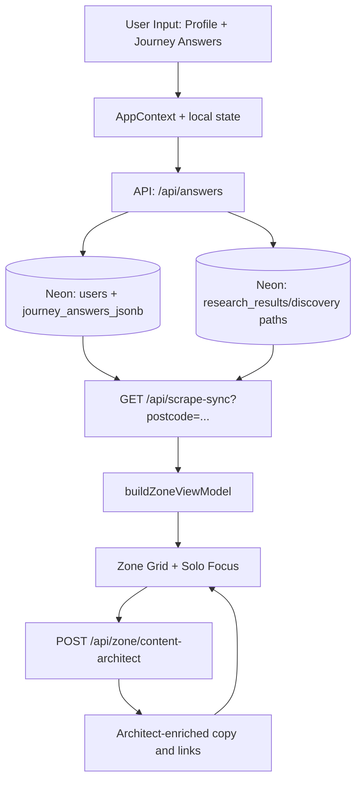

---

#### 3) Data Pipeline By Layer

##### Copy voice (warm auditor)

- **Persona:** trusted UK mate — calm, empathetic, data-honest; one line of dry humour per card at most (`lib/zone/zoneVoice.ts`). Numbers still from Neon / `buildUserImpact` only.
- **Write path:** scrape-sync / `researchAgent` → Neon `architect_prose` + `agent_headline` → optional `content-architect` batch → `buildZoneViewModel` + `contentProseSanitize` on read.
- **Expanded Solo Focus:** `resolveExpandedTrueTipInsight` uses per-**parent** `journey_key` (`focusCategoryJourneyId`); body via `buildResearchResultsTrueTipBody` → `toThreeTrueTipParagraphs` with **`dedupeTrueTipParagraphs`** so the stamped £/CO₂e payoff appears **once**. Weak expanded H1s use **`EXPANDED_JOURNEY_HOOK`** (per journey). Mechanical scaffold lines stripped before display.
- **Locality in prose:** town name from `AppContext.locationState.locationName` (geocode after profile postcode) — **`lib/zone/localityCopy.ts`**. Raw postcodes never appear in Solo Focus lead copy.
- **Postcode:** drives APIs and research only — never hardcoded demo labels in `app/` or `lib/` UI paths.

##### Client Layer
- **State hub:** `app/context/AppContext.tsx`
- **Zone orchestrator:** `app/zone/page.tsx`
- **Solo Focus UI:** `app/components/SoloFocusOverlay.tsx`
- **Visited/pink behavior:** local visited cards + journey-visited merge guardrails

##### API Layer
- `POST /api/answers`: canonical answer commit path
- `GET /api/scrape-sync`: hydrates category coverage and latest research-backed snapshot
- `POST /api/zone/content-architect`: batch card copy generation/enrichment
- `GET /api/pulse/living`: live cap/rates/grid pulse data
- `POST /api/sentinel`: parallel signal layer (not the primary content source)

##### Data Layer (Neon)
- `journey_answers_jsonb`: user answers by journey
- `research_results`: headlines, prose, saving values, source/offer URLs
- `guest_sessions`: pre-auth continuity
- `users`: profile and genome anchors

---

#### 4) Category contract (what each journey must say)

Each Zone card only accepts Neon copy that passes `sanitizeArchitectProseForJourney` + `isAcceptableZoneJourneyHeadline` for that journey key. Wrong-category rows (e.g. BUS grant prose on `grants` with an e-bike headline) are treated as **unsettled** → Solo Focus shows **Computing…** until a valid scrape or `content-architect` row exists.

| Journey | Headline / topic lane | Prose must cover |
| --- | --- | --- |
| `home` | Fabric, heating, draughts, insulation | Loft, draught-proofing, heating waste — not e-bike or pure tariff-only dumps |
| `utilities` | Tariff, standing charge, direct debit | Ofgem cap / supplier switch maths for the user's fuel type |
| `grants` | BUS, ECO, local authority grants | Grant eligibility + installer path — not generic e-bike retail |
| `solar` | MCS install, export, self-use | Generation ROI — not boiler upgrade or BUS-only copy |
| `travel` | Commute, fuel, rail, EV | Transport swap — not loft or heat-pump grants |
| `holidays` | Flights, rail vs air, trip frequency | Holiday travel carbon — not home energy or e-bike schemes |
| `food` | Waste, basket, local outlets | Food waste / diet shift — not heat pumps |
| `shopping` | Repair, circular, durable goods | Purchase habits — not energy audit tables |
| `money` | Green finance, bills, direct debits | Household money moves — not shower heads or BUS |
| `tech` | Standby, smart heat, meters | Plug/load discipline — not loft insulation |
| `water` | Metering, Southern/regional water saves | Water volume — not gas boiler grants |
| `waste` | Council recycling, compost | Local waste rules — not tariff cap essays |
| `carbon` | Footprint tracking vs 12k kWh ≈ 1t | Audit framing — not meal planners or e-bike |

**Settled** means: per-journey coverage has verified £ **and** journey-valid headline or three-paragraph `architect_prose` (see `journeyResearchSettled` in `lib/researchSyncClient.ts`).

---

#### 5) Flow Rules That Matter

- **Postcode-first:** locality-aware paths must derive from user postcode.
- **Mechanical truth first:** no fake money/carbon if research stream is absent.
- **Pink visited cards:** reopening is allowed, but close should return to grid without loop takeover.
- **Category boundaries:** generated copy must stay inside the active journey domain.
- **Trusted source links:** use valid absolute HTTPS sources for CTA and citations.

---

#### 6) Operational Pipeline (Deploy + Health)

| Step | Command / endpoint |
| --- | --- |
| 1 | `npm run verify` — local gate (`tsc:check` + `lint:ci`) |
| 2 | `npm run deploy` — verify, Vercel remote build, auto-promote (`scripts/deploy-production.sh`) |
| 3 | `npm run promote` — if dashboard shows **Staged** but build is green |
| 4 | `GET /api/health?live=1` · `GET /api/health` · `GET /api/health/diagnostics` (Bearer `CRON_SECRET`) |
| 5 | `npm run hermes:ping` · `npm run hermes:pulse` (cron smoke) |
| 6 | Local env: `vercel pull --environment=production` → `npm run env:merge` → `npm run dev:3000` |
| 7 | `npm run dev:pipeline-ready` — verify + health; optional `npm run dev:pipeline-ready -- --seed YOURPOSTCODE` |
| 8 | Localhost `/zone`: one-shot auto-bootstrap unsettled journeys (`devResearchBootstrap.ts`); prod JIT unless `NEXT_PUBLIC_ZONE_DEV_BOOTSTRAP=1`. Grid reveal does not use timed `refreshKey` polls after bootstrap. |
| 9 | Content: `GET /api/scrape-sync?postcode=...` or `POST` trigger with `journey_key` |

See [DEPLOY-VERCEL.md](DEPLOY-VERCEL.md) for Vercel Lint/Typecheck *internal error* (build often OK — use **`npm run promote`**).


---

## Annex: Zone content, scrape & presentation {#annex-zone-content-scrape--presentation}

*Source file: `ZONE-CONTENT-AND-DATA.md`*


Canonical reference for **where Zone copy and numbers come from**, **what we scrape and why**, **how cards and Solo Focus present it**, and **tone of voice** across Architect, True Tip, and Zai.

**Related:** [HANDBOOK.md](HANDBOOK.md) · [PROFILE-ANSWERS-ZONE-TECH.md](PROFILE-ANSWERS-ZONE-TECH.md) (12×3 + mechanical truth) · [HYBRID-DATA-PIPELINE.md](HYBRID-DATA-PIPELINE.md) (cost tiers) · [ZAI-AND-QUESTIONS-RULES.md](ZAI-AND-QUESTIONS-RULES.md) (boundaries + question registry) · [INTELLIGENCE-LOOP-MANIFEST.md](INTELLIGENCE-LOOP-MANIFEST.md) (Hermes + persist) · [ULM-APPLICATION-LOOP.md](ULM-APPLICATION-LOOP.md) (ceilings + spawn) · [SENTINEL.md](SENTINEL.md) (parallel live layer) · [SUPPLEMENTAL-SYSTEMS.md](SUPPLEMENTAL-SYSTEMS.md) (Gary mode, pattern shift, rebirth vault, research paths).

**Code map:** `lib/zone/buildZoneViewModel.ts` · `lib/brains/buildUserImpact.ts` · `lib/agents/researchAgent.ts` · `lib/agents/contentArchitect.ts` · `lib/soloFocusCopy.ts` · `lib/zone/offerUrlGuard.ts` · `lib/zone/trustedJourneyUrls.ts` · `app/components/JourneyBentoCard.tsx` · `app/components/RockSavingTips.tsx`.

---

#### 1. Mental model

Zero Zero is **postcode-first**. The Zone wall should read as a **local audit**, not a generic savings blog.

| Layer | Owns | Premium cost |
|--------|------|--------------|
| **Profile onboarding** | Who you are, postcode, habits, goal | **Free** — Postcodes.io, Carbon Intensity, optional OpenEPC |
| **Deterministic engine** | Annual £ and kg CO₂e per journey | **Zero** — `buildUserImpact` |
| **Research stream** | Headlines, three-paragraph prose, offer URLs | **Firecrawl + Gemini** (surgical, capped) |
| **Content Architect** | Polishes grid + expanded copy from **locked** £/kg | **Gemini batch** — `POST /api/zone/content-architect` |
| **Zai chat** | Explains stored context | **No scrape** on `POST /api/zai` |

##### Mechanical truth

If Neon has **no stream** for a journey, the bento tile shows **COMPUTING — HOME** (etc.), metrics **—**, and **£0** — not marketing placeholder totals.

- Empty DB + postcode → `GET /api/scrape-sync` → `{ source: "pending", scraped: [] }`
- Shape defaults in `lib/scraper/uk2026Defaults.ts` are **zero**, labels **Computing...**
- `buildUserImpact` does **not** back-fill UK marketing leads when totals are 0
- `journeyHasStreamData` in `lib/zone/mechanicalTruth.ts` gates live £/headlines

Details: **[PROFILE-ANSWERS-ZONE-TECH.md](PROFILE-ANSWERS-ZONE-TECH.md)** §4.

---

#### 2. End-to-end data flow

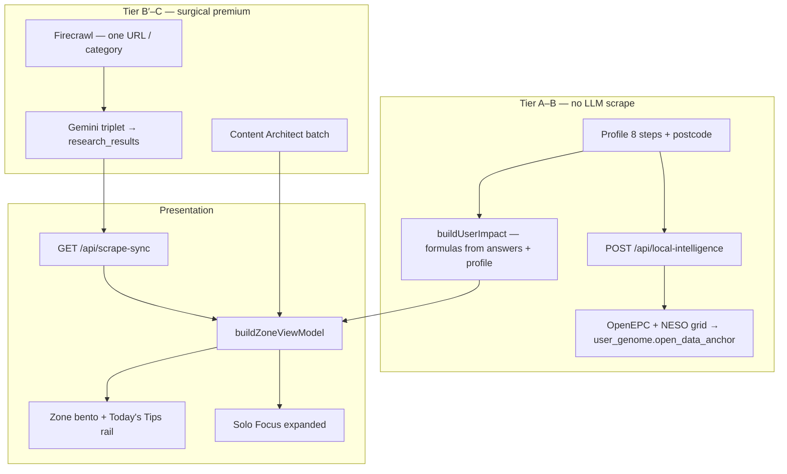

##### Cost tiers (summary)

| Tier | Surface | Premium APIs |
|------|---------|--------------|
| **A** | Profile postcode step | None |
| **B** | Zone grid baseline £/kg | None — `buildUserImpact` only |
| **B′** | Cached `research_results` copy | Only if row empty — surgical seed + Gemini triplet |
| **C** | Solo Focus `POST /api/answers` | Hybrid spawn when `MODEL_STRATEGY=bucket_failover` |
| **D** | `/zai` chat | None — read-only Neon |

Full table: **[HYBRID-DATA-PIPELINE.md](HYBRID-DATA-PIPELINE.md)**.

---

#### 3. Storage (Neon + client)

##### Neon hot path

| Table / column | Role |
|----------------|------|
| **`research_results`** | Per `category` (journey key): `saving_amount_gbp`, `verified_saving`, `agent_headline`, `architect_prose`, `offer_url`, `source_url`, `user_id`, postcode |
| **`research_snapshot`** (JSONB) | Invoke metadata (Hermes / hybrid-pipeline / repair flags) — not user-facing prose |
| **`journey_answers_jsonb`** | 12 domains × 3 behavioural answers |
| **`users.user_genome`** | `open_data_anchor` (EPC + grid snapshot at hydrate) |
| **`scraped_summary`** | Legacy hero aggregates when populated |
| **`discovery_injections`** | Capped supplemental cards |
| **`guest_sessions`** | Pre-login profile + answers (`zz_sid`) |

##### Client mirrors

- **`AppContext`** + **`localStorage`**: `profile_postcode`, journey answers, `visited_cards`
- **`GET /api/answers`** on boot — server wins over stale client cache
- **`GET /api/scrape-sync`** on Zone load — hydrates `research_category_coverage` + scraped overlay inputs

##### `insightReady` (scrape-sync)

True when a category row has prose, headline, £, or offer URL — bento face hides “Computing…” once settled. **`GET ?repair=1`** backfills missing headlines/prose without a full `force` research run.

---

#### 4. What we scrape, why, and when

Scraping is **never** “crawl the whole web for this postcode.” It is **surgical**: one **journey category** at a time, anchored to postcode + profile + (often) a specific answer.

| Trigger | Entry | Why |
|---------|--------|-----|
| **Zone load hydrate** | `GET /api/scrape-sync?postcode=` | Read existing rows; if empty → honest **pending** |
| **Solo Focus answer** | `POST /api/answers` → optional `triggerScrapeSyncForCategory` | User earned context for that journey |
| **Tip +1 verification** | `runTipVerificationDeepScrape` → scrape-sync `repair=1` | Estimated → verified after user confirms |
| **Deep Dive “Search deeper”** | JIT inside `AskZaiDeepDiveSheet` | Only Zai-adjacent surface allowed fresh fetch |
| **Hermes / cron (weekly)** | `GET /api/cron/zone-research?repair=1` | **Backfill** incomplete rows — not day-to-day discovery |
| **Broad force** | `POST /api/scrape-sync?force=true` | **Blocked** in `bucket_failover` unless `ALLOW_BROAD_SCRAPE=1` |

##### Firecrawl

- **Module:** `lib/agents/researchAgent.ts` — `scrapeFirecrawlZoneResearchStructured`
- **Shape:** `schemas/firecrawl-zone-research.v2.json` structured extract + markdown
- **Skip:** `SKIP_FIRECRAWL=1`, missing `FIRE_CRAWL_KEY_2` / `FIRECRAWL_API_KEY` → mechanical + Neon fallbacks

##### Gemini on research persist

On `persistResearchResult`:

| Field | Use |
|-------|-----|
| **`agent_headline`** | Zone bento preview — target **6–8 words** |
| **`architect_prose`** | Solo Focus body — **three paragraphs**, label-free |
| **`offer_url`** | BUY / Claim CTA after sanitization |
| **`saving_amount_gbp`** | Verified £ on card + prose |

##### Guards (credit + trust)

| Guard | Module |
|-------|--------|
| Visited card → no re-scrape on re-open | `lib/zone/visitedCards.ts`, `lib/researchSyncClient.ts` |
| Zai chat → read-only, no Firecrawl | `lib/zai/chatBoundaries.ts`, `app/api/zai/route.ts` |
| Category lane lock (one journey per request) | `lib/intelligence/scrapeBoundaries.ts` |
| Injection cap per journey | `MAX_DISCOVERY_INJECTIONS_PER_JOURNEY` in `lib/intelligence/manifest.ts` |
| Visited close → no inject on tip close | `lib/zone/patternShiftClose.ts` |

---

#### 5. How £ and kg are calculated (vs copy)

**Numbers on tiles** come from **`buildUserImpact`** (`lib/brains/buildUserImpact.ts`) — the **only** place money and carbon are calculated. UI must not invent totals.

1. Profile + journey answers → per-journey functions in `lib/brains/calculations.ts` (annualized).
2. When Solo Focus answers were cleared (e.g. after `/profile/summary`) but postcode / home / transport remain, **`lib/brains/profileJourneyBaseline.ts`** supplies **synthetic mid-band answers** so tiles are not £0 — badge stays **`ESTIMATED_AUDIT`** until Neon stream + genome complete.
3. Optional **scraped overlay** (≤20% delta) when scrape-sync provides data points.
4. **`buildZoneViewModel`** shows SAVE/CARBON when stream, utilities seed, or **`profileHasImpactBaseline`** — not only Neon.

**Questions** in `lib/journeys.ts` are **behavioural only** — they refine the model; they do not embed “save £400” in labels.

##### Audit badges

| Badge | When |
|-------|------|
| **`LIVE_AUDIT`** | Verified Neon money + genome complete enough |
| **`ESTIMATED_AUDIT`** | Stream exists but profile still thin |

Set in `buildZoneViewModel` via `vmAuditLive()`.

---

#### 6. Zone wall — collapsed bento cards

Built in **`lib/zone/buildZoneViewModel.ts`**, rendered as **`JourneyBentoCard`** (`app/zone/page.tsx` groovy grid).

| UI element | Source |
|------------|--------|
| **Headline** | `zoneCardHeadlineFromRaw` ← Neon `agent_headline` → Content Architect → cleaned title; **5–8 words** on grid (`cleanZonePreviewHeadline`, `isZonePreviewHeadlineNoise`) |
| **SAVE / CARBON** | `formatZoneCardMoney` / carbon from impact + stream |
| **Insight strip** | **Estimated** — *“Estimated from your profile — local audit still loading.”* when `auditState === ESTIMATED_AUDIT'` and research not settled but profile £ shows (`lib/zone/zoneAuditUi.ts`). **Computing** — spark icon when still loading and no estimated strip. |
| **Category colour** | `lib/journeyColors.ts` |
| **Visited (pink)** | Mother tile: pink after loop + `completeCleanBirth`. Discovery inject: pink on close. `.zone-card--visited` — see **Director's Order** in [HANDBOOK.md](HANDBOOK.md) |
| **Source line** | `source. …` attribution — **not** long prose |

##### Motion

**Atomic crystallize:** bento ripple via `ZONE_ATOMIC_BENTO_VARIANTS` + stagger (`lib/motion-family.ts`). Wall hidden until `revealedCardCount ≥ 1` and `pulseWordsComplete`.

**Grid reveal stability (`app/zone/page.tsx`):** after Architectural Pulse completes, cards stagger in at **2×** `ZONE_GRID_STAGGER_CHILD_DELAY_SEC` (not 3×). `revealedCardCount` only resets to **0** when pulse phase is not `done` — not when `displayItems` grows after scrape-sync (avoids flash-then-stall). Dev localhost bootstrap seeds unsettled journeys once; it does **not** schedule `refreshKey` poll timers (those used to re-hydrate the whole grid and interrupt reveal).

##### Today's Tips rail (Rock)

Separate from 12 journey bentos:

- **`RockSavingTips`** — heading **Today's Tips** (`aria-label="Today's tips"`)
- Habits + learn URLs from **`lib/rock/habitsCatalog.ts`**
- Same visit styling when opened

##### Discovery & injects

| Path | Role |
|------|------|
| **`POST /api/answers`** → `injectNewDiscoveryCard` | **Canonical** birth — one discovery per answer (JSON `new_card_data` / `grid_pulse_card`) |
| **`POST /api/zone/injections`** | Trap follow-up — supplemental, capped |
| **`POST /api/research/question-card`** | Free-form Ask — supplemental, capped |

Ceilings: **`MAX_DISCOVERY_INJECTIONS_PER_JOURNEY` = 3** · **`MAX_ZONE_BENTO_CELLS` = 24** (`lib/zone/ulmLimits.ts`).

---

#### 7. Expanded card — Solo Focus

**Open:** `onExpand` → `rememberSoloFocusOpen` / `openSoloFocus` → **`JourneyBentoCard`** QUESTION chamber (inject tips: **`SoloFocusOverlay`**). Pink lock waits for loop birth — not expand.

##### Layout (Zai Architect)

| Zone | Content |
|------|---------|
| **H1 (Marvin)** | **10–20 word** hook (`headlineFromExpandedHook`) — 2–3 lines; no postcodes/tariff dumps in title |
| **Lead (Marvin H4)** | First paragraph only — **town** from `locationState.locationName` (`lib/zone/localityCopy.ts`), never raw postcode |
| **Body** | Two **Roboto Bold** paragraphs + payoff — `buildResearchResultsTrueTipBody` / `resolveExpandedTrueTipInsight` |
| **Metrics** | Verified £ + CO₂e from stored row |
| **Trinity** | Ask Zai → deep dive; Continue in Zai → handoff; RECLAIM / BUY → `MotherCardRenderer` + `IndustrialHandoffButton` |
| **Questions** | **One** registry Q per open — zip-shut MC answer → **RESULT**; close → loop question (`DiscoveryTakeover`) |

##### Warm auditor voice (copy — 2026)

Persona: **trusted UK mate** — calm, empathetic, data-honest; at most one line of dry humour per card (`lib/zone/zoneVoice.ts`). Numbers only from Neon / `buildUserImpact`.

**Source of truth (no UI filler):**

| Layer | Owner | Rule |
|--------|--------|------|
| **Neon `research_results`** | `researchAgent` / scrape-sync | Three paragraphs from Gemini + surgical scrape; locality from geocode / profile |
| **Content Architect** | `POST /api/zone/content-architect` | Batch polish: friction / lever / action; category locks; `ZONE_CONTENT_ARCHITECT_VOICE` |
| **Solo Focus display** | `resolveExpandedTrueTipInsight` → `buildResearchResultsTrueTipBody` → `toThreeTrueTipParagraphs` | Prefer DB `architect_prose`; **one** payoff line via `payoffSentence` (stamped £/CO₂e) — **no** CTA-bridge / “Execute the…” / duplicate stamp paragraphs |
| **Locality** | `lib/zone/localityCopy.ts` | `resolveSoloFocusPlaceLabel` + `personalizeTrueTipPlaceLead` — town in lead, not postcode |
| **Sanitizer** | `lib/zone/contentProseSanitize.ts` | Strip leakage, demo postcodes, cross-category pollution on read |

**Not used for card prose:** `lib/soloFocusCopy.ts` generic placeholders, demo postcodes, or static “local data” paragraphs in the client.

##### Three prose beats (no UI labels)

Embedded in copy only — **never** `# What:` / `**Why:**` in the UI.

1. **Friction** — data-backed waste for the category (compact £ / kg).
2. **Leverage** — April 2026 policy or grant fact from `lib/brains/constants.ts` when relevant.
3. **Payoff** — single closing line, e.g. *“We've put about £X a year and around Y CO₂e against your {topic} row — from your saved audit, not a guess.”* (`payoffSentence` in `lib/zone/auditorNarrative.ts` — deduped by `dedupeTrueTipParagraphs` / `paragraphRepeatsPayoffStamp`).

##### Quality gates (`lib/soloFocusCopy.ts`)

| Function | Purpose |
|----------|---------|
| `stripExpandedCardTitleNoise` | Clean Solo Focus H1 |
| `headlineFromExpandedHook` + `EXPANDED_JOURNEY_HOOK` | **10–20 word** Marvin hook; per-journey fallback when DB title is thin, jargon, or off-topic (e.g. travel: rail/bus commute swap — not generic “near you” padding) |
| `dedupeTrueTipParagraphs` / `paragraphRepeatsPayoffStamp` | Drop duplicate payoff / repeated blocks before render |
| `isMechanicalScaffoldParagraph` / `isBoilerplateProseParagraph` | Strip *Execute the…*, *We treat the ~£…*, *optimization plan*, *green funding frameworks*, thin *“Your X is high-value”* |
| `collapseDuplicateProseParagraphs` | No repeated sentences within a block |
| `polishTrueTipParagraphsForHeadline` | Dedupe + de-headline-echo on open paragraph |
| `isRawResearchDump` | Reject tariff/policy blobs |
| `pruneDuplicateLocalityInsight` | Don't repeat H1 locality in body |
| Category separation | **home ≠ grants** — insulation vs BUS/ECO wording |

##### Headline word limits

| Surface | Limit | Enforcer |
|---------|-------|----------|
| Zone bento | **5–8** | `enforceHeadlineWordLimits(text, false)` |
| Solo Focus expanded hook | **10–20** (~2–3 lines) | `headlineFromExpandedHook` → per-journey `EXPANDED_JOURNEY_HOOK` when title is weak or generic spring filler (`isGenericSpringHeadline`); mechanical proof via `lib/zone/auditorNarrative.ts` (no shared “policy and tariff pressure…” block) |
| Paragraph | ≤ **40** words each | `MAX_TRUE_TIP_PARAGRAPH_WORDS` |

##### After an answer

```
POST /api/answers
  → upsert journey_answers_jsonb
  → buildUserImpact
  → (optional) discovery race → injectNewDiscoveryCard
  → zip-shut → next single question
  → optional Tier 2 mother/child morph (scoped scrape-sync)
```

**Visited close:** `shouldSkipInjectionOnCardClose` — no inject/scrape burn on tip close.

---

#### 8. Offer URLs (BUY / source)

Pipeline: `research_results.offer_url` → **`sanitizeZoneOfferUrl`** (`lib/zone/offerUrlGuard.ts`) → CTA.

| Rule | Behaviour |
|------|-----------|
| Block 404 gov paths | e.g. great-british-insulation-scheme |
| Block bare `gov.uk` homepages | Fall back to trusted URL |
| Home ↔ grants cross-landing | BUS on home tile → EST home URL; warm-homes on grants → BUS apply URL |
| Fallback | **`TRUSTED_JOURNEY_URLS`** — EST, MSE, WRAP, railcards (`lib/zone/trustedJourneyUrls.ts`) |

CTA labels: **`resolveRevenueCtaLabel`** (`lib/zone/verifiedRevenue.ts`) — Claim / Buy / Get. If no HTTPS offer, handoff may use **`/zai`** audit URL.

---

#### 9. Content Architect (polish layer)

Async after VM is built:

1. Client: `buildContentArchitectCardPayload(vm, journeyAnswers, locality, live unit rates, …)`
2. **`POST /api/zone/content-architect`** → `generateCardContextsBatch` (`lib/agents/contentArchitect.ts`)
3. **`applyArchitectEnrichment`** merges `headline`, `insight` (3 ¶), `actionLine`, `suppliedBy`

Architect receives **locked** £/kg — it does not recalculate totals.

##### Architect tone (system prompt summary)

- **`ZONE_CONTENT_ARCHITECT_VOICE`** (`lib/zone/zoneVoice.ts`) — warm, caring, compact £ facts
- Uppercase functional headlines (5–8 words bento; expanded hook up to 20 words)
- No emojis, no cheerleading, no dev-speak (`tile`, `pipeline`, `morph`)
- Category locks enforced per `journey_key` (see [USER-FLOW-AND-DATA-PIPELINE.md](USER-FLOW-AND-DATA-PIPELINE.md) §4)
- **home** = insulation, draughts, heating — never grants/BUS wording
- **grants** = BUS, ECO, heat pump funding only
- Each journey: distinct mechanism — no reused opening sentence
- No dev-speak: tile, lane, anchored, component

---

#### 10. Tone of voice by surface

| Surface | Persona | Scrape on turn? |
|---------|---------|-----------------|
| Zone bento + Solo Focus | Warm auditor (`zoneVoice.ts`) — Marvin hook + lead + Roboto body | On answer / tip+1 / hydrate; localhost bootstrap (dev) |
| Content Architect | Same warm voice (batch polish) | N/A (batch) |
| **`/zai` chat** | “Active auditor with a pint” — calm UK mate, dry irony OK | **Never** on `POST /api/zai` |
| Deep Dive sheet | Same matrix, in-card | **Search deeper** only |

##### Zai chat contract

- **Matrix:** `ZAI_PERFORMANCE_AUDITOR_V3_MATRIX` — `lib/brains/zai/prompts.ts` (re-export `lib/zai/chatPrompts.ts`)
- **3-beat** in prose — Detection → Proof → Directive (no labeled headings)
- **`stripZaiChatMarkdown`** server + client
- Thin context → *“i don't have enough information to be confident on that one. let's stick to your bills or travel moves.”*
- Forbidden: financial / legal / medical advice
- No “Sure!”, cheer, exclamation spam

Full boundaries + question registry: **[ZAI-AND-QUESTIONS-RULES.md](ZAI-AND-QUESTIONS-RULES.md)**.

---

#### 11. Content vs data — quick lookup

| User sees | Data source | Copy owner |
|-----------|-------------|------------|
| Grid headline | `agent_headline` + Architect + cleaners | `soloFocusCopy`, `contentArchitect` |
| Grid £/kg | `buildUserImpact` + `journeyHasStreamData` | `calculations.ts` |
| Expanded H1 | 10–20 word hook, 2–3 lines | `headlineFromExpandedHook`, `stripExpandedCardTitleNoise` |
| Expanded lead (H4) | Town from `locationState` | `localityCopy.ts`, `personalizeTrueTipPlaceLead` |
| Expanded body | `architect_prose` or auditor fallback | `buildResearchResultsTrueTipBody`, `toThreeTrueTipParagraphs` |
| No-offer footer | When no HTTPS partner URL | *“No live retailer link this week — figures still come from your saved audit row.”* (`JourneyBentoCard`, `SoloFocusOverlay`) — not “Fresh Audit…” dev-speak |
| BUY link | `offer_url` → sanitizer → trusted fallback | `offerUrlGuard`, `trustedJourneyUrls` |
| Questions | `lib/journeys.ts` | Static behavioural copy |
| Today's Tips | Rock catalog | `RockSavingTips`, `habitsCatalog` |
| Pink / yellow visit | `visited_cards` + `POST /api/zone/visit` | `.zone-card--visited` in `globals.css` |

---

#### 12. Boundary diagram (who must not overlap)

```
                  ┌──────────────────────────────────────────┐
                  │     ONBOARDING (8 profile steps)       │
                  │  Postcode → buildUserImpact baseline     │
                  └────────────────────┬─────────────────────┘
                                       │
                                       ▼
┌────────────────────────────────────────────────────────────────────────┐
│                    ZONE GRID & research_results                        │
│  12 bentos · tips rail · ≤3 injects/journey · 1 Q per card             │
│  Visited → pink / yellow                                               │
│  Canonical birth: POST /api/answers → injectNewDiscoveryCard           │
└──────────────────────────────┬─────────────────────────────────────────┘
                               │ read-only
                               ▼
                  ┌──────────────────────────────────────────┐
                  │         ZAI CHAT (/zai)                  │
                  │  Transcript + Neon only — NO scrape        │
                  └──────────────────────────────────────────┘
```

| Layer | Must not |
|-------|----------|
| Onboarding | Zone loop questions, broad Zai scrape |
| Zone | Duplicate questions on one card; inject on visited close |
| Zai chat | Firecrawl, cron, `triggerScrapeSyncForCategory` |
| Deep dive | Scrape on **Continue in Zai** (context handoff only) |

---

#### 13. Verification

```bash
### Local
npm run verify && npm run build

### Honest empty Zone (prod)
curl -sS "https://00-ulm.vercel.app/api/scrape-sync?postcode=BN17" | jq '.source, (.scraped | length)'

### Latest Neon row
npm run db:log-research
```

---

#### 14. Sentinel (parallel layer — not main scrape copy)

Sentinel does **not** fill `research_results` headlines for all 12 journeys. It provides:

- **Live-Impact** grid/rates on Zone (`useSentinel` → `POST /api/sentinel`)
- **Home mother/child deck** in `journey_state` (`advanceHomeJourneySentinelAfterAnswer` after home answers)
- **`inject-sentinel-*`** priority tips + optional rural grant card

Full spec: **[SENTINEL.md](SENTINEL.md)**.

---

#### 15. Supplemental systems

| System | Doc section |
|--------|-------------|
| Gary / BN17 demo `user_id` | [SUPPLEMENTAL-SYSTEMS.md](SUPPLEMENTAL-SYSTEMS.md) §2 |
| Pattern shift vs visited close | §3 |
| Rebirth vault discovery race | §4 |
| Tier 2 / tip +1 scrape | §5 |
| `triggerSupplementalResearch` vs canonical birth | §1 |
| Fallback zone tips | §9 |

---

#### 16. Why it is designed this way

1. **Trust** — show £ only with a research stream or honest COMPUTING state.
2. **Cost** — surgical scrape, visited lock, bucket failover, Hermes repair-only cron.
3. **Clarity** — one question per card; one discovery spawn per answer; home ≠ grants.
4. **Action** — real HTTPS offers or trusted fallbacks, not dead gov homepages.
5. **Voice** — same auditor from grid → Solo Focus → Zai; chat stays read-only so it cannot invent £ not on the wall.

---

*Update this doc when changing `buildZoneViewModel`, `contentArchitect`, `soloFocusCopy`, scrape boundaries, or visit/inject rules.*

---

## Annex: Profile, journey questions & mechanical truth {#annex-profile-journey-questions--mechanical-truth}

*Source file: `PROFILE-ANSWERS-ZONE-TECH.md`*


What ships in **`main`** after the **mechanical truth** pass: the UI only shows £/kg and headlines when Neon or scrape-sync has **stream data**. No UK placeholder back-fill on the Zone wall.

Cross-links: **[HANDBOOK.md](HANDBOOK.md)**, **[ZONE-CONTENT-AND-DATA.md](ZONE-CONTENT-AND-DATA.md)** (scrape, copy, presentation), **[HYBRID-DATA-PIPELINE.md](HYBRID-DATA-PIPELINE.md)**, **[INTELLIGENCE-LOOP-MANIFEST.md](INTELLIGENCE-LOOP-MANIFEST.md)**, **`lib/journeys.ts`**.

---

#### 1. Thirteen domains × three questions

| Journey key | Profile / Solo Focus questions (ids) |
|-------------|--------------------------------------|
| `home` | `property_type`, `insulation_level`, `glazing_type` |
| `utilities` | `tariff_type`, `supplier_switch`, `monthly_energy_band` ( **`home_power` / power type = profile only** — unlocks UTILITIES tile on Zone) |
| `grants` | `boiler_age`, `income_benefits`, `prior_eco_bus` |
| `solar` | `roof_orientation`, `roof_shading`, `daytime_occupancy` |
| `travel` | `commute_distance`, `ev_hybrid`, `public_transport` |
| `holidays` | `annual_flights`, `flight_duration`, `carbon_offsets` |
| `food` | `diet_profile`, `organic_shopping`, `own_produce` |
| `shopping` | `retail_channel`, `repair_mindset`, `online_deliveries` |
| `money` | `monthly_energy_bill`, `tariff_type`, `green_investments` |
| `tech` | `smart_thermostat`, `smart_home`, `smart_meter` |
| `water` | `garden_butt`, `wash_preference`, `rainwater_harvest` |
| `waste` | `food_waste_collection`, `composting`, `soft_plastics` |
| `carbon` | `footprint_awareness`, `carbon_removal`, `tonne_reduction_timeline` |

- **Source of truth:** `lib/journeys.ts` — `JOURNEY_ORDER`, `JOURNEYS`, `isValidJourneyQuestion`, `isJourneyComplete`.
- **Wall order:** `JOURNEY_ORDER` in `lib/journeys.ts` (13 keys including `utilities` after `home`).
- **DB sync:** `npm run db:evolve-12-domains` seeds `journey_questions` for all keys in `JOURNEY_ORDER`.

Question copy is **behavioural** (no hardcoded £/carbon in labels). Money on cards comes from **research / scrape**, not from question text.

---

#### 2. Profile onboarding

| Step | Code | Persistence |
|------|------|-------------|
| Route | `app/profile/page.tsx` → `ProfilePageClient.tsx` | — |
| Name step | `InputField` `autocomplete="given-name"`; `firstNameFromAutofill` on change/blur | `profile_name` — **first token only** (browser may autofill full name) |
| Postcode step | `autocomplete="postal-code"`; hydrate from `profile_postcode` (`localStorage`, intro geolocation, `SessionStateRehydrate`) · `POST /api/local-intelligence` | Council, ward, `localCarbonG`, grant context → used in VM + summary |
| Profile fields | name, postcode, `home_type`, **`power type`** (profile step `powerType` → GAS / ELECTRIC / MIX / OTHER), transport, household, employment, goal | `users` + `AppContext` + `localStorage` (`profile_home_power`); seeds journey answers + **unlocks 13th Zone card (UTILITIES)** via `lib/profile/homePower.ts` + `lib/zone/utilitiesZoneUnlock.ts` |
| Motion | Full-sentence fade per step (`STACCATO_TWEEN`, y 10→0) | [HANDBOOK.md](HANDBOOK.md) Motion table |
| After profile | `/profile/summary` → `/zone` | Summary uses `lib/brains/summaryLogic.ts` + `buildUserImpact` (no UK_2026 back-fill) |

##### Utilities free APIs (server-only)

| API | Auth | Used for |
|-----|------|----------|
| [postcodes.io](https://postcodes.io) | none | Council / region anchor |
| [carbonintensity.org.uk](https://api.carbonintensity.org.uk) | none | `GET /intensity` (live gCO₂/kWh), `GET /generation` (fuel mix %), regional postcode |
| [environment.data.gov.uk](https://environment.data.gov.uk/flood-monitoring) | none | Water lane — latest station readings (`/data/readings?_limit=N`) |
| [api.octopus.energy](https://api.octopus.energy) | none | Indicative Agile p/kWh (electric / mixed homes) |
| Ofgem price-cap hub | none (HTML via `/api/pulse/living`) | Cap + unit-rate citations |

Full matrix + usefulness: **[PUBLIC-UK-APIS.md](PUBLIC-UK-APIS.md)**. Registry: `lib/data/utilitiesFreeApis.ts` · `lib/data/ukPublicInfrastructureApis.ts` · `lib/data/octopusPublicApis.ts` · `lib/data/publicUkApisUsage.ts`. Live smoke: `npm run test:uk-apis`.

**Intro:** `/` and `/intro` — kinetic words → stacked lockup **CREATE A / PROFILE TO / START.** at **profile question H2 scale** (not desktop H1). **CREATE** only (no SKIP). `?skip=1` skips logo. Intro may set `profile_postcode` via geolocation + `/api/geocode`.

---

#### 3. Journey answers (Solo Focus & embedded)

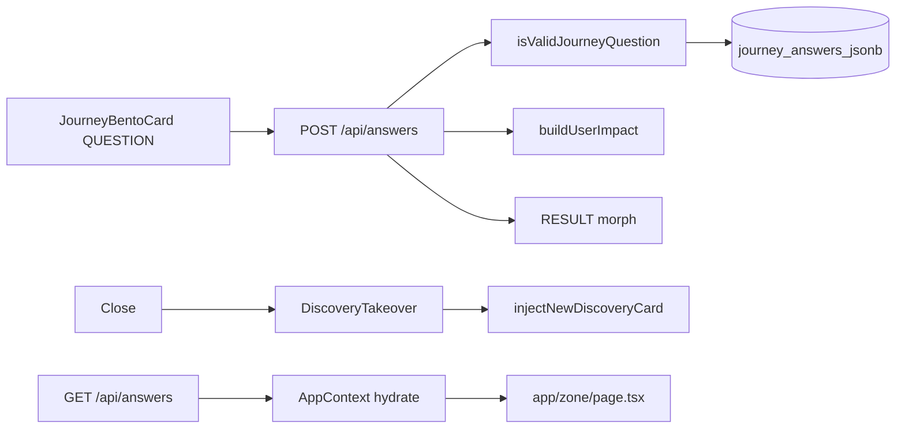

| Piece | Location |
|-------|----------|
| Solo Focus Q | `lib/zone/questionHandler.ts` → `getSoloFocusNextQuestion` |
| UI | `app/components/JourneyBentoCard.tsx` |
| Loop after close | `app/components/DiscoveryTakeover.tsx` + `lib/zone/loopQuestions.ts` |
| Server handler | `app/api/answers/route.ts` |
| Validation | `isValidJourneyId` + `isValidJourneyQuestion` from `lib/journeys.ts` |
| Persist | `upsertJourneyAnswerJsonb`, `upsertUserGenomeFromAnswer` (`lib/db/neon.ts`) |
| Discovery birth | `raceDiscoveryBirth` → response `new_card_data` / `grid_pulse_card` → client `injectNewDiscoveryCard` |
| Supplemental | `POST /api/research/question-card` (Ask), `POST /api/zone/injections` (trap) — capped |

Answers **refine** impact when stream data exists; they **do not** fabricate Zone wall £ when Neon is empty (see §4).

---

#### 4. Mechanical truth on the Zone

##### Rule

**If `research_results` / `scraped_summary` / per-journey Neon row has no stream for a journey → that tile shows £0, carbon 0, title `COMPUTING — <JOURNEY>`, metrics `—`, and a “Computing…” strip.**

##### Data path

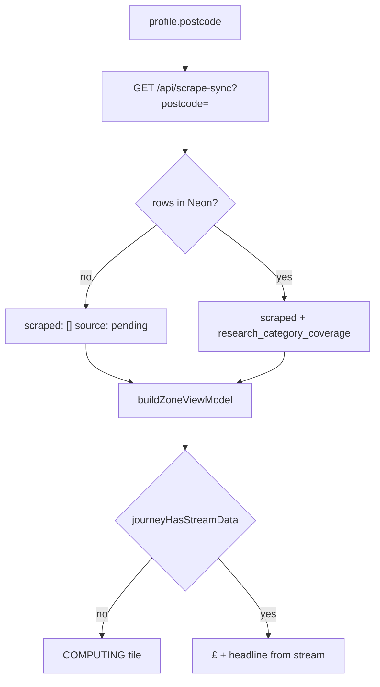

| File | Role |
|------|------|
| `lib/scraper/uk2026Defaults.ts` | Shape-only defaults: **all zeros**, labels **Computing...** (not shown as fake savings) |
| `lib/brains/buildUserImpact.ts` | **No** `UK_2026_MONEY_LEAD` back-fill when money/carbon are 0 |
| `lib/zone/mechanicalTruth.ts` | `journeyHasStreamData`, `hasAnyStreamData`, `computingJourneyTitle` |
| `lib/zone/buildZoneViewModel.ts` | Skips formula £ for journeys without stream; hero **Analyzing your postcode...** when totals are 0 |
| `app/zone/page.tsx` | Grid always visible; `LoadingHeartbeat` + skeleton cards until scrape-sync resolves (`vmResolved`); `streamPending` → `insightGenerationPending` on cards |
| `app/api/scrape-sync/route.ts` | With postcode + empty DB → `{ scraped: [], source: "pending" }` (not fake defaults) |

##### Filling the screen (only path)

1. **POST** `/api/scrape-sync?postcode=BN17&force=true` (Bearer `SCRAPER_SECRET` or `CRON_SECRET`) — regional research + persist repair.
2. Or **Hermes** cron → `/api/cron/zone-research` for queued users.
3. Or user **answers** in Solo Focus → discovery + supplemental research (capped).

**Verify API (honest empty):**

```bash
curl -sS "https://00-ulm.vercel.app/api/scrape-sync?postcode=BN17" | jq '.source, (.scraped | length)'
### expect: "pending" and 0 until Neon has rows
```

**Verify DB:**

```bash
npm run db:log-research
npm run db:columns
```

---

#### 5. What you should see in the browser

| State | Zone hero | Journey tiles |
|-------|-----------|---------------|
| Clean Neon, first load | “Analyzing your postcode…”, £0 total | 13× **COMPUTING — …**, **—** for SAVE/CARBON, pulsing “Computing…” |
| After pulse / research rows | Personalised hero when totals &gt; 0 | Real £, headlines, LIVE/ESTIMATED audit badges |
| Stale client cache | Old £ may flash briefly | Hard refresh; `DATA_VERSION` in app clears journey cache on bump |

---

#### 6. Deploy & prep

```bash
npm run verify
npm run prep:live           # db:test + db:evolve-12-domains + build:clean
npm run deploy              # verify + remote build + auto-promote
npm run promote             # if Vercel Staged but build green
npm run dev:pipeline-ready  # local env + health; optional -- --seed POSTCODE
```

See [DEPLOY-VERCEL.md](DEPLOY-VERCEL.md) and [USER-FLOW-AND-DATA-PIPELINE.md](USER-FLOW-AND-DATA-PIPELINE.md) §6.

If `git push` says “no upstream”, run once: `git push -u origin main`.

---

#### 7. Presentation (after stream exists)

Once `research_results` rows exist, see **[ZONE-CONTENT-AND-DATA.md](ZONE-CONTENT-AND-DATA.md)** for headlines, Solo Focus triplets (deduped payoff, per-journey expanded hooks), Today's Tips rail, offer URLs, grid reveal stability, and warm UK auditor tone.

---

## Annex: Zai, Deep Dive & question registry {#annex-zai-deep-dive--question-registry}

*Source file: `ZAI-AND-QUESTIONS-RULES.md`*


Single reference for **Ask Zai chat**, **Ask Zai Deep Dive**, **profile onboarding**, **journey questions** (12 domains × 3), **Zone loop beats**, and **tip verification (+1)**.

**Code sources:** `lib/zai/chatRules.ts`, `lib/zai/chatBoundaries.ts`, `lib/zai/chatPrompts.ts`, `lib/zai/deepDiveAudit.ts`, `lib/zai/loadResearchSourceHint.ts`, `lib/zai/scrapeAreaHint.ts`, `app/zai/page.tsx`, `app/components/AskZaiDeepDiveSheet.tsx`, `app/profile/ProfilePageClient.tsx`, `lib/journeys.ts`, `lib/zone/loopQuestions.ts`, `lib/zone/tipVerification.ts`, `lib/zone/visitedCards.ts`, `lib/brains/zai/prompts.ts`, `lib/brains/zai/boundaries.ts`.

Related: [HANDBOOK.md](HANDBOOK.md), [ZONE-CONTENT-AND-DATA.md](ZONE-CONTENT-AND-DATA.md) (scrape, card copy, Solo Focus, tone), [SENTINEL.md](SENTINEL.md), [SUPPLEMENTAL-SYSTEMS.md](SUPPLEMENTAL-SYSTEMS.md), [ULM-APPLICATION-LOOP.md](ULM-APPLICATION-LOOP.md), [PROFILE-ANSWERS-ZONE-TECH.md](PROFILE-ANSWERS-ZONE-TECH.md), [HYBRID-DATA-PIPELINE.md](HYBRID-DATA-PIPELINE.md), [INTELLIGENCE-LOOP-MANIFEST.md](INTELLIGENCE-LOOP-MANIFEST.md).

---

#### Part 0 — Mechanical Truth boundaries (no overlap)

##### Hybrid data pipeline (cost)

| Tier | Surface | Premium APIs |
|------|---------|--------------|
| A | Profile postcode step | **None** — Postcodes.io + Carbon Intensity (+ optional OpenEPC → `user_genome.open_data_anchor`) |
| B | Zone grid tile £/kg | **None** — `buildUserImpact` only |
| C | Solo Focus answer | **Hybrid spawn** when `MODEL_STRATEGY=bucket_failover` — `lib/zone/engineDataRouter.ts` locks £/kg, Gemini prose only |
| D | `/zai` | **None** — read-only matrix |

Hermes cron unchanged (repair backfill only). See [HYBRID-DATA-PIPELINE.md](HYBRID-DATA-PIPELINE.md).

##### Global data matrix — who owns what

```
                  ┌──────────────────────────────────────────┐
                  │     ONBOARDING BASICS (Part 3)           │
                  │  Postcode, name, core habits, goal       │
                  │  → buildUserImpact → Neon / localStorage │
                  └────────────────────┬─────────────────────┘
                                       │ initial baseline
                                       ▼
┌────────────────────────────────────────────────────────────────────────┐
│                    ZONE GRID & LIVE DATABASE                         │
│  12 journey bentos · 24-cell ceiling · ≤3 injects / domain           │
│  1 card = 1 active question (journey Q or loop beat)                 │
│  Visited → pink / yellow (`visited_cards`)                           │
│  Canonical birth: POST /api/answers → injectNewDiscoveryCard (×1)    │
└──────────────────────────────┬─────────────────────────────────────────┘
                               │ read-only context
                               ▼
                  ┌──────────────────────────────────────────┐
                  │         ZAI CHAT (/zai)                  │
                  │  Transcript + Neon/profile only          │
                  │  NO scrape on chat turns                 │
                  │  3-beat · no markdown · no AI apology    │
                  └──────────────────────────────────────────┘
```

| Layer | Owns | Must not |
|-------|------|----------|
| **Onboarding** (8 steps) | Profile fields, postcode locality, `buildUserImpact` baseline | Zone loop questions, free Zai scrape |
| **Zone** | Journey + loop answers, card visit state, discovery inject (capped), GET scrape-sync hydrate | Duplicate questions on one card; inject on visited close |
| **Zai chat** | Interpret verified context + transcript (max 20 turns) | Broad Firecrawl, cron, `triggerScrapeSyncForCategory` |
| **Deep dive sheet** | In-card audit; **Search deeper** = only Zai-adjacent JIT scrape | Scrape on **Continue in Zai** (handoff only) |
| **Sentinel** | Live grid + home deck + `inject-sentinel-*` tips on Zone | **Not** Zai chat — see [SENTINEL.md](SENTINEL.md) |

**Enforced in code:** `lib/zai/chatBoundaries.ts`, `lib/zone/visitedCards.ts` (`shouldSkipInjectionOnCardClose`), `app/api/zai/route.ts` (read-only comment + no scrape calls), `lib/researchSyncClient.ts` (doc guard).

##### Onboarding hydration flow

1. Eight profile steps (`ProfilePageClient.tsx`) capture demographics and goal.
2. On completion, answers feed **`buildUserImpact(profile, postcode)`** → approximate money/carbon baseline.
3. Payload persists to Neon / `localStorage` mirrors; **`GET /api/scrape-sync`** on Zone load hydrates cards from **`research_results`** — not a loose broad scrape at profile redirect.

##### Zone card loop rules

| Rule | Implementation |
|------|----------------|
| **1 card = 1 question** | One active `EmbeddedJourneyQuestion` or loop beat per card surface; no stacked inputs. |
| **Single spawn** | User answers → targeted state → `POST /api/answers` → exactly **one** discovery card per answer → `injectNewDiscoveryCard`. |
| **Injection budget** | Up to **`MAX_DISCOVERY_INJECTIONS_PER_JOURNEY` = 3** per domain (`lib/intelligence/manifest.ts`). |
| **Visited flip (pink)** | **Mother journey:** pink only after **one** loop answer + `completeCleanBirth` (`markCardVisited` on closed card id — **not** on first Solo Focus close). **Discovery inject (`inject-*`):** pink on close (`shouldCloseMarkPinkOnly`). **Rock / tip +1:** may mark on open or verify path. UI: `.zone-card--visited` via `isZoneCardPink` + `visited_cards`. |
| **Offer URLs** | `sanitizeZoneOfferUrl` (`lib/zone/offerUrlGuard.ts`): block 404 gov paths (e.g. great-british-insulation-scheme), bare `gov.uk` homepages, home↔grants cross-landing; fall back to `TRUSTED_JOURNEY_URLS` (EST, MSE, WRAP, railcards — not regulator homepages). |
| **Copy voice** | Content architect + True Tip: calm UK mate tone; **home ≠ grants** mechanism; `dedupeTrueTipParagraphs`, `isMechanicalScaffoldParagraph`, `collapseDuplicateProseParagraphs`, `isRawResearchDump`. Full pipeline: **[ZONE-CONTENT-AND-DATA.md](ZONE-CONTENT-AND-DATA.md)**. |
| **Close credit guard** | If card already visited, close calls `onPatternShiftClose` with `visitedClose: true` → **no** loop takeover, **no** `spawnAchievementWhenLoopPoolExhausted`, **no** `/api/zone/injections` path from close (`lib/zone/patternShiftClose.ts`). |

##### Zai chat sandbox

| Allowed JIT scrape surfaces | Forbidden on Zai chat |
|---------------------------|------------------------|
| `POST /api/answers` (server) | `POST /api/zai` turns |
| Tip +1 `runTipVerificationDeepScrape` | `Continue in Zai` navigation (context only) |
| Deep dive **Search deeper** only | Closing Zai (`ZAI_AUDIT_COMPLETE` = VM refresh only) |
| Zone `GET /api/scrape-sync` hydrate | Re-opening visited card close |

##### Zai editorial contract (“active auditor with a pint”)

| Rule | Detail |
|------|--------|
| **Voice** | Calm UK mate; lowercase where natural; short phrases; dry irony OK; no `!` cheer or “Sure!” openers. |
| **3-beat** | Detection → Proof → Directive (embedded in prose, **not** labeled headings). |
| **Label-free** | No `#` / `##`, no `**What:**` — `stripZaiChatMarkdown()` on server + client. |
| **Thin context** | No postcode, answers, or £/kg totals → `i don't have enough information to be confident on that one. let's stick to your bills or travel moves.` |
| **Forbidden topics** | Financial / legal / medical → `i cannot offer financial, legal, or medical advice. let's stay focused on your home energy or travel moves.` |
| **Prompt matrix** | `ZAI_PERFORMANCE_AUDITOR_V3_MATRIX` in `lib/brains/zai/prompts.ts` (re-exported from `lib/zai/chatPrompts.ts`). |
| **UI** | `/zai` uses `postZaiChat` + stream reader (not a second widget bot); pills hide while loading. |
| **Fallback (empty/stream fail)** | `give me a sec — still checking what's live near you.` |

##### API sketch (read-only turn)

```typescript
// lib/zai/chatBoundaries.ts — pattern; live handler: app/api/zai/route.ts POST
// 1. getZaiDeclineForQuestion(userMessage) → early JSON (no Gemini)
// 2. Load Neon journey_answers + profile + research rows (no scrape)
// 3. Gemini stream with ZAI_EDITORIAL_AUDITOR_DNA + 3-beat matrix
// 4. stripZaiChatMarkdown(polish(reply))
```

---

#### How it all works together (integrated flow)

This section is the **wiring diagram**: how profile onboarding, Zone questions, answers, discovery cards, Deep Dive, and Zai chat share data **without** double-scraping or duplicate question banks.

##### One-line summary

| Step | What happens |
|------|----------------|
| 1 | **Profile (8 questions)** → baseline money/carbon + Neon user row |
| 2 | **Zone** loads hero + 12 journey bentos from `research_results` (GET scrape-sync) |
| 3 | User opens a card → **Solo Focus** shows **one** journey question (Q1 from `lib/journeys.ts`) or a **loop beat** after close |
| 4 | User answers → **`POST /api/answers`** persists `journey_answers_jsonb`, may return **one** new discovery card → grid inject |
| 5 | Optional **Tip +1** or **Deep Dive** deepen that card; only **Search deeper** triggers a category scrape |
| 6 | **Zai chat** reads profile + journey answers + transcript + Neon research — **no scrape** on chat turns |
| 7 | **Continue in Zai** passes context into `/zai` once; next messages stay read-only |

All layers are gated in code (`chatBoundaries`, `visitedCards`, `perCategoryCardCap`, `ulmLimits`, `MAX_DISCOVERY_INJECTIONS_PER_JOURNEY = 3`).

##### End-to-end user journey

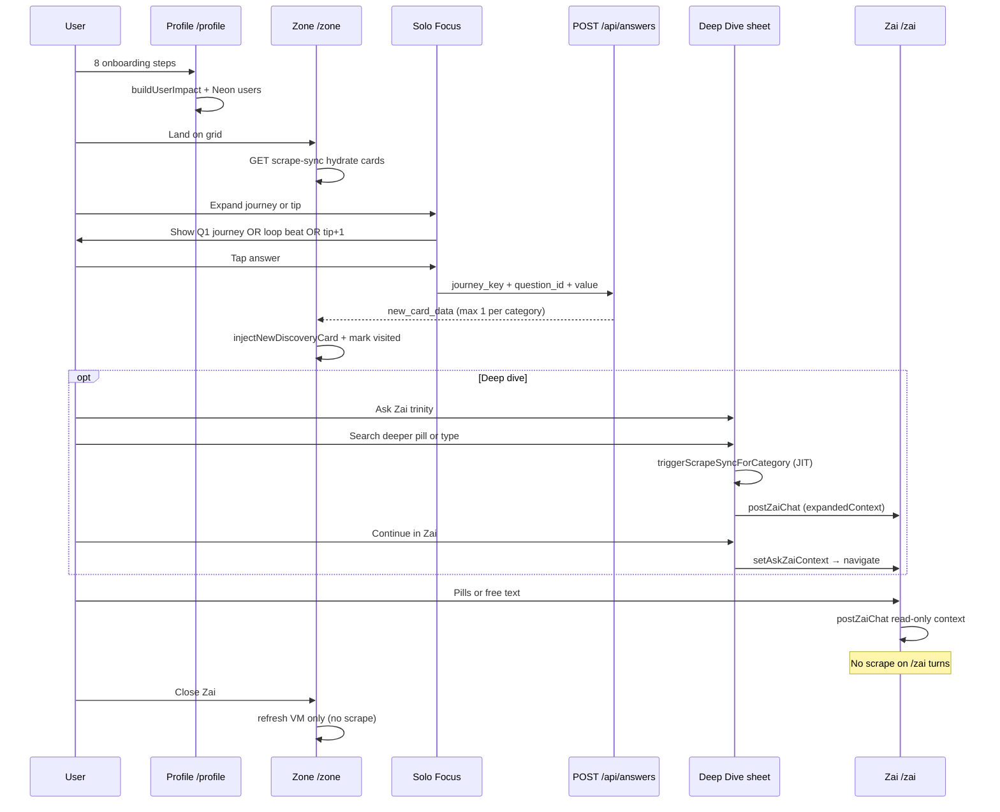

##### Which questions appear where (no overlap)

| When | Question source | Persisted as | Spawns discovery card? |
|------|-----------------|--------------|-------------------------|
| First time through profile | Part 3 — 8 steps only | `profile_*` keys + `users` | No |
| Solo Focus (first open on category) | Part 5 — journey **Q1** (`FUNKY_QUESTION_LABEL`) | `journey_{id}_answers` | Yes — via **`POST /api/answers`** |
| Full journey depth (profile/API path) | Part 4 — up to **3** per domain | `journey_{id}_answers` | Yes — same API, capped inject |
| After Solo Focus **close** (unvisited) | Part 6 — **loop beat** (`LOOP_QUESTION_BANK`) | `zz_loop_answers_log` + journey keys | Yes — if answer committed to API |
| After Solo Focus **close** (visited) | — | — | **No** — close credit guard |
| Tip card **+1** verify | Part 7 — verification follow-up | `targetField` in answers | Triggers **scoped scrape**, not free inject |
| Deep Dive pills | Part 2 — 3 fixed strings | Last question in sheet state | No inject — only Zai reply + optional JIT scrape |
| Zai chat pills | Part 1 — 5 suggested prompts | Chat transcript only | No — read-only turn |

**Rule:** Loop question IDs (`lifestyle_shift_pattern`, etc.) are **not** the same as journey registry IDs (`property_type`, etc.). Both validate through `isValidLoopOrJourneyQuestion` on `POST /api/answers`.

##### Shared data bus (what Zai reads)

| Store | Keys / tables | Written by | Read by Zai |
|-------|---------------|----------|-------------|
| `localStorage` | `profile_*`, `journey_{id}_answers`, `heroTotals`, `visited_cards` | Profile, answers, visits | `postZaiChat` + `getJourneyAnswersFromClient()` |
| `sessionStorage` | `AskZaiContext` (handoff) | Deep Dive **Continue in Zai** | `/zai` mount once, then cleared |
| `localStorage` | `zz_recent_chat_history` (20 turns) | `/zai` chat | `/zai` reload |
| Neon | `users`, `journey_answers_jsonb`, `research_results` | Profile, answers, scrape-sync | `/api/zai` when logged in |
| Zone VM | `buildZoneViewModel` + injections | scrape-sync, inject cap | Zai via totals + expandedContext |

Zai **never** re-runs onboarding questions or loop beats in chat — it only **interprets** answers already stored.

##### Deep Dive ↔ Zai chat ↔ Zone answers

| Action | UI | API / side effect | Injects grid card? |
|--------|-----|-------------------|-------------------|
| Answer in Solo Focus | Embedded question | `POST /api/answers` | Yes (canonical, max 1/category) |
| **Search deeper** in Deep Dive | Sheet pill / submit | `postZaiChat` + `triggerScrapeSyncForCategory` | No — answer stays in sheet |
| **Continue in Zai** | Sheet button | `setAskZaiContext` → `/zai` auto-send | No — uses handoff question as first user turn |
| Type in `/zai` | Chat input / 5 pills | `postZaiChat` only | No |
| Close visited card | × on pink card | `visitedClose` — skip loop/inject | No |

Handoff question shape (`lib/expandStorage.ts`):

`{user label} — I'm on "{card title}" in Zero Zero. Help me save or cut carbon for this.`

##### Close behaviour (visited vs fresh)

```
User taps close on Solo Focus (journey tile)
        │
        ├─ loop beat already answered for this journey? ──YES──► close only (visitedClose)
        │
        └─ NO ──► pickNextLoopQuestion(journey)
                    ├─ beat available ──► DiscoveryTakeover (loop UI) → injectNewDiscoveryCard
                    └─ bank exhausted ──► spawnAchievementWhenLoopPoolExhausted (pink hero card)

inject-* tips: visited_cards contains tip id ──► close only (no loop)
```

Visited cards on the grid stay **pink/yellow**; re-open does not call `/api/zone/injections` on close.

##### Enforcement checklist (working together now)

| Integration | Status | Where |
|-------------|--------|-------|
| Profile → hero baseline → Zone | Wired | `buildUserImpact`, `app/zone/page.tsx` hydrate |
| Journey answer → one discovery inject | Wired | `POST /api/answers`, `MAX_DISCOVERY_INJECTIONS_PER_JOURNEY = 3`, `perCategoryCardCap`, `engineDataRouter` |
| Loop answers → same API validator | Wired | `isValidLoopOrJourneyQuestion` |
| Visited close → no inject | Wired | `shouldSkipInjectionOnCardClose`, `PatternShiftCloseHandler` |
| Deep Dive scrape → Search deeper only | Wired | `AskZaiDeepDiveSheet.submit` |
| Continue in Zai → handoff, no scrape | Wired | `continueInZai` → `setAskZaiContext` only |
| Zai chat → read-only, no scrape | Wired | `app/api/zai/route.ts`, `chatBoundaries` |
| Zai close → Zone refresh only | Wired | `ZAI_AUDIT_COMPLETE_EVENT` → `refreshKey` |
| Chat + deep dive share `postZaiChat` | Wired | `lib/zai/chatClient.ts`, expandedContext on handoff |
| 3-beat + no markdown + no apology | Wired | `prompts.ts`, `stripZaiChatMarkdown` |

##### Troubleshooting “feels disconnected”

| Symptom | Likely cause | Check |
|---------|--------------|-------|
| Zai invents £ not on grid | Chat not reading Neon stream | Logged-in session; `research_results` for postcode |
| Two cards same category | Old client cache | Bump `NEXT_PUBLIC_DATA_VERSION`; clear `visited_cards` |
| Scrape on every Zai message | Should not happen | Confirm no `triggerScrapeSync` in `app/zai/page.tsx` |
| Loop question after pink close | Credit guard bypass | `visited_cards` contains card id |
| Deep Dive + chat duplicate scrape | Continue pressed after Search deeper | Continue does not scrape; only submit does |

---

#### Part 1 — Ask Zai chat (`/zai`)

##### Layout & turn-taking (`lib/zai/chatRules.ts`)

| Rule | Behaviour |
|------|-----------|
| Intro | Always visible (`ZAI_INTRO_LINES`); thread appends below |
| Page title | `<h3 className="zz-page-title">` — global H3, left-aligned |
| Close | Viewport-locked × → Zone; `dispatchZaiAuditComplete()` |
| Scroll | `zai-page-scroll` scrolls; composer fixed at bottom (transparent, no gradient scrim) |
| Pills | Under intro if no Zai reply yet; else under **last non-empty Zai** bubble |
| Pills hidden | While loading, or when last turn is **user** |
| `connect` | Fixed dock only while streaming |
| Input | Fixed dock; 2px shadow on field |
| Bubbles | 30px radius, 15px padding (intro + Zai + user) |

##### Intro copy (`lib/zai/chatPrompts.ts`)

1. `i read your zone — money, carbon, and what you actually do at home.`
2. `pick a prompt or ask your own. one uk move, this week.`

##### Cold-start hook (first Zai bubble when no handoff)

- With hero totals: `i've got £{money}/yr and {carbon}kg on your board in {place}. pick a lane — bills, travel, or grants — and i'll narrow it to one move.`
- Without totals: `i'm zai — your uk savings mate. tell me one bill or trip that nags you in {place}; i'll find a real lever.`

##### Suggested prompt pills (`ZAI_CHAT_SUGGESTED_PROMPTS`)

| # | Prompt |
|---|--------|
| 1 | `where should i start?` |
| 2 | `cut home energy bills` |
| 3 | `travel without the guilt` |
| 4 | `what grant fits me?` |
| 5 | `one change this week` |

##### Session flow

1. **Cold start** — intro + hook (above) when no `AskZaiContext`.
2. **Handoff** — `sessionStorage` `AskZaiContext` consumed once on mount → auto user message → streamed Zai reply.
3. **Free chat** — user types or pill → `POST /api/zai` with transcript, `journey_*_answers`, postcode, hero totals.
4. **History** — last 20 messages → `zz_recent_chat_history`.
5. **Fallback** — `give me a sec — still checking what's live near you.`

##### Handoff question template (`lib/expandStorage.ts`)

- With journey label: `{label} — I'm on "{cardTitle}" in Zero Zero. Help me save or cut carbon for this.`
- Default: `I want to know more about "{cardTitle}" and how I can save. Can you help?`
- Deep dive default if empty: `How can I close the saving gap for this category?`

##### AI voice & boundaries

**Persona:** Zai — UK savings mate; **Detection → Proof → Directive** (3 beats). See `lib/brains/zai/prompts.ts` (`ZAI_EDITORIAL_AUDITOR_DNA`, `ZAI_PERFORMANCE_AUDITOR_V3_MATRIX`).

**Allowed:** explain sustainability; reference card data; small actions; footprint; tradeoffs.

**Forbidden:** financial / medical / legal advice; promised savings; invented products/stats/brands; absolute claims.

**When unsure:** `I don't have enough information to be confident.`

**API:** `POST /api/zai` (streaming). Client guard: `isForbiddenQuestion()` in `lib/brains/zai/boundaries.ts`.

##### Reply chrome (`lib/zai/zaiChatUi.ts`)

On recommendation-shaped replies: **Like**, **source** (URL in prose), **profile answer** link when journey answers exist. Handoff replies always get Like meta.

---

#### Part 2 — Ask Zai Deep Dive sheet

**Component:** `app/components/AskZaiDeepDiveSheet.tsx`  
**Audit helpers:** `lib/zai/deepDiveAudit.ts`  
**Opened from:** Solo Focus or expanded bento — **Ask Zai** in action trinity.

##### UI rules

| Piece | Rule |
|-------|------|
| Shell | Bottom sheet (portal); zip-up; max ~85dvh; scrim closes; **ULM yellow** field (`#FFD700`), **ULM dark** ink (`#1A1A1A`) |
| Header | Category label + **Audit trail** + card headline |
| Audit block | **Calculation summary** + read-only trail (profile genome, journey answers, card £/kg signals, source URL) |
| Pills | **3 category-specific** prompts from `buildDeepDiveQuestionPills(journeyKey)` → **Continue in Zai** (no scrape) |
| Zai replies in sheet | Yellow bubble + dark text (same tokens as `/zai`) |
| Input placeholder | `Ask about this shift…` |
| Submit | **Search deeper** — `postZaiChat` + `triggerScrapeSyncForCategory` (JIT; locality from profile, not hardcoded counties) |
| Continue | **Continue in Zai** — `setAskZaiContext` (includes `shift_title`) → `/zai` read-only handoff |

##### Deep dive pills (per journey)

Generated by `buildDeepDiveQuestionPills` — e.g. home: `show me the math`, `why does this beat the april cap?`, `what do i do this week?`.  
Tapping a pill opens `/zai` with context pre-loaded; it does **not** run a scrape.

User may also type a **free-form** question in the sheet input (**Search deeper** path).

##### Submit behaviour

1. Build API question via `buildSoloFocusAskZaiQuestion(headline, userLabel)`.
2. POST `/api/zai` with `expandedContext` (category journey key, spend, regional avg, `shift_title`, scraped source, journey answers).
3. **`POST /api/zai`** enriches prompts from latest **`research_results`** row (`source_url` / `offer_url` / `saving_amount_gbp` only — never `architect_prose`; Zai explains why/how, not card copy).
4. JIT scrape when postcode ≥ 4 chars; scrape hint uses `scrapeAreaHintFromLocality` (`lib/zai/scrapeAreaHint.ts`).

---

#### Part 3 — Profile onboarding questions

**Route:** `/profile` → `ProfilePageClient.tsx` (`PROFILE_QUESTIONS`)  
**Not** the 12-domain journey bank — those are in Part 4.

| Step | ID | Prompt | Type | Options / placeholder |
|------|-----|--------|------|------------------------|
| 1 | `name` | `name` | text input | placeholder: `alex` |
| 2 | `postcode` | `postcode` | text input | placeholder: `postcode` |
| 3 | `livingSituation` | `who do you live with?` | options | `ALONE`, `COUPLE`, `FAMILY`, `SHARED` |
| 4 | `homeType` | `your home?` | options | `FLAT`, `HOUSE` |
| 5 | `transport` | `how do you get around?` | options | `WALK`, `BIKE`, `PUBLIC`, `CAR`, `MIX` |
| 6 | `age` | `how old are you?` | options | `JUNIOR`, `MID`, `RETIRED` |
| 7 | `employmentStatus` | `employment status?` | options | `EMPLOYED`, `SELF_EMPLOYED`, `UNEMPLOYED` |
| 8 | `goal` | `what is your goal?` | options | `SAVE` → money, `REDUCE` → carbon, `BOTH` → balanced |

After profile: `/profile/summary` → `/zone`.

---

#### Part 4 — Journey questions (12 domains × 3)

**Source of truth:** `lib/journeys.ts` (`JOURNEYS`, `QUESTIONS_PER_JOURNEY = 3`).

- **Profile / API:** all three per domain (`getJourneyQuestionsForProfile`).
- **Solo Focus:** first question only per domain (`SOLO_FOCUS_QUESTIONS_PER_JOURNEY = 1`) — see Part 5.
- **Validation:** `isValidJourneyQuestion(journeyId, questionId)` on `POST /api/answers`.

##### Home

| ID | Label | Options |
|----|-------|---------|
| `property_type` | Is your property detached or semi-detached? | `DETACHED`, `SEMI`, `TERRACED`, `FLAT` |
| `insulation_level` | Current insulation (loft / cavity)? | `FULL`, `PARTIAL`, `NONE`, `UNKNOWN` |
| `glazing_type` | Double or triple glazed? | `TRIPLE`, `DOUBLE`, `SINGLE`, `UNKNOWN` |

##### Grants

| ID | Label | Options |
|----|-------|---------|
| `boiler_age` | Is your boiler over 10 years old? | `OVER_10YR`, `UNDER_10YR`, `UNKNOWN` |
| `income_benefits` | Are you on any income-related benefits? | `YES`, `NO`, `PREFER_NOT` |
| `prior_eco_bus` | Have you had previous ECO4 or BUS grants? | `YES`, `NO`, `UNSURE` |

##### Solar

| ID | Label | Options |
|----|-------|---------|
| `roof_orientation` | Roof pitch orientation (S / E / W)? | `SOUTH`, `EAST`, `WEST`, `MIXED`, `FLAT` |
| `roof_shading` | Do you have a chimney or significant shading? | `NONE`, `CHIMNEY`, `TREES`, `BOTH` |
| `daytime_occupancy` | Average daytime occupancy at home? | `HIGH`, `MEDIUM`, `LOW`, `OUT_MOST_DAYS` |

##### Travel

| ID | Label | Type | Options / notes |
|----|-------|------|-----------------|
| `commute_distance` | Daily commute distance (miles)? | number | repeat: `Even a rough estimate helps — miles per day?` |
| `ev_hybrid` | Do you own an EV or hybrid? | options | `EV`, `HYBRID`, `PETROL_DIESEL`, `NONE` |
| `public_transport` | Public transport access near you? | options | `EXCELLENT`, `LIMITED`, `NONE` |

##### Holidays

| ID | Label | Options |
|----|-------|---------|
| `annual_flights` | Annual flight count? | `NONE`, `ONE_TWO`, `THREE_PLUS` |
| `flight_duration` | Average flight duration (hours)? | `SHORT`, `MEDIUM`, `LONG_HAUL` |
| `carbon_offsets` | Do you buy carbon offsets? | `YES`, `NO`, `SOMETIMES` |

##### Food

| ID | Label | Options |
|----|-------|---------|
| `diet_profile` | Meat-heavy or plant-based? | `MEAT_HEAVY`, `FLEXI`, `PLANT_BASED` |
| `organic_shopping` | Percentage of organic shopping? | `HIGH`, `SOME`, `RARELY`, `NEVER` |
| `own_produce` | Do you grow any of your own produce? | `YES`, `NO`, `STARTING` |

##### Shopping

| ID | Label | Options |
|----|-------|---------|
| `retail_channel` | High-street or second-hand first? | `HIGH_STREET`, `SECOND_HAND`, `MIXED` |
| `repair_mindset` | Repair vs replace mindset? | `REPAIR_FIRST`, `REPLACE`, `MIXED` |
| `online_deliveries` | Frequency of online deliveries? | `DAILY`, `WEEKLY`, `MONTHLY`, `RARELY` |

##### Money

| ID | Label | Type | Options / notes |
|----|-------|------|-----------------|
| `monthly_energy_bill` | Monthly energy bill (£)? | number | repeat: `Rough figure is fine — what do you pay per month?` |
| `tariff_type` | Fixed or variable tariff? | options | `FIXED`, `VARIABLE`, `UNKNOWN` |
| `green_investments` | Interest in green investments? | options | `HIGH`, `SOME`, `NONE` |

##### Tech

| ID | Label | Options |
|----|-------|---------|
| `smart_thermostat` | Smart thermostat (Nest / Hive)? | `YES`, `NO`, `PLANNED` |
| `smart_home` | Home Assistant or smart plugs? | `YES`, `NO`, `PARTIAL` |
| `smart_meter` | Smart meter installed? | `YES`, `NO`, `UNKNOWN` |

##### Water

| ID | Label | Options |
|----|-------|---------|
| `garden_butt` | Garden size suitable for water butts? | `LARGE`, `SMALL`, `NONE` |
| `wash_preference` | Shower or bath preference? | `SHOWER`, `BATH`, `BOTH` |
| `rainwater_harvest` | Rainwater harvesting setup? | `YES`, `NO`, `PLANNED` |

##### Waste

| ID | Label | Options |
|----|-------|---------|
| `food_waste_collection` | Access to food waste collection? | `YES`, `NO`, `PARTIAL` |
| `composting` | Composting on-site? | `YES`, `NO`, `SHARED` |
| `soft_plastics` | Soft plastic recycling habit? | `ALWAYS`, `SOMETIMES`, `NEVER` |

##### Carbon

| ID | Label | Options |
|----|-------|---------|
| `footprint_awareness` | Are you aware of your total footprint? | `YES`, `ROUGH`, `NO` |
| `carbon_removal` | Interest in carbon removal? | `HIGH`, `SOME`, `NONE` |
| `tonne_reduction_timeline` | Timeline for 1t reduction? | `THIS_YEAR`, `ONE_TO_THREE`, `LONGER` |

---

#### Part 5 — Solo Focus (one journey question per session)

**Cap:** `SOLO_FOCUS_MAX_QUESTIONS_PER_SESSION = 3` in `lib/animations.ts` (embedded chamber); registry exposes **one** high-leverage question per open (`getSoloFocusQuestions`).

**Displayed label on Zone bento (first question only):** `FUNKY_QUESTION_LABEL` in `lib/journeys.ts`:

| Journey | Solo Focus prompt (Q1 label) |
|---------|------------------------------|
| home | Is your property detached or semi-detached? |
| grants | Is your boiler over 10 years old? |
| solar | Roof pitch orientation (S / E / W)? |
| travel | Daily commute distance (miles)? |
| holidays | Annual flight count? |
| food | Meat-heavy or plant-based? |
| shopping | High-street or second-hand first? |
| money | Monthly energy bill (£)? |
| tech | Smart thermostat (Nest / Hive)? |
| water | Garden size suitable for water butts? |
| waste | Access to food waste collection? |
| carbon | Are you aware of your total footprint? |

---

#### Part 6 — Zone loop questions (post–Solo Focus beats)

**Source:** `lib/zone/loopQuestions.ts` (`LOOP_QUESTION_BANK`).  
**Rules:** each `questionId` shown **at most once** per browser profile; `pickNextLoopQuestion(journeyId)` prefers beats tagged for that journey (or global beats with empty `journeyKeys`).

| questionId | Prompt (UI) | Journey tags | Answer options (value) |
|------------|-------------|--------------|-------------------------|
| `lifestyle_shift_pattern` | swap your annual / flight for rail? | (any) | YES — RAIL & LOCAL · MAYBE — SHOW ME · NO — KEEP FLYING |
| `travel_rail_vs_flight` | rail instead / of flying? | travel | YES — RAIL · SHOW ME THE MATH · KEEP FLYING |
| `travel_ev_commute` | ev for your / commute? | travel, money | YES — EV · COMPARE COSTS · KEEP PETROL |
| `holidays_local_vs_longhaul` | uk staycations / not long-haul? | holidays | YES — LOCAL · MAYBE · KEEP LONG-HAUL |
| `holidays_train_not_plane` | train to europe / not short flights? | holidays, travel | YES — TRAIN · SHOW ROUTES · KEEP FLYING |
| `food_plant_shift` | two plant-based / meals a week? | food | YES · TRY IT · NOT YET |
| `food_waste_cut` | cut food waste / by half? | food, waste | YES · SHOW TIPS · NOT YET |
| `money_ev_swap` | swap petrol / for an ev? | money | YES — EV · COMPARE COSTS · KEEP PETROL |
| `money_smart_tariff` | switch to a / smart tariff? | money, home | YES — SWITCH · COMPARE · STAY PUT |
| `home_heat_pump` | heat pump / not gas? | home | YES · CHECK ELIGIBILITY · STAY ON GAS |
| `home_loft_insulate` | loft insulation / this year? | home, grants | YES · GET QUOTE · NOT YET |
| `grants_bus_boiler` | check bus grant / for your boiler? | grants, home | YES · MORE INFO · NOT ELIGIBLE |
| `solar_roof_fit` | solar on your / roof? | solar, home | YES · FREE SURVEY · NOT YET |
| `shopping_repair_first` | repair before / you replace? | shopping | YES · SHOW LOCAL · BUY NEW |
| `tech_standby_off` | kill standby / at night? | tech | YES · SHOW HOW · NOT YET |
| `water_meter_save` | water meter / save water? | water | YES · CHECK · NO METER |
| `waste_compost` | compost food / scraps? | waste, food | YES · TRY IT · NOT YET |
| `carbon_offset_cut` | cut direct / emissions first? | carbon | YES · SHOW PLAN · OFFSET ONLY |

Answers persist to `zz_loop_answers_log` and `journey_{id}_answers` (loop ids). Valid on `POST /api/answers` via `isValidLoopOrJourneyQuestion`.

---

#### Part 7 — Tip verification (+1) questions

**Source:** `lib/zone/tipVerification.ts` — one follow-up per journey before earned deep scrape (Solo Focus tip path). Card may override with its own `followUp`.

| Journey | Question | Options |
|---------|----------|---------|
| home | Is your loft insulated to 270mm? | YES, PARTLY, NO |
| grants | Are you on any income-related benefits? | YES, NO, PREFER NOT |
| solar | Do you have a south-facing roof? | YES, PARTLY, NO |
| travel | Could you switch one flight to rail this year? | YES, MAYBE, NO |
| holidays | Could your next break stay in the UK? | YES, MAYBE, NO |
| food | Do you batch-cook to cut food waste? | YES, SOMETIMES, NO |
| shopping | Do you delay non-essential buys 48 hours? | YES, SOMETIMES, NO |
| money | Are you on a smart or time-of-use tariff? | YES, NOT SURE, NO |
| tech | Do you leave devices on standby overnight? | YES, SOMETIMES, NO |
| water | Do you have a water meter? | YES, NO, NOT SURE |
| waste | Do you compost food scraps at home? | YES, SOMETIMES, NO |
| carbon | Could you shift heavy use off-peak? | YES, MAYBE, NO |

---

#### Quick map — where questions appear

See **How it all works together** above for the full sequence. Compact view:

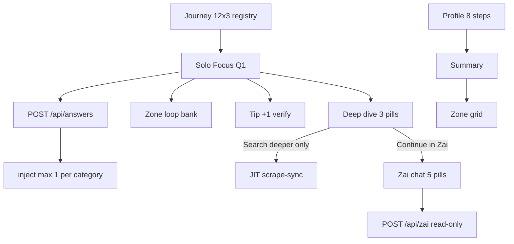

| Surface | Count | File |
|---------|-------|------|
| Profile onboarding | 8 | `ProfilePageClient.tsx` |
| Journey registry | 36 (12×3) | `lib/journeys.ts` |
| Solo Focus (shown) | 12 (Q1 each) | `lib/journeys.ts` |
| Zone loop bank | 18 beats | `lib/zone/loopQuestions.ts` |
| Tip verification | 12 | `lib/zone/tipVerification.ts` |
| Deep dive pills | 3 | `SoloFocusOverlay.tsx`, `JourneyBentoCard.tsx` |
| Zai chat pills | 5 | `lib/zai/chatPrompts.ts` |

---

*Last synced with repo registry files — update **How it all works together** when changing handoff, inject caps, or scrape gates. Update question tables when editing `journeys.ts`, `loopQuestions.ts`, or `chatPrompts.ts`. Zone content: **[ZONE-CONTENT-AND-DATA.md](ZONE-CONTENT-AND-DATA.md)** · Sentinel: **[SENTINEL.md](SENTINEL.md)** · Gary/rebirth/pattern shift: **[SUPPLEMENTAL-SYSTEMS.md](SUPPLEMENTAL-SYSTEMS.md)**.*

---

## Annex: Intelligence loop (Hermes, Neon, verify) {#annex-intelligence-loop-hermes-neon-verify}

*Source file: `INTELLIGENCE-LOOP-MANIFEST.md`*


Operational contract for infra, data flow, UX, and verification. **Secrets belong only in `.env.local` / Vercel** — never commit passwords or paste them into docs or chat.

**Profile, journey questions, answers, and Zone mechanical truth:** [PROFILE-ANSWERS-ZONE-TECH.md](PROFILE-ANSWERS-ZONE-TECH.md). **Zone scrape → copy → presentation:** [ZONE-CONTENT-AND-DATA.md](ZONE-CONTENT-AND-DATA.md). **Sentinel (parallel):** [SENTINEL.md](SENTINEL.md). **Gary / rebirth / inject paths:** [SUPPLEMENTAL-SYSTEMS.md](SUPPLEMENTAL-SYSTEMS.md). **Index:** [HANDBOOK.md](HANDBOOK.md).

---

#### 1. Infrastructure

| Piece | Detail |
|--------|--------|
| **Hermes (Oracle VPS) / Vercel Cron** | **Weekly** Monday **05:00** (`0 5 * * 1`) → **`GET /api/cron/zone-research`** with **`Authorization: Bearer <CRON_SECRET>`**. Per-category JIT scrape still fires on Solo Focus Tip +1 answer. |
| **Neon (London)** | Canonical pooler hostname is **`MANIFEST_NEON_POOLER_HOST`** in `lib/intelligence/manifest.ts`. It **must** match the host inside `DATABASE_URL` (password only via Neon Console / `vercel env`). |
| **Credentials** | Set `DATABASE_URL` (full URI). Do **not** commit real passwords; rotate immediately if exposed. |
| **Firecrawl** | API key: `FIRE_CRAWL_KEY_2` **or** `FIRECRAWL_API_KEY` — both read by `lib/sentinel/api-config.ts` (primary name wins). |
| **Gemini** | `GEMINI_API_KEY` — extraction, Zai, research triplet. |

---

#### 2. Scraper and logic loop

- **Firecrawl + Gemini:** Research runs category discovery across **twelve** journey keys in `lib/journeys.ts` (`JOURNEY_ORDER`); locality seeds include Littlehampton / Arun and Les Azerables / Creuse where configured (`lib/agents/researchAgent.ts`).
- **Mechanical truth:** Zone tiles and hero totals only show non-zero £/kg when `journeyHasStreamData` (`lib/zone/mechanicalTruth.ts`) — Neon `research_results`, `scraped_summary`, or scrape-sync repair. Empty DB + postcode → `GET /api/scrape-sync` returns `source: "pending"`, `scraped: []`. UK shape defaults in `lib/scraper/uk2026Defaults.ts` are **zero**, not marketing £.
- **Expansion (canonical birth):** Journey answers in Solo Focus / bento use **`POST /api/answers`** → discovery race → `injectNewDiscoveryCard` when the API returns `new_card_data` / `grid_pulse_card`. **`POST /api/research/question-card`** is the **free-form Ask** path only (not the MC answer birth). **`POST /api/zone/injections`** handles trap follow-ups — all paths share the **`MAX_DISCOVERY_INJECTIONS_PER_JOURNEY`** (**3**) cap per user per journey (`lib/intelligence/manifest.ts`).
- **Data mapping:** On persist, **`saving_amount_gbp`** and **`verified_saving`** are aligned (`lib/agents/researchAgent.ts` → `persistResearchResult`). **`offer_url`** must be HTTPS where possible. Invoke payload JSON is stored in **`research_snapshot`**.

---

#### 3. UX / UI

Presentation contract (bento headlines, three-paragraph Solo Focus, Today's Tips rail, offer URL guards, tone): **[ZONE-CONTENT-AND-DATA.md](ZONE-CONTENT-AND-DATA.md)** §6–10.

- **Mobile locality:** Long placenames use **`formatSummaryLocalityKineticToken`** (`lib/brains/summaryLogic.ts`) + **`IntroWordCycle`** with **`opacityTicker`** on `/profile/summary` (word-by-word opacity only — no intro glitch). **`/` + `/intro`** keep the logo glitch (Style A). Kinetic order is **HELLO → name → locality** then bridge + waste beats; single-word towns **over seven characters** get Marvin clamp + squeeze (Littlehampton path).
- **Expanded Solo Focus:** **Marvin** hook H1 (**10–20 words** — **`headlineFromExpandedHook`** + per-journey **`EXPANDED_JOURNEY_HOOK`** when title is thin) + **Marvin H4 lead** (town from **`locationState.locationName`**, not postcode) + two **Roboto** body paragraphs + **one** payoff (`payoffSentence`, deduped). Zone bento: **5–8 words** via **`headlineFromTitle`**. Voice: **`lib/zone/zoneVoice.ts`**. Gemini triplet in **`lib/agents/researchAgent.ts`** → **`architect_prose`**; locality fallbacks are warm UK prose (no CTA-bridge scaffolding).
- **CTA:** Expanded cards use **`MotherCardRenderer`** + **`IndustrialHandoffButton`** with **`ctaUrl`** from **`offer_url`** / verified source, falling back to **`/zai`** audit URL when no partner link exists (`JourneyBentoCard`).

---

#### 4. Verification

From repo root with **`DATABASE_URL`** in `.env.local`:

```bash
npm run db:log-research      # latest research_results row
npm run db:test              # Neon connectivity
npm run db:evolve-12-domains # journey_questions for all 12 keys
```

**Honest empty Zone (production smoke):**

```bash
curl -sS "https://00-ulm.vercel.app/api/scrape-sync?postcode=BN17" | jq '.source, (.scraped | length), .research_category_coverage'
### pending + 0 scraped rows + {} coverage  ⇒  UI should show COMPUTING tiles, not £12.5k
```

**Fill stream (server; use your Bearer secret, single-quoted in zsh):**

```bash
bash scripts/curl-scrape-sync-trigger.sh https://00-ulm.vercel.app BN17
```

Logs the latest **`research_results`** row (including **`saving_amount_gbp`**, **`verified_saving`**, **`architect_prose`**, **`offer_url`**) via **`npm run db:log-research`**.

See also: **`npm run db:columns`**, **[PROFILE-ANSWERS-ZONE-TECH.md](PROFILE-ANSWERS-ZONE-TECH.md)**.

---

## Annex: ULM ceilings & spawn {#annex-ulm-ceilings--spawn}

*Source file: `ULM-APPLICATION-LOOP.md`*


Production blueprint: **free API intercept → deterministic engine → surgical premium tier**.  
Zai is the **only** product bot (no secondary chat widget).

**Code map:** `lib/zone/ulmLimits.ts`, `lib/zone/engineDataRouter.ts`, `lib/intelligence/freeTierHydration.ts`, [HYBRID-DATA-PIPELINE.md](HYBRID-DATA-PIPELINE.md), [ZONE-CONTENT-AND-DATA.md](ZONE-CONTENT-AND-DATA.md), [SENTINEL.md](SENTINEL.md), [SUPPLEMENTAL-SYSTEMS.md](SUPPLEMENTAL-SYSTEMS.md), [ZAI-AND-QUESTIONS-RULES.md](ZAI-AND-QUESTIONS-RULES.md).

---

#### Credit guardrails (enforced)

| Layer | Cost | Modules |
|-------|------|---------|
| Free intercept | 0 tokens | `openEpcClient`, `nesoGridClient`, `pvgisClient`, `defraWasteClient`, `getLocalData` |
| Deterministic £/kg | 0 tokens | `buildUserImpact`, `engineDataRouter` deltas |
| Premium | Gemini + capped Firecrawl | `premiumEditorialExtraction`, Deep Dive **Search deeper** only |

**Hermes:** weekly `repair=1` backfill only — no change when ULM ships.

---

#### Hard ceilings (`lib/zone/ulmLimits.ts`)

| Constant | Value |
|----------|-------|
| `MAX_ZONE_BENTO_CELLS` | **24** (journey + tip cells; hero excluded) — `clipGroovyGridToCeiling` |
| `MAX_DISCOVERY_INJECTIONS_PER_JOURNEY` | **3** per `journey_key` |
| `INITIAL_ROCK_SAVING_TIPS` | **6** (rotation seeds) |
| `MAX_ROCK_SAVING_TIPS_RAIL` | **12** |
| `ULM_KWH_PER_TONNE_CO2E` | **12_000** (12k/1t auditor copy) |

Grid discovery tips on wall: still **1 earned inject per category** via `perCategoryCardCap` (12 journeys + injects ≤ 24).

---

#### 1. Profile (`/profile`)

- 8 steps → `buildUserImpact` baseline; no Gemini/Firecrawl on onboarding.
- Postcode → `POST /api/local-intelligence` → `hydrateFreeStructuralContext` → `user_genome.open_data_anchor`.
- Motion: `STACCATO_TWEEN` questions; summary uses `IntroWordCycle` / `opacityTicker`.

---

#### 2. Zone (`/zone`)

- **12 domains:** `JOURNEY_ORDER` in `lib/journeys.ts`.
- **Mechanical truth:** empty Neon → `COMPUTING — JOURNEY` / `—`; no fake £.
- **Visited:** `visited_cards` → pink `#FF00FF` / yellow `#FDFD00` (`.zone-card--visited`).
- **Rock rail:** navy + yellow; 6-slot rotation; display capped at 12.

---

#### 3. Loop & spawn

- **1 card = 1 question** — Solo Focus isolation.
- **POST /api/answers** → exactly **one** discovery card in JSON; hybrid race when `MODEL_STRATEGY=bucket_failover`.
- **Zip-shut** → next loop beat (`ZIP_SHUTTER_SPRING`).
- **Visited close guard:** `shouldSkipInjectionOnCardClose` — no inject/scrape on tip close.

---

#### 4. Headlines (`lib/soloFocusCopy.ts`)

| Surface | Words |
|---------|-------|
| Zone bento | **5–8** — `enforceHeadlineWordLimits(text, false)` |
| Solo Focus / expanded hook | **10–20** — `headlineFromExpandedHook` + `EXPANDED_JOURNEY_HOOK` when weak; else `enforceHeadlineWordLimits(text, true)` |
| Prose beats | ≤ **40** words / paragraph |

Full scrape → copy → presentation pipeline: **[ZONE-CONTENT-AND-DATA.md](ZONE-CONTENT-AND-DATA.md)**.

---

#### 5. Zai (`/zai`)

- **Persona:** active auditor with a pint — `ZAI_PERFORMANCE_AUDITOR_V3_MATRIX` in `lib/brains/zai/prompts.ts`.
- **Read-only chat:** no Firecrawl on `POST /api/zai`.
- **JIT scrape exception:** `AskZaiDeepDiveSheet` → **Search deeper** only.
- **Stream UI:** `postZaiChat` + `readZaiStream` (not a floating third-party bot).
- **Fallback:** `i don't have enough information to be confident on that one. let's stick to your bills or travel moves.`

---

#### Env

```env
MODEL_STRATEGY=bucket_failover
HYBRID_DATA_PIPELINE=1
OPENEPC_EMAIL=
OPENEPC_API_KEY=
```

---

#### Verify

```bash
npm run verify
npm run db:audit
```

---

## Annex: Hybrid data pipeline (cost tiers) {#annex-hybrid-data-pipeline-cost-tiers}

*Source file: `HYBRID-DATA-PIPELINE.md`*


Full product loop: **[ULM-APPLICATION-LOOP.md](ULM-APPLICATION-LOOP.md)**. **How scraped data becomes card copy and Solo Focus prose:** **[ZONE-CONTENT-AND-DATA.md](ZONE-CONTENT-AND-DATA.md)**.

**Principle:** Math and structure are free; raw scrape and LLM analysis cost money.

| Tier | Surface | Premium (Gemini / Firecrawl) |
|------|---------|------------------------------|
| **A** | Profile onboarding (8 steps + postcode) | **None** — Postcodes.io, Carbon Intensity API, optional OpenEPC |
| **B** | Zone grid (`buildZoneViewModel`) | **None** for baseline £/kg on 12 journey tiles |
| **B′** | Cached `research_results` tip copy | **Only if row empty** — surgical seed URL + Gemini triplet |
| **C** | Solo Focus answer (`POST /api/answers`) | **Hybrid spawn** when `MODEL_STRATEGY=bucket_failover` — locked £/kg + editorial Gemini |
| **D** | `/zai` chat | **None** — read-only Neon + genome; no Firecrawl |

#### Code map

| Module | Role |
|--------|------|
| `lib/intelligence/nesoGridClient.ts` | Regional gCO₂/kWh (Carbon Intensity API) |
| `lib/intelligence/openEpcClient.ts` | EPC register (needs `OPENEPC_EMAIL` + `OPENEPC_API_KEY`) |
| `lib/intelligence/freeTierHydration.ts` | Tier A parallel hydrate → `user_genome.open_data_anchor` |
| `lib/zone/engineDataRouter.ts` | `processCalculatedLoopSpawn` — deterministic deltas + one discovery card |
| `lib/agents/premiumEditorialExtraction.ts` | Gemini prose only; £/kg passed in as locked facts |
| `lib/brains/buildUserImpact.ts` | Single source of truth for Zone tile £/kg |
| `lib/intelligence/scrapeBoundaries.ts` | `bucket_failover` gates broad scrape |

#### Env

```env
MODEL_STRATEGY=bucket_failover   # enables hybrid Solo Focus spawn + scrape gates
### Optional explicit toggle (also on when bucket_failover):
HYBRID_DATA_PIPELINE=1

### OpenEPC (England & Wales) — skip silently if unset
OPENEPC_EMAIL=you@example.com
OPENEPC_API_KEY=your-register-key
```

#### Hermes

No VPS change. Hermes still calls `GET/POST /api/cron/zone-research?repair=1` for **backfill** on incomplete `research_results`. Day-to-day discovery is earned in-app (Tier C), not cron.

#### Neon

- **`user_genome.open_data_anchor`** — EPC + grid snapshot at postcode hydrate
- **`research_results`** — premium editorial rows with `invokePayload.trigger: hybrid-pipeline`
- Keep **`journey_answers`** + **`journey_answers_jsonb`** (dual-write)

#### Run audit

```bash
npm run db:audit
npm run verify
```

---

## Annex: Full app spec (architecture, APIs, DB) {#annex-full-app-spec-architecture-apis-db}

*Source file: `FULL-APP-SPEC.md`*


Operational architecture for the UK postcode-driven energy auditor: what talks to what, where data lives, and how Profile, Zone, Solo Focus, and Neon research fit together.

**Related docs:** [HANDBOOK.md](HANDBOOK.md) · [ZONE-CONTENT-AND-DATA.md](ZONE-CONTENT-AND-DATA.md) · [SENTINEL.md](SENTINEL.md) · [SUPPLEMENTAL-SYSTEMS.md](SUPPLEMENTAL-SYSTEMS.md) · [INTELLIGENCE-LOOP-MANIFEST.md](INTELLIGENCE-LOOP-MANIFEST.md) · [PROFILE-ANSWERS-ZONE-TECH.md](PROFILE-ANSWERS-ZONE-TECH.md) · [ZAI-AND-QUESTIONS-RULES.md](ZAI-AND-QUESTIONS-RULES.md)

**Production:** https://00-ulm.vercel.app · **Repo:** https://github.com/00app/00-ULM

---

#### 1. Product overview

Zero Zero is a UK-first web app. A user provides a **postcode** and a short **profile** (household, transport, goals). The app shows a **Zone** — a bento grid of 12 journey domains (home, grants, solar, travel, etc.) with savings and carbon hints. Tapping a card opens **Solo Focus**: answer embedded questions, see a researched recommendation, then optionally **spawn** a sharper “child” insight.

##### 1.1 Metaphor: brain, stomach, memory, nervous system

| Metaphor | Role | Implementation |
|----------|------|----------------|
| **Brain** | Reasoning and copy | **Gemini** — audits, headlines, three prose paragraphs, discovery cards |
| **Stomach** | Ingestion | **Firecrawl** — scrapes trusted UK pages (Ofgem, GOV.UK, grants, tariffs) |
| **Memory** | Persistence | **Neon Postgres** — users, answers, `research_results` per category/postcode |
| **Nervous system** | Orchestration | **Next.js on Vercel** — API routes: scrape → model → persist → JSON to browser |
| **Hermes (VPS)** | External clock | **Oracle VPS** hits `/api/cron/zone-research` daily; does not run AI itself |

Hermes only **wakes** the app. The app uses `DATABASE_URL`, `GEMINI_API_KEY`, and `FIRE_CRAWL_KEY_2` (or `FIRECRAWL_API_KEY`) to execute the pipeline.

---

#### 2. High-level architecture


##### 2.1 End-to-end intelligence loop

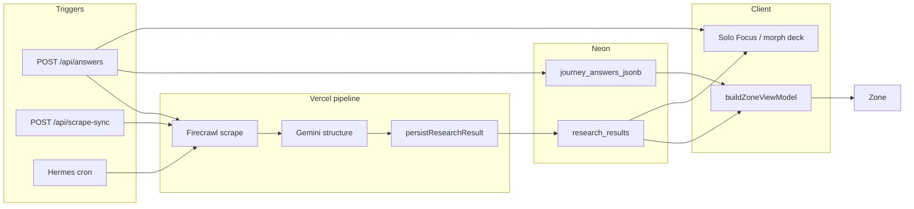

---

#### 3. User journey (routes)

| Step | Route | What happens |
|------|--------|----------------|
| Intro | `/`, `/intro` | Logo glitch (Style A) → kinetic words → lockup **CREATE A / PROFILE TO / START.** at **profile H2 scale** → CREATE → profile. Geolocation may seed `profile_postcode`. `?skip=1` skips logo. |
| Profile | `/profile` | Stepped onboarding: name (**given-name**, first token only), **postcode** (`postal-code`, hydrate `profile_postcode`), household, home type, transport, age, employment, goal. Full-sentence fade per step. |
| Summary | `/profile/summary` | Kinetic **HELLO → name → locality** (`IntroWordCycle`, opacity ticker only). Impact totals. Handshake scrape. |
| Zone | `/zone` | 12 journey cards + Saving Tips; hydrates from Neon via scrape-sync. |
| Solo Focus | Overlay on Zone | Questions → answer → zip-shut → result / morph card. |
| Zai | `/zai` | Free-form chat (Gemini), separate from MC answer birth path. |
| Other | `/likes`, `/settings` | Saved cards, reset/session. |

There is no separate `/journeys` product route — journeys live on Zone.

**Canonical Zone path:** `app/zone/page.tsx` → `lib/zone/buildZoneViewModel.ts` (facade: `lib/logic/zone.ts`).

---

#### 4. Postcode, profile, and identity

##### 4.1 Postcode as geographic anchor

- Stored in **`localStorage`** as `profile_postcode` and on `users.postcode` after signup.
- Zone reads via `readProfilePostcode()` / `AppContext`; passed on every research call.
- Geocoding never runs in the browser:
  - `POST /api/local-intelligence` — council, ward, grant context
  - `GET /api/geocode/postcode` — locality cached as `profile_locality_name`

**Postcode change** → `clearZoneVmLocalCache()` wipes journey answers, hero totals, Solo Focus session keys, locality cache.

**Read order:** URL `?postcode=` → `localStorage profile_postcode` (`lib/zone/safeProfileStorage.ts`).

##### 4.2 Profile onboarding → server user

1. User completes steps in `ProfilePageClient.tsx`.
2. **`POST /api/user`** creates `users` row (`gen_random_uuid()`), sets **httpOnly session cookie**, returns locality from `getLocalData(postcode)`.
3. Client mirrors to `localStorage` and `AppContext.refreshProfile()`.

If signup fails, client keeps localStorage and can use a **browser research UUID** (`ensureClientResearchUserId`) for scrape-sync and answers without session.

##### 4.3 Research user id (Neon row ownership)

| Priority | Source |
|----------|--------|
| 1 | Session (`users.id` + `sessions` cookie) after successful `/api/user` |
| 2 | Client research id: Gary UUID for BN17, or `crypto.randomUUID()` in `zz_research_user_id` |

Passed as `?user_id=` on **GET scrape-sync** and in **POST** bodies for trigger/answers.

##### 4.4 Gary / demo mode (BN17 only)

- Postcode starting with **BN17** pins research to UUID `00000000-0000-4000-a000-000000000000`.
- All scrape-sync calls append `user_id` when active (`lib/zone/garyMode.ts`).
- Links pre-seeded Neon rows to demo — **not** a default for unknown postcodes.

##### 4.5 Locality (Summary header)

- `resolveProfileLocalityForPostcode` + Nominatim via geocode API.
- Summary uses current postcode locality, not a fixed demo string (`lib/brains/summaryLogic.ts`).

---

#### 5. Journey questions and answers (12 × 3)

**Source of truth:** `lib/journeys.ts`

| Journey key | Example question ids |
|-------------|----------------------|
| `home` | `property_type`, `insulation_level`, `glazing_type` |
| `grants` | `boiler_age`, `income_benefits`, `prior_eco_bus` |
| `solar` | `roof_orientation`, `roof_shading`, `daytime_occupancy` |
| `travel` | `commute_distance`, `ev_hybrid`, `public_transport` |
| `holidays` | `annual_flights`, `flight_duration`, `carbon_offsets` |
| `food` | `diet_profile`, `organic_shopping`, `own_produce` |
| `shopping` | `retail_channel`, `repair_mindset`, `online_deliveries` |
| `money` | `monthly_energy_bill`, `tariff_type`, `green_investments` |
| `tech` | `smart_thermostat`, `smart_home`, `smart_meter` |
| `water` | `garden_butt`, `wash_preference`, `rainwater_harvest` |
| `waste` | `food_waste_collection`, `composting`, `soft_plastics` |
| `carbon` | `footprint_awareness`, `carbon_removal`, `tonne_reduction_timeline` |

- **12 domains**, **3 questions each** (`JOURNEY_ORDER`).
- Question labels are **behavioural** — no £/kg in copy.
- **Next question:** `lib/zone/questionHandler.ts` → `getNextQuestion(journeyId, answers)`.

##### 5.1 Where answers are stored

| Layer | Storage |
|-------|---------|
| Browser | `localStorage` → `journey_{journeyId}_answers` |
| Server | `journey_answers_jsonb` — one JSONB blob per user (all journeys) |
| Legacy | `journey_answers` normalized rows |
| Mirror | `user_profiles.journey_answers_jsonb` (optional Hermes/audit) |
| Pre-login | `guest_sessions` by `zz_sid` cookie |

##### 5.2 Answer flow diagram

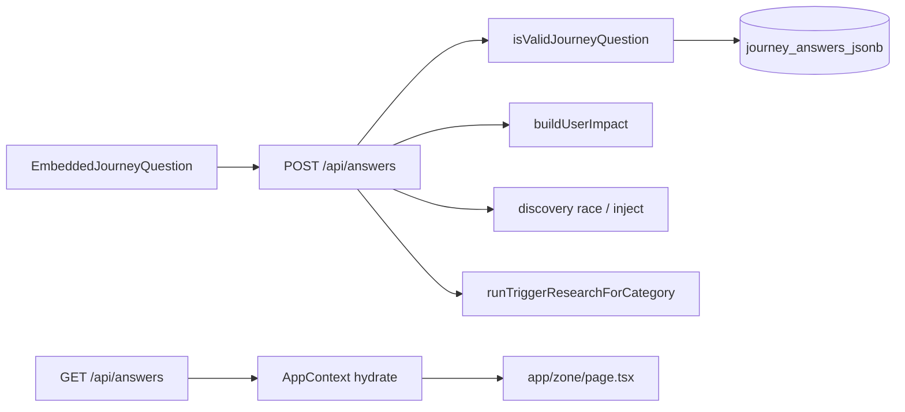

---

#### 6. API reference

##### 6.1 Identity and profile

| API | Method | Role |
|-----|--------|------|
| `/api/user` | POST | Create user + session from profile payload |
| `/api/user` | GET | Return session user or `null` |
| `/api/auth/login`, `signup`, `logout` | — | Session auth |
| `/api/local-intelligence` | POST | Postcode → council, ward, carbon context, grant hints |
| `/api/geocode/postcode` | GET | Server Nominatim proxy → locality name |

##### 6.2 Zone hydration

| API | Method | Role |
|-----|--------|------|
| `/api/scrape-sync` | GET | Primary Zone load: `scraped[]`, `research_category_coverage`, unit rates; Tier 2: `category`, `answer`, `question_id` |
| `/api/scrape-sync` | POST | Trigger research: `{ trigger, postcode, category, user_id, profileData }` |
| `/api/scrape-sync` | GET `?repair=1` | Backfill missing headlines/prose without full Firecrawl loop |
| `/api/scrape-sync` | GET `?force=true` | Heavy full research run (slow) |

**Auth for POST scrape-sync:** Bearer `CRON_SECRET` / `SCRAPER_SECRET`, session, or **postcode + valid `user_id`**.

##### 6.3 Answer loop (canonical discovery birth)

| API | Method | Role |
|-----|--------|------|
| `/api/answers` | POST | Save answer; recompute impact; discovery race; `runTriggerResearchForCategory`; returns `new_card_data`, `morphCards`, totals |
| `/api/answers` | GET | Hydrate journey answers for logged-in user |

**Auth for POST answers:** session **or** valid `user_id` in body (`lib/answers/resolveAnswersUser.ts`).

**Handler:** `app/api/answers/route.ts`

##### 6.4 Supplemental (capped)

| API | Role |
|-----|------|
| `/api/research/question-card` | Free-form Ask → new card (**not** MC answer birth) |
| `/api/zone/injections` | Trap follow-up cards |
| `/api/zone/tips-refresh` | Refresh injected tip tiles |
| `/api/zone/content-architect` | Optional Gemini polish on architect prose |
| `/api/discovery/pulse` | Economy fingerprint for tip £ patches |
| `/api/zone/generate-next` | Morph / next-win hints |

**Cap:** `MAX_DISCOVERY_INJECTIONS_PER_JOURNEY` = **3** per user per journey (`lib/intelligence/manifest.ts`).

##### 6.5 Scheduled and operations

| API | Role |
|-----|------|
| `/api/cron/zone-research` | Hermes: batch `runZeroResearchWithProfile` for users with postcode (Bearer `CRON_SECRET`) |
| `/api/health` | DB ping; `?live=1` for liveness only |
| `/api/health/diagnostics` | Neon / Gemini / Firecrawl booleans; session or Bearer gate |

##### 6.6 Chat and misc

| API | Role |
|-----|------|
| `/api/zai` | Zai assistant (Gemini + profile/answer context) |
| `/api/pulse/living` | Living pulse proxy (Ofgem + grid; CORS-safe) |
| `/api/summary` | Summary narrative support |
| `/api/likes`, `/api/actioned` | Saved / actioned cards |
| `/api/reset` | Session / cache reset |

##### 6.7 CORS rule

The browser must **not** call Ofgem or Nominatim directly. Use `/api/pulse/living`, `/api/geocode/postcode`, `/api/scrape-sync` only.

---

#### 7. Zone page — data and view model

**Files:** `app/zone/page.tsx` · `lib/zone/buildZoneViewModel.ts` · `lib/brains/buildUserImpact.ts` · `lib/zone/mechanicalTruth.ts`

##### 7.1 Load sequence

1. Hydrate client state — `AppContext`, `localStorage` profile, journey answers, postcode.
2. **`GET /api/scrape-sync?postcode=…&user_id=…`**
   - Reads `research_results` (by `user_id` and/or postcode).
   - Builds `research_category_coverage` per category.
   - Builds `scraped[]` journey rows.
3. **`buildZoneViewModel`** merges profile, answers, Neon coverage, scraped overlay.
4. **Mechanical truth:** no stream → `COMPUTING — <JOURNEY>`, metrics `—`.
5. **Optional:** auto-trigger `POST /api/scrape-sync` for up to 4 unsettled categories (background seed).
6. **Saving Tips** — static habit catalog (`lib/rock/habitsCatalog.ts`) + rotation.

##### 7.2 Collapsed bento card fields

| UI field | Source |
|----------|--------|
| Category label | Journey key (`SOLAR`, `TRAVEL`) |
| Headline | `agent_headline` (cleaned via `cleanZonePreviewHeadline`) → `profileDrivenJourneyTitle` → short fallback |
| SAVE / CARBON | Neon `saving_amount_gbp` + impact formulas when `journeyHasStreamData` |
| “Computing…” strip | `!journeyResearchSettled(coverage[journey])` |
| Audit badge | `LIVE_AUDIT` vs `ESTIMATED_AUDIT` when genome incomplete vs research-backed |

**Headline priority:** Neon `agent_headline` only for grid preview — **not** `deep_content_tip` or raw audit prose (avoids kWh/tariff dumps on tiles).

##### 7.3 Grid layout

**Wall order:** `WALL_JOURNEY_ORDER` in `app/zone/page.tsx` — same 12 keys, 3×4 bento.

**Motion:** Style B mechanical snap (`STACCATO_*` stagger). See `lib/animations.ts` and `.cursor/rules/mechanical-pulse.mdc`.

---

#### 8. Solo Focus and expanded view

**Components:** `JourneyBentoCard` / `ZoneCard` · `SoloFocusOverlay` · `EmbeddedJourneyQuestion`

##### 8.1 States

1. User taps card → overlay with **mother** content from Zone VM + coverage.
2. **QUESTION** — `EmbeddedJourneyQuestion` shows next MC question (`getNextQuestion`).
3. User answers → **zip-shut** (`ZIP_SHUTTER_SPRING` / `SOLO_FOCUS_ZIP_SHUT_SEC`).
4. Next question **fade-open** (opacity + y) when `soloFocusZipShut` — no intro shimmer on handoff.

**Session cap:** `SOLO_FOCUS_MAX_QUESTIONS_PER_SESSION` in `lib/animations.ts`.

##### 8.2 On answer — server sequence

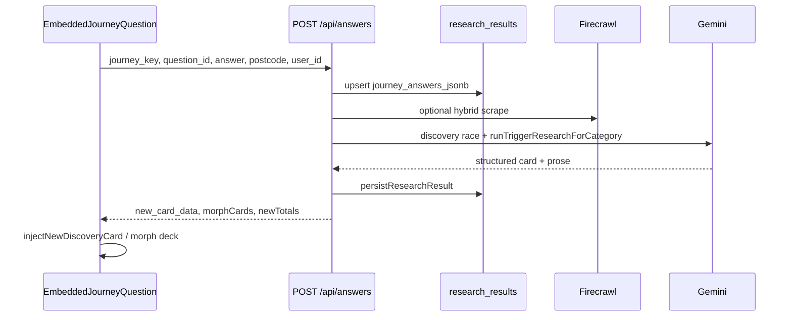

##### 8.3 Expanded view content

| Piece | Source / code |
|-------|----------------|
| H1 (**10–20 words**) | `headlineFromExpandedHook` + `EXPANDED_JOURNEY_HOOK` when DB title weak; `stripExpandedCardTitleNoise` |
| Lead (H4) | Town from `locationState.locationName` — `personalizeTrueTipPlaceLead` (`lib/zone/localityCopy.ts`) |
| Three paragraphs | `architect_prose` via `buildResearchResultsTrueTipBody` → `toThreeTrueTipParagraphs` (label-free beats; one `payoffSentence`) |
| SAVE / CARBON | Verified £ from `research_results` when settled |
| CTA | `offer_url` → `IndustrialHandoffButton` (`resolveRevenueCtaLabel`) |
| Source link | `source_url` / `verifiedAuditSourceUrl` |
| No-offer footer | Calm UK line when no HTTPS partner URL (not “Fresh Audit…”) |
| Fallback CTA | `/zai` if no offer URL |

**Layout:** Marvin hook H1 + Marvin H4 lead + two Roboto body paragraphs + payoff (≤ `MAX_TRUE_TIP_PARAGRAPH_WORDS` each). Guards: `isRawResearchDump`, `dedupeTrueTipParagraphs`, `isMechanicalScaffoldParagraph`.

**Copy resolver:** `resolveExpandedTrueTipInsight` · `buildResearchResultsTrueTipBody` · `toThreeTrueTipParagraphs` · `resolveSoloFocusInsightDisplay`.

---

#### 9. Mother card vs child card (Tier 2)

| | Mother card | Child / Tier 2 card |
|--|-------------|---------------------|
| **When** | First open of journey tile | After user answers a question in Solo Focus |
| **Data** | Latest `research_results` for journey category | Scoped re-research for category + specific answer |
| **Trigger** | Zone load / cron / profile handshake | `POST /api/answers` and/or Tier 2 `GET /api/scrape-sync` |
| **UI** | Same tile; journey-level insight | **Morph deck** — new card with sharper offer |
| **Code** | `buildZoneViewModel` | `runTier2MotherChildSwap` (`lib/zone/tier2RecursiveSpawner.ts`) |

##### 9.1 Tier 2 sequence

1. User answers child question in Solo Focus.
2. Client: **`runTier2MotherChildSwap`** — persist answer locally + **`GET /api/scrape-sync?postcode&category&answer&question_id&user_id`**.
3. Server: persists to `journey_answers` when `user_id` + valid `question_id`; runs **`runTriggerResearchForCategory`**; returns updated `research_category_coverage`.
4. UI: morph deck append + `zz-tier2-profile-refresh` event → Zone hero totals refresh.

**Canonical birth (server):** `POST /api/answers` → discovery race → `injectNewDiscoveryCard` when API returns `new_card_data` / `grid_pulse_card`.

**Tier 2 fallback:** If POST answers returns 401 (stale bundle / no `user_id`), client can still run Tier 2 GET scrape-sync.

---

#### 10. Firecrawl and Gemini

##### 10.1 Firecrawl (stomach)

- Crawls configured UK URLs (Ofgem, GOV.UK, council grants, tariff pages).
- Returns **markdown + URLs** for the research pipeline.
- Used in: `runZeroResearchWithProfile`, `runTriggerResearchForCategory`, `runHybridLiveZoneTipForAnswer`, Sentinel, cron batch.
- **Env:** `FIRE_CRAWL_KEY_2` or `FIRECRAWL_API_KEY` (`lib/sentinel/api-config.ts` — primary name wins).

Without Firecrawl configured, trigger routes return **503 Scraper not configured**.

##### 10.2 Gemini (brain)

Structures scraped text into:

| Field | Constraint |
|-------|------------|
| `agent_headline` | ~20 words, Zai Senior Auditor voice |
| `architect_prose` | Exactly three paragraphs (what / why / how in prose only) |
| `saving_amount_gbp` | Headline £ saving |
| `offer_url` | HTTPS CTA where possible |
| `source_url` | Verified citation |
| `category` | Journey key |

**Discovery race** on answer: structured pipeline, Zero Hunter, Rebirth vault (`lib/agents/rebirthVaultDiscovery.ts`).

**Persona:** Industrial, direct, UK grants/tariffs — lowercase where natural (`lib/agents/researchAgent.ts`).

**Env:** `GEMINI_API_KEY` (server-only).

##### 10.3 Persist

`persistResearchResult` → `research_results` + optional `research_snapshot` JSONB (invoke metadata).

On persist, `saving_amount_gbp` and `verified_saving` are aligned.

---

#### 11. Hermes and the Oracle VPS

Hermes is the **scheduled HTTP trigger**, not a separate AI runtime.

##### 11.1 Typical setup

1. **~05:00 daily** — VPS shell calls:
   ```
   GET https://00-ulm.vercel.app/api/cron/zone-research?limit=20
   Authorization: Bearer <CRON_SECRET>
   ```
2. Handler (`app/api/cron/zone-research/route.ts`) loads users from **`users`** where postcode is set.
3. For each user: **`runZeroResearchWithProfile`** → Firecrawl + Gemini → Neon.
4. Zone clients read rows via **`GET /api/scrape-sync`**.

Hermes needs only **`CRON_SECRET`** on the VPS. The app holds **`DATABASE_URL`** on Vercel.

##### 11.2 Manual triggers

```bash
### Fast: liveness + CRON_SECRET auth (no Firecrawl run)
npm run hermes:ping

### Full smoke: one user through zone-research (~2–5 min)
npm run hermes:pulse

### VPS / daily batch (limit=20)
bash scripts/hermes-pulse.sh

bash scripts/curl-scrape-sync-trigger.sh https://00-ulm.vercel.app BN17
```

Or `POST /api/scrape-sync` with `{ trigger: true, postcode, category, user_id }`.

**VPS crontab example** (secret file, not in repo):

```cron
0 5 * * * CRON_SECRET_FILE=/home/ubuntu/.hermes/cron.secret /path/to/00-00/scripts/hermes-pulse.sh >> /var/log/hermes-pulse.log 2>&1
```

##### 11.3 Four-step loop

1. **Trigger (Hermes):** Cron hits `/api/cron/zone-research`.
2. **Extraction:** Firecrawl scrape → Gemini maps to twelve journey categories → persist.
3. **Consumption (Zone):** Bento tiles + Solo Focus expanded copy from Neon.
4. **Expansion (user):** `POST /api/answers` → discovery → `injectNewDiscoveryCard`; supplemental Ask/inject paths capped at 3 per journey.

---

#### 12. Database schema (Neon)

**Init:** `npm run init-db` applies `lib/schema.sql` + `research_snapshot` migration.

**Pooler:** `DATABASE_URL` host must match `MANIFEST_NEON_POOLER_HOST` in `lib/intelligence/manifest.ts`.

##### 12.1 Hot-path tables

###### `users`

| Column | Use |
|--------|-----|
| `id` | UUID primary key |
| `name`, `postcode` | Identity + geography |
| `household`, `home_type`, `transport_baseline` | Profile |
| `age_group`, `employment_status` | Persona |
| `user_genome` | JSONB — goal, Hermes memory, profile_goal |

###### `sessions`

| Column | Use |
|--------|-----|
| `token`, `user_id`, `expires_at` | httpOnly cookie auth |

###### `journey_answers_jsonb`

| Column | Use |
|--------|-----|
| `user_id` | FK to users |
| `answers` | JSONB: all journey question maps |

###### `research_results` (source of truth for cards)

| Column | Use |
|--------|-----|
| `postcode` | Geographic filter |
| `user_id` | Personalization (nullable) |
| `category` | Journey key |
| `saving_amount_gbp`, `verified_saving` | £ on cards |
| `agent_headline` | Short H1 |
| `architect_prose` | Expanded three paragraphs |
| `offer_url` | CTA |
| `source_url` | Verified source link |
| `markdown`, `citations` | Raw scrape |
| `research_snapshot` | JSONB invoke metadata |
| `provider_name` | Attribution (Ofgem, GOV.UK) |
| `elec_unit_rate_gbp_per_kwh`, etc. | Tariff rates when extracted |
| `is_high_impact`, `carbon_impact_kg` | Rebirth / high-impact rows |
| `created_at` | Latest row wins per category lookup |

**Lookup order:** prefer `user_id`, then `postcode` for guest/postcode-only rows.

###### `user_profiles`

Optional mirror of `journey_answers_jsonb` for Hermes / audit-complete flows.

###### `discovery_injections`

Tracks injected discovery cards per user per journey (enforces cap).

###### `scraped_summary`

Legacy hero aggregates when populated.

###### `guest_sessions`

Pre-login profile + answers by `zz_sid` cookie.

##### 12.2 Secondary / legacy tables

| Table | Note |
|-------|------|
| `journey_answers` | Normalized per-question rows; dual-write in some paths |
| `journey_questions` | Seeded via `npm run db:evolve-12-domains` |
| `cards`, `micro_answers` | Legacy — not on Zone hot path |
| `user_actioned_cards`, `likes` | User actions |
| `activity_status` | SSO activity visibility |

##### 12.3 `insightReady` (scrape-sync)

True when a category row has prose, headline, £, or offer URL — Zone hides “Computing…” once settled.

---

#### 13. Mechanical truth

The Zone wall must **not** show placeholder savings when Neon has no research stream.

| Layer | Behaviour |
|-------|-----------|
| `uk2026Defaults` | All `money_value` / `carbon_value` = **0**; leads = **Computing...** |
| `buildUserImpact` | Does **not** back-fill from UK defaults when totals are 0 |
| `mechanicalTruth.ts` | `journeyHasStreamData` — true only when stream has £, prose, or tip |
| `buildZoneViewModel` | Formula £ only if stream exists; else **COMPUTING — JOURNEY** |
| `GET /api/scrape-sync` | Postcode + empty DB → `{ scraped: [], source: "pending" }` |

##### 13.1 Data path


##### 13.2 Filling the screen

1. `POST /api/scrape-sync` trigger or `?force=true`
2. Hermes cron → `/api/cron/zone-research`
3. User answers in Solo Focus → discovery + category research
4. Zone auto-seed (up to 4 categories after load)

##### 13.3 Browser states

| State | Zone hero | Journey tiles |
|-------|-----------|---------------|
| Clean Neon, first load | “Analyzing your postcode…”, £0 | 12× **COMPUTING — …**, **—** metrics |
| After research rows | Personalised totals | Real £, headlines, LIVE/ESTIMATED badges |
| Stale client cache | May flash old £ | Hard refresh; `DATA_VERSION` bump clears cache |

---

#### 14. Client identity without full login

| Mechanism | Purpose |
|-----------|---------|
| Session cookie | Full POST/GET `/api/answers`, hydrate |
| `zz_research_user_id` | Minted UUID or Gary UUID for scrape-sync triggers |
| `user_id` on scrape-sync GET | Links Neon rows |
| `profile_postcode` | Drives all geography |

---

#### 15. Motion DNA (UI contract)

| Surface | Style | Rule |
|---------|-------|------|
| `/` + `/intro` | Style A (Glitch) + decision lockup | ~469ms glitch; decision headline = `.profile-question-headline` H2 (uppercase stack, not desktop H1) |
| `/profile/summary` | Staccato word ticker | `IntroWordCycle` + `opacityTicker`: one word, opacity 0→1 only |
| `/profile` questions | Full-sentence fade | y: 10→0, opacity, `STACCATO_TWEEN` |
| Zone grid | Style B (Mechanical Snap) | `STACCATO_*` stagger; 60px card radius |
| Solo Focus | Zip-shut → fade-open | Answer collapses chamber; next question opacity + y |

**Springs:** `KINETIC_SPRING` + `LAYOUT_SPRING` only.

---

#### 16. Environment variables

| Variable | Required for | Notes |
|----------|--------------|-------|
| `DATABASE_URL` | All Neon paths | Pooler host = `MANIFEST_NEON_POOLER_HOST` |
| `GEMINI_API_KEY` | Research, Zai, discovery | Server-only |
| `FIRE_CRAWL_KEY_2` or `FIRECRAWL_API_KEY` | Scraping | Primary name wins |
| `CRON_SECRET` | Hermes cron, diagnostics gate | Min 16 chars |
| `SCRAPER_SECRET` | Optional scrape triggers | |
| `GATEWAY_TOKEN` | Internal inject/pulse webhooks | |
| `NEXT_PUBLIC_APP_URL` | Client URL hints | |

See `.env.example`. Never commit `.env.local`.

---

#### 17. Verification commands

```bash
npm run db:log-research      # latest research_results row
npm run db:test              # Neon connectivity
npm run db:columns           # column listing
npm run db:evolve-12-domains # journey_questions for all 12 keys
bash scripts/verify-env-and-health.sh
```

**Honest empty Zone:**

```bash
curl -sS "https://00-ulm.vercel.app/api/scrape-sync?postcode=BN17" | jq '.source, (.scraped | length), .research_category_coverage'
### pending + 0 scraped + {} coverage ⇒ COMPUTING tiles, not fake £
```

**Health:**

```bash
curl -sS "https://00-ulm.vercel.app/api/health"
```

---

#### 18. Key source files (index)

| Area | Path |
|------|------|
| Zone page | `app/zone/page.tsx` |
| Zone VM | `lib/zone/buildZoneViewModel.ts` |
| Impact math | `lib/brains/buildUserImpact.ts` |
| Mechanical truth | `lib/zone/mechanicalTruth.ts` |
| Journeys | `lib/journeys.ts` |
| Scrape-sync API | `app/api/scrape-sync/route.ts` |
| Answers API | `app/api/answers/route.ts` |
| Cron / Hermes | `app/api/cron/zone-research/route.ts` |
| Research agent | `lib/agents/researchAgent.ts` |
| Rebirth vault | `lib/agents/rebirthVaultDiscovery.ts` |
| Tier 2 spawner | `lib/zone/tier2RecursiveSpawner.ts` |
| Gary mode | `lib/zone/garyMode.ts` |
| Solo Focus copy | `lib/soloFocusCopy.ts` |
| Solo Focus UI | `app/components/SoloFocusOverlay.tsx`, `EmbeddedJourneyQuestion.tsx`, `JourneyBentoCard.tsx` |
| Profile | `app/profile/ProfilePageClient.tsx` |
| Summary | `lib/brains/summaryLogic.ts` |
| Neon DB | `lib/db/neon.ts` |
| Manifest | `lib/intelligence/manifest.ts` |
| Animations | `lib/animations.ts` |

---

#### 19. Deploy and prep

```bash
npm run prep:live          # db:test + db:evolve-12-domains + build:clean
npm run deploy:force       # vercel deploy --prod (scripts/deploy-production.sh)
```

**Gary DB repair (when needed):** `npx tsx scripts/repair-gary-db-handshake.ts` (uses `DATABASE_URL` only).

---

*Last updated: conversation spec consolidation. For motion and product rules, see `.cursor/rules/zero-zero-prime-directive.mdc` and [HANDBOOK.md](HANDBOOK.md).*

---

## Annex: Gary mode, pattern shift, rebirth vault {#annex-gary-mode-pattern-shift-rebirth-vault}

*Source file: `SUPPLEMENTAL-SYSTEMS.md`*


Short reference for **systems that sit beside** the main Zone content pipeline ([ZONE-CONTENT-AND-DATA.md](ZONE-CONTENT-AND-DATA.md)) and Sentinel ([SENTINEL.md](SENTINEL.md)). No duplicate of those specs — only what is easy to miss.

---

#### 1. Research path matrix

| Path | Trigger | Births discovery card? | Cap |
|------|---------|------------------------|-----|
| **`POST /api/answers`** → `raceDiscoveryBirth` / `injectNewDiscoveryCard` | Solo Focus / bento answer | **Yes — canonical** | `MAX_DISCOVERY_INJECTIONS_PER_JOURNEY` (3) |
| **`triggerSupplementalResearch`** | After answer (sync or void), tips-refresh, gateway | Persists `research_results`; may feed VM, not always grid inject | Same manifest caps when inject |
| **`POST /api/research/question-card`** | Free-form Ask | Supplemental inject | Capped |
| **`POST /api/zone/injections`** | Trap / pattern follow-up | Supplemental | Capped |
| **`runRebirthVaultDiscovery`** | Discovery race participant in answers route | Optional high-impact tip card | Race winner only |
| **Sentinel `inject-sentinel-*`** | `useSentinel` on Zone | Tip rail only | Not loop-answer birth (`perCategoryCardCap`) |
| **Hermes cron** | `repair-mechanical` / `zone-research` | Backfill Neon rows | Server batch |

---

#### 2. Gary / demo mode

**Module:** `lib/zone/garyMode.ts`

| Constant | Value |
|----------|--------|
| `GARY_RESEARCH_USER_ID` | `00000000-0000-4000-a000-000000000000` |
| Activation | Postcode **`BN17*`** or `zz_gary_mode=1` in localStorage |

**Behaviour:**

- Scrape-sync GET/POST append **`user_id`** so BN17 testers share one Neon research partition
- `ensureClientResearchUserId` mints or reuses UUID for trigger POSTs without session
- **`ZoneIntelligenceStrip`** (dev FAB) polls with Gary `user_id` when active

**Ops:** `npx tsx scripts/link-gary-bn17-research.ts` — relink orphan `research_results` rows (uses `DATABASE_URL` only).

**Handbook:** [HANDBOOK.md](HANDBOOK.md) § Data & view model (Gary / demo identity).

---

#### 3. Pattern shift close

**Module:** `lib/zone/patternShiftClose.ts`

When user closes Solo Focus from a **visited** card (`visitedClose: true`):

- **No** loop takeover question on the Zone shell
- **No** `spawnAchievementWhenLoopPoolExhausted`
- **No** `/api/zone/injections` from close path

**UI:** `app/zone/page.tsx` — `patternShiftJourneyId` overlay for non-visited close flow; `JourneyBentoCard` / `SoloFocusOverlay` pass `onPatternShiftClose`.

Credit guard aligned with [ZAI-AND-QUESTIONS-RULES.md](ZAI-AND-QUESTIONS-RULES.md) (visited flip + close credit guard).

---

#### 4. Rebirth vault discovery

**Module:** `lib/agents/rebirthVaultDiscovery.ts`

Optional **discovery race** entrant from `POST /api/answers` (`discoveryBirthRace.ts`):

- Firecrawl **Action Vault** URLs per journey (`lib/agents/actionVaults.ts`)
- Gemini pro profile (**12k/1t** auditor framing) → high-impact `ZoneTipCard`
- Persists `research_results` with **`is_high_impact`**
- Models: `GEMINI_REBIRTH_MODEL` or fallback `gemini-1.5-flash`

**Not** the default birth path — runs in parallel race; first valid payload wins inject.

---

#### 5. Tier 2 mother/child swap

**Module:** `lib/zone/tier2RecursiveSpawner.ts`

After a **child** Solo Focus answer (mother/child morph deck):

1. `persistTier2AnswerLocal`
2. Scoped **`GET /api/scrape-sync`** with `category`, `answer`, `question_id`, optional `repair=1`
3. `buildTier2MorphCard` → morph deck append
4. `refreshZoneTotalsAfterTier2` + `zz-tier2-profile-refresh` event

**Tip +1:** `lib/zone/tipVerificationDeepScrape.ts` — same scrape-sync with **repair** pass (Estimated → Verified).

**Handbook:** [HANDBOOK.md](HANDBOOK.md) § Tier 2 mother/child swap.

---

#### 6. Discovery birth race

**Module:** `lib/agents/discoveryBirthRace.ts`

`POST /api/answers` may race:

- Standard discovery pipeline
- Optional **`rebirthVault`** callback
- Hybrid spawn (`lib/zone/engineDataRouter.ts` when `bucket_failover`)

First successful **`DiscoveryBirthPayload`** → response `new_card_data` / `grid_pulse_card` → client **`injectNewDiscoveryCard`**.

---

#### 7. Content Architect (async polish)

Not supplemental — **primary presentation polish** after VM build. Documented in **[ZONE-CONTENT-AND-DATA.md](ZONE-CONTENT-AND-DATA.md)** §9.

Client: fingerprinted batch per Zone load (`architectBatchKeyRef`) to avoid duplicate Gemini spend.

---

#### 8. Zone UI adjuncts

| Component | Role |
|-----------|------|
| **`ZoneAskZaiDock`** | Fixed Ask Zai entry on Zone (portal / dock) |
| **`AppFloatingNav`** | Likes, Zai, Settings — portaled nav |
| **`FixedViewportPortal`** | Overlay mounting for fixed UI |
| **`ZoneIntelligenceStrip`** | Dev scrape-sync poll (Gary-aware) |

---

#### 9. Fallback tips

**Module:** `lib/zone/fallbackZoneTips.ts`

Server-only tip payloads when research/inject paths fail — used by `app/api/zone/tips-refresh` and `injections` (not exported from route files — Next.js 16 route export rule).

---

#### 10. Related docs

| Doc | Topic |
|-----|--------|
| [ZONE-CONTENT-AND-DATA.md](ZONE-CONTENT-AND-DATA.md) | Scrape, copy, cards, tone |
| [SENTINEL.md](SENTINEL.md) | Sentinel live layer |
| [HYBRID-DATA-PIPELINE.md](HYBRID-DATA-PIPELINE.md) | Cost tiers |
| [ULM-APPLICATION-LOOP.md](ULM-APPLICATION-LOOP.md) | Ceilings, spawn |
| [ZAI-AND-QUESTIONS-RULES.md](ZAI-AND-QUESTIONS-RULES.md) | Boundaries + questions |
| [HANDBOOK.md](HANDBOOK.md) | Index + ops |

---

*Update when adding new inject paths, demo modes, or discovery race entrants.*

---

## Annex: Sentinel live layer {#annex-sentinel-live-layer}

*Source file: `SENTINEL.md`*


Sentinel is a **parallel layer** to the main Zone content pipeline (`GET /api/scrape-sync` → `research_results` → Content Architect). It does **not** replace Hermes, scrape-sync, or the canonical **`POST /api/answers`** discovery birth path.

**Main content spec:** [ZONE-CONTENT-AND-DATA.md](ZONE-CONTENT-AND-DATA.md) · **Boundaries:** [ZAI-AND-QUESTIONS-RULES.md](ZAI-AND-QUESTIONS-RULES.md) Part 0.

---

#### 1. What Sentinel does

| Capability | Purpose |
|------------|---------|
| **Live-Impact** | Ofgem-locked April 2026 rates + regional grid intensity (`app/lib/skills/liveImpact.ts`) |
| **Home mother/child deck** | P1–P3 slides in `journey_state` for `home`; advances after each home answer (max 3) |
| **Client priorities** | Top 3 heuristic tips (home / travel / waste-shopping) from answers + goal + chat keywords |
| **Rural grant signal** | Remote postcode prefixes + Firecrawl grant extract → optional `inject-sentinel-rural-support` tip |
| **Grid low pulse** | When intensity &lt; 50 g/kWh, Zone can pulse the carbon journey card |
| **Zone sync** | `syncUserZone` builds home mother/child state from profile + local intelligence |

Sentinel copy is **direct, no pleasantries** (bear/wolf tip lines on client-built priorities). It is **not** the Zai chat persona (“auditor with a pint”) — see [ZAI-AND-QUESTIONS-RULES.md](ZAI-AND-QUESTIONS-RULES.md).

---

#### 2. Architecture

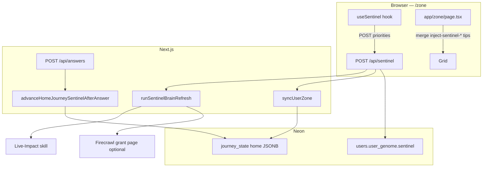

---

#### 3. Code map

| Module | Role |
|--------|------|
| `app/hooks/useSentinel.ts` | Client: build priorities, throttle refresh (5 min), optional 24h scrape via API |
| `app/api/sentinel/route.ts` | Auth session: brain refresh + `syncUserZone` + persist `user_genome.sentinel` |
| `lib/agents/sentinel.ts` | `runSentinelBrainRefresh` — Gemini tool calling (Live-Impact + structured Firecrawl extract) |
| `lib/sentinel/runner.ts` | `advanceHomeJourneySentinelAfterAnswer`, `syncUserZone`, mother/child slide builders |
| `lib/sentinel/scraper.ts` | Soft-save cards (flow temp, phantom standby, food waste) |
| `lib/sentinel/liveGrounding.ts` | Gemini grounding for mother copy; also used by **`/api/local-offers`** |
| `lib/sentinel/recardTypes.ts` | `SentinelMotherRecardPayload`, `MotherChildSlide`, view states `LIVE` / `RESULT` |
| `lib/sentinel/api-config.ts` | Shared Firecrawl + Gemini clients (`FIRE_CRAWL_KEY_2` wins) |
| `app/lib/skills/liveImpact.ts` | Auditable baseline £/kWh + grid intensity |
| `scripts/test-sentinel-runner.ts` | Local integration test for runner + advance |

---

#### 4. Client hook (`useSentinel`)

**Used on:** `app/zone/page.tsx` only.

##### Inputs

- `userAnswers` — journey answer map from AppContext
- `impactTotals` — hero `totalMoney` / `totalCarbon` from VM
- `recentChatHistory` — last messages for keyword bias (heat / commute / waste)

##### Outputs

| Field | Meaning |
|-------|---------|
| `priorities` | Up to 3 `SentinelPriority` rows → mapped to **`inject-sentinel-{journey}-{index}`** tip cards |
| `gridLowPulse` | Server flag when grid intensity low |
| `grantFound` + `firecrawlGrant` | Rural remote + grant scrape → **`inject-sentinel-rural-support`** |
| `liveImpact` | Home idle 24h cost/carbon + intensity |
| `pulseColor` | Optional carbon card pulse colour |

##### Refresh policy

| Interval | Behaviour |
|----------|-----------|
| **5 minutes** | Skip duplicate `POST /api/sentinel` if `zz_sentinel_last_refreshed` is fresh |
| **24 hours** | Pass `run_scrape_sync: true` → server may POST scrape-sync; client then POSTs **`/api/zone/tips-refresh`** |

Priorities are **heuristic** (20% of impact totals + answer count), re-sorted by profile goal (`profile_goal`: money / carbon / balanced).

---

#### 5. Server API — `POST /api/sentinel`

| Auth | Behaviour |
|------|-----------|
| **Guest** | Echo priorities back; no brain refresh |
| **Signed in** | Full pipeline |

**Body (optional):** `priorities[]`, `system_prompt`, `region`, `run_scrape_sync`.

**Steps:**

1. `runSentinelBrainRefresh({ region, postcode, runScrapeSync })`
2. `syncUserZone({ userId, location, genome, appOrigin })`
3. Tune priority `savingsGbp` with live baseline cost
4. If `run_scrape_sync` + remote postcode (`KW`, `IV`, `HS`, …) → internal POST `/api/scrape-sync` → `grant_found` from markdown/citations
5. Merge snapshot into `users.user_genome.sentinel` + `last_refreshed`

**Remote postcode prefixes:** `KW`, `IV`, `HS`, `ZE`, `PH`, `PA`, `AB`, `TR`, `LL` (see `REMOTE_POSTCODE_PREFIX` in route).

---

#### 6. Home journey deck (`advanceHomeJourneySentinelAfterAnswer`)

**Trigger:** `POST /api/answers` when `journey_key === 'home'` and logged-in `user_id` (`app/api/answers/route.ts`).

**Storage:** `journey_state` row `journey_key = 'home'` — JSON `MotherChildJourneyState`:

| Field | Meaning |
|-------|---------|
| `slides` | P1–P3 mother/child slides (tenure + grid tier steer EST affiliate links) |
| `slideCursor` | Current slide index |
| `sessionAnswerCount` | 0–3 home answers this deck |
| `viewState` | `LIVE` until 3 answers → `RESULT` |
| `laneJourneyKey` | Always `home` today |

**Returns:** `SentinelMotherRecardPayload` (headline, description, money/carbon, `source_url`, `verified_date`) for client mother recard UI.

**Affiliate links (UTM `utm_medium=sentinel`):** EST advice URLs vary by grid tier (`reg_gb_base`, `reg_urban_lez`, `reg_hi_rural`).

---

#### 7. `syncUserZone`

Builds initial or refreshed **home** mother/child slides from:

- User postcode + `user_genome`
- `GET /api/local-intelligence` (when `appOrigin` passed) or `getLocalData`
- `runLiveGrounding` for prose grounding
- Soft-save cards from `lib/sentinel/scraper.ts`

Upserts **`journey_state`** and **`journeys`** for zone waterfall population. Called from **`POST /api/sentinel`** after brain refresh.

---

#### 8. Zone grid integration

`app/zone/page.tsx`:

- Merges **`sentinelTipCards`** (`inject-sentinel-*`) into tip rail / inject list
- Optional **`sentinelSupportTipCard`** when rural grant found
- **`sentinelHeroPing`** / **`sentinelPingJourneyKeys`** for grid pulse UX
- Home card can show **`homeSupportTitle`** / **`homeSupportOfferUrl`** from Sentinel grant

##### Inject ID rules

`lib/zone/perCategoryCardCap.ts` — **`inject-sentinel-*`** and **`inject-fallback-*`** are **not** loop-answer discovery births (do not count toward earned inject cap the same way as `injectNewDiscoveryCard`).

---

#### 9. vs main research pipeline

| | **Scrape-sync / research_results** | **Sentinel** |
|--|--------------------------------------|--------------|
| **Primary output** | Per-journey headlines, `architect_prose`, `offer_url` | Home deck state + 3 client priorities + rural grant tip |
| **Trigger** | Zone load, answers, cron, tip+1 | Zone mount hook, `POST /api/sentinel`, home answers |
| **Neon table** | `research_results` | `journey_state`, `user_genome.sentinel` |
| **Content Architect** | Yes | No |
| **Hermes cron** | `zone-research` / `repair-mechanical` | Not required |

Both may use **Firecrawl** — shared keys via `lib/sentinel/api-config.ts` and `lib/agents/researchAgent.ts`.

---

#### 10. Living pulse “Safe Sentinel fallback”

`lib/logic/pulse.ts` logs **`[pulse] Safe Sentinel fallback active`** when living pulse (`GET /api/pulse/living`) fails. That is a **degraded pulse path label**, not a call into `lib/sentinel/runner.ts`.

---

#### 11. Env & verification

| Variable | Sentinel use |
|----------|----------------|
| `GEMINI_API_KEY` | Brain refresh tool calling (`SENTINEL_REASONING_MODEL` default `gemini-3.1-pro-preview` in agent) |
| `FIRE_CRAWL_KEY_2` / `FIRECRAWL_API_KEY` | Grant page extract |
| `DATABASE_URL` | `journey_state`, `users` updates |
| Session cookie | `POST /api/sentinel` (signed-in path) |

```bash
### Local runner smoke (needs DATABASE_URL)
npx tsx scripts/test-sentinel-runner.ts

npm run verify
```

---

#### 12. When to change Sentinel vs main docs

| Change | Update |
|--------|--------|
| Home deck slides, `journey_state` shape | This doc + `lib/sentinel/runner.ts` |
| Inject tip IDs / cap rules | [ZONE-CONTENT-AND-DATA.md](ZONE-CONTENT-AND-DATA.md) + `perCategoryCardCap.ts` |
| scrape-sync / Architect / Zai boundaries | [ZONE-CONTENT-AND-DATA.md](ZONE-CONTENT-AND-DATA.md), [ZAI-AND-QUESTIONS-RULES.md](ZAI-AND-QUESTIONS-RULES.md) |

---

*Last synced with `useSentinel`, `app/api/sentinel/route.ts`, `lib/sentinel/runner.ts`, `app/api/answers/route.ts`.*

---

## Annex: Hermes vs JIT scrape {#annex-hermes-vs-jit-scrape}

*Source file: `HERMES-ULM-JIT-BRIEF.md`*


**Audience:** whoever runs the Oracle VPS cron (`ubuntu@140.238.100.237`) and anyone testing from a Mac.  
**App:** `https://00-ulm.vercel.app` — Zero Zero intelligence loop.

This is **not** the Python `hermes` chat CLI schedule. VPS cron uses **`bash scripts/hermes-pulse.sh`** (see [HERMES-VPS-SETUP.md](HERMES-VPS-SETUP.md)).

**Product docs:** [ZONE-CONTENT-AND-DATA.md](ZONE-CONTENT-AND-DATA.md) (main scrape/copy) · [SENTINEL.md](SENTINEL.md) (parallel live layer — not Hermes) · [SUPPLEMENTAL-SYSTEMS.md](SUPPLEMENTAL-SYSTEMS.md) (inject paths, Gary mode).

---

#### What changed (tell Hermes / the VPS)

| Before | Now (Ulm / “use less, more”) |
|--------|------------------------------|
| Daily broad scrape for many users | **Weekly** pulse — Monday **05:00 UTC** (`0 5 * * 1`) |
| Gemini Pro / 2.5 multi-model | **`gemini-2.5-flash`** everywhere (surgical; not 1.5/2.0/lite on new keys) |
| Pre-scrape whole Zone | **JIT:** Firecrawl/Gemini only after user answers Tip +1 in Solo Focus |
| `limit=12` full cron | **Times out** on Vercel (~300s). Weekly job uses **`limit=3`** full OR **`repair=1`** backfill |

**Hermes does not run Gemini locally.** It only HTTP-triggers Vercel with `CRON_SECRET`.

##### UTILITIES lane (13th Zone card — May 2026)

- **Profile** captures `home_power` (GAS / ELECTRIC / MIX / OTHER) — not a Solo Focus MC question.
- **UTILITIES** tile unlocks on the Zone wall only after profile power type is set (`lib/zone/utilitiesZoneUnlock.ts`).
- **JIT scrape** for `category=utilities` uses free server APIs (no keys): Postcodes.io, Carbon Intensity, optional Octopus public Agile feed — see `lib/data/utilitiesFreeApis.ts` + `lib/intelligence/utilitiesLaneRules.ts`.
- **Gemini / Firecrawl** still cite Ofgem price-cap pages for £/yr; lane lock blocks re-asking power type and blocks category drift into `grants`/`home` unless the CTA is scheme-specific.
- **Hermes config:** no VPS change — same `repair-mechanical` weekly line; utilities rows backfill with other journeys when `repair=1`.

---

#### Correct weekly cron line (VPS)

```cron
### 00-00 hermes-pulse — weekly surgical pulse (Monday 05:00 UTC)
0 5 * * 1 /usr/bin/bash /home/ubuntu/00-00/scripts/hermes-pulse.sh --secret-file=/home/ubuntu/.hermes/cron.secret --weekly >> /home/ubuntu/hermes-pulse.log 2>&1
```

Install from repo:

```bash
bash scripts/install-hermes-crontab.sh --install
### default schedule is now 0 5 * * 1 (Monday)
```

---

#### Mac commands (from git repo)

```bash
npm run hermes:ping
npm run hermes:repair-pulse
```

**Do not** put comments on the same line as `npm run` — npm forwards `#` to the script (`Unknown arg: #`).

```bash
bash scripts/hermes-pulse.sh --smoke --secret-file ~/.hermes/cron.secret
npm run db:log-gary
npm run db:repair-gary
```

---

#### Do **not** do this (your terminal showed why)

##### 1. `curl` with `limit=12` and no `repair=1` only

```bash
### BAD — FUNCTION_INVOCATION_TIMEOUT (12 × full Firecrawl+Gemini per user)
curl -X POST "https://00-ulm.vercel.app/api/cron/zone-research?limit=12" \
  -H "Authorization: Bearer YOUR_SECRET"
```

Use **repair backfill** instead:

```bash
### GOOD — backfill agent_headline / architect_prose / saving_amount_gbp on incomplete rows
curl -sS -X POST "https://00-ulm.vercel.app/api/cron/zone-research?repair=1&limit=6" \
  -H "Authorization: Bearer $(grep '^CRON_SECRET=' .env.local | cut -d= -f2- | tr -d '\"')"
```

Or load secret safely (avoids zsh `!` / `(BN17)` glob bugs):

```bash
SECRET=$(grep '^CRON_SECRET=' .env.local | cut -d= -f2- | tr -d '"' | tr -d "'")
curl -sS -X POST "https://00-ulm.vercel.app/api/cron/zone-research?repair=1&limit=6" \
  -H "Authorization: Bearer ${SECRET}"
```

**Never** put `(BN17)` or other parentheses on the same line as `# comment` in zsh — it triggers `unknown file attribute: B`.

##### 2. `hermes cron create … --model gemini-1.5-flash`

That is the **Python Hermes assistant** CLI. It does **not** schedule this app’s Vercel cron. Wrong flag: use **`-m gemini-1.5-flash`**, not `--model`.

For **this product**, use `install-hermes-crontab.sh` on the VPS, not `hermes cron create`.

##### 3. Expecting `npm run db:repair-research` to fix production row 726 immediately

Local repair uses your **`.env.local`** `GEMINI_*` models. If logs still show `gemini-2.5-flash-lite`, set:

```env
GEMINI_ZONE_MODEL=gemini-1.5-flash
GEMINI_ARTICLE_MODEL=gemini-1.5-flash
GEMINI_CHAT_MODEL=gemini-1.5-flash
```

Row **726** (grants / BUS) can still get a **mechanical** £7,500 triplet without Gemini when repair runs against Neon. Latest row **728** is a junk ingest (null category) — repair skips until category is set; JIT scrapes are **per journey_key** after Tip +1.

---

#### What Hermes should expect on Monday pulse

1. `GET /api/health?live=1` → 200  
2. `GET /api/health/diagnostics` + Bearer → neon, gemini, firecrawl booleans  
3. `GET /api/cron/zone-research?limit=3` with `--weekly` (or `repair=1` if you add `--repair-only` flag to script) → at most **3** full user scrapes  

Day-to-day user research is **not** Hermes’s job anymore — it is **earned** in the app when Gary answers one Solo Focus question.

---

#### Neon truth check (Gary / BN17)

```bash
npm run db:log-research
```

- Exit **0** = latest row has £ + headline + 3-paragraph prose  
- Exit **2** = incomplete (Zone uses mechanical fallbacks until Tip +1 or repair)

Target for grants row 726 after repair: `saving_amount_gbp` 7500, `agent_headline` set, `architect_prose` three paragraphs.

---

#### Vercel env (production)

Ensure Production has:

- `CRON_SECRET` (same as `~/.hermes/cron.secret` on VPS)  
- `GEMINI_API_KEY`  
- `FIRE_CRAWL_KEY_2`  
- Optional: `GEMINI_ZONE_MODEL=gemini-1.5-flash` (defaults in code if unset)

**use less, more.**

---

## Annex: Hermes VPS setup {#annex-hermes-vps-setup}

*Source file: `HERMES-VPS-SETUP.md`*


Reference for `ubuntu@140.238.100.237` — Hermes only **HTTP-triggers** Vercel; it does not run Gemini/Firecrawl locally.

**Production target:** `https://00-ulm.vercel.app/api/cron/zone-research`

**Operator brief (read first):** [`HERMES-ULM-JIT-BRIEF.md`](./HERMES-ULM-JIT-BRIEF.md) — Ulm JIT, weekly schedule, why `limit=12` timed out, correct curl/Mac commands.

---

#### Ulm JIT (May 2026) — what Hermes triggers now

| Job | Schedule | Command |
|-----|----------|---------|
| **Weekly pulse** | Monday 05:00 UTC `0 5 * * 1` | `hermes-pulse.sh --weekly` → `?limit=3` (max 3 full user scrapes) |
| **Repair backfill** | Manual / optional | `hermes-pulse.sh --repair-only` → `?repair=1&limit=12` (headline/£/prose only) |
| **Auth smoke** | Anytime | `hermes-pulse.sh --auth-only` (~2s) |

Day-to-day research is **not** bulk-croned. Users earn a **surgical scrape** after answering one Solo Focus Tip +1 question in the app (`gemini-1.5-flash`, topic-locked by `journey_key`).

**Do not** run `limit=12` without `repair=1` on production — Vercel will **FUNCTION_INVOCATION_TIMEOUT**.

---

#### What your terminal showed

| Observation | Meaning |
|---------------|---------|
| `tail /var/log/hermes-cron.log` → no file | Cron never ran (or log path was wrong). Use **`~/hermes-pulse.log`**, not `/var/log/…`. |
| `crontab -l` only comments | **`crontab -e` saved with no job line** — Hermes is not scheduled yet. |
| Mac `curl` → 401 | `$CRON_SECRET` empty in shell, or wrong value. Use `npm run hermes:ping` on Mac. |

---

#### Fastest path (from Mac, one command)

```bash
cd ~/Documents/00-00
bash scripts/deploy-hermes-to-vps.sh
```

This rsyncs `hermes-pulse.sh`, writes `~/.hermes/cron.secret` from `.env.production.local`, runs `--auth-only`, and leaves your existing crontab line in place.

---

#### One-time setup on the VPS (manual)

##### 1. SSH in (from Mac)

```bash
ssh -i ~/Downloads/ssh-key-2026-05-08.key ubuntu@140.238.100.237
```

##### 2. Get the repo (if missing)

```bash
git clone https://github.com/00app/00-ULM.git ~/00-00
cd ~/00-00
git pull
```

Or sync only the scripts from your Mac:

```bash
ssh -i ~/Downloads/ssh-key-2026-05-08.key ubuntu@140.238.100.237 'mkdir -p ~/00-00/scripts'
rsync -avz -e "ssh -i ~/Downloads/ssh-key-2026-05-08.key" \
  scripts/hermes-pulse.sh scripts/install-hermes-crontab.sh scripts/setup-hermes-vps.sh \
  ubuntu@140.238.100.237:~/00-00/scripts/
```

##### 3. Secret file (same as Vercel `CRON_SECRET`)

```bash
mkdir -p ~/.hermes && chmod 700 ~/.hermes
### Paste production secret — use single quotes if it contains !
printf '%s' 'YOUR_VERCEL_CRON_SECRET' > ~/.hermes/cron.secret
chmod 600 ~/.hermes/cron.secret
```

##### 4. Run setup + install cron

```bash
cd ~/00-00
bash scripts/setup-hermes-vps.sh --install-cron
```

Or manually:

```bash
bash scripts/hermes-pulse.sh --secret-file ~/.hermes/cron.secret --auth-only
bash scripts/install-hermes-crontab.sh --install
crontab -l   # must show ONE line starting with 0 5 * * 1 (weekly)
```

##### 5. Verify crontab (non-empty)

```bash
crontab -l | grep hermes-pulse
```

Expected (either form is fine):

```cron
### 00-00 hermes-pulse
0 5 * * 1 /usr/bin/bash /home/ubuntu/00-00/scripts/hermes-pulse.sh --secret-file=/home/ubuntu/.hermes/cron.secret --weekly >> /home/ubuntu/hermes-pulse.log 2>&1
```

Or (what you installed):

```cron
0 5 * * * /usr/bin/bash /home/ubuntu/00-00/scripts/hermes-pulse.sh --secret-file=/home/ubuntu/.hermes/cron.secret >> /home/ubuntu/hermes-pulse.log 2>&1
```

Prefer **`/usr/bin/bash`** in cron so the job does not depend on the script’s execute bit alone.

##### 6. Test on VPS (do **not** use `npm` on the server)

`npm run hermes:ping` only works on your **Mac** inside the git repo. On the VPS there is no `package.json` in `~` — use **bash** directly:

```bash
/usr/bin/bash /home/ubuntu/00-00/scripts/hermes-pulse.sh \
  --secret-file=/home/ubuntu/.hermes/cron.secret --auth-only
```

Full smoke (~2–5 min):

```bash
/usr/bin/bash /home/ubuntu/00-00/scripts/hermes-pulse.sh \
  --secret-file=/home/ubuntu/.hermes/cron.secret --smoke
tail -30 ~/hermes-pulse.log
```

If `No such file` for `hermes-pulse.sh`, clone or rsync the repo first (§2).

---

#### crontab -e tips

- Add **one line** at the bottom (do not paste into zsh on Mac).
- Save and exit (`nano`: Ctrl+O, Enter, Ctrl+X).
- `crontab -l` must show the `0 5 * * *` line — not only `#` comments.

---

#### Mac vs VPS

| | Mac (dev) | Oracle VPS (Hermes) |
|--|-----------|---------------------|
| Schedule | Optional `install-hermes-crontab.sh --install` | **Required** for weekly pulse (`0 5 * * 1`) |
| Secret | `~/.hermes/cron.secret` | Same path under `/home/ubuntu/` |
| Log | `~/hermes-pulse.log` | `/home/ubuntu/hermes-pulse.log` |
| Quick test | `npm run hermes:ping` (in repo on Mac) | `bash …/hermes-pulse.sh --secret-file … --auth-only` (**no npm**) |

---

#### Troubleshooting

| Symptom | Fix |
|---------|-----|
| HTTP 401 | Secret ≠ Vercel Production `CRON_SECRET`; redeploy after rotating on Vercel. |
| `zsh: event not found` | Secret contains `!` — use **single quotes** or `set +H` before export. |
| Empty `crontab -l` | Re-run `bash scripts/install-hermes-crontab.sh --install`. |
| No log file | Cron not run yet; run manual `--smoke` once or wait until 05:00 UTC. |

See also: [HANDBOOK.md](HANDBOOK.md) · [FULL-APP-SPEC.md](FULL-APP-SPEC.md) §11 · `scripts/hermes-pulse.sh`

---

## Annex: Motion DNA {#annex-motion-dna}

*Source file: `MOTION-FAMILY.md`*


Delivery-only motion vocabulary. **Does not** change profile questions, summary word order, zone loop logic, or `lib/brains`. Sequence is frozen in **`lib/zone/directorsOrder.ts`** + **`docs/HANDBOOK.md`** (Director's Order).

**Unified material (vibe-lock):** every surface uses the same crystallize physics — Intro/loading (`AtomicLogo`), Profile/Settings steps, Summary/Architectural Pulse ticker, Zone grid + Rock, Zai messages, loop takeover, discovery snap-in.

#### Tokens (`lib/motion-family.ts`)

| Token | Value | Use |
|-------|-------|-----|
| `FAMILY_EASE` | `cubic-bezier(0.22, 1, 0.36, 1)` | All family tweens |
| `FAMILY_DUR_LONG` | `0.8s` | Chapter changes (profile step, page shell) |
| `FAMILY_DUR_ATOMIC` | `1.0s` | Crystallize: blur cloud → sharp lock |
| `FAMILY_DUR_SHORT` | `0.4s` | Likes, hovers, word exit, controls |
| `familyAtomicAssembly` | blur + letter-spacing + scale | Summary ticker, Architectural Pulse, loop question |
| `familyReveal` | blur → sharp (no letter-spacing) | Profile headline, settings cells |
| `familyGlide` | 15px **vertical rise** + blur | Profile step swap (legacy name) |
| `familyAtomicSurface` | rise + blur + scale | Cards, screens, zone cells, Solo Focus |
| `familyAtomicTextProps` | surface + letter-spacing | Intro / summary opacity ticker |
| `ZONE_ATOMIC_BENTO_VARIANTS` | blur cloud → card | Zone grid ripple (exported as `ZONE_BENTO_CELL_VARIANTS`) |

#### Reading-speed contract

- `FAMILY_READ_MS_PER_WORD` = **200ms** minimum sharp dwell per word after assembly.
- `atomicWordHoldMs(text)` = **1000ms** assembly + `readingSpeedDwellMs(text)`.
- Wired on `/profile/summary`, Architectural Pulse, and `IntroWordCycle` + `opacityTicker`.

#### Surfaces

| Surface | Motion |
|---------|--------|
| `/` + `/intro` | `AtomicLogo` power-on + atomic `IntroWordCycle` (`opacityTicker`) |
| Loading routes | `AppBootGlitch` → `AtomicLogo` loop |
| `/profile` | Centered atomic cross-fade (`familyProfileStepProps` = atomic) |
| `/profile/summary` | Atomic ticker + `atomicWordHoldMs` read buffer |
| Zone | Pulse words → atomic grid ripple (rise + blur, **0.12s** stagger) → expand shell |
| Loop / discovery | Atomic headline; discovery tip atomic snap-in |
| `/zai` | Page + messages `familyAtomicProps` |
| `/likes`, `/settings` | `familyPageEnterProps` + atomic cells |

#### Director's order (Zone)

1. Summary atomic ticker completes (`pulseWordsComplete`).
2. Bento grid ripples (crystallize, stagger `ZONE_GRID_STAGGER_CHILD_DELAY_SEC`; reveal interval **2×** child delay in `app/zone/page.tsx`).
3. `revealedCardCount` stays stable when scrape-sync adds rows — no reset-to-zero flash mid-session.
4. Today's tips (Rock) last — **no loop** on close.

Journey loop: expand → close → **one** loop → discovery → **pink** (`markCardVisited` in `completeCleanBirth` only).

#### Zone expand (Solo Focus)

Industrial zip-shut / opacity snap on `ExpandedCardShell` — **no `layoutId` morph** (morph broke close → loop handoff). `FAMILY_MOTION_SCALE` (0.7) speeds all family durations ~30%.

#### Protected

Boot / intro glitch keyframes in `globals.css`. Industrial tokens in `lib/animations.ts` for Solo Focus zip-shut.

#### Hover

- `.zz-family-bloom` — scale 1.02 + gold drop-shadow (likes/settings/profile CTAs).
- `.zz-atomic-hover` + `FAMILY_ATOMIC_HOVER` — 1px jitter on zone journey cards.

---

## Annex: Vercel deploy & checks {#annex-vercel-deploy--checks}

*Source file: `DEPLOY-VERCEL.md`*


When the dashboard shows **Checks Failed**, **Environment: Production**, **Staged**, and Lint/Typecheck say *“An internal error occurred”* — the **Next.js build often already succeeded**. Your commit is deployed to a preview URL; production alias was not promoted because optional checks failed.

#### 1. Confirm the real build passed

On the deployment page, open **Build Logs** (not Deployment Checks).

Look for:

```text
> npm run verify
> node scripts/build-with-manifest-fix.js
...
Build complete. Output in .next
```

If that finished without `Error: Command "npm run verify && …" exited with 1`, **your code is fine**.

#### 2. Promote to production (fastest)

1. Vercel → project **00-ulm** → **Deployments**
2. Open deployment **`4924d2f`** (or latest **Staged**)
3. **⋯** menu → **Promote to Production** (or **Assign to Production Domain**)

Production alias **`https://00-ulm.vercel.app`** should then serve this build.

#### 3. Stop the false failures (repo + dashboard)

**Repo (automatic):**

| Layer | What runs |
| --- | --- |
| **`vercel.json` `buildCommand`** | `npm run verify` then `node scripts/build-with-manifest-fix.js` |
| **`.npmrc`** | `include=dev` — native Lint/Typecheck jobs get `@types/*` + eslint |
| **`scripts/vercel-check.mjs`** | Native check entry: `next typegen` + explicit eslint/tsc binaries |
| **`package.json` `lint` / `typecheck`** | `node scripts/vercel-check.mjs …` (not deprecated `next lint`) |
| **`next.config.js`** | No `eslint` key (Next 16 removed it — native Vercel Lint crashes). `typescript.ignoreBuildErrors` only. |
| **`vercel.json` `installCommand`** | `npm ci --include=dev` (checks + build see eslint/tsc) |
| **`npm run deploy`** | verify → `vercel deploy --prod` → wait Ready → **`scripts/vercel-promote-latest.sh`** |

Missing or nested check scripts caused Vercel *internal error* on native Lint/Typecheck; direct binaries fix that.

**Dashboard (fix “internal error” on native Lint/Typecheck):**

1. **Project 00-ulm** → **Settings** → **Build and Deployment** → **Deployment Checks**
2. **Remove** or mark **not required** the built-in **Lint** and **Typecheck** checks (Next 16 + flat ESLint often yields *internal error* with no log).
3. **Add** → **GitHub Actions** → require jobs **`Lint`** and **`Typecheck`** from `.github/workflows/vercel-production-gate.yml` (exact names).

Until step 3 is done, a green **build** can still show **Checks Failed** — run `npm run promote` so `00-ulm.vercel.app` serves the Ready deployment.

**Staged but build green:** run `npm run promote` (promotes latest Ready prod deployment to `00-ulm.vercel.app`).

Optional smoke check: **`GET /api/health?live=1`** (no DB, returns 200).

#### 4. Align Node 24 everywhere

| File | Value |
|------|--------|
| `package.json` `engines.node` | `24.x` |
| `.node-version` | `24` |
| `.nvmrc` | `24` |
| Vercel **Project Settings → Node.js Version** | **24.x** |

Mismatch (e.g. `.nvmrc` on 22) can break native check jobs while the main build uses 24.

#### 5. CLI deploy (recommended — remote build + auto-promote)

From repo root (linked to **00-ulm**):

```bash
npm run deploy
```

This runs **`npm run verify`**, then **`vercel deploy --prod`** (build on Vercel — **not** `--prebuilt`), then **auto-promote** via `scripts/vercel-promote-latest.sh` so **`00-ulm.vercel.app`** is not left on an old build when dashboard checks fail.

**Staged only (build already green):** `npm run promote`

Do **not** use `vercel deploy --prebuilt` unless you ran **`vercel build --prod`** in the same session seconds earlier.

#### 6. After production is live

```bash
npm run hermes:ping
npm run hermes:repair-pulse
```

`hermes:repair-pulse` needs **`/api/cron/repair-mechanical`** on the promoted deployment (included in builds after the Ulm/Hermes commit).

#### Local proof (before you trust Vercel checks)

```bash
npm run verify
npm run build
```

Both must pass locally; if they do and Vercel only shows *internal error* on Lint/Typecheck, promote anyway.

#### GitHub Actions (`ci.yml`) vs partial pushes

`main` **zone/page.tsx** imports modules that must land in the **same push** or CI typecheck fails:

- `lib/zone/categoryIntent.ts`
- `lib/zone/tipVerification.ts`
- `lib/zone/tipVerificationDeepScrape.ts`
- `lib/architecturalPulse.ts` (`ZoneWelcomeCopy.savingsMoneyLine` / `savingsCarbonLine`)
- `lib/zone/buildZoneViewModel.ts` (`categoryIntentWeights` param)
- `app/components/SoloFocusOverlay.tsx` (`tipVerificationMode`, `onTipVerificationComplete`)

If `researchAgent.ts` is on `main`, also push in the **same commit**:

- `lib/intelligence/topicShield.ts`
- `lib/intelligence/aiGateway.ts` (`GEMINI_PRECISION_TEMPERATURE` re-export)
- `lib/intelligence/researchProfilePayload.ts` (`surgical` on seed URLs)
- `lib/soloFocusCopy.ts` (`headlineFromArchitectProse`)
- `lib/zone/questionHandler.ts` (`getSoloFocusNextQuestion`)
- `lib/zone/tier2RecursiveSpawner.ts` (`repair` on `fetchTier2ScrapeSync`)
- `lib/journeys.ts` (`getSoloFocusQuestions`)

Commit **verify + build green locally**, then push the full set — not `zone/page.tsx` alone.

---

## Annex: Dev test & audit runbook {#annex-dev-test--audit-runbook}

*Source file: `DEV-TEST-AUDIT.md`*


Quick runbook for local work on Zero Zero (00-00) after ULM / hybrid pipeline changes.

---

#### Do you need new SQL?

| Change | SQL required? |
|--------|----------------|
| Hybrid pipeline (`open_data_anchor` in `users.user_genome`) | **No** — JSONB key inside existing `user_genome` column |
| `MAX_DISCOVERY_INJECTIONS_PER_JOURNEY = 3` | **No** — app-level cap only |
| 24-card ceiling, Rock 6→12 | **No** — client + `ulmLimits.ts` |
| Legacy table cleanup (`card_views`, `micro_answers`, `zai_messages`) | **Optional** — run `db/migrations/20260521_drop_legacy_unused_tables.sql` in Neon SQL Editor **only after** `npm run db:audit` shows 0 rows |

**Fresh branch / empty Neon:** run once:

```bash
npm run init-db
npm run db:evolve-12-domains
```

**Existing production:** no mandatory migration for ULM. Refresh `DATABASE_URL` in Vercel if auth fails.

---

#### Do you need to update Hermes?

**No** for ULM, Zai read-only, or hybrid spawn.

Hermes only HTTP-triggers Vercel (`scripts/hermes-pulse.sh` + `CRON_SECRET`). Keep:

- VPS: `bash scripts/install-hermes-crontab.sh --install` (weekly **repair-only** or `--weekly`)
- Mac smoke: `npm run hermes:ping` · `npm run hermes:repair-pulse`

See [HERMES-ULM-JIT-BRIEF.md](HERMES-ULM-JIT-BRIEF.md) and [HERMES-VPS-SETUP.md](HERMES-VPS-SETUP.md).

User-facing research is **in-app** (answer loop / Deep Dive), not Hermes cron.

---

#### Prerequisites

1. `cp .env.example .env.local` and fill at minimum:
   - `DATABASE_URL` (Neon **pooler** URI — refresh from console if `28P01` auth fails)
   - `GEMINI_API_KEY`
   - `FIRE_CRAWL_KEY_2` (optional locally; needed for full scrape paths)
   - `CRON_SECRET` (matches VPS `~/.hermes/cron.secret` if testing cron)
2. `npm install`
3. For hybrid Solo Focus spawn locally:

```env
MODEL_STRATEGY=bucket_failover
### or
HYBRID_DATA_PIPELINE=1
```

---

#### Clean build (zero TS/lint errors)

```bash
### 0) Optional — drop stale .next / Turbopack caches
npm run purge:disk

### 1) Static gate (must pass; fix any eslint *errors* before ship)
npm run verify

### 2) Production build (verify is included in `npm run build`)
npm run build

### Or wipe .next first:
npm run build:clean
```

**Launch smoke after build:** see **Launch verification** in [HANDBOOK.md](HANDBOOK.md) (Summary atomic ticker → Zone ripple → one loop → pink; Rock = no loop).

**Full prep (Neon + journey_questions + clean build):**

```bash
npm run prep:live
```

Expected: `verify` exit 0, Next build “Compiled successfully”, no TypeScript errors.

---

#### Dev server

```bash
### First time or after weird HMR:
npm run dev:clean

### Normal:
npm run dev
### → http://127.0.0.1:3000
```

After deploy or data-version bumps (`DATA_VERSION` default `2026-05-24-profile-baseline`), returning users auto-reset via `SessionStateRehydrate` then rehydrate from `/api/session-state`. Manual: DevTools → Application → clear site data, or complete profile again.

##### Final test reset (local)

```bash
npm run purge:disk
npm run verify
npm run build:clean
npm run dev:clean
```

**Browser (127.0.0.1:3000):** Settings → **RESET DATA**, or DevTools → Application → **Clear site data**.

**Partial journey/loop cache only** (keep profile): paste the snippet from `npm run clear:learning`.

| Settings edit | Behaviour |
|---------------|-----------|
| Profile row (pencil) | `/profile?q={id}&returnTo=/settings` — one question, then back to Settings |
| Loop row (pencil) | In-place loop beat overlay — answer updates `zz_loop_answers_log` + `journey_*_answers`, returns to Settings |
| Journey card (pencil) | `SoloFocusOverlay` question mode — journey MC answers, then back to Settings |

##### Neon `Connection terminated due to connection timeout` (prep / migrations)

| Cause | Fix |
|-------|-----|
| Compute suspended (cold start) | Run `npm run db:test` first (HTTP wake), then `npm run db:apply-pending` or `npm run prep:live`. Scripts retry automatically via `scripts/neon-wake.ts`. |
| Forced TCP `pg` | Do **not** set `DATABASE_USE_NEON_SERVERLESS=0` for local CLI unless you need raw `pg`. |
| SSL mode warning in terminal | Informational for `pg` v9; optional: add `sslmode=verify-full` to `DATABASE_URL` in Neon console. |

##### Vercel CLI `ETIMEDOUT` after “Deployment completed”

Harmless — build and deploy finished; CLI lost the polling connection. Confirm in [Vercel dashboard](https://vercel.com) or `curl https://00-ulm.vercel.app/api/health?live=1`.

##### `Cannot find the middleware module` (Next 16 + Webpack)

| Cause | Fix |
|-------|-----|
| Stale `.next` after purge / crash | `npm run dev:clean` (purge + manifests + dev). Do not run bare `next dev` — use `npm run dev` or `dev:clean`. |
| Port 3000 still held by an old `node` process | `lsof -ti :3000 \| xargs kill` then `npm run dev:clean`. |
| Proxy not compiled yet (first request) | Wait for terminal `Compiled` / `proxy.ts` timing line, hard-refresh. |
| `next start` without a build | Run `npm run build:clean` first; `start` no longer stubs middleware manifests. |

Boundary file: root **`proxy.ts`** (`export function proxy`). Next 16 renamed `middleware.ts` → `proxy.ts`; the dev bundle still emits `.next/dev/server/middleware.js`.

##### Hydration + console noise (dev)

| Symptom | Fix / expectation |
|---------|-------------------|
| React **hydration mismatch** on `/` | `useHydrationSafeReducedMotion` on intro/logo/word cycle; **`suppressHydrationWarning`** on `<html>` / `<body>` (Grammarly injects `data-gr-ext-installed`). |
| **`name` vs `postcode` on `/profile`** | `ProfilePageClient` waits for `profileHydrated` after `useLayoutEffect` reads `localStorage` / `sessionStorage` — no SSR step label drift. |
| **AUDIT over bento on Zone handoff** | Summary → Zone uses **`.zone-handoff-overlay`** (fixed, 40px inset); wall hidden until `architecturalPulsePhase === 'done'`. |
| **Marvin / Roboto look like system fonts** | Marvin is local: `public/assets/Marvin Visions Bold.ttf` (`@font-face` in `globals.css`, **`font-weight: 700 900`** — must match `.intro-text-large` at 900). If missing from disk, run `git checkout -- "public/assets/Marvin Visions Bold.ttf"`. Roboto is `next/font/google` on `<html className={roboto.variable}>` + `<body className={roboto.className}>`. Summary waits on `preloadAppFonts()` (2s cap) before the ticker. Hard-refresh after restore. |
| **Unused font preload** warning | Single Marvin preload in `app/layout.tsx` (`/assets/Marvin%20Visions%20Bold.ttf`); `@font-face` in `globals.css`. |
| `runtime.lastError` / extension port | Browser extension — ignore unless reproducing in incognito without extensions. |
| **`[403] Lightning dunning … gemini`** | Google Cloud billing / quota on the Gemini project — not an app bug. Bucket failover uses Groq/Mistral; expect **`[429]`** if profile triggers many `scrape-sync` calls in one session. |

**Profile autofill smoke:** set `profile_postcode` in Application → Local Storage, reload `/profile?q=postcode` — field prefilled. Name step: browser `given-name` autofill should persist **first token only** (`lib/profile/firstNameFromInput.ts`).

---

#### Database audit

```bash
npm run db:test              # ping + table list
npm run db:verify-discovery  # Zai + inject tables
npm run db:audit             # row counts + legacy cleanup hints
npm run db:log-research      # latest research_results row
```

If `db:test` passes but pool scripts fail: save `.env.local`, remove stale `export DATABASE_URL=...` from your shell, or set `DATABASE_USE_NEON_SERVERLESS=0` for CLI scripts.

---

#### App + API smoke

```bash
npm run verify
npm run stack:verify          # env + db:test + hermes:ping
npm run dev:pipeline-ready    # optional: -- --seed YOURPOSTCODE

npm run verify:env
### BASE_URL=https://00-ulm.vercel.app npm run verify:env

npm run hermes:ping
npm run deploy                # verify + remote build + auto-promote
### npm run promote             # if Vercel shows Staged but build green
```

**Manual checklist**

| Step | URL / action |
|------|----------------|
| Profile 8 steps | `/profile` — name `given-name` (first name only), postcode from `profile_postcode` + `/api/local-intelligence` |
| Zone grid | `/zone` — 13 journeys (`JOURNEY_ORDER`), visited pink/yellow; localhost one-shot bootstrap (`devResearchBootstrap.ts`). After pulse, cards should stagger in without flash/stall (no post-bootstrap `refreshKey` polls). |
| Research gates | `npm run zone:audit-gates -- YOURPOSTCODE` — per-journey settled / headline / prose failures from Neon |
| Solo Focus answer | one question → one discovery card; hybrid if bucket_failover |
| Zai | `/zai` — stream, no scrape; pills under last Zai bubble |
| Deep Dive | unvisited card → **Search deeper** only (scrape) |

**E2E (optional):**

```bash
npm run test:e2e
```

---

#### zsh pitfalls (from real terminal sessions)

**Do not put `# comments` on the same line as npm scripts** — npm forwards `#` to the shell:

```bash
### BAD — fails with "Unknown arg: #"
npm run hermes:repair-pulse   # optional smoke

### GOOD — one command per line
npm run hermes:repair-pulse
```

**Do not paste multi-line blocks with `#` comment lines into zsh** — you get `command not found: #`.

**`rm` with a comment on the same line** breaks words into separate args:

```bash
### BAD
rm .env.vercel.production   # don't commit

### GOOD
rm .env.vercel.production
```

**Copy-paste one command at a time:**

```bash
npm install
npm run verify
npm run build
```

---

#### Vercel `MODEL_STRATEGY`

Production diagnostics already report `bucket_failover.enabled: true` when you curl with `CRON_SECRET` — good.

If `vercel env pull` shows `MODEL_STRATEGY=""`, set it explicitly in Vercel → Project → Environment Variables → Production:

```text
MODEL_STRATEGY=bucket_failover
```

Redeploy, then re-check:

```bash
export CRON_SECRET="$(grep '^CRON_SECRET=' .env.local | cut -d= -f2- | tr -d '\"')"
curl -sS -H "Authorization: Bearer ${CRON_SECRET}" \
  'https://00-ulm.vercel.app/api/health/diagnostics' | jq '.bucket_failover.enabled'
```

Local hybrid spawn also needs the same in `.env.local` (or `HYBRID_DATA_PIPELINE=1`).

---

#### Stop burning Gemini credits (free-tier / failover)

When AI Studio shows spend near the cap (£30 default), add to **`.env.local`** and restart dev:

```bash
MODEL_STRATEGY=bucket_failover
GEMINI_FREE_TIER=1
BUCKET_SKIP_GEMINI=1
GROQ_API_KEY=<your groq key>
GROQ_MODEL=llama-3.1-8b-instant
```

Optional: `MISTRAL_API_KEY`, `OPENROUTER_API_KEY` with `OPENROUTER_MODEL=meta-llama/llama-3.1-8b-instruct:free`.

- **Zai + Deep Dive** use the bucket chain (Groq first), not direct Gemini.
- **Discovery answers** use bucket when `MODEL_STRATEGY=bucket_failover`.
- Lower or pause spend in [AI Studio → Spend](https://aistudio.google.com/spend) if you keep `GEMINI_API_KEY` set.
- **Firecrawl** is separate — 402 means no scrape credits; hybrid free APIs (EPC/NESO) still work.

---

#### Troubleshooting

| Symptom | Fix |
|---------|-----|
| `password authentication failed` | Neon console → reset password → paste new pooler URL into `.env.local` + Vercel |
| `verify` ESLint warning only | Pre-existing `SoloFocusOverlay` hooks — not a build blocker |

##### Local dev — stop credit burn

| Symptom | Fix |
|--------|-----|
| `[scraper] Ofgem Firecrawl scrape failed: 402` | Add `SKIP_FIRECRAWL=1` to `.env.local` (no Firecrawl calls) |
| Many `POST /api/zone/content-architect` ~20s | One batch per profile fingerprint; clear `sessionStorage` keys `zz_architect_*` to force refresh |
| `npm run hermes:repair-pulse # comment` → `Unknown arg: #` | Run **one command per line** — npm passes `#` to bash |
| Vercel Lint/Typecheck *internal error* | Build often OK — `npm run promote` or [DEPLOY-VERCEL.md](DEPLOY-VERCEL.md) |
| Staged deployment | `npm run promote` (alias latest Ready prod → `00-ulm.vercel.app`) |
| Zone stale cards | Clear localStorage; check `NEXT_PUBLIC_DATA_VERSION` in `.env.local` |
| Hermes 401 | `CRON_SECRET` in `.env.local` must match VPS secret file |
| `Unknown arg: #` after npm | Remove inline `# comments` on npm lines |
| `zsh: parse error near )` | Run commands separately; don't paste commented blocks |

---

#### Related docs

- [USER-FLOW-AND-DATA-PIPELINE.md](USER-FLOW-AND-DATA-PIPELINE.md) — flow, category contract, deploy checklist
- [DEPLOY-VERCEL.md](DEPLOY-VERCEL.md) — Staged / promote / native checks
- [ULM-APPLICATION-LOOP.md](ULM-APPLICATION-LOOP.md) — product ceilings
- [HYBRID-DATA-PIPELINE.md](HYBRID-DATA-PIPELINE.md) — free vs premium tiers
- [ZONE-CONTENT-AND-DATA.md](ZONE-CONTENT-AND-DATA.md) — scrape, card copy, Solo Focus, tone
- [SENTINEL.md](SENTINEL.md) — Sentinel hook + API + home deck
- [SUPPLEMENTAL-SYSTEMS.md](SUPPLEMENTAL-SYSTEMS.md) — Gary mode, pattern shift, rebirth vault
- [ZAI-AND-QUESTIONS-RULES.md](ZAI-AND-QUESTIONS-RULES.md) — Zai + questions
- [HANDBOOK.md](HANDBOOK.md) — full project reference

---

## Annex: UK public APIs {#annex-uk-public-apis}

*Source file: `PUBLIC-UK-APIS.md`*


All endpoints below require **no API keys**. The browser must **not** call them directly (CORS + policy). Use server routes and `lib/data/*` modules.

**Live smoke:** `npm run test:uk-apis`

**Catalog (usefulness + app wiring):** `lib/data/publicUkApisUsage.ts`

---

#### Are they all useful?

| # | API | Useful? | Why |
|---|-----|---------|-----|
| 1 | Carbon Intensity `/intensity` | **High** | Core mechanical truth — live gCO₂/kWh for electric heat, EV, and carbon tile. |
| 2 | Carbon Intensity `/generation` | **High** | Explains *why* intensity moves (wind/solar/gas mix). |
| 3 | EA flood readings | **Medium** | Water **journey** ambient signal only — not household bill £. |
| 4 | Octopus `/products/` | **Medium** | Tariff **catalogue** baseline for utilities JIT — one supplier, indicative. |
| 5 | Octopus Agile `standard-unit-rates` | **High** (electric/mixed) | Half-hourly p/kWh for time-shift copy; useless for gas-only homes. |
| 6 | Air quality (Open-Meteo EAQI fallback) | **Low** | Defra `current-aqi-regional.json` is **404**; app uses Open-Meteo at postcode for optional carbon/travel prose. |

**Skip or deprioritize:** Defra for utilities £ math; EA readings for tariff switching; Octopus products alone without Firecrawl/Gemini offers for verified `saving_amount_gbp`.

---

#### How the app uses them

```mermaid
flowchart TB
  subgraph profile [Profile]
    P[home_power GAS/ELECTRIC/MIX]
  end
  subgraph server [Server only]
    U[fetchUtilitiesPublicSnapshot]
    I[fetchUkInfrastructureFeed]
    O[fetchOctopusMarketSnapshot]
    G[formatUtilitiesPublicFeedBlock]
  end
  subgraph consumers [Consumers]
    SS[GET /api/scrape-sync]
    RA[runTriggerResearchForCategory utilities]
    PL[GET /api/pulse/living]
    LD[getLocalData / nesoGridClient]
  end
  P --> U
  U --> I
  U --> O
  U --> G
  G --> RA
  U --> SS
  I --> LD
  PL --> Ofgem HTML
```

##### UTILITIES lane (13th card)

1. User sets **power type** on `/profile` → unlocks UTILITIES on `/zone`.
2. **Zone load / JIT:** `GET /api/scrape-sync?postcode=…` returns `utilities_public_feed` when session has `home_power`.
3. Feed includes:
   - `ukInfrastructure` — carbon, generation mix, EA water sample, Defra AQI sample
   - `octopusMarket` — product count + Agile half-hourly slots (electric / mixed only)
   - Postcode-local grid via `nesoGridClient`
   - April 2026 **reference** cap p/kWh from `lib/brains/constants` (not invented from Octopus alone)
4. **Gemini / Firecrawl:** `formatUtilitiesPublicFeedBlock()` is prepended in `runTriggerResearchForCategory` via `buildUtilitiesResearchContext` — lane lock forbids re-asking power type.

##### Other journeys

| Journey | APIs loaded | Purpose |
|---------|-------------|---------|
| `carbon` | Infrastructure feed (carbon + mix + Defra) | Grid + air context in prose |
| `water` | EA readings sample | Hydrology ambient — not bill savings |
| `solar` | Generation mix + regional intensity | Export / yield timing |
| `home` | Postcodes + Ofgem constants / pulse | Fabric + cap citations |
| `gas-only utilities` | Infrastructure, **no** Octopus market bundle | Skip Agile when `home_power=GAS` |

##### Code map

| Module | Functions |
|--------|-----------|
| `lib/data/ukPublicInfrastructureApis.ts` | `getLiveCarbonIntensity`, `getGenerationMix`, `getLatestWaterReadings`, `getAirQualityData` |
| `lib/data/octopusPublicApis.ts` | `getActiveEnergyProducts`, `getLiveTariffHalfHourlyRates`, `fetchOctopusMarketSnapshot` |
| `lib/data/utilitiesFreeApis.ts` | `fetchUtilitiesPublicSnapshot`, `formatUtilitiesPublicFeedBlock`, `UTILITIES_FREE_API_REGISTRY` |
| `lib/data/publicUkApisUsage.ts` | `PUBLIC_UK_API_CATALOG`, `publicApiBundleForJourney` |

---

#### Terminal tests (Cursor)

```bash
npm run test:uk-apis
npm run test:utilities
```

No `.env` keys required for APIs 1–6. Firecrawl/Gemini still need keys for **scraped** £/yr and architect prose.

---

## Annex: App flow & pipeline (architect) {#annex-app-flow--pipeline-architect}

*Source file: `APP-FLOW-AND-PIPELINE.md`*


> **Canonical user-facing doc:** [USER-FLOW-AND-DATA-PIPELINE.md](USER-FLOW-AND-DATA-PIPELINE.md) — keep that file updated for ops and copy contracts. This spec adds structural constraints for architects.

#### 1. End-to-end user flow

| Step | Route | User | System |
| --- | --- | --- | --- |
| 1 | `/`, `/intro` | Land, start profile | Motion, optional geocode → `profile_postcode` |
| 2 | `/profile` | Onboarding genome | Context + `POST /api/local-intelligence` → `locationName` |
| 3 | `/profile/summary` | Review totals | Atomic ticker → Zone handoff |
| 4 | `/zone` | 13 category cards | `GET /api/scrape-sync`, `buildZoneViewModel`, mechanical truth |
| 5 | Solo Focus | Open card | Marvin hook H1 + town-based lead + 3-beat prose |
| 6 | Answer | MC / loop | `POST /api/answers`, discovery, optional scrape |
| 7 | Close | Return to grid | Pink on birth; visited → grid only (no loop takeover) |

#### 2. Runtime architecture

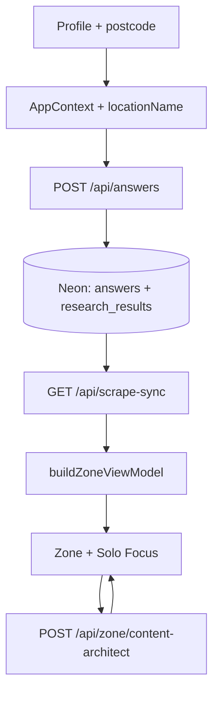

#### 3. Content governance

| Rule | Implementation |
| --- | --- |
| Postcode-first APIs | All research/scrape uses session postcode param |
| Town in UI prose | `lib/zone/localityCopy.ts` — no raw postcode in Solo Focus lead |
| Category isolation | `contentProseSanitize`, `isAcceptableZoneJourneyHeadline` per `journey_key` |
| Warm voice | `lib/zone/zoneVoice.ts` — Gemini + Content Architect; Solo Focus dedupe via `dedupeTrueTipParagraphs` |
| Expanded hook | `EXPANDED_JOURNEY_HOOK` per `journey_key` when DB headline is thin or off-topic |
| Mechanical truth | No fake £/kg without Neon stream (`mechanicalTruth.ts`) |
| HTTPS CTAs | `offerUrlGuard`, `trustedJourneyUrls` |

#### 4. Deploy and wake

| Task | Command |
| --- | --- |
| Verify | `npm run verify` |
| Deploy + promote | `npm run deploy` |
| Staged only | `npm run promote` |
| Stack smoke | `npm run stack:verify` |
| Hermes | `npm run hermes:ping` |
| Dev seed (13 journeys) | `npm run pipeline:seed -- YOURPOSTCODE` |

Details: [DEPLOY-VERCEL.md](DEPLOY-VERCEL.md), [HANDBOOK.md](HANDBOOK.md).

---

## Annex: Product architecture notes {#annex-product-architecture-notes}

*Source file: `PRODUCT-ARCHITECTURE-SPEC.md`*


Single reference for core data flows, hybrid open-source API integration architectures, programmatic typographic limits, and conversational persona boundary safety rules.

---

#### 1. Core Data Flow & Hybrid Hydration Architecture

Zero Zero operates on a hybrid data structure designed to enforce **Mechanical Truth** while capping premium execution costs to near-zero metrics for standard platform hydration.

┌──────────────────────────────────────────┐ │ ONBOARDING RAW ATTRIBUTE INGESTION │ └────────────────────┬─────────────────────┘ │ Postcode + Habits Profile ▼ ┌──────────────────────────────────────────────────────────────────┐ │ FREE API INTERCEPT LAYER (Zero Token Cost) │ │ │ │ * Building Fabric ───────────► OpenEPC REST API │ │ * Live Transmission Mix ──────► NESO Carbon Intensity API │ │ * Solar Radiation Data ───────► EU-PVGIS Location REST │ │ * Multi-Modal Transit Maps ───► TfL / National Rail Darwin │ │ * Regional Trash Regulations ─► Defra Local Index Cache │ └────────────────────────────────┬─────────────────────────────────┘ │ ▼ ┌──────────────────────────────────────────┐ │ DETERMINISTIC FORMULA ENGINE (Neon) │ │ - Resolves true annual £ / kg metrics │ │ - Bypasses speculative AI calculations │ └────────────────────┬─────────────────────┘ │ ▼ ┌──────────────────────────────────────────┐ │ SURGICAL PREMIUM TIER CALL (Capped) │ │ - Gemini: Label-Free Forensic Triplet │ │ - Firecrawl: Hyper-Local Partner Links │ └──────────────────────────────────────────## Engineering Matrix Linkages
* **System Operations Handbook:** [HANDBOOK.md](HANDBOOK.md)
* **Full Application Blueprint:** [FULL-APP-SPEC.md](FULL-APP-SPEC.md)
* **12×3 Core Question Framework:** [PROFILE-ANSWERS-ZONE-TECH.md](PROFILE-ANSWERS-ZONE-TECH.md)
* **Automated Cron Infrastructure:** [INTELLIGENCE-LOOP-MANIFEST.md](INTELLIGENCE-LOOP-MANIFEST.md) · [HERMES-VPS-SETUP.md](HERMES-VPS-SETUP.md)
* **Operational Prompts Registry:** [ZAI-AND-QUESTIONS-RULES.md](ZAI-AND-QUESTIONS-RULES.md) · [ZONE-CONTENT-AND-DATA.md](ZONE-CONTENT-AND-DATA.md)
* **Hybrid Data Hydration Protocol:** [HYBRID-DATA-PIPELINE.md](HYBRID-DATA-PIPELINE.md)

---

## Code index (quick)

| Path | Role |
|------|------|
| `app/zone/page.tsx` | Zone orchestrator |
| `app/components/JourneyBentoCard.tsx` | Bento + Solo Focus expand |
| `app/components/SoloFocusMotherStack.tsx` | Canonical expanded column |
| `app/components/AskZaiDeepDiveSheet.tsx` | Deep dive + Continue in Zai |
| `app/api/answers/route.ts` | Canonical discovery birth |
| `app/api/scrape-sync/route.ts` | Zone hydrate + trigger |
| `app/api/zai/route.ts` | Read-only Zai |
| `lib/journeys.ts` | 13×3 questions |
| `lib/zone/buildZoneViewModel.ts` | Zone VM |
| `lib/brains/buildUserImpact.ts` | £/kg engine |
| `lib/soloFocusCopy.ts` | Headlines, dedupe, True Tip |
| `lib/zone/auditorNarrative.ts` | Mechanical prose fallbacks |
| `lib/zone/zoneVoice.ts` | Warm Auditor voice |
| `lib/agents/researchAgent.ts` | Firecrawl + persist |
| `lib/zai/chatBoundaries.ts` | Zai scrape sandbox |

---

*End of Master Handbook. Regenerate annexes: `python3 scripts/consolidate-handbook.py`*
