# Zero Zero (00-00) — Master Handbook

**Single audit document.** Everything below consolidates the product docs in `docs/` into one place so you can verify copy, logic, APIs, questions, loops, and data sources without jumping files.

| | |
|---|---|
| **Repo** | `https://github.com/00app/00-ULM.git` |
| **Production** | `https://www.00-00.online` (`00-00.online` → www) |
| **Rules in code** | `.cursor/rules/` · `lib/journeys.ts` · `lib/zone/ulmLimits.ts` |

**How to use this file**

1. Read **[GUARDRAILS-AND-PIPELINE.md](GUARDRAILS-AND-PIPELINE.md)** — canonical guardrails + pipeline map.
2. Read **Complete app overview & testing** and **Quick start** before testing logic or content sources.
2. Read **Master checklist** before a release.
3. Skim the **synthesized** sections (loop, mechanical truth, Director's Order).
4. Drill into **annexes** for full API tables, every question ID, scrape triggers, deploy runbooks.
5. When behaviour changes, edit the **satellite** `docs/*.md` first, then run `python3 scripts/consolidate-handbook.py`.

**Do not commit secrets.** Postcodes in examples are `@fixture-only` in `scripts/` only — never hardcode BN17 in `app/` or `lib/`.

---

## Master checklist (release audit)

| Area | Verify |
|------|--------|
| **Postcode-first** | All locality flows use user `profile.postcode` / session — no demo postcode in UI |
| **Mechanical truth** | Empty Neon → `COMPUTING — JOURNEY`, metrics `—`, not fake £12k |
| **Copy** | Per-journey headlines (`EXPANDED_JOURNEY_HOOK`) on **mother** tiles; Rock grid + Solo Focus use catalog habits (`clampRockTipHeadline`, `headlineFromRockHabit`) — not wall hooks |
| **Prose** | Max 2 blocks in Solo Focus (Marvin lead ≤30 words + optional body); no duplicate payoff; no generic “policy and tariff pressure…” |
| **Questions** | 13 journeys × 3 in `lib/journeys.ts`; Solo Focus = 1 Q; loop = `loopQuestions.ts` |
| **Zone wall order** | welcome → profile hero → today's tips (heading shows morning/afternoon/evening, `getTipsTimeOfDay`, 08:00/14:00/18:00) + Rock → recommendations (daily refresh) + bento → signup (`zone-section-*` testids) |
| **Grid order** | `buildGroovyGridItems` — mothers by goal-weighted £ then `JOURNEY_ORDER`; injects nest under parent; max 2/category, 24 total |
| **Discovery birth** | Only `POST /api/answers` → `injectNewDiscoveryCard` (cap 3/journey) |
| **Zai** | Read-only on chat; scrape only on Deep Dive **Search deeper** |
| **Credit** | `MODEL_STRATEGY=bucket_failover`; no `?force=true`; JIT max 4 URLs; daily Vercel Cron repair only |
| **Deploy** | `npm run verify` → `npm run deploy` → `npm run promote` if Staged |
| **Cron trigger** | Daily `repair-mechanical` via Vercel Cron (was weekly on Hermes/Oracle VPS, retired 2026-07-07) — not a broad scrape in bucket mode |
| **Ellipsis** | No sentence ending in `...` or `…` reaches Solo Focus or Zone bento |
| **Coherence** | Every Solo Focus paragraph passes `isCoherentParagraph` before render |

---

## Quick start

```bash
npm install
cp .env.example .env.local   # never commit
npm run init-db
npm run dev                  # http://127.0.0.1:3000
npm run verify               # typecheck + lint (Vercel gate)
npm run deploy               # verify → remote build → promote
```

| Command | Purpose |
|---------|---------|
| `npm run db:test` | Neon connectivity |
| `npm run db:log-research` | Latest `research_results` row |
| `npm run db:evolve-13-domains` | Seed `journey_questions` for all 13 keys in `JOURNEY_ORDER` |
| `npm run promote` | Promote Staged Vercel deployment |
| `npm run dev:pipeline-ready` | Env + health; optional `--seed POSTCODE` |
| `bash scripts/verify-env-and-health.sh` | Prod smoke (`BASE_URL=…`) |

**Required env (production):** `DATABASE_URL`, `GEMINI_API_KEY`, `FIRE_CRAWL_KEY_2` or `FIRECRAWL_API_KEY`, `CRON_SECRET` (≥16 chars). **Bucket mode:** `MODEL_STRATEGY=bucket_failover`, `MAX_ITERATIONS=5`.

---

## Core principles (always true)

| Principle | Meaning | Code |
|-----------|---------|------|
| **Postcode-first** | Council, grants, scrape, copy tied to user postcode | `AppContext`, `/api/scrape-sync`, `research_results` |
| **12k / 1t** | ~12,000 kWh ≈ 1 tonne CO₂e annual baseline for auditor framing | `ULM_KWH_PER_TONNE_CO2E`, `lib/brains/constants.ts` (July 2026 cap **£1,862**) |
| **Mechanical truth** | No fake £/kg on wall without Neon stream | `lib/zone/mechanicalTruth.ts`, `buildZoneViewModel` |
| **Mechanical pulse UI** | Yellow `#FDFD00`, pink `#FF00FF`, purple `#7800ce`; no drop shadows | `app/globals.css`, `lib/journeyColors.ts` |
| **Use less, more** | Max 2 cards/category on wall; 24 bento cells; 3 discovery injects/journey | `lib/zone/ulmLimits.ts`, `perCategoryCardCap` |

### Journey order (13 domains)

`home` → `utilities` → `grants` → `solar` → `travel` → `holidays` → `food` → `shopping` → `money` → `tech` → `water` → `waste` → `carbon`

**Utilities tile:** always on the Zone wall (13th key). Shows **`COMPUTING`** until profile **power type** is set; full tariff stream unlocks after `profile_home_power` (`lib/zone/utilitiesZoneUnlock.ts`).

---

## Complete app overview & testing

**Full reference (edit this satellite first):** [`docs/APP-OVERVIEW-AND-TESTING.md`](APP-OVERVIEW-AND-TESTING.md) · annex below after `consolidate-handbook.py`.

### What the app does

UK postcode auditor: **profile** → **summary** → **Zone** (13 journey tiles + Rock tips) → **Solo Focus** (MC questions + discovery) → optional **Zai** chat and **SMS** signup. Intelligence = **Firecrawl scrape** + **Gemini copy** → Neon `research_results`; £/kg = **`buildUserImpact` only**.

### Where content comes from (test matrix)

| Surface | Headline / copy | £ / kg | URL / CTA |
|---------|-----------------|--------|-----------|
| **Journey mother tile** | Neon `agent_headline` → Architect | Neon `saving_amount_gbp` or `buildUserImpact` | Neon `offer_url` → trusted fallback |
| **Rock tip tile** | Habit catalog title | Catalog `money_gbp` | `resolveRockHabitLearnUrl` (topic shield) |
| **Solo Focus (journey)** | Neon `architect_prose` + hooks | Verified audit or formula | `resolveSoloFocusHandoffUrls` |
| **Solo Focus (Rock)** | `headlineFromRockHabit` + insight | Catalog habit row | Habit learn URL |
| **SMS tips** | Same as visible Rock rail | Catalog £ in body | Per-habit resolved URL |
| **SMS recs** | Journey VM titles | — | `resolveJourneyCardUrl` |
| **Zone wall stack** | Fixed DOM order — see Director's Order | — | `zone-section-*` testids in `app/zone/page.tsx` |

**COMPUTING** when `!journeyHasStreamData` — no fake £ without Neon stream (`mechanicalTruth.ts`).

### How £ and carbon are calculated

1. **`lib/brains/buildUserImpact.ts`** — single entry; calls **`lib/brains/calculations.ts`** per journey.
2. Inputs: profile + `journey_*_answers` (or **synthetic** mid-bands from profile when answers cleared).
3. Employment modifier: `applyEmploymentFinancialPhysics`.
4. Grid: regional gCO₂/kWh via `gridCarbonContextForPostcode`.
5. **`buildZoneViewModel`** overlays Neon £ when stream valid; badges **LIVE_AUDIT** vs **ESTIMATED_AUDIT**.

**Strong answer → £ mapping:** grants (`boiler_age`, …), solar trio, travel (`commute_distance`, `ev_hybrid`), utilities `tariff_type`, money/tech/water/waste/food/holidays/carbon — see annex §5.2.

**Scrape-only answers (no dedicated £ formula):** home fabric trio, utilities `supplier_switch` / `monthly_energy_band`, travel `public_transport`, food `own_produce` — still trigger research + discovery.

### Intelligence triggers (when content is born)

| When | What runs | Cap |
|------|-----------|-----|
| Profile submit | `POST /api/user` + onboarding JIT | 4 journeys |
| Summary exit | `runProfileResearchHandshake` | deduped JIT |
| Zone load | `GET /api/scrape-sync` | read |
| MC answer | `POST /api/answers` | discovery + optional JIT |
| Tip +1 / deep scrape | `POST /api/scrape-sync` | 1 `journey_key` |
| Vercel Cron | `/api/cron/zone-research` | daily repair |

Profile → grid field matrix: [PROFILE-FIELDS-GRID-UNLOCKS.md](PROFILE-FIELDS-GRID-UNLOCKS.md). Trigger detail: [INTELLIGENCE-PIPELINE-FINAL.md](INTELLIGENCE-PIPELINE-FINAL.md).

### Testing checklist (logic + content)

| Step | Command / action | Pass |
|------|------------------|------|
| Static | `npm run verify` + `npm run test:mechanical-truth` | exit 0 |
| DB | `npm run db:test` | 15 tables |
| API | `curl …/api/health` | `database: connected` |
| Empty zone | `curl …/api/scrape-sync?postcode=SW1A1AA` | `pending`, 0 scraped |
| Browser T1–T11 | See APP-OVERVIEW-AND-TESTING.md §9.3 | profile → zone → answers → SMS |
| E2E personalization | DEV-TEST-AUDIT.md § E2E gate | E1–E6 |

**Symptom → cause:** wrong Rock URL → topic shield; all COMPUTING → no Neon rows / session; utilities re-lock → `home_power` in VM — full table in APP-OVERVIEW-AND-TESTING.md §9.4.

---

## Table of contents

### Synthesized (read first)

- [Complete app overview & testing](#complete-app-overview--testing) · [Quick start](#quick-start) · [Core principles](#core-principles-always-true) · [Master checklist](#master-checklist-release-audit)
- [Pipeline connection map](#pipeline-connection-map-how-it-wires-together)
- [API registry & auth](#api-registry--auth)
- [AI credit spend control](#ai-credit-spend-control-boundaries)
- [Scrape URL registry](#scrape-url-registry-firecrawl-seeds)
- [Journey questions & the loop](#journey-questions-the-loop)
- [Mechanical truth](#mechanical-truth-zone--carbon)
- [Enforced loop & credit boundaries](#enforced-loop--credit-boundaries)
- [Data & view model](#data--view-model)
- [Neon hot path](#neon-hot-path-what-actually-fills)
- [Director's Order](#directors-order-zone--frozen-product-sequence)
- [Launch verification](#launch-verification-senior-gate--no-drift)
- [Zai Active Auditor](#zai-active-auditor-persona-brain-stomach--logic)
- [Security](#security)

### Annexes (full source docs — complete detail)

- [App overview & testing (full)](#annex-app-overview--testing-full)
- [User flow & runtime pipeline](#annex-user-flow--runtime-pipeline)
- [Zone content, scrape & presentation](#annex-zone-content-scrape--presentation)
- [Profile, questions & mechanical truth](#annex-profile-journey-questions--mechanical-truth)
- [Zai, Deep Dive & question registry](#annex-zai-deep-dive--question-registry)
- [Intelligence loop](#annex-intelligence-loop-hermes-neon-verify)
- [ULM ceilings & spawn](#annex-ulm-ceilings--spawn)
- [Hybrid data pipeline](#annex-hybrid-data-pipeline-cost-tiers)
- [Full app spec (APIs, DB)](#annex-full-app-spec-architecture-apis-db)
- [Supplemental systems](#annex-gary-mode-pattern-shift-rebirth-vault)
- [Sentinel](#annex-sentinel-live-layer)
- [Hermes vs JIT](#annex-hermes-vs-jit-scrape) · [Hermes VPS setup](#annex-hermes-vps-setup)
- [Motion DNA](#annex-motion-dna) · [Deploy Vercel](#annex-vercel-deploy--checks)
- [Dev test & audit](#annex-dev-test--audit-runbook) · [UK public APIs](#annex-uk-public-apis)

**Regenerate annexes:** `python3 scripts/consolidate-handbook.py`

<!-- SYNTHESIZED:START -->
---

## Pipeline connection map (how it wires together)

End-to-end: **profile postcode** → **free Tier A hydrate** → **Zone VM** → **earned JIT scrape** → **Neon `research_results`** → **Solo Focus copy** → **Zai read-only explain**.

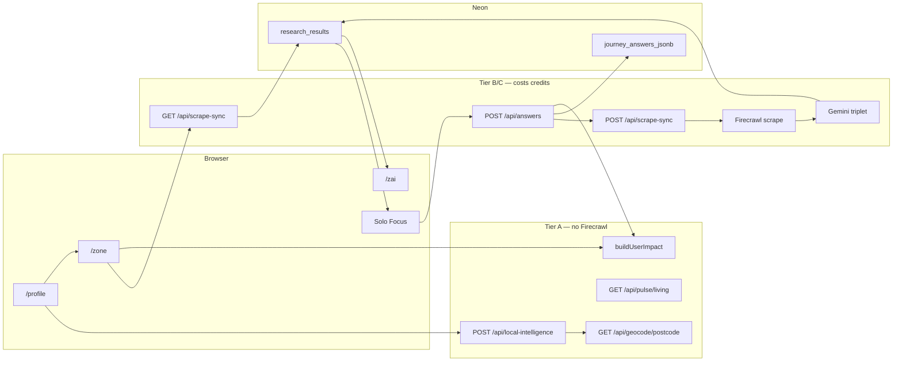

| Stage | Route / module | Reads | Writes | Premium? |
|-------|----------------|-------|--------|----------|
| Onboard | `/profile` → `POST /api/local-intelligence` | Postcodes.io, Carbon Intensity | session, localStorage | **No** |
| Locality label | `GET /api/geocode/postcode` | Nominatim (server proxy) | `profile_locality_name` | **No** |
| Zone load | `GET /api/scrape-sync?postcode=&user_id=` | `research_results`, coverage | client VM | **No** (read); repair may scrape |
| Answer loop | `POST /api/answers` | profile, answers | `journey_answers_jsonb`, impact, optional discovery | **Hybrid** — one category JIT when earned |
| Zone VM | `buildZoneViewModel` | impact + Neon + injections | bento cells | **No** |
| Solo Focus copy | `resolveExpandedTrueTipInsight` | `architect_prose`, impact | display only | **No** (uses cached Neon) |
| Zai chat | `POST /api/zai` | genome, `research_results` URLs/£ | transcript | **Gemini only** — **no Firecrawl** |
| Deep Dive scrape | `AskZaiDeepDiveSheet` → scrape-sync | same as JIT | optional row refresh | **Yes** — user-initiated only |
| Hermes cron | `GET /api/cron/zone-research?repair=1` | incomplete rows | backfill `research_results` | **Yes** — batch capped (`limit=`) |
| Sentinel | `POST /api/sentinel` | live grid + optional FC | tip rail only | **Optional FC** — not main copy path |

**Canonical discovery birth:** `POST /api/answers` → `injectNewDiscoveryCard` (not Zai, not cron). Supplemental: `/api/zone/injections`, `/api/research/question-card` (share injection cap).

**Code index:** `app/api/scrape-sync/route.ts` · `app/api/answers/route.ts` · `lib/agents/researchAgent.ts` · `lib/intelligence/researchProfilePayload.ts` · `lib/zone/buildZoneViewModel.ts` · `lib/brains/buildUserImpact.ts`.

---

## API registry & auth

### Identity & profile

| API | Method | Role | Auth |
|-----|--------|------|------|
| `/api/user` | POST/GET | Session user create/hydrate | cookie |
| `/api/auth/login`, `signup`, `logout` | — | Session auth | — |
| `/api/local-intelligence` | POST | Postcode → council, ward, carbon context | session / body |
| `/api/geocode/postcode` | GET | Nominatim proxy → locality name | public read |
| `/api/profile/mobile` | POST | Save mobile; send Today's Tips SMS | session (guest ok, no DB) |

### Twilio SMS (inbound webhook)

| API | Method | Role | Auth |
|-----|--------|------|------|
| `/api/webhooks/twilio` | POST | STOP / START / delivery status | Twilio signature (prod) |

**Env:** `TWILIO_*` + `NEXT_PUBLIC_APP_URL` on Vercel — see [DEPLOY-VERCEL.md](DEPLOY-VERCEL.md) §7 · [FULL-APP-SPEC.md](FULL-APP-SPEC.md) §6.2. User handsets are **not** env vars.

### Zone & research (credit-sensitive)

| API | Method | Role | Auth | Firecrawl? |
|-----|--------|------|------|------------|
| `/api/scrape-sync` | GET | Hydrate Zone; `?repair=1` backfill headlines | session, `user_id`, or Bearer | repair only |
| `/api/scrape-sync` | POST | Trigger category research | Bearer / session / postcode+`user_id` | **Yes** — one `journey_key` |
| `/api/scrape-sync` | GET `?force=true` | Broad multi-category run | Bearer | **Blocked** in bucket mode |
| `/api/answers` | POST | Save answer, impact, discovery race | session or `user_id` | optional JIT per category |
| `/api/answers` | GET | Hydrate journey answers | session | No |
| `/api/cron/zone-research` | GET/POST | Hermes batch repair | Bearer `CRON_SECRET` | repair batch |
| `/api/cron/repair-mechanical` | GET/POST | Incomplete row backfill | Bearer | capped |

### Supplemental (capped — not MC birth)

| API | Cap | Firecrawl? |
|-----|-----|------------|
| `/api/zone/injections` | 3/journey/user | optional |
| `/api/research/question-card` | 3/journey/user | optional |
| `/api/zone/tips-refresh` | manifest | optional |
| `/api/zone/content-architect` | batch polish | Gemini only |
| `/api/discovery/pulse` | tip patches | No |

### Chat & ops

| API | Role | Firecrawl? |
|-----|------|------------|
| `/api/zai` | Forensic mate chat | **No** |
| `/api/pulse/living` | Ofgem + grid proxy | No |
| `/api/summary` | Summary narrative | No |
| `/api/health` | DB ping; `?live=1` liveness | No |
| `/api/health/diagnostics` | neon/gemini/firecrawl booleans | No |

**CORS:** Browser must **not** call Ofgem or Nominatim directly — use `/api/pulse/living`, `/api/geocode/postcode`, `/api/scrape-sync`.

**Auth secrets:** `CRON_SECRET`, `SCRAPER_SECRET`, `GATEWAY_TOKEN` (≥16 chars) — see `lib/intelligence/scrapeSyncAuth.ts`.

---

## AI credit spend control (boundaries)

### Environment gates (`lib/intelligence/scrapeBoundaries.ts`)

| Variable | Effect |
|----------|--------|
| `MODEL_STRATEGY=bucket_failover` | Enables bucket mode — blocks broad scrape by default |
| `MAX_ITERATIONS=5` | Caps provider failover loops |
| `ALLOW_BROAD_SCRAPE=1` | Allows `?force=true` and full cron batch (audit only) |
| `SKIP_FIRECRAWL=1` | No Firecrawl HTTP — mechanical + Neon fallbacks |
| `FIRE_CRAWL_KEY_2` / `FIRECRAWL_API_KEY` | Required for any scrape (server-only) |
| `BUCKET_SKIP_GEMINI=1` / `GEMINI_FREE_TIER=1` | Skip Gemini in provider chain |
| `BUCKET_SKIP_DEEP_GEMINI=1` | Skip second-pass Gemini recovery |

**Verify bucket status (prod):**

```bash
curl -sS -H "Authorization: Bearer ${CRON_SECRET}" \
  'https://www.00-00.online/api/health/diagnostics' | jq '.bucket_failover'
```

Expect: `enabled: true`, `broadScrapeAllowed: false`, `skipDeepGemini: true`.

### ULM ceilings (`lib/zone/ulmLimits.ts`, `lib/intelligence/manifest.ts`)

| Ceiling | Value | Purpose |
|---------|-------|---------|
| `MAX_ZONE_BENTO_CELLS` | 24 | Bento wall cells (excl. hero) |
| `MAX_DISCOVERY_INJECTIONS_PER_JOURNEY` | 3 | Custom discovery rows per user/journey |
| `INITIAL_ROCK_SAVING_TIPS` | 6 | Rock rail cold start |
| `MAX_ROCK_SAVING_TIPS_RAIL` | 12 | Rock rail absolute max |
| JIT seed cap | **4 URLs** (surgical) / **8** (full) | `buildCategoryFirecrawlSeedUrls` |
| ZeroResearch batch | **8 URLs** max | `runZeroResearch` |
| Rebirth vault | **5 URLs** max per vault | `urlsForVault` |

### Scrape allowed / forbidden surfaces (`lib/zai/chatBoundaries.ts`)

| Allowed (may hit Firecrawl) | Forbidden (never scrape) |
|-----------------------------|---------------------------|
| `zone_answer_loop` — POST `/api/answers` | `zai_chat_turn` — POST `/api/zai` |
| `tip_verification_plus_one` | `zai_chat_continue_in_zai` |
| `ask_zai_deep_dive_search_deeper` | `zai_close_audit_complete` |
| `profile_postcode_step` | `visited_card_close` |
| `zone_hydration_get` — GET scrape-sync read/repair | broad `?force=true` in bucket mode |

### Guards that stop credit burn

| Guard | Module |
|-------|--------|
| One journey per scrape request (lane lock) | `validateSurgicalScrapeContext`, `topicShield` |
| Visited card → no re-scrape on re-open | `visitedCards.ts`, `researchSyncClient.ts` |
| Pink visited close → no inject / no loop | `patternShiftClose.ts` |
| Employed + affluent → skip grant-heavy URLs | `buildCategoryFirecrawlSeedUrls` (`skipGrantSeeds`) |
| Hermes weekly repair only — not daily broad pulse | `HERMES-VPS-SETUP` annex |
| Zai chat read-only — no web browse | `assertNoScrapeOnZaiChat` |

### Hybrid cost tiers (summary)

| Tier | Surface | Firecrawl | Gemini |
|------|---------|-----------|--------|
| **A** | Profile, geocode, pulse | No | No |
| **B** | Zone VM, collapsed bento | No | No |
| **B′** | Cached `research_results` display | Only if row empty | Only if row empty |
| **C** | Solo Focus answer → JIT spawn | **Yes** — surgical | **Yes** — triplet only |
| **D** | `/zai` chat | **No** | **Yes** — read-only context |

Full spec: annex [Hybrid data pipeline](#annex-hybrid-data-pipeline-cost-tiers).

---

## Scrape URL registry (Firecrawl seeds)

**Source of truth in code:** `lib/intelligence/researchProfilePayload.ts` (`JOURNEY_FIRECRAWL_SEEDS`), `lib/zone/trustedJourneyUrls.ts`, `lib/agents/researchAgent.ts` (`UK_2026_SEED_URLS`), `lib/agents/actionVaults.ts` (rebirth vault), `lib/agents/nineDomainResearchSeeds.ts` (Hermes grid).

### Trusted CTA fallback (one per journey — BUY/Claim handoff)

| Journey | URL |
|---------|-----|
| home | `https://www.energysavingtrust.org.uk/advice/reducing-home-heat-loss/` |
| utilities | `https://www.moneysavingexpert.com/cheapenergyclub/` |
| grants | `https://www.gov.uk/apply-boiler-upgrade-scheme` |
| solar | `https://mcscertified.com/find-an-installer/` |
| travel | `https://www.nationalrail.co.uk/tickets-railcards-and-offers/railcards/` |
| holidays | `https://www.eurostar.com/uk-en/deals` |
| food | `https://www.lovefoodhatewaste.com` |
| shopping | `https://wrap.org.uk/taking-action/food-waste` |
| money | `https://www.moneysavingexpert.com/banking/` |
| tech | `https://www.backmarket.co.uk` |
| water | `https://www.waterwise.org.uk/save-water/` |
| waste | `https://www.recyclenow.com` |
| carbon | `https://www.carbontrust.com/resources` |

Default if unknown: `https://www.gov.uk/`

### Per-journey Firecrawl seeds (`JOURNEY_FIRECRAWL_SEEDS`)

| Journey | HTTPS seeds (deduped; max 4 surgical / 8 full) |
|---------|--------------------------------------------------|
| **utilities** | moneysavingexpert.com/cheapenergyclub · ofgem.gov.uk/energy-advice-households/energy-price-cap · energysavingtrust.org.uk · (+ home_power: BUS or Octopus smart / EST electric heating) |
| **home** | gov.uk/apply-boiler-upgrade-scheme · energysavingtrust.org.uk · which.co.uk/money/saving-energy |
| **grants** | gov.uk/apply-boiler-upgrade-scheme · gov.uk/energy-company-obligation · energysavingtrust.org.uk/advice/grants-and-loans |
| **travel** | nationalrail.co.uk/railcards · thetrainline.com · gov.uk/guidance/rail-fares-and-season-tickets |
| **holidays** | eurostar.com/uk-en · visitbritain.com · thetrainline.com |
| **food** | lovefoodhatewaste.com · which.co.uk/reviews/food-and-drink |
| **money** | moneysavingexpert.com/banking · gov.uk/apply-warm-home-discount-scheme |
| **shopping** | which.co.uk/money/shopping |
| **tech** | backmarket.co.uk/en-gb |
| **waste** | gov.uk/recycling-collections |
| **water** | waterwise.org.uk |
| **solar** | gov.uk/government/publications/solar-energy-uk |
| **carbon** | ofgem.gov.uk |

**Always added per build:** `trustedUrlForJourney(journeyKey)`.

**Non-surgical only:** generic UK trio (Ofgem cap, BUS, EST) · `gov.uk/find-local-council/{postcode}` · council org slug from Postcodes.io.

**Employed + not low-income:** grant-heavy URLs stripped unless journey = `grants` (`GRANT_HEAVY_URL_MARKERS` in code).

### Employment-aware extra seeds

**Employed + not low-income:** EST solar/export pages · Octopus smart/agile/export · gov.uk cycle-to-work · MSE utilities · Which saving-energy.

**Unemployed or low-income:** warm-homes-local-grant · ECO4 · warm-home-discount · EST grants-and-loans · find-energy-grants-help-pay-bills.

### Broad / cron seeds (use sparingly — high credit)

**`UK_2026_SEED_URLS`** (`researchAgent.ts`): Ofgem cap · BUS · ECO4 · EST · Which saving-energy · MSE utilities · octopus.energy/blog · consumerreports.org/money/energy — batch max **8**.

**`NINE_DOMAIN_GRID_SEED_URLS`** (Hermes grid): Ofgem cap · MSE cheapenergyclub + utilities · gov.uk energy grants · improve-energy-efficiency · ECO4 · olioex · hiyacar · justpark · ccwater · gov.uk recycling · freight emissions guidance · EV tax exemption · MSE shopping.

### Rebirth vault URLs (discovery race — optional)

| Vault | Journeys | URLs (max 5) |
|-------|----------|--------------|
| **A** | home, carbon, waste | Ofgem cap · gov.uk improve-energy-efficiency · find-energy-grants · BUS · MSE cheapenergyclub · MSE utilities · EST |
| **B** | travel, holidays, tech | gov.uk EV tax exemption · hiyacar · liftshare · karshare · turo GB |
| **C** | food, shopping, money, default | olioex · toogoodtogo · ethicalconsumer · freegle · MSE shopping |

Module: `lib/agents/actionVaults.ts` · `lib/agents/rebirthVaultDiscovery.ts`.

### Dynamic locality (postcode-driven)

| Pattern | When |
|---------|------|
| `https://www.gov.uk/find-local-council/{POSTCODE}` | postcode ≥ 4 chars, non-surgical |
| `https://www.gov.uk/government/organisations/{councilSlug}` | council from Postcodes.io |
| User-context regions | only via `buildDynamicLocalitySeedUrls` — never hardcoded in UI |

### Offer URL guards

Pipeline: `research_results.offer_url` → `sanitizeZoneOfferUrl` (`lib/zone/offerUrlGuard.ts`) → CTA. Blocks bare gov.uk homepages, dead BUS paths, cross-category landings. Falls back to **TRUSTED_JOURNEY_URLS**.

---

## Journey questions (“the loop”)

- **Definitions:** `lib/journeys.ts` — **13 domains**, **3 questions each** (`JOURNEY_ORDER`). Profile leading question **`home_power`** (GAS / ELECTRIC / MIX / OTHER) seeds utilities + `home.energy_type`. Question labels are behavioural only — **no £/kg in copy**.
- **Next question:** `lib/zone/questionHandler.ts` — `getNextQuestion(journeyId, answers)` returns the first unanswered registry question.
- **Solo Focus UI:** `JourneyBentoCard.tsx` — **one** registry question per open (`getSoloFocusNextQuestion`); after MC answer → **RESULT**; after **close** → **`DiscoveryTakeover`** (one loop per journey). **Do not** `markCardVisited` on close — pink only in **`completeCleanBirth`** after loop + discovery birth.
- **Persist:** `POST /api/answers` — validates registry id → `journey_answers_jsonb` → `buildUserImpact` → optional `runLoopSpawnResearch` (JIT cap **4** via `answerFunnelRouter`).
- **Discovery birth (canonical):** `raceDiscoveryBirth` in response → client **`injectNewDiscoveryCard`** → nested tip under parent journey in **`buildGroovyGridItems`** (max **2** cells/category on wall, **3** injects/journey lifetime cap).
- **Supplemental only:** `POST /api/zone/injections` (trap), `POST /api/research/question-card` (Ask) — capped; not MC birth.
- **Hydrate:** `GET /api/answers` on boot — server wins over stale client cache.
- **Full question tables:** see annex [Profile, questions & mechanical truth](#annex-profile-journey-questions--mechanical-truth) and [Zai, Deep Dive & question registry](#annex-zai-deep-dive--question-registry).

---

## Mechanical truth (Zone £ / carbon)

| Layer | Behaviour |
|-------|-----------|
| **`uk2026Defaults`** | Shape only — not fake savings |
| **`buildUserImpact`** | Single source of £/kg (`lib/brains/buildUserImpact.ts`) |
| **`mechanicalTruth.ts`** | `journeyHasStreamData` — true only with Neon/scrape row |
| **`buildZoneViewModel`** | No stream → **COMPUTING — JOURNEY**, metrics **—** |
| **`GET /api/scrape-sync`** | Empty DB → `{ scraped: [], source: "pending" }` |

---

## Enforced loop & credit boundaries

| Area | Rule | Code |
|------|------|------|
| Discovery birth | **`POST /api/answers`** only (cap **3**/journey) | `injectNewDiscoveryCard`, `manifest.ts` |
| Supplemental | `/api/zone/injections`, `/api/research/question-card` | Capped, not MC birth |
| Bucket mode | `MODEL_STRATEGY=bucket_failover` blocks broad `?force=true` | `scrapeBoundaries.ts` |
| Hermes | Weekly **`repair-mechanical`** backfill — not daily broad scrape | `HERMES-VPS-SETUP` annex |
| Visited close | No loop / no inject burn | `patternShiftClose.ts`, `visitedCards.ts` |
| Zai chat | Read-only; no Firecrawl | `chatBoundaries.ts` |
| Deep Dive scrape | **Search deeper** only | `AskZaiDeepDiveSheet` |

**Ceilings:** `MAX_ZONE_BENTO_CELLS` = 24 · `MAX_DISCOVERY_INJECTIONS_PER_JOURNEY` = 3 · Rock rail 6→12 (`lib/zone/ulmLimits.ts`).

---

## Data & view model

Zone VM: **AppContext** + **localStorage**, journey answers, **`GET /api/scrape-sync`**, **`/api/local-intelligence`**, injections, content-architect. Badges: **`LIVE_AUDIT`** vs **`ESTIMATED_AUDIT`**. **Postcode:** `profile_postcode` in localStorage; validated client-side via **`lib/geocode/ukPostcode.ts`**; Zone refreshes on change. **Locality:** `GET /api/geocode/postcode` → `profile_locality_name` (outcode fallback while parish loads). **Truth ledger:** `/settings/truth` — `buildIntelligenceLedger` surfaces per-journey settled/computing/estimated status for diagnostics. **Gary mode:** BN17* or `zz_gary_mode=1` → shared research UUID (`lib/zone/garyMode.ts`) — **@fixture-only** for scripts.

Full scrape → copy → Solo Focus pipeline: annex [Zone content](#annex-zone-content-scrape--presentation).

---

## Neon hot path (what actually fills)

| Table | Role |
|-------|------|
| **`research_results`** | `agent_headline`, `architect_prose`, `offer_url`, `saving_amount_gbp`, `user_id`, postcode |
| **`journey_answers_jsonb`** | MC + loop answers |
| **`user_profiles`** | Profile mirror / Hermes audit |
| **`discovery_injections`** | Injected discovery rows |

**`insightReady`:** category has prose/headline/£/URL → hide “Computing…”. **`GET ?repair=1`:** backfill without full force run.

---

## Director's Order (Zone — frozen product sequence)

**Skeleton:** `lib/zone/directorsOrder.ts`, `visitedCards.ts`, `loopMemory.ts`, `loopQuestions.ts`. **Skin:** `lib/motion-family.ts` only — must not change sequence.

**Home cascade:** `/intro` → `/profile` → `/profile/summary` (ticker complete) → `/zone` (`ArchitecturalPulse` + **`pulseWordsComplete`** → bento ripple).

**Zone wall vertical stack (DOM — `app/zone/page.tsx`):**

| # | Section | `data-testid` |
|---|---------|---------------|
| 1 | Welcome (pulse words) | `zone-section-welcome` |
| 2 | Profile hero card | `zone-hero-wall` |
| 3 | Today's Tips heading + Rock rail | `zone-section-today-tips` |
| 4 | Recommendations heading + category bento | `zone-section-recommendations` |
| 5 | Mobile signup | `zone-section-signup` |

Section headings render in **`zone-rock-strip`** / **`zone-category-wall`** — never as flex children inside `groovy-zone-grid`. Visibility: **`wallSectionsReady`** (`pulseWordsComplete` + pulse `done` + `zoneInteractable` + no expanded card) and **`zoneRevealCount >= 1`**.

**Bento cell order:** `buildGroovyGridItems` — mothers sorted by goal-weighted £ then `JOURNEY_ORDER`; discovery `inject-*` tips nest after parent; max **2** cells/category, **24** total (`lib/zone/gridOrder.ts`, `perCategoryCardCap.ts`).

**Solo Focus contract:**

| Step | Behaviour |
|------|-----------|
| 1 | Profile hero crystallizes first; category mothers ripple in recommendations grid after section headings |
| 2 | Rock tip: grid = catalog title (`clampRockTipHeadline`); expand = **`headlineFromRockHabit`** + habit £/kg — **not** journey mother hook or Neon audit |
| 3 | Rock tip close = **`visitedClose`** (no loop, no tip verification scrape) |
| 4 | Mother: expand → close → **one** loop → answer → discovery child → **pink** (`completeCleanBirth` only) |
| 5 | Discovery inject child: close → pink immediately (no loop) |
| 6 | Revisit pink: expand → close → grid only (no `DiscoveryTakeover`) |

---

## Launch verification (senior gate — no drift)

```bash
npm run purge:disk    # optional
npm run verify
npm run build:clean
```

**Manual smoke:** profile + `home_power` → summary → zone pulse → one journey loop → pink → reopen (no second loop) → Rock tip expand (habit headline + catalog £/kg, not wall HOME hook) → Rock close (no loop).

**Motion did not change:** `lib/brains/*`, `buildZoneViewModel`, `POST /api/answers` race, question registry.

---

## Zai Active Auditor Persona (Brain Stomach & Logic)

- **12k/1t:** All suggestions grounded in measurable £ and CO₂e (`ULM_KWH_PER_TONNE_CO2E`).
- **Gemini:** Forensic mate — explains **why/how**, not card 3-beat prose. Label-free output. Bubbles: **`#FFD700`** on **`#1A1A1A`** text.
- **Firecrawl:** Postcode-scoped; chat route **does not** scrape. Deep Dive **Search deeper** + answer-loop triggers only.
- **Context:** `/api/zai` loads `research_results` URLs/£ — **not** `architect_prose`.

Full rules: annex [Zai, Deep Dive & question registry](#annex-zai-deep-dive--question-registry).

---

## Security

- Never commit `.env.local`; rotate exposed secrets; Vercel env for production.
- `GEMINI_API_KEY`, `DATABASE_URL`, `TWILIO_AUTH_TOKEN` — server-only (no `NEXT_PUBLIC_`).
- Twilio: only the **from** number (`TWILIO_PHONE_NUMBER`) belongs in Vercel — not user personal mobiles (Neon `users.mobile`).
- Sessions: httpOnly, secure in prod, sameSite lax.
- `npm run audit` for dependency patches.

<!-- SYNTHESIZED:END -->

---

## Annexes (full source docs)


---

## Annex: Guardrails & pipeline (canonical) {#annex-guardrails--pipeline-canonical}

*Source file: `GUARDRAILS-AND-PIPELINE.md`*


**Mission:** Every UK home gets a **postcode-first**, **mechanically true** audit — real £ and kg from profile + answers + Neon research, never demo leakage or fabricated savings.

This document ties together **rules**, **code gates**, **CI**, and **docs** so one workflow stays honest end-to-end.

---

#### 1. Three-layer guardrail stack

| Layer | What enforces it | When it runs |
| --- | --- | --- |
| **A — Agent rules** | `.cursor/rules/*.mdc` (always on in Cursor) | Every edit / agent session |
| **B — Code contracts** | `lib/zone/mechanicalTruth.ts`, `ulmLimits.ts`, `mechanicalTruthEval.ts`, `onboardingGuardrails.ts`, `offerUrlGuard.ts`, `contentProseSanitize.ts` | Runtime + unit eval |
| **C — CI / ship gate** | `npm run verify`, GitHub Actions Lint + Typecheck, `vercel-build-gate.mjs` | Every push / deploy |

**Rule of thumb:** If it must never break in prod, it lives in **B** or **C**. Docs and `.mdc` files explain and remind — they do not replace code gates.

##### A — Cursor rules (behavioural law for agents)

| File | Governs |
| --- | --- |
| `postcode-first-architect.mdc` | Dynamic postcode, 12k/1t truth, UI ceilings, deploy order |
| `zero-zero-prime-directive.mdc` | Motion DNA, intelligence loop, discovery birth path |
| `mechanical-pulse.mdc` | Typography, colour, geometry — no shadows |
| `zone-voice-copy.mdc` | Forensic Mate voice, banned phrases |
| `verify-deploy-gate.mdc` | `npm run verify` before commit/deploy |

Index: `.cursor/rules/README.md`

##### B — Code gates (canonical modules)

| Concern | Module |
| --- | --- |
| Empty DB → no fake £ | `lib/zone/mechanicalTruth.ts` |
| Rock / offer URL alignment | `lib/rock/resolveRockHabitLearnUrl.ts`, `mechanicalTruthEval.ts` |
| Grid / discovery ceilings | `lib/zone/ulmLimits.ts`, `perCategoryCardCap.ts` |
| £/kg engine (only source) | `lib/brains/buildUserImpact.ts`, `calculations.ts` |
| Profile → research payload | `lib/profile/buildResearchProfilePayload.ts`, `onboardingGuardrails.ts` |
| Goal / loop / sort | `lib/profile/goalWeighting.ts`, `profileGoalPreference.ts`, `loopQuestions.ts` |
| Scrape boundaries | `lib/intelligence/scrapeBoundaries.ts`, `answerFunnelRouter.ts` |
| Prose / headline quality | `contentProseSanitize.ts`, `soloFocusCopy.ts`, `researchGateAudit.ts` |
| Truth ledger audit | `lib/intelligence/buildIntelligenceLedger.ts` |
| LLM provider failover | `lib/intelligence/bucketFailover.ts`, `llmRateLimit.ts` |
| Malformed LLM JSON | `lib/agents/researchAgent.ts` (`sanitizeJsonEmbeddedNewlines`) |
| Content provenance flags | `research_results.is_mechanical_fallback`, `.is_headline_mechanical_fallback` (see §2) |
| Awin affiliate wrapping | `lib/monetization/awinAffiliateLink.ts` |
| Postcode → region | `lib/local/getLocalData.ts` (exact area-code table) |
| Per-category free-scrape seeds | `lib/intelligence/researchProfilePayload.ts` (`JOURNEY_FREE_SEEDS`, `JOURNEY_FIRECRAWL_SEEDS`) — same link-rot risk as `trustedJourneyUrls.ts`, see §1 note below |
| `research_results` read ordering (postcode vs user_id) | `app/api/scrape-sync/route.ts` (`buildScrapedFromResearchResults`) |

**Security (OWASP-aligned):** `SCRAPER_SECRET` authorizes scrape-sync POST only; `CRON_SECRET` is `/api/cron/*` only. Session restore requires HMAC `restore_proof` (no dev UUID bypass). Rate limits on scrape-sync GET (10/min anonymous), likes POST, restore-session. See `lib/security/productionSecrets.ts`.

**Re-auditing offer/learn URL liveness (`trustedJourneyUrls.ts`, `resolveRockHabitLearnUrl.ts`, `lib/brains/calculations.ts`, `lib/brains/recommendations.ts`, `habitsCatalog.ts`, `JOURNEY_FREE_SEEDS`/`JOURNEY_FIRECRAWL_SEEDS` in `researchProfilePayload.ts`):** these are hand-maintained hardcoded fallbacks, so they rot as partner sites restructure — worth a periodic sweep, not a one-off. `curl` is not sufficient: several UK retail/corporate sites (RAC, AA, Tesco, Sony, Royal Mail, Tesla, John Lewis, Levi's) run bot-detection that returns 403/404 to any automated non-browser request, live page or not — confirmed directly (`rac.co.uk/drive/advice/fuel-efficiency/` once returned curl 404 while rendering fine in a real browser). Verify with a real Chromium instance instead, and escalate before writing off a link as dead: try forcing HTTP/1.1 (some blocks are protocol-layer, not IP-based — John Lewis and Levi's help center both opened up this way), and when using `site:` search to find where content moved, scope it to the whole domain family including help/support subdomains, not just the apex domain (Levi's GB denim-care content lives on `levihelp.levi.com`, not `levi.com`). Only treat a result as a confirmed dead link when it renders the site's own branded 404 (e.g. "Page not found - GOV.UK") — a generic Akamai/Cloudflare "Access Denied" page means the check was blocked, not that the link is dead; don't guess a replacement in that case. **This isn't hypothetical**: `tech`'s three `JOURNEY_FREE_SEEDS` entries went dead (one genuine branded GOV.UK 404, two unresponsive) and were never caught until a live production trigger showed zero scraped markdown / empty citations for the category (2026-07) — confirmed via the app's own request/response, not curl, since `energysavingtrust.org.uk` 403s curl uniformly (root domain included) yet serves the app's real scraper fine elsewhere. When a category's fallback rate sits persistently high while others don't, check its seed URLs directly before assuming the LLM/provider layer is at fault.

##### C — Ship gate commands

```bash
npm run verify                  # typecheck + lint + mechanical-truth (14 checks)
npm run test:truth-ledger       # ledger gate mapping
npm run test:property-intelligence
npm run verify:logic            # policy savings + profile baseline
npm run db:test                 # Neon schema ping
npm run zone:audit-gates -- POSTCODE   # 13/13 journey settlement
npm run deploy                  # verify → Vercel prod → promote
```

Full UAT matrix: [APP-OVERVIEW-AND-TESTING.md](APP-OVERVIEW-AND-TESTING.md) §9.

---

#### 2. Data pipeline (every user, every home)

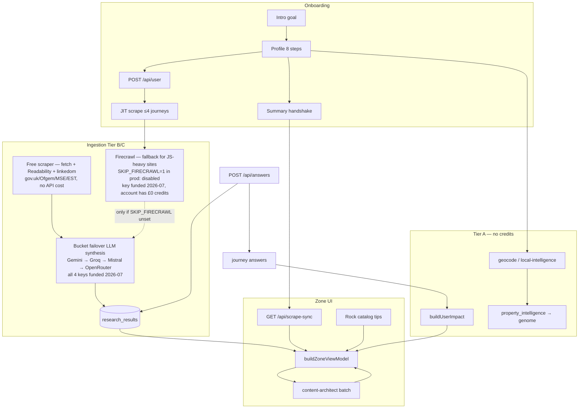

##### Intelligence triggers (when scrapes fire)

| Step | Trigger | Cap / module |
| --- | --- | --- |
| Profile submit | `triggerOnboardingResearchBootstrap` | 4 journeys — `onboardingResearchBootstrap.ts` |
| Summary exit | `runProfileResearchHandshake` | deduped gap-fill — `researchSyncClient.ts` |
| Zone cold start | `runProductionResearchRefresh` | prod bootstrap — `productionResearchBootstrap.ts` |
| MC answer | `runLoopSpawnResearch` | per answer — `loopSpawnResearch.ts` |
| Solo Focus +1 | `POST /api/scrape-sync` + `journey_key` | Topic Shield |
| Weekly repair | `GET /api/cron/zone-research` | Hermes — `CRON_SECRET` |
| ZeroAgent (per category) | `runZeroAgent` inside `runTriggerResearchForCategory` | free UK data APIs + tool calling — `lib/agents/zeroAgent.ts` |

**ZeroAgent provider order:** direct Gemini function calling (`GEMINI_API_KEY`, free tier) is primary; OpenRouter (`OPENROUTER_API_KEY`, model from `OPENROUTER_MODEL`) is the fallback, only tried when Gemini errors or is unconfigured. Both share the same tool declarations (`AGENT_TOOL_DECLARATIONS` in `agentTools.ts`) and finalize/citation logic. Runs regardless of `bucket_failover` — it calls free UK APIs, not paid Firecrawl. `GEMINI_AGENT_MODEL` in `zeroAgent.ts` now imports `FLASH_DEFAULT` from `geminiModels.ts` instead of its own hardcoded literal — see the model-name note below, this constant had the exact same staleness bug independently.

**Gemini/OpenRouter model ids go stale — use the `-latest` aliases, not dated ones (2026-07 incident):** `FLASH_DEFAULT` in `lib/intelligence/geminiModels.ts` used to hardcode `gemini-2.5-flash` / `gemini-2.0-flash-lite`. Google retires dated model ids for newer API-key projects ("this model is no longer available to new users") — a fresh `GEMINI_API_KEY` authenticated fine but every direct-API call 404'd, and `bucketFailover` fell through to Groq every time with zero indication Gemini was misconfigured rather than just unlucky. Now uses `gemini-flash-latest` / `gemini-flash-lite-latest`. Three other hardcoded `'gemini-2.5-flash'` duplicates existed outside this constant (`zeroAgent.ts`, `discoveryStructured.ts`, `mechanicalDiagnostics.ts`'s status display) and would have silently drifted from the fix — all now import `FLASH_DEFAULT`/`GEMINI_DIRECT_ZONE` instead of holding their own literal. Same failure mode hit OpenRouter independently: its `OPENROUTER_MODEL` env var pointed at a slug OpenRouter had deprecated for free-tier routing (`404 "unavailable for free"`), fixed by pointing it at the same confirmed-working `google/gemini-2.5-flash` (a real, working slug on OpenRouter specifically, unrelated to Google's own direct-API deprecation of the same string). **If a provider starts 404ing on model-not-found after working fine before, check the model id before assuming the key is bad.**

**Category headline word-count tiers** (`lib/soloFocusCopy.ts`): Today's Tips (Rock catalog) stay at 8–10 words (`MIN/MAX_ZONE_CARD_HEADLINE_WORDS`). Journey mother cards get 9–12 words (`MIN/MAX_JOURNEY_CARD_HEADLINE_WORDS`) — more room for the locality name + a figure without truncating mid-clause. Pass `{ min, max }` bounds explicitly to `clampZoneBentoHeadline`/`enforceHeadlineWordLimits` for journey-card call sites; omit for tips (keeps the tighter default). If you touch the LLM prompt's stated word target, keep it in sync with these constants — a prompt asking for fewer words than the validator's minimum accepts guarantees every real LLM headline gets rejected and replaced by the generic per-journey fallback (`ZONE_BENTO_HOOK`), silently killing locality-specific copy for that category. **This exact drift happened for real (2026-07):** the triplet-extraction prompt in `researchAgent.ts` told the LLM `agent_headline` should be "8 to 10 words" — copied from the *different*, correctly-scoped 8–10 tier that content-architect's `ZONE_CONTENT_ARCHITECT_VOICE` (`zoneVoice.ts`) legitimately uses for its own, narrower Zone-face polish pass — while the journey-card validator it actually feeds requires a 9-word minimum. Any LLM headline that correctly followed its own 8-word-minimum instruction was guaranteed rejected. Fixed to state "9 to 12 words"; `zoneVoice.ts`'s separate 8–10 instruction was left untouched since it's genuinely a different, correctly-matched tier — don't conflate the two when auditing this again.

Detail: [INTELLIGENCE-PIPELINE-FINAL.md](INTELLIGENCE-PIPELINE-FINAL.md)

##### Personalization inputs (all flow to scrape + VM)

| Input | Storage | Effect |
| --- | --- | --- |
| Postcode | `profile_postcode`, Neon | All scrapes, council, grid carbon, copy locality — region resolved via `getLocalData.ts`'s exact postcode-area lookup table (postcodes.io primary, OpenStreetMap then this table as emergency fallback only) |
| Goal | `profile_goal` | JIT pick, grid sort, loop rank, architect emphasis |
| Power type | `profile_home_power` | Utilities unlock + JIT |
| Employment + income | profile / genome | Affluence tone, grant deprioritisation |
| Property intelligence | `user_genome.property_intelligence` | EPC pre-fills, Truth Ledger register |
| Journey answers | `journey_*_answers` | £/kg calculators, supplemental scrape |
| Likes / nope | `offer_signals` | Grid weights, scrape avoid hints |
| Home type / transport / power | `RockHabit.applicable` gate | Today's Tips catalog filter — `lib/zone/filterRockHabits.ts`; soft gate, missing profile fields never exclude a tip |

Detail: [PROFILE-FIELDS-GRID-UNLOCKS.md](PROFILE-FIELDS-GRID-UNLOCKS.md)

**Never clobber local with empty server data.** Any code that rehydrates client state from a server snapshot (`sessionRehydrateApply.ts`, `SessionStateRehydrate`, similar sync-on-mount patterns) must only overwrite a local field when the server value is genuinely non-empty. A stale or not-yet-persisted server session read racing ahead of a fire-and-forget `POST` can return blank fields; a `!= null` check lets an empty string through and wipes data the user just entered. This exact bug caused a full onboarding-completion loop in production (fixed 2026-07 — bounced users back to the postcode question right after they finished). Same principle for any "fill gaps, don't overwrite" merge.

##### Profile object identity (AppContext)

`AppContext`'s `profile` and `journeyAnswers` state must keep the previous object reference when the underlying values haven't changed (`refreshProfile` and the `UNIFIED_PROFILE_MEMORY_EVENT` listener both shallow-compare before calling `setProfile`/`setJourneyAnswers`). Effects across the app (Zone's view-model builder, content-architect batching) key off these objects **by reference**, not deep equality — a fresh object on every refresh cascades into redundant re-fetches everywhere a `profile`/`journeyAnswers` dependency exists, even when nothing actually changed. This caused `/api/pulse/living` to fire dozens of times back-to-back for one postcode (2026-07), starving the DB/CPU badly enough that only 1 of 13 research categories ever completed for affected users. If you add a new effect keyed on `state.profile` or `state.journeyAnswers`, either trust the identity stability (do nothing) or add your own dedupe guard for the expensive part specifically — don't assume the effect re-firing is free.

##### Mechanical truth (never fake)

| State | Wall behaviour |
| --- | --- |
| No Neon stream + no baseline | `COMPUTING — JOURNEY`, metrics `—` |
| Profile baseline only | Estimated £/kg, **ESTIMATED_AUDIT** |
| Neon stream valid | Live £, headline, prose — **LIVE_AUDIT** |
| Always | Both £ and carbon stamped when numbers exist |

**`is_mechanical_fallback` (added 2026-07):** `research_results` boolean, `false` when the row's £ figure came from real LLM triplet extraction, `true` when the £ fell through to the shared per-category mechanical template (fixed number, same for every user at fallback). `app/api/scrape-sync/route.ts`'s `RESEARCH_COVERAGE_SELECT` reads it and zeroes `sav`/`carbon` on fallback rows so a template row can never masquerade as a real saving; when a postcode has both a genuine and a fallback row for the same journey, the genuine one always wins regardless of £ size. Replaces the old `verified` column, which was a `GENERATED ALWAYS` column that was always `true` and carried no real signal.

**`is_headline_mechanical_fallback` (added 2026-07) — deliberately a separate column, not folded into the one above:** tracks whether the *headline* specifically came from the mechanical template, independent of the £ figure. A row can have a 100% genuine, LLM-computed £ and prose but a too-short headline that gets swapped for the generic per-category template text (two independent code paths do this swap: `mechanicalCategoryTripletFallback`'s own headline output, and `clampZoneBentoHeadline` separately collapsing to `ZONE_BENTO_HOOK` on quality grounds) — before this column existed, that row still reported `is_mechanical_fallback = false` ("real"), which was misleading. **Do not fold this into `is_mechanical_fallback`**: `buildScrapedFromResearchResults` zeroes `sav`/`carbon` whenever `is_mechanical_fallback` is true, so broadening that flag to also cover headline-only templating would wrongly hide a genuine, already-settled £ figure. A row is only fully bespoke when *both* flags are `false`.

**`repairResearchResultsMissingHeadlines` field-clobbering bug (fixed 2026-07):** its repair UPDATE selects rows missing *any one* of headline/prose/£ (the WHERE clause is an OR of five independent conditions), but used to overwrite *all three* fields unconditionally whenever it ran — a row selected only because its headline was too short had its genuine £ and prose silently destroyed and replaced with the generic template's numbers too. Traced to `saving_amount_gbp = COALESCE($4::numeric, saving_amount_gbp)`: since `$4` (the template value) is never null, COALESCE always picked it regardless of whether the existing figure was already genuine — the argument order was backwards. Rewrote as per-field `CASE` expressions so each of headline/prose/£ only takes the template value when *that specific field* was the actual reason the row was selected.

**LLM triplet-JSON parsing (fixed 2026-07):** small/fast bucket models (Groq's `llama-3.1-8b-instant` in particular) emit syntactically-plausible JSON with unescaped literal newlines inside long string fields — spec-invalid, `JSON.parse` throws, and the extraction silently fell through to the mechanical template for every user regardless of profile. `sanitizeJsonEmbeddedNewlines` in `researchAgent.ts` escapes raw `\n`/`\r` only inside quoted-string spans before parsing. If genuinely-different users start seeing near-identical Zone cards again, check `is_mechanical_fallback` **and** `is_headline_mechanical_fallback` on the relevant rows first — that's the fast diagnostic.

**LLM cooldown gate — all, not any:** `isLlmRateLimited(providers)` (`lib/intelligence/llmRateLimit.ts`) must require every listed provider to be cooling down before skipping synthesis, not just one. It used to check `isAnyProviderCoolingDown`, so a single permanently-invalid key (e.g. an expired Gemini key stuck on cooldown) blocked triplet extraction for every user forever even though Groq/Mistral were healthy. `generateWithBucketFailover` already skips a cooling-down provider and tries the next internally — this gate only exists to short-circuit when truly nothing is left to try.

**Mechanical-only mode is one env var away, and used to be silent (fixed 2026-07):** `shouldPreferMechanicalTripletInBucket()` (`scrapeBoundaries.ts`), gated by `ALLOW_LLM_TRIPLET`, short-circuits `researchAgent.ts` straight to the mechanical template with zero LLM attempt whenever it returns true — not rate-limited, not failed, never tried. It's currently set correctly, but nothing logged when it fired, so a silent removal of that env var would have looked identical to "LLM synthesis stopped working" with no trace pointing at the actual cause. Now warns explicitly (`[researchAgent] mechanical-only mode active...`) when it triggers, distinguished from the separate rate-limited short-circuit it used to share a branch with.

**Stale-postcode rows can outrank current research (fixed 2026-07):** `buildScrapedFromResearchResults`'s coverage query matches `rr.user_id = $1 OR postcode matches` for logged-in users, then dedupes per category by `created_at DESC` — meaning a user's own older row for a *different* postcode (house move, typo fix, re-onboarding) could outrank a correct, current-postcode row simply by being more recent. Fixed with a `CASE WHEN postcode matches THEN 0 ELSE 1 END` tiebreaker ahead of `created_at` in the `ORDER BY`, so a postcode-matching row always wins regardless of age.

---

#### 3. Surface checklist (is it ready?)

| Surface | Ready when |
| --- | --- |
| **Onboarding** | Completeness gate → summary → zone; `POST /api/user` session |
| **Zone cards** | 13 journeys from VM; scrape-sync coverage or COMPUTING |
| **Today's Tips** | Rock catalog + topic-safe journey URL merge |
| **Solo Focus** | Card-scoped context; loop after close; discovery via `/api/answers` |
| **Mobile signup** | `POST /api/profile/mobile` + Twilio env in Vercel |
| **Settings** | Engine waste totals, focus switch, headline preview tiles |
| **Truth Ledger** | `/api/intelligence/ledger` + unified grid UI |
| **Likes** | Snapshots + `/likes` |
| **Zai / Ask** | Genome context; read-only chat; card context in Solo Focus |

##### Likes correctness (fixed 2026-07)

Two related bugs, both root-caused to the same place: how a liked card's identity/journey gets resolved.

- **`/likes` silently dropped likes on cards outside the fixed journey/tip set.** `app/likes/page.tsx`'s `likedCards` filtered liked ids against `viewModel.journeys` (13 fixed journey cards) and `viewModel.tips` (the rotating, capped Today's Tips rail) membership — any card liked via a Rock-merged recommendation tile or a morph/discovery card (ids like `rock-xxx`, `morph-xxx`) never matches either list, so the like was correctly recorded server-side and in the local snapshot (`readLikeCardSnapshot`) but silently excluded from display, showing "no likes" with confirmed likes on the account. Fixed by making the snapshot (saved at like-time with full display data) the primary render source, falling back to viewModel lookup only when no snapshot exists.
- **Liking a non-standard card mislabeled its own journey.** `trackZoneLike` (`app/zone/page.tsx`) derived `journey_key` by searching `viewModel.tips`/`viewModel.journeys` for the card id and defaulted to `'home'` when that search missed — which it always does for the same `rock-xxx`/`morph-xxx` ids above. This mislabeled the like's category and, on `/likes`, drove the wrong text/background colour pairing (`'home'` maps to a yellow-branded card, so a mislabeled card could render near-invisible dark-on-dark text). `JourneyBentoCard`/`SoloFocusOverlay` already resolve the correct journey for whatever card is on screen (`activeJourneyId`/`loopJourneyKey`) for their own `recordOfferSignal` calls — `onLike` now threads that same value through as an explicit 4th argument, and `trackZoneLike` prefers it over its own lookup.

##### Zone hero hydration mismatch (fixed 2026-07)

`zoneWelcome` (time-of-day greeting + name) and the Today's Tips heading both computed real text unconditionally during render — but the greeting depends on `new Date()` (server clock vs. browser clock can disagree by timezone, or just drift across a boundary hour) and the name depends on `localStorage` (never available server-side, SSR always saw the "Guest." fallback). Server and the client's first hydration pass produced different text on every full page load — a reliable React error #418. Fixed by gating both behind the existing `hydrated` flag (already used elsewhere for exactly this SSR-safety purpose, flips true in a `useEffect` post-mount) so server and the client's pre-hydration pass render the same deterministic empty placeholder (`ZONE_WELCOME_SSR_SAFE_EMPTY`), then swap to the real values in a normal post-mount update — not a hydration mismatch.

##### Monetization (Awin)

`wrapWithAwinAffiliateLink` (`lib/monetization/awinAffiliateLink.ts`) wraps an already-resolved, already-guarded destination URL at click time — three call sites: `IndustrialHandoffButton` (`app/components/ui/Buttons.tsx`), `openOfferUrlInNewTab` (`lib/zone/tier2RecursiveSpawner.ts`), `openZoneExternalHandoff` (`lib/zone/zoneHandoff.ts`). It is a no-op (returns the URL unchanged) unless **both** `NEXT_PUBLIC_AWIN_PUBLISHER_ID` is set **and** the destination host has an entry in `AWIN_MERCHANT_IDS`. As of 2026-07: `backmarket.co.uk` (25205) and `podpoint.com` (73493) are live single-programme hosts; `moneysupermarket.com` runs two programmes on one host (Energy 22713, Money 61791) — `AWIN_MERCHANT_IDS` supports this via a journey-keyed object instead of a plain mid string for multi-programme hosts, and `wrapWithAwinAffiliateLink`/`awinMerchantIdForUrl` take an explicit `journeyKey` param (threaded from the same `activeJourneyId`/`loopJourneyKey` source as the Likes fix above) to disambiguate — a journey with no entry for a multi-programme host resolves to no mid, never guesses the wrong programme. Nine more merchants are pending Awin approval (BT Broadband, Railcard, Rail Discoveries, Project Solar UK, Phones Direct, AO Mobile Phones Direct, Insulation & More, Clove Recycling, EV King) — commented placeholders only, no domain/mid guessed. Add a host → `awinmid` entry (or journey-keyed object for a multi-programme host) as each program is approved; do not guess an ID.

---

#### 4. Doc hierarchy (what to edit, what to purge)

##### Edit these first (satellites)

| Priority | File | Topic |
| --- | --- | --- |
| 1 | **This file** | Guardrails + pipeline map |
| 2 | [INTELLIGENCE-PIPELINE-FINAL.md](INTELLIGENCE-PIPELINE-FINAL.md) | Trigger matrix + read path |
| 3 | [PROFILE-FIELDS-GRID-UNLOCKS.md](PROFILE-FIELDS-GRID-UNLOCKS.md) | Field → JIT → grid |
| 4 | [APP-OVERVIEW-AND-TESTING.md](APP-OVERVIEW-AND-TESTING.md) | Content sources + UAT |
| 5 | [ULM-APPLICATION-LOOP.md](ULM-APPLICATION-LOOP.md) | Ceilings, discovery caps |
| 6 | [ZONE-CONTENT-AND-DATA.md](ZONE-CONTENT-AND-DATA.md) | Copy, scrape, Solo Focus |
| 7 | [DEV-TEST-AUDIT.md](DEV-TEST-AUDIT.md) | Local smoke + deploy runbook |

##### Ops / infra (edit when deploying)

| File | Topic |
| --- | --- |
| [DEPLOY-VERCEL.md](DEPLOY-VERCEL.md) | CI flakes, promote |
| [HERMES-VPS-SETUP.md](HERMES-VPS-SETUP.md) | Vercel Cron (retired Oracle VPS runbook) |
| [HERMES-ULM-JIT-BRIEF.md](HERMES-ULM-JIT-BRIEF.md) | JIT vs repair |

##### Reference only (rarely edit)

| File | Topic |
| --- | --- |
| [PUBLIC-UK-APIS.md](PUBLIC-UK-APIS.md) | Free UK APIs |
| [MOTION-FAMILY.md](MOTION-FAMILY.md) | Motion DNA |
| [SECURITY-AUDIT.md](SECURITY-AUDIT.md) | Security notes |

##### Removed (purged Jun 2026)

`APP-FLOW-AND-PIPELINE.md`, `INTELLIGENCE-LOOP-MANIFEST.md`, `PRODUCT-ARCHITECTURE-SPEC.md` — content lives in this file, [USER-FLOW-AND-DATA-PIPELINE.md](USER-FLOW-AND-DATA-PIPELINE.md), [INTELLIGENCE-PIPELINE-FINAL.md](INTELLIGENCE-PIPELINE-FINAL.md), and [FULL-APP-SPEC.md](FULL-APP-SPEC.md).

##### Generated / audit mirror

| File | Regenerate |
| --- | --- |
| [HANDBOOK.md](HANDBOOK.md) | `python3 scripts/consolidate-handbook.py` after satellite edits |

---

#### 5. Maintenance workflow

1. **Behaviour change** → edit code gate in `lib/` first.
2. **Document** → update the matching satellite (table §4), not HANDBOOK directly.
3. **Regenerate** → `python3 scripts/consolidate-handbook.py`.
4. **Verify** → `npm run verify` + relevant `test:*` scripts.
5. **Audit postcode** → `npm run zone:audit-gates -- POSTCODE`.
6. **Ship** → `npm run deploy`.

**Never:** hardcode a demo postcode in `app/` or `lib/`. Fixtures only in `scripts/` labelled `@fixture-only`.

---

*Last consolidated: Jul 2026 — aligns with `.cursor/rules/` and production gate at `776637f`.*

---

## Annex: Intelligence pipeline (trigger matrix) {#annex-intelligence-pipeline-trigger-matrix}

*Source file: `INTELLIGENCE-PIPELINE-FINAL.md`*


Vercel Cron (formerly Hermes on an Oracle VPS, retired 2026-07-07 — see FULL-APP-SPEC.md §11) sits at the repair layer; the **browser onboarding path** below is what new users hit on first run.

**Ingestion (2026-07):** the free scraper (`lib/agents/freeScraper.ts` — plain `fetch` + Readability + linkedom, no API cost) is primary for the static gov.uk/Ofgem/MoneySavingExpert/EnergySavingTrust sources that make up most seed URLs. Firecrawl is the fallback for whatever it can't reach — its key is funded as of 2026-07 (`FIRE_CRAWL_KEY_3`), but the account currently has £0 credits (confirmed via a live API call: key authenticates, request fails on "Insufficient credits"), and `SKIP_FIRECRAWL=1` is separately still set in production, so Firecrawl calls remain disabled either way — the free scraper is effectively the sole ingestion path live. Per-category free-scraper seed URLs live in `JOURNEY_FREE_SEEDS` (`lib/intelligence/researchProfilePayload.ts`) and rot the same way `trustedJourneyUrls.ts` does — see the "Re-auditing offer/learn URL liveness" note in GUARDRAILS-AND-PIPELINE.md §1 for the verification method and a real 2026-07 incident (tech's 3 seeds all went dead, confirmed via zero scraped markdown on a live trigger, not curl).

LLM synthesis of scraped markdown into the £/kg/prose triplet runs through **bucket failover** (`lib/intelligence/bucketFailover.ts`): Gemini → Groq → Mistral → OpenRouter. As of 2026-07 all four provider keys are funded and configured — `GEMINI_API_KEY`, `GROQ_API_KEY`, `MISTRAL_API_KEY`, `OPENROUTER_API_KEY` — so OpenRouter is a genuine 4th tier now, not dormant. See GUARDRAILS-AND-PIPELINE.md §2 for the model-id staleness incident (`FLASH_DEFAULT` / `OPENROUTER_MODEL` both pointed at dated/deprecated model slugs that 404'd despite valid keys) — if a provider starts failing with a model-not-found error after previously working, check the model id before assuming the key regressed.

#### 1. Profile complete (`ProfilePageClient.submitProfile`)

1. Persist profile to `localStorage` + unified memory.
2. **`POST /api/user`** — Neon row, session cookie, `restore_proof`.
3. **`triggerOnboardingResearchBootstrap`** — up to **4** surgical JIT scrapes (`ONBOARDING_JIT_CAP`):
   - Always: `home`
   - When power type set: `utilities`
   - Goal-aligned (+2): see `lib/zone/onboardingResearchBootstrap.ts`
4. Prefetch locality (≤2.6s) → navigate to `/profile/summary`.

Profile payload for Firecrawl/Gemini: `buildResearchProfilePayload()` — postcode, house number, home type, power, transport, household, employment, goal, **`age_group`**.

**Per-field grid unlock table:** [PROFILE-FIELDS-GRID-UNLOCKS.md](PROFILE-FIELDS-GRID-UNLOCKS.md).

#### 2. Summary exit (`/profile/summary` phase `exit`)

`runProfileResearchHandshake()`:

| Call | Purpose |
| --- | --- |
| `GET /api/scrape-sync?postcode=` | Coverage + mechanical defaults |
| `POST /api/zone/tips-refresh` | Tip rail refresh (when AI route not blocked) |
| `triggerOnboardingResearchBootstrap` (deduped) | Fills any journeys not already fired at profile submit |

Session dedupe key: `sessionStorage.zz_onboarding_jit_journeys`.

#### 3. Zone wall (`/zone`)

- View model from profile + journey answers + Neon `research_results`.
- Pink lock: visited cards do not re-trigger scrape.
- Loop questions → `POST /api/answers` → discovery birth (canonical MC path).

#### 4. Solo Focus — earned scrape

| Trigger | API |
| --- | --- |
| Tip +1 / deep scrape | `POST /api/scrape-sync` with **`journey_key`** (Topic Shield) |
| Tier-2 answer pivot | `GET /api/scrape-sync?tier2=…` |
| Trap follow-up (capped) | `POST /api/zone/injections` |
| Free-form Ask card (capped) | `POST /api/research/question-card` |

All JIT POST bodies must include `journey_key` (or `category` resolved to one).

#### 5. Hermes repair (scheduled)

| Job | Schedule | Route |
| --- | --- | --- |
| Zone research pulse | Weekly Mon 05:00 UTC | `GET/POST /api/cron/zone-research` |
| Mechanical repair | Hermes script | `GET/POST /api/cron/repair-mechanical` |

Local verify: `npm run hermes:ping`, `npm run hermes:repair-pulse` (requires `CRON_SECRET`).

#### Free-tier filters (refined curation)

- **Topic Shield** — one journey domain per Firecrawl pass (`resolveSurgicalJourneyKey`).
- **Employment / income** — seed URLs via `buildEmploymentAwareResearchSeeds` (grants vs agile tariffs).
- **Goal** — onboarding journey pick + Zone tip sort (`goalSortWeights`).
- **House number + postcode** — EPC address match in local-intelligence + research context.
- **ULM caps** — 24 bento cells, 3 discovery injects/journey (`lib/zone/ulmLimits.ts`).

#### Key modules

| Module | Role |
| --- | --- |
| `lib/profile/buildResearchProfilePayload.ts` | Shared profile → research context |
| `lib/zone/onboardingResearchBootstrap.ts` | Goal → onboarding journey list |
| `lib/researchSyncClient.ts` | Browser triggers + handshake |
| `lib/agents/researchAgent.ts` | Firecrawl + Gemini synthesis |
| `app/api/scrape-sync/route.ts` | JIT gate + session profile merge |

#### 6. Content retrieval (read path)

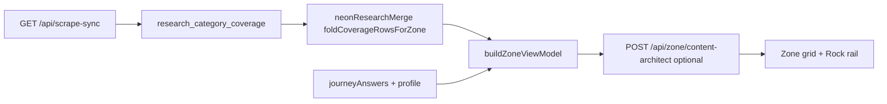

| Step | What happens |
| --- | --- |
| Zone mount | `GET /api/scrape-sync?postcode=` + optional `user_id` |
| Coverage fold | `bills`→`money`, `general`→`home` aliases |
| VM build | `buildUserImpact` + Neon overlay + goal/employment filters |
| Architect batch | Polishes headlines; seeds trusted URL if Neon deep link missing |
| Rock rail | `prepareRockHabitsForRail` → `mergeRockHabitWithJourneyOffer` → `habitToTipCard` |

**Honest empty:** `source: "pending"`, `scraped: []` — tiles show **COMPUTING**, not fabricated £.

#### 7. Offer URL precedence

| Surface | Order |
| --- | --- |
| Journey mother CTA | Neon `offer_url` → formula URL → `trustedUrlForJourney` → `/zai` audit |
| Rock habit learn | Topic-safe `learn_url` → `ROCK_SLUG_OFFER_URLS` → provider map → journey trusted |
| SMS tips | `resolveRockHabitLearnUrl` per habit (topic shield blocks journey bleed) |
| SMS recommendations | `resolveJourneyCardUrl` from journey VM rows |

#### 8. Mobile SMS pipeline

| Step | Module |
| --- | --- |
| Opt-in + save | `POST /api/profile/mobile` (`sms_opt_in: true` required) |
| Welcome | `sendMobileWelcomeSms` |
| Tips + recs | `sendSignupZoneSms` ← `zoneSignupTips`, `zoneSignupRecommendations` from Zone |
| STOP/START | `POST /api/webhooks/twilio` |

#### 9. Neon wake

`NeonWakePing` → `GET /api/health` on load, focus, and tab visibility — scales idle compute before DB routes.

---

## Annex: Profile fields → grid unlocks {#annex-profile-fields-grid-unlocks}

*Source file: `PROFILE-FIELDS-GRID-UNLOCKS.md`*


Maps each onboarding answer to **what activates** in the intelligence loop and **what moves** on the Zone wall. Applies to every signed-in user who completes profile + summary (canonical path).

Cross-links: [INTELLIGENCE-PIPELINE-FINAL.md](INTELLIGENCE-PIPELINE-FINAL.md), [PROFILE-ANSWERS-ZONE-TECH.md](PROFILE-ANSWERS-ZONE-TECH.md), [ZONE-CONTENT-AND-DATA.md](ZONE-CONTENT-AND-DATA.md).

---

#### Universal sequence (every user)

| Phase | Trigger | What runs |
| --- | --- | --- |
| **0 — Connect** | Any page load | `NeonWakePing` → `GET /api/health` wakes Neon compute |
| **1 — Profile submit** | Last profile step + goal | `POST /api/user` (session) → `triggerOnboardingResearchBootstrap` (≤4 JIT scrapes) |
| **2 — Summary exit** | Ticker completes → exit phase | `runProfileResearchHandshake` — coverage GET, tips refresh, deduped JIT fill |
| **3 — Zone load** | `/zone` | `GET /api/scrape-sync?postcode=` → `buildZoneViewModel` → 13 tiles + Rock rail |
| **4 — Earned depth** | Solo Focus Tip +1, MC answers | `POST /api/scrape-sync` / `POST /api/answers` → discovery birth (capped) |
| **5 — Repair** | Weekly Hermes | `GET /api/cron/zone-research` refreshes stale rows |

**Requirement:** profile must finish with a valid postcode (≥4 chars) and **`POST /api/user`** must succeed (session cookie). Without session, scrapes persist anonymously and mobile SMS is blocked.

**Goal** is set on intro (`profile_goal` in localStorage) or profile; it is required for `isProfileOnboardingComplete`.

---

#### Profile field matrix

| Field | Question / source | Storage key | Neon / genome | Onboarding JIT | Zone grid & curation |
| --- | --- | --- | --- | --- | --- |
| **Name** | `name` | `profile_name` | `users.name` | — | Summary ticker; Rock mobile SMS greeting |
| **Postcode** | `postcode` | `profile_postcode` | `users.postcode` | **Anchor for all scrapes** | Hero locality; council/region via geocode; scrape-sync scope |
| **House number** | optional on postcode step | `profile_house_number` | `user_genome.house_number` | EPC address match in research context | Home/grants precision; OpenEPC row match |
| **Household** | who do you live with? | `profile_household` | `user_genome.household` | Research seed context | Impact baselines; affluence auditor tone |
| **Home type** | flat / house | `profile_home_type` | `user_genome.home_type` | `home` journey seeds | Home tile baseline; insulation/EPC framing |
| **Power type** | gas / electric / mix / other | `profile_home_power` | `user_genome.home_power` | Adds **`utilities`** to onboarding JIT list | **Unlocks UTILITIES tile** (13th card); Agile/Octopus + tariff lane |
| **Transport** | walk / bike / public / car / mix | `profile_transport` | `user_genome.transport_baseline` | `travel` priority when goal-aligned | Travel tile sort; commute impact |
| **Age** | junior / mid / retired | `profile_age` | `users.age_group` | `age_group` in `buildResearchProfilePayload` → Gemini persona | `personaBoost` tip sort (JUNIOR→tech, RETIRED→home) |
| **Employment** | employed / self-employed / not in work | `profile_employment_status` | `user_genome.employment_status` | **`buildEmploymentAwareResearchSeeds`** — grants vs agile tariffs | Grants **title** rewrite; **filters means-tested tips** off Rock rail for employed users |
| **Goal** | intro: save money / reduce carbon / both | `profile_goal` | `users.primary_goal` | Picks **+2 goal-aligned JIT journeys** (see below) | **`goalSortWeights`** — hero tile order; tip rail ranking |

Payload assembly: `buildResearchProfilePayload()` / `buildResearchProfileFromStorage()` → every Firecrawl + Gemini pass (`postcode`, `house_number`, `home_type`, `home_power`, `transport_baseline`, `household`, `employment_status`, `goal`, `age_group`).

---

#### Journey MC questions → Zone influence (39 total)

Source: `lib/journeys.ts` · £/kg: `lib/brains/calculations.ts` via `buildUserImpact`. Every valid **`POST /api/answers`** also triggers `runLoopSpawnResearch` and can birth discovery cards.

| Domain | Strong £ / headline influence | Weak or scrape-only |
| --- | --- | --- |
| **home** | Legacy keys `electricity_provider`, `gas_provider`, `green_tariff` if present | `property_type`, `insulation_level`, `glazing_type` — synthetic baselines only; `calculateHome` ignores fabric trio |
| **utilities** | `tariff_type` → April 2026 policy savings | `supplier_switch`, `monthly_energy_band` — not mapped to `monthly_cost` |
| **grants** | `boiler_age`, `income_benefits`, `prior_eco_bus`; OVER_10YR → hybrid scrape | — |
| **solar** | `roof_orientation`, `roof_shading`, `daytime_occupancy` | — |
| **travel** | `commute_distance`, `ev_hybrid` | `public_transport` — not in `calculateTravel`; VM titles read `fuel_type` not `ev_hybrid` |
| **holidays** | `annual_flights`, `flight_duration`, `carbon_offsets` | — |
| **food** | `diet_profile`, `organic_shopping` | `own_produce` — unmapped |
| **shopping** | `retail_channel`, `repair_mindset`, `online_deliveries` | — |
| **money** | `monthly_energy_bill`, `tariff_type`, `green_investments` | — |
| **tech** | `smart_thermostat`, `smart_home`, `smart_meter` | — |
| **water** | `garden_butt`, `wash_preference`, `rainwater_harvest` | — |
| **waste** | `food_waste_collection`, `composting`, `soft_plastics` | — |
| **carbon** | `footprint_awareness`, `carbon_removal`, `tonne_reduction_timeline` | — |

**Indirect (all MC answers):** `getGenomeModifier` +0.08 per answered Q on wall formula; discovery inject into tip slots; supplemental scrape at journey 3/3 complete.

---

#### Goal → onboarding JIT journeys (cap 4)

Always **`home`**. If power type set → **`utilities`**. Then goal fills remaining slots:

| Goal | Priority order (first unsettled wins) |
| --- | --- |
| **money** | grants → money → shopping → travel |
| **carbon** | carbon → solar → travel → food |
| **balanced** | grants → travel → food → money |

Examples:

- Money + electric home → `home`, `utilities`, `grants`, `money`
- Carbon + gas home → `home`, `utilities`, `carbon`, `solar`
- Balanced + no power yet → `home`, `grants`, `travel`, `food` (utilities skipped until power answered)

Dedupe: `sessionStorage.zz_onboarding_jit_journeys` — profile submit + summary handshake do not double-fire.

---

#### What each profile field does *not* do

- **No field fabricates £ on the wall** without Neon stream data (`journeyHasStreamData`).
- **Onboarding JIT does not scrape all 13 journeys** — remaining domains are **earned** in Solo Focus (Tip +1) or Hermes repair.
- **Journey MC answers** (3× per domain in Solo Focus) refine impact and birth discovery cards; they are separate from profile fields (see [PROFILE-ANSWERS-ZONE-TECH.md](PROFILE-ANSWERS-ZONE-TECH.md) §1).

---

#### After profile — per-user curation stack

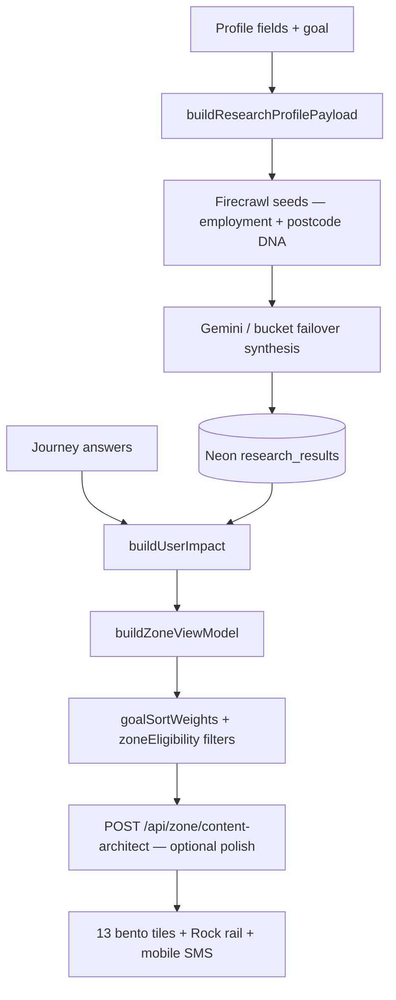

| Layer | Module | Sort / filter behaviour |
| --- | --- | --- |
| Mechanical £/kg | `buildUserImpact` | Only from stream + answers — zero when pending |
| Hero order | `goalSortWeights(profile.goal)` | Money-heavy vs carbon-heavy tile weights |
| Grants copy | `grantsJourneyTitleForProfile` | Employed vs not; affluent postcode districts |
| Rock tips | `filterTipsForEmployment` | Hides means-tested grant tips for employed users |
| Headlines | `content-architect` + `researchAgent` | Category-locked; wrong lane → COMPUTING until valid row |

---

#### Offer URL precedence

| Surface | Resolution order | Module |
| --- | --- | --- |
| **Journey mother tile CTA** | Neon `offer_url` → formula `claimOfferUrl` → council grant URL → `trustedUrlForJourney` → Ask Zai | `buildZoneViewModel`, `resolveSoloFocusHandoffUrls` |
| **Rock Today's Tips** | Habit `learn_url` if topic-safe → slug map → provider map → journey trusted URL | `resolveRockHabitLearnUrl` |
| **Rock + Neon merge** | Journey `latestOfferUrl` only when `mergeRockHabitWithJourneyOffer` passes topic shield | `lib/rock/resolveRockHabitLearnUrl.ts` |
| **SMS tips** | Same as Rock — `resolveRockHabitLearnUrl(h)` per habit (not blind journey URL) | `zoneSignupTips` in `app/zone/page.tsx`, `signupZoneSms.ts` |
| **SMS recommendations** | Journey card `resolveJourneyCardUrl` from VM | `signupZoneSmsShared.ts` |

**Anti-pattern (fixed):** stamping one journey-level Neon URL on every Rock habit in that category (e.g. e-bike + Eurostar). Topic conflicts: Eurostar vs e-bike/motorway habits; Recyclenow vs water butt; WRAP food vs preloved fashion.

---

#### Mobile signup (post-Zone)

Requires **session** + explicit **`sms_opt_in: true`** (checkbox). Flow:

1. `POST /api/profile/mobile` persists `users.mobile` + `mobile_sms_opt_in`
2. `sendMobileWelcomeSms` — first-time or changed number
3. `sendSignupZoneSms` — Today's tips (`zoneSignupTips` + `tipSlugs`) + recommendations (`zoneSignupRecommendations`)

Payload built from visible Rock rail + journey mother cards on Zone — not profile fields alone.

---

#### Verify one user end-to-end

```bash
### After profile + summary in browser (signed in)
curl -sS -b cookies.txt "https://www.00-00.online/api/scrape-sync?postcode=YOURPC" | jq '.research_category_coverage, .source'
npm run db:log-research
```

Expect onboarding JIT keys in `research_category_coverage` within minutes; unsettled journeys stay **COMPUTING** until earned scrape or Hermes pulse.

---

#### Known gaps (engineering backlog)

| Item | Impact |
| --- | --- |
| Home fabric MC trio not in `calculateHome` | Answers affect scrape context only, not home £ |
| `utilities.monthly_energy_band` not wired to spend model | Band is scrape-only |
| Travel VM titles use `fuel_type`; registry uses `ev_hybrid` | EV headline may not reflect MC answer until genome derives `fuel_type` |
| Onboarding JIT cap = 4 | Remaining 9 journeys earned in Solo Focus or Hermes |
| Content Architect may use trusted catalog URL when Neon deep link thin | Prose personalised; URL may be generic |
| Mechanical triplet fallback | Can look “live” with `trustedUrlForJourney` before full Firecrawl pass |

**Fixed in code (ship with next deploy):** `vmLive` profile includes `home_power` (utilities tile after living pulse); `age_group` in client research payload; Rock/SMS topic-aligned URLs via `mergeRockHabitWithJourneyOffer`.

---

## Annex: App overview & testing (full) {#annex-app-overview--testing-full}

*Source file: `APP-OVERVIEW-AND-TESTING.md`*


**Purpose:** One document to understand what the app does, where every piece of content comes from, how £ and carbon are calculated, and how to test each layer.

**Cross-links:** [HANDBOOK.md](HANDBOOK.md) · [PROFILE-FIELDS-GRID-UNLOCKS.md](PROFILE-FIELDS-GRID-UNLOCKS.md) · [INTELLIGENCE-PIPELINE-FINAL.md](INTELLIGENCE-PIPELINE-FINAL.md) · [DEV-TEST-AUDIT.md](DEV-TEST-AUDIT.md)

**Production:** https://www.00-00.online · **Repo:** https://github.com/00app/00-ULM.git

---

#### 1. What the app is

Zero Zero is a UK postcode-driven energy and lifestyle auditor. A user provides a **postcode** and short **profile** (household, home type, power type, transport, age, employment, goal). The app builds a personalised **Zone** — a bento grid of **13 journey domains** (home, utilities, grants, solar, travel, etc.) with savings and carbon hints. Tapping a card opens **Solo Focus**: embedded questions, researched copy, and optional **discovery** child cards.

| Metaphor | Role | Implementation |
|----------|------|----------------|
| **Brain** | Reasoning and copy | Gemini — headlines, three prose paragraphs, discovery cards |
| **Stomach** | Ingestion | Firecrawl — UK pages (Ofgem, GOV.UK, grants, tariffs) |
| **Memory** | Persistence | Neon Postgres — users, answers, `research_results` |
| **Nervous system** | Orchestration | Next.js on Vercel — API routes, client VM |
| **Hermes** | Scheduled repair | Weekly cron → `/api/cron/zone-research` |

**Mechanical truth:** Tiles show **COMPUTING — JOURNEY** and £0 until Neon or scrape-sync has **stream data**. No fake marketing £ on an empty database.

---

#### 2. User journey (routes)

| Step | Route | What happens | Key APIs / modules |
|------|-------|--------------|-------------------|
| Intro | `/`, `/intro` | Goal choice; optional geolocation postcode | `profile_goal` in localStorage |
| Profile | `/profile` | 8 steps + goal; **`POST /api/user`** on submit | Session cookie, JIT scrapes (≤4) |
| Summary | `/profile/summary` | HELLO → name → locality ticker; research handshake | `runProfileResearchHandshake` |
| Zone | `/zone` | Welcome → profile hero → Today's Tips + Rock → Recommendations bento → signup | `GET /api/scrape-sync`, `buildZoneViewModel`, `buildGroovyGridItems` |
| Solo Focus | Overlay | 1 MC question → answer → result; discovery birth | `POST /api/answers` |
| Solo Focus close | Lifestyle loop question → short pulse → atomic exit → grid | `DiscoveryTakeover` |
| Solo Focus like | Card **stays open**; like button selected state; `offer_signals` + snapshot; Zai may route to `/likes` on first like | `SoloFocusActionTrinity`, `trackZoneLike`, `LikesCardActionTrinity` |
| Solo Focus nope | Offer feedback question → grid; card suppressed | `OfferFeedbackTakeover`, `offer_signals` |
| Zai | `/zai` | Read-only chat (Gemini); no MC birth | `POST /api/zai` |
| Likes / Settings | `/likes`, `/settings` | Liked Zone + Zai picks (not actioned); trinity GET/CLAIM/BUY + unlike + done | `AppContext`, `zz_zai_likes`, `likeCardSnapshots` |

**Canonical path:** Profile → Summary → Zone. Session (`POST /api/user`) is required for SMS and full Neon user rows.

---

#### 3. End-to-end data flow

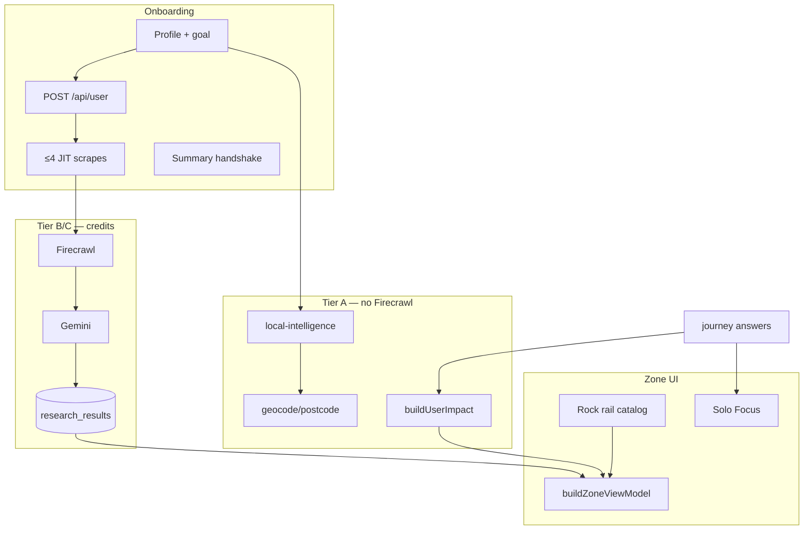

| Stage | Reads | Writes | Costs credits? |
|-------|-------|--------|----------------|
| Postcode geocode | Postcodes.io, Nominatim | `profile_locality_name` | No |
| Local intelligence | Council, carbon, grants context | session / genome | No |
| Zone hydrate | `research_results`, coverage | client state | No (read) |
| Onboarding JIT | Profile snapshot | Neon rows | Yes (≤4 journeys) |
| MC answer | Profile + answers | `journey_answers_jsonb`, discovery | Optional JIT per journey |
| Hermes weekly | Stale rows | repair `research_results` | Yes (batch) |
| Zai chat | Genome + research URLs | transcript | Gemini only |

---

#### 4. Where content comes from (UI element matrix)

Use this table when testing: **if X on screen, data must come from Y**.

##### 4.1 Journey mother tiles (13 bento cards)

| UI element | Primary source | Fallback | Module |
|------------|----------------|----------|--------|
| **Headline (5–8 words)** | Neon `agent_headline` | Content Architect polish; `profileDrivenJourneyTitle` | `buildZoneViewModel`, `zoneCardHeadlineFromRaw` |
| **SAVE £** | Neon `saving_amount_gbp` if stream | `buildUserImpact` per journey | `mechanicalTruth.journeyHasStreamData` |
| **CARBON kg** | `buildUserImpact` + stream | 0 / `—` when COMPUTING | `lib/brains/calculations.ts` |
| **COMPUTING title** | No stream | `computingJourneyTitle(journey)` | `mechanicalTruth.ts` |
| **CTA / BUY URL** | Neon `offer_url` | Formula URL → `trustedJourneyUrls` → `/zai` | `buildZoneViewModel`, `resolveSoloFocusHandoffUrls` |
| **Prose (Solo Focus)** | Neon `architect_prose` (3 paragraphs) | Warm auditor fallback | `researchAgent.ts` |
| **Audit badge** | LIVE vs ESTIMATED | `vmAuditLive()` | `buildZoneViewModel` |
| **Visited pink** | User closed card / loop | `visitedCards`, server breadcrumbs | `app/zone/page.tsx` |
| **Council grant bar** | `getLocalData(postcode)` | geocode + local-intelligence | Not from MC answers |

##### 4.2 Today's Tips (Rock rail)

| UI element | Source | Module |
|------------|--------|--------|
| **Title** | Static habit catalog | `lib/rock/habitsCatalog.ts` |
| **£ / kg on tile** | `habit.money_gbp` / `habit.carbon_kg` | catalog — **not** Neon journey row |
| **Learn URL** | `resolveRockHabitLearnUrl` | slug map → provider map → topic shield |
| **Neon offer merge** | Journey `latestOfferUrl` only if topic-safe | `mergeRockHabitWithJourneyOffer` |
| **Which habits show** | Season + off-wall dedupe | `prepareRockHabitsForRail` (6 visible, 12 cap) |
| **Solo Focus expand** | Habit `insight` only — **never** mother hook/prose | `headlineFromRockHabit` |

##### 4.3 Profile summary ticker

| Word | Source |
|------|--------|
| HELLO, name, locality | `buildSummaryStaccatoWords` + `IntroWordCycle` |
| Waste beats | `buildUserImpact` → `summaryWaste` |

##### 4.4 SMS (mobile signup)

| Section | Source |
|---------|--------|
| Welcome | `lib/messaging/welcomeSms.ts` (fixed copy) |
| Today's tips | `zoneSignupTips` → `resolveRockHabitLearnUrl` per habit |
| Recommendations | Journey VM rows → `resolveJourneyCardUrl` |

##### 4.5 Zai chat

| Input | Source |
|-------|--------|
| Context | `user_genome`, journey answers, `research_results` URLs/£ |
| Scrape | **Only** on Deep Dive “Search deeper” — not on every message |

---

#### 5. How £ and carbon are calculated

**Single source of truth:** `lib/brains/buildUserImpact.ts` → `lib/brains/calculations.ts`. **UI must never invent totals.**

##### 5.1 Pipeline

1. **Profile** + **journey answers** (from localStorage / Neon `journey_answers_jsonb`)
2. If answers missing for a journey, **synthetic mid-bands** from profile (`lib/brains/profileJourneyBaseline.ts`) — badge stays **ESTIMATED_AUDIT**
3. Per-journey calculator → annual £ and kg
4. Optional **scraped overlay** (≤20% delta) when scrape-sync provides data points
5. **`buildZoneViewModel`** blends impact + Neon `saving_amount_gbp` when stream exists

##### 5.2 Per-journey calculators (what answers affect £)

| Journey | Calculator | Key answer fields |
|---------|------------|-------------------|
| **home** | `calculateHome` | `monthly_cost`, `energy_type`, `green_tariff`, providers; policy savings via `tariff_type` from utilities/money |
| **utilities** | `calculateUtilities` | `tariff_type` → April 2026 policy savings |
| **grants** | `calculateGrants` | `boiler_age`, `income_benefits`, `prior_eco_bus` |
| **solar** | `calculateSolar` | `roof_orientation`, `roof_shading`, `daytime_occupancy` |
| **travel** | `calculateTravel` | `commute_distance`, `ev_hybrid` |
| **holidays** | `calculateHolidays` | `annual_flights`, `flight_duration`, `carbon_offsets` |
| **food** | `calculateFood` | `diet_profile`, `organic_shopping` |
| **shopping** | `calculateShopping` | `retail_channel`, `repair_mindset`, `online_deliveries` |
| **money** | `calculateMoney` | `monthly_energy_bill`, `tariff_type`, `green_investments` |
| **tech** | `calculateTech` | `smart_thermostat`, `smart_home`, `smart_meter` |
| **water** | `calculateWater` | `garden_butt`, `wash_preference`, `rainwater_harvest` |
| **waste** | `calculateWaste` | `food_waste_collection`, `composting`, `soft_plastics` |
| **carbon** | `calculateCarbon` | `footprint_awareness`, `carbon_removal`, `tonne_reduction_timeline` |

**Employment physics:** `applyEmploymentFinancialPhysics` adjusts several journeys by employment status.

**Grid carbon:** Electricity kg uses NESO regional intensity (`gridCarbonContextForPostcode`) or live pulse when available.

**Constants:** July 2026 price cap typical **£1,862**; ~**12,000 kWh ≈ 1 tonne CO₂e** framing — `lib/brains/constants.ts`.

##### 5.3 Questions that do NOT change calculator £ (scrape + genome only)

- **home:** `property_type`, `insulation_level`, `glazing_type`
- **utilities:** `supplier_switch`, `monthly_energy_band`
- **travel:** `public_transport`
- **food:** `own_produce`

All MC answers still: persist to genome, trigger `runLoopSpawnResearch`, can birth discovery cards, bump `getGenomeModifier`.

##### 5.4 When wall shows £0 vs real numbers

| Condition | Wall behaviour |
|-----------|----------------|
| No Neon stream + no profile baseline | **COMPUTING — JOURNEY**, metrics `—` |
| Profile baseline only | Estimated £ from formulas; **ESTIMATED_AUDIT** |
| Neon `saving_amount_gbp` + valid headline/prose | **LIVE_AUDIT**; Neon £ can override formula |
| Utilities without `home_power` | Tile visible but **COMPUTING** until power type set |

**Verify:** `lib/zone/mechanicalTruth.ts` — `journeyHasStreamData`, `hasAnyStreamData`.

---

#### 6. Research & scrape pipeline (content birth)

##### 6.1 When scrapes fire

| Trigger | API | Cap |
|---------|-----|-----|
| Profile submit | `triggerOnboardingResearchBootstrap` | 4 journeys (home + utilities if power + 2 goal-aligned) |
| Summary exit | `runProfileResearchHandshake` (deduped) | fills gaps |
| MC answer | `POST /api/answers` → `runLoopSpawnResearch` | per answer |
| Journey 3/3 complete | `triggerSupplementalResearch` | full category |
| Solo Focus Tip +1 | `POST /api/scrape-sync` with `journey_key` | one domain (Topic Shield) |
| Hermes | `GET /api/cron/zone-research` | weekly repair batch |

##### 6.2 What gets persisted (Neon `research_results`)

| Column | Use |
|--------|-----|
| `category` / journey key | Tile assignment |
| `saving_amount_gbp` | SAVE £ on wall when stream valid |
| `agent_headline` | Bento headline |
| `architect_prose` | Solo Focus prose (3 paragraphs) |
| `offer_url`, `source_url` | CTA and attribution |
| `research_snapshot` | Firecrawl/Gemini invoke metadata |
| `profile_snapshot` | Postcode, employment, goal at scrape time |

##### 6.3 Read path

`GET /api/scrape-sync?postcode=&user_id=` → `research_category_coverage` → `neonJourneyResearchFromCoverage` → `buildZoneViewModel`.

**Honest empty:** `{ source: "pending", scraped: [] }` — not fabricated defaults.

---

#### 7. Personalization layers

| Input | Effect |
|-------|--------|
| **Postcode** | All scrapes, council, grid carbon, locality in copy |
| **House number** | EPC address match in research |
| **Goal** | JIT journey pick; `goalSortWeights` hero/tip order |
| **Like / nope feedback** | Grid sort weights, scrape avoid hints, Hermes `offer_feedback` | `offerPreference`, `offer_signals` |
| **Power type** | Unlocks utilities tile; utilities JIT; tariff seeds |
| **Employment** | Grant vs agile seeds; `filterTipsForEmployment`; grants title |
| **Household / transport / home type** | Impact baselines, synthetic answers, titles |
| **Age** | Tip persona boost (JUNIOR→tech, RETIRED→home) |
| **MC answers** | Per-journey £; supplemental scrape; discovery birth |

Full profile matrix: [PROFILE-FIELDS-GRID-UNLOCKS.md](PROFILE-FIELDS-GRID-UNLOCKS.md).

---

#### 8. Storage map

##### 8.1 localStorage (client)

| Key | Content |
|-----|---------|
| `profile_postcode`, `profile_name`, `profile_goal`, … | Profile fields |
| `journey_{key}_answers` | MC answers per journey |
| `zz_research_user_id` | Guest research UUID |
| `zz_onboarding_jit_journeys` | sessionStorage — JIT dedupe |

##### 8.2 Neon (server)

| Table / column | Content |
|----------------|---------|
| `users` | name, postcode, mobile, `primary_goal`, session link |
| `user_genome` (JSONB) | house_number, home_power, employment, … |
| `journey_answers_jsonb` | All MC answers |
| `research_results` | Per journey/postcode/user research rows |
| `sessions` | httpOnly auth |

---

#### 9. Testing guide (logic & content)

##### 9.1 Automated gates (run first)

```bash
npm run verify                  # typecheck + lint
npm run test:mechanical-truth   # honest empty VM, Rock URL alignment, cap lock
npm run db:test                 # Neon connectivity
```

##### 9.2 API probes

```bash
### Health + DB
curl -sS https://www.00-00.online/api/health | jq .

### Honest empty (fresh postcode, no rows yet)
curl -sS "https://www.00-00.online/api/scrape-sync?postcode=SW1A1AA" | jq '.source, (.scraped|length), .research_category_coverage'

### After profile + wait ~2min — expect coverage keys for JIT journeys
npm run db:log-research
npm run zone:audit-gates -- YOURPOSTCODE
```

##### 9.3 Browser test matrix

| # | Test | Pass criteria | Proves |
|---|------|---------------|--------|
| T1 | New user profile → summary → zone | Session cookie; locality on summary | `POST /api/user`, geocode |
| T2 | Fresh postcode first load | COMPUTING titles, £0 hero | mechanical truth |
| T3 | After JIT (~2 min) | JIT journeys off COMPUTING | Firecrawl+Gemini→Neon |
| T4 | Set power type | Utilities tile unlocks | `utilitiesZoneUnlock` |
| T5 | Goal money vs carbon | Different JIT keys in coverage | `onboardingResearchBootstrap` |
| T6 | Grants OVER_10YR answer | Grants £/URL updates | `calculateGrants` + scrape |
| T7 | Expand Rock tip | Habit insight, catalog £ | not mother prose |
| T8 | Expand journey card | Neon headline/prose or COMPUTING | stream gating |
| T9 | MC answer close | Discovery card in tips | `injectNewDiscoveryCard` |
| T10 | Mobile opt-in | Welcome + tips SMS; URLs topic-aligned | `signupZoneSms` |
| T11 | Employed user | No means-tested grant tips on Rock | `filterTipsForEmployment` |
| T12 | Solo Focus **like** | Card **remains open**; like circle shows selected colours; row on `/likes` with offer CTA | `SoloFocusActionTrinity`, `LikesCardActionTrinity`, `resolveZaiPickHandoff` |
| T13 | Solo Focus **nope** | Card closes; feedback question; card suppressed on wall | `OfferFeedbackTakeover`, `gridOrder`, `offerPreference` |
| T14 | Solo Focus **close (X)** | Lifestyle loop question (not offer feedback) | `DiscoveryTakeover`, `loopQuestions` |
| T15 | Expand any journey card | No ellipsis in H1 or lead | `isTruncatedSentence` guard |
| T16 | Expand any journey card | Lead contains town name | `buildAuditorDetectionParagraph` |
| T17 | Expand Rock tip | Headline is 20–24 words | `headlineFromRockHabit` |
| T18 | Zone wall section order | After pulse: welcome → profile card → today's tips h3 → Rock → recommendations h3 → category grid → signup; headings **not** inside bento flex | `zone-section-*` testids, `wallSectionsReady` |
| T19 | Nav links (≥768px) | Zone rail: Likes / Settings / Zai `<Link>` routes return 200 | `ZoneDesktopNavRail`, `floating-nav--zone-rail-desktop` |
| T20 | `/likes` empty | Title **no likes** only — no intro paragraph | `app/likes/page.tsx` |
| T21 | `/likes` with picks | Top label + headline + SAVE/CARBON + **GET/CLAIM/BUY** → unlike → done | `LikesCardActionTrinity`, `resolveZaiPickHandoff` |

##### 9.4 What to check when something looks wrong

| Symptom | Likely cause | Check |
|---------|--------------|-------|
| All tiles COMPUTING forever | No Neon rows; JIT not fired; wrong DB | `db:log-research`, session, `DATABASE_URL` host |
| Fake-looking £ with empty DB | Should not happen — report bug | `mechanicalTruth`, `uk2026Defaults` |
| Wrong CTA URL | Neon offer vs trusted fallback | `research_results.offer_url`, `offerUrlGuard` |
| Rock tip → wrong URL | Journey URL bleed | `resolveRockHabitLearnUrl`, topic shield |
| Utilities locked after pulse | `home_power` dropped from VM rebuild | profile in `vmLive` build |
| SMS but no text | Twilio trial / env | `describeOutboundReadiness`, Vercel env |
| Answers don't change £ | Question not in calculator map | §5.3 above |

---

#### 10. Code index (quick)

| Path | Role |
|------|------|
| `app/profile/ProfilePageClient.tsx` | Profile steps, `POST /api/user`, JIT trigger |
| `app/profile/summary/page.tsx` | Ticker, research handshake |
| `app/zone/page.tsx` | Zone orchestrator, scrape-sync hydrate, Rock/SMS payload |
| `app/api/scrape-sync/route.ts` | Research read + JIT trigger |
| `app/api/answers/route.ts` | MC save, discovery, supplemental scrape |
| `app/api/profile/mobile/route.ts` | SMS signup |
| `lib/brains/buildUserImpact.ts` | **Only** £/kg calculator entry |
| `lib/brains/calculations.ts` | Per-journey formulas |
| `lib/zone/buildZoneViewModel.ts` | Zone VM — tiles, sort, filters |
| `lib/zone/mechanicalTruth.ts` | COMPUTING vs stream |
| `lib/agents/researchAgent.ts` | Firecrawl + Gemini persist |
| `lib/rock/habitsCatalog.ts` | Rock habit catalog |
| `lib/rock/resolveRockHabitLearnUrl.ts` | Topic-aligned tip URLs |
| `lib/journeys.ts` | 13×3 question registry |
| `lib/zone/ulmLimits.ts` | 24 cells, 3 injects/journey |
| `lib/zone/offerFeedbackLoop.ts` | Nope feedback beats + Settings log |
| `app/components/OfferFeedbackTakeover.tsx` | Post–**nope** one-shot question (like no longer closes Solo Focus) |
| `app/components/LikesCardActionTrinity.tsx` | Likes wall — offer CTA + unlike + done |
| `lib/zai/resolveZaiLikeHandoff.ts` | Zai pick BUY/GET/CLAIM + partner URL fallback |
| `app/components/DiscoveryTakeover.tsx` | Lifestyle loop + clean birth exit |

---

#### 11. Director's Order (product sequence on Zone)

1. Architectural pulse → grid reveal  
2. Journey mother tiles (13)  
3. Solo Focus: question → answer → result → optional discovery  
4. **Close (X):** lifestyle loop question → short pulse (`audit` / `done.`) → atomic shell exit → grid  
5. **Like:** card stays open — user can still read prose and tap GET/CLAIM/BUY; like recorded to `/likes`  
6. **Nope:** offer feedback question → atomic exit → grid (disliked cards suppressed)  
6. Today's Tips (Rock) — visit only, no loop scrape on close  
7. Mobile signup below Rock when grid collapsed  

Pink = visited. Discovery birth only via `POST /api/answers` (canonical).

---

## Annex: User flow & runtime pipeline {#annex-user-flow--runtime-pipeline}

*Source file: `USER-FLOW-AND-DATA-PIPELINE.md`*


This document gives a single view of how users move through the app and how data flows through the system.

Related references:
- `docs/HANDBOOK.md`
- `docs/ZONE-CONTENT-AND-DATA.md`
- `docs/PROFILE-ANSWERS-ZONE-TECH.md`
- `docs/SENTINEL.md`

---

#### 1) User Flow (End To End)

| Step | Route / Surface | What user does | What system does |
| --- | --- | --- | --- |
| 1 | `/` / `/intro` | Lands on intro and starts profile | Loads intro motion, optional postcode prefill from browser/geocode path |
| 2 | `/profile` | Completes onboarding questions (postcode + optional house number) | Saves profile to localStorage / session; `POST /api/local-intelligence` hydrates council + OpenEPC anchor |
| 3 | `/profile/summary` | Reviews summary headline and totals framing | Builds summary words and transitions into Zone |
| 4 | `/zone` | Sees hero + 13 category cards | Fetches scrape snapshot, merges deterministic impact + research coverage, then renders cards |
| 5 | Zone card open (Solo Focus) | Opens a journey/tip card | Opens expanded card shell, loads question/result state |
| 6 | Solo Focus answer | Answers embedded question | Sends `POST /api/answers`, persists answer, recalculates impact, may trigger discovery/research paths |
| 7 | Solo Focus close | Returns to Zone | Uses visited/loop guardrails: visited (pink) cards close to grid only, no loop takeover |
| 8 | Ask Zai / tips interactions | Opens deeper guidance and CTA links | Uses existing context and trusted URL routing; no direct browser scraping |

---

#### 2) Runtime Pipeline (High Level)

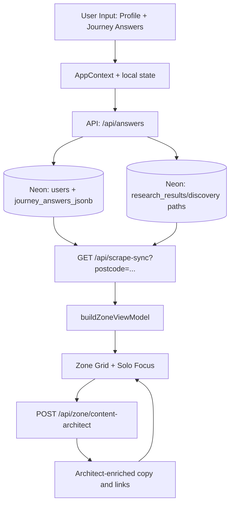

---

#### 3) Data Pipeline By Layer

##### Copy voice (warm auditor)

- **Persona:** trusted UK mate — calm, empathetic, data-honest; one line of dry humour per card at most (`lib/zone/zoneVoice.ts`). Numbers still from Neon / `buildUserImpact` only.
- **Write path:** scrape-sync / `researchAgent` → Neon `architect_prose` + `agent_headline` → optional `content-architect` batch → `buildZoneViewModel` + `contentProseSanitize` on read.
- **Expanded Solo Focus (journey mother):** `resolveExpandedTrueTipInsight` uses per-**parent** `journey_key` (`focusCategoryJourneyId`); body via `buildResearchResultsTrueTipBody` → `toThreeTrueTipParagraphs` with **`dedupeTrueTipParagraphs`** so the stamped £/CO₂e payoff appears **once**. Weak expanded H1s use **`EXPANDED_JOURNEY_HOOK`** (per journey). Mechanical scaffold lines stripped before display.
- **Expanded Solo Focus (Rock / Today's Tips):** `cardId` prefix `rock-` → **`headlineFromRockHabit`** + catalog **`insight`**; £/kg from **`habitToTipCard`** — **not** Neon `researchCategoryCoverage[journey_key]` (habits share journey keys with wall mothers).
- **Locality in prose:** town name from `AppContext.locationState.locationName` (geocode after profile postcode) — **`lib/zone/localityCopy.ts`**. Raw postcodes never appear in Solo Focus lead copy.
- **Postcode:** drives APIs and research only — never hardcoded demo labels in `app/` or `lib/` UI paths.

##### Client Layer
- **State hub:** `app/context/AppContext.tsx`
- **Zone orchestrator:** `app/zone/page.tsx`
- **Solo Focus UI:** `app/components/SoloFocusOverlay.tsx`
- **Visited/pink behavior:** local visited cards + journey-visited merge guardrails

##### API Layer
- `POST /api/answers`: canonical answer commit path
- `GET /api/scrape-sync`: hydrates category coverage and latest research-backed snapshot
- `POST /api/zone/content-architect`: batch card copy generation/enrichment
- `GET /api/pulse/living`: live cap/rates/grid pulse data
- `POST /api/sentinel`: parallel signal layer (not the primary content source)

##### Data Layer (Neon)
- `journey_answers_jsonb`: user answers by journey
- `research_results`: headlines, prose, saving values, source/offer URLs
- `guest_sessions`: pre-auth continuity
- `users`: profile and genome anchors

---

#### 4) Category contract (what each journey must say)

Each Zone card only accepts Neon copy that passes `sanitizeArchitectProseForJourney` + `isAcceptableZoneJourneyHeadline` for that journey key. Wrong-category rows (e.g. BUS grant prose on `grants` with an e-bike headline) are treated as **unsettled** → Solo Focus shows **Computing…** until a valid scrape or `content-architect` row exists.

| Journey | Headline / topic lane | Prose must cover |
| --- | --- | --- |
| `home` | Fabric, heating, draughts, insulation | Loft, draught-proofing, heating waste — not e-bike or pure tariff-only dumps |
| `utilities` | Tariff, standing charge, direct debit | Ofgem cap / supplier switch maths for the user's fuel type |
| `grants` | BUS, ECO, local authority grants | Grant eligibility + installer path — not generic e-bike retail |
| `solar` | MCS install, export, self-use | Generation ROI — not boiler upgrade or BUS-only copy |
| `travel` | Commute, fuel, rail, EV | Transport swap — not loft or heat-pump grants |
| `holidays` | Flights, rail vs air, trip frequency | Holiday travel carbon — not home energy or e-bike schemes |
| `food` | Waste, basket, local outlets | Food waste / diet shift — not heat pumps |
| `shopping` | Repair, circular, durable goods | Purchase habits — not energy audit tables |
| `money` | Green finance, bills, direct debits | Household money moves — not shower heads or BUS |
| `tech` | Standby, smart heat, meters | Plug/load discipline — not loft insulation |
| `water` | Metering, Southern/regional water saves | Water volume — not gas boiler grants |
| `waste` | Council recycling, compost | Local waste rules — not tariff cap essays |
| `carbon` | Footprint tracking vs 12k kWh ≈ 1t | Audit framing — not meal planners or e-bike |

**Settled** means: per-journey coverage has verified £ **and** journey-valid headline or three-paragraph `architect_prose` (see `journeyResearchSettled` in `lib/researchSyncClient.ts`).

---

#### 5) Flow Rules That Matter

- **Postcode-first:** locality-aware paths must derive from user postcode.
- **Mechanical truth first:** no fake money/carbon if research stream is absent.
- **Pink visited cards:** reopening is allowed, but close should return to grid without loop takeover.
- **Category boundaries:** generated copy must stay inside the active journey domain.
- **Trusted source links:** use valid absolute HTTPS sources for CTA and citations.

---

#### 6) Operational Pipeline (Deploy + Health)

| Step | Command / endpoint |
| --- | --- |
| 1 | `npm run verify` — local gate (`tsc:check` + `lint:ci`) |
| 2 | `npm run deploy` — verify, Vercel remote build, auto-promote (`scripts/deploy-production.sh`) |
| 3 | `npm run promote` — if dashboard shows **Staged** but build is green |
| 4 | `GET /api/health?live=1` · `GET /api/health` · `GET /api/health/diagnostics` (Bearer `CRON_SECRET`) |
| 5 | `npm run hermes:ping` · `npm run hermes:pulse` (cron smoke) |
| 6 | Local env: `vercel pull --environment=production` → `npm run env:merge` → `npm run dev:3000` |
| 7 | `npm run dev:pipeline-ready` — verify + health; optional `npm run dev:pipeline-ready -- --seed YOURPOSTCODE` |
| 8 | Localhost `/zone`: one-shot auto-bootstrap unsettled journeys (`devResearchBootstrap.ts`); prod JIT unless `NEXT_PUBLIC_ZONE_DEV_BOOTSTRAP=1`. Grid reveal does not use timed `refreshKey` polls after bootstrap. |
| 9 | Content: `GET /api/scrape-sync?postcode=...` or `POST` trigger with `journey_key` |

See [DEPLOY-VERCEL.md](DEPLOY-VERCEL.md) for Vercel Lint/Typecheck *internal error* (build often OK — use **`npm run promote`**).


---

## Annex: Zone content, scrape & presentation {#annex-zone-content-scrape--presentation}

*Source file: `ZONE-CONTENT-AND-DATA.md`*


Canonical reference for **where Zone copy and numbers come from**, **what we scrape and why**, **how cards and Solo Focus present it**, and **tone of voice** across Architect, True Tip, and Zai.

**Related:** [GUARDRAILS-AND-PIPELINE.md](GUARDRAILS-AND-PIPELINE.md) · [HANDBOOK.md](HANDBOOK.md) · [PROFILE-ANSWERS-ZONE-TECH.md](PROFILE-ANSWERS-ZONE-TECH.md) · [INTELLIGENCE-PIPELINE-FINAL.md](INTELLIGENCE-PIPELINE-FINAL.md) · [HYBRID-DATA-PIPELINE.md](HYBRID-DATA-PIPELINE.md) · [ZAI-AND-QUESTIONS-RULES.md](ZAI-AND-QUESTIONS-RULES.md) · [ULM-APPLICATION-LOOP.md](ULM-APPLICATION-LOOP.md) · [SENTINEL.md](SENTINEL.md) · [SUPPLEMENTAL-SYSTEMS.md](SUPPLEMENTAL-SYSTEMS.md).

**Code map:** `lib/zone/buildZoneViewModel.ts` · `lib/brains/buildUserImpact.ts` · `lib/agents/researchAgent.ts` · `lib/agents/contentArchitect.ts` · `lib/soloFocusCopy.ts` · `lib/zone/offerUrlGuard.ts` · `lib/zone/trustedJourneyUrls.ts` · `app/components/JourneyBentoCard.tsx` · `app/components/RockSavingTips.tsx`.

---

#### 1. Mental model

Zero Zero is **postcode-first**. The Zone wall should read as a **local audit**, not a generic savings blog.

| Layer | Owns | Premium cost |
|--------|------|--------------|
| **Profile onboarding** | Who you are, postcode, habits, goal | **Free** — Postcodes.io, Carbon Intensity, optional OpenEPC |
| **Deterministic engine** | Annual £ and kg CO₂e per journey | **Zero** — `buildUserImpact` |
| **Research stream** | Headlines, three-paragraph prose, offer URLs | **Firecrawl + Gemini** (surgical, capped) |
| **Content Architect** | Polishes grid + expanded copy from **locked** £/kg | **Gemini batch** — `POST /api/zone/content-architect` |
| **Zai chat** | Explains stored context | **No scrape** on `POST /api/zai` |

##### Mechanical truth

If Neon has **no stream** for a journey, the bento tile shows **COMPUTING — HOME** (etc.), metrics **—**, and **£0** — not marketing placeholder totals.

- Empty DB + postcode → `GET /api/scrape-sync` → `{ source: "pending", scraped: [] }`
- Shape defaults in `lib/scraper/uk2026Defaults.ts` are **zero**, labels **Computing...**
- `buildUserImpact` does **not** back-fill UK marketing leads when totals are 0
- `journeyHasStreamData` in `lib/zone/mechanicalTruth.ts` gates live £/headlines

Details: **[PROFILE-ANSWERS-ZONE-TECH.md](PROFILE-ANSWERS-ZONE-TECH.md)** §4.

---

#### 2. End-to-end data flow

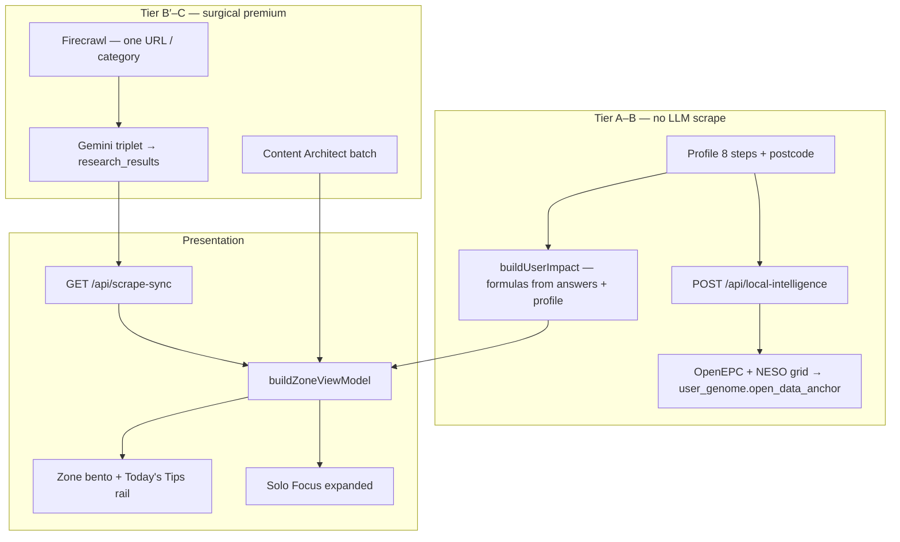

##### Cost tiers (summary)

| Tier | Surface | Premium APIs |
|------|---------|--------------|
| **A** | Profile postcode step | None |
| **B** | Zone grid baseline £/kg | None — `buildUserImpact` only |
| **B′** | Cached `research_results` copy | Only if row empty — surgical seed + Gemini triplet |
| **C** | Solo Focus `POST /api/answers` | Hybrid spawn when `MODEL_STRATEGY=bucket_failover` |
| **D** | `/zai` chat | None — read-only Neon |

Full table: **[HYBRID-DATA-PIPELINE.md](HYBRID-DATA-PIPELINE.md)**.

---

#### 3. Storage (Neon + client)

##### Neon hot path

| Table / column | Role |
|----------------|------|
| **`research_results`** | Per `category` (journey key): `saving_amount_gbp`, `verified_saving`, `agent_headline`, `architect_prose`, `offer_url`, `source_url`, `user_id`, postcode |
| **`research_snapshot`** (JSONB) | Invoke metadata (Hermes / hybrid-pipeline / repair flags) — not user-facing prose |
| **`journey_answers_jsonb`** | 13 domains × 3 behavioural answers |
| **`users.user_genome`** | `open_data_anchor` (EPC + grid snapshot at hydrate) |
| **`scraped_summary`** | Legacy hero aggregates when populated |
| **`discovery_injections`** | Capped supplemental cards |
| **`guest_sessions`** | Pre-login profile + answers (`zz_sid`) |

##### Client mirrors

- **`AppContext`** + **`localStorage`**: `profile_postcode`, journey answers, `visited_cards`
- **`GET /api/answers`** on boot — server wins over stale client cache
- **`GET /api/scrape-sync`** on Zone load — hydrates `research_category_coverage` + scraped overlay inputs

##### `insightReady` (scrape-sync)

True when a category row has prose, headline, £, or offer URL — bento face hides “Computing…” once settled. **`GET ?repair=1`** backfills missing headlines/prose without a full `force` research run.

---

#### 4. What we scrape, why, and when

Scraping is **never** “crawl the whole web for this postcode.” It is **surgical**: one **journey category** at a time, anchored to postcode + profile + (often) a specific answer.

| Trigger | Entry | Why |
|---------|--------|-----|
| **Zone load hydrate** | `GET /api/scrape-sync?postcode=` | Read existing rows; if empty → honest **pending** |
| **Solo Focus answer** | `POST /api/answers` → optional `triggerScrapeSyncForCategory` | User earned context for that journey |
| **Tip +1 verification** | `runTipVerificationDeepScrape` → scrape-sync `repair=1` | Estimated → verified after user confirms |
| **Deep Dive “Search deeper”** | JIT inside `AskZaiDeepDiveSheet` | Only Zai-adjacent surface allowed fresh fetch |
| **Hermes / cron (weekly)** | `GET /api/cron/zone-research?repair=1` | **Backfill** incomplete rows — not day-to-day discovery |
| **Broad force** | `POST /api/scrape-sync?force=true` | **Blocked** in `bucket_failover` unless `ALLOW_BROAD_SCRAPE=1` |

##### Firecrawl

- **Module:** `lib/agents/researchAgent.ts` — `scrapeFirecrawlZoneResearchStructured`
- **Shape:** `schemas/firecrawl-zone-research.v2.json` structured extract + markdown
- **Skip:** `SKIP_FIRECRAWL=1`, missing `FIRE_CRAWL_KEY_2` / `FIRECRAWL_API_KEY` → mechanical + Neon fallbacks

##### Gemini on research persist

On `persistResearchResult`:

| Field | Use |
|-------|-----|
| **`agent_headline`** | Zone bento preview — target **6–8 words** |
| **`architect_prose`** | Solo Focus body — **three paragraphs**, label-free |
| **`offer_url`** | BUY / Claim CTA after sanitization |
| **`saving_amount_gbp`** | Verified £ on card + prose |

##### Guards (credit + trust)

| Guard | Module |
|-------|--------|
| Visited card → no re-scrape on re-open | `lib/zone/visitedCards.ts`, `lib/researchSyncClient.ts` |
| Zai chat → read-only, no Firecrawl | `lib/zai/chatBoundaries.ts`, `app/api/zai/route.ts` |
| Category lane lock (one journey per request) | `lib/intelligence/scrapeBoundaries.ts` |
| Injection cap per journey | `MAX_DISCOVERY_INJECTIONS_PER_JOURNEY` in `lib/intelligence/manifest.ts` |
| Visited close → no inject on tip close | `lib/zone/patternShiftClose.ts` |

---

#### 5. How £ and kg are calculated (vs copy)

**Numbers on tiles** come from **`buildUserImpact`** (`lib/brains/buildUserImpact.ts`) — the **only** place money and carbon are calculated. UI must not invent totals.

1. Profile + journey answers → per-journey functions in `lib/brains/calculations.ts` (annualized).
2. When Solo Focus answers were cleared (e.g. after `/profile/summary`) but postcode / home / transport remain, **`lib/brains/profileJourneyBaseline.ts`** supplies **synthetic mid-band answers** so tiles are not £0 — badge stays **`ESTIMATED_AUDIT`** until Neon stream + genome complete.
3. Optional **scraped overlay** (≤20% delta) when scrape-sync provides data points.
4. **`buildZoneViewModel`** shows SAVE/CARBON when stream, utilities seed, or **`profileHasImpactBaseline`** — not only Neon.

**Questions** in `lib/journeys.ts` are **behavioural only** — they refine the model; they do not embed “save £400” in labels.

##### Audit badges

| Badge | When |
|-------|------|
| **`LIVE_AUDIT`** | Verified Neon money + genome complete enough |
| **`ESTIMATED_AUDIT`** | Stream exists but profile still thin |

Set in `buildZoneViewModel` via `vmAuditLive()`.

---

#### 6. Zone wall — collapsed bento cards

##### Zone wall vertical stack (DOM order)

The Zone page (`app/zone/page.tsx`) renders sections in this **fixed vertical order**. Section headings are **siblings** of card grids — never flex children inside `groovy-zone-grid` (headings inside the grid stretch to card row height and merge with tile copy).

| # | Section | `data-testid` | Wrapper | Content |
|---|---------|---------------|---------|---------|
| 1 | Welcome | `zone-section-welcome` | `zone-hero-copy` | Architectural pulse words — locality + £/CO₂ hero copy |
| 2 | Profile card | — | `zone-hero-wall` → `zone-grid-hero` | Single profile/hero bento — **not** journey mothers |
| 3 | Today's Tips heading | `zone-section-today-tips` | `zone-rock-strip` | H3 **today's tips** |
| 4 | Rock rail | — | `zone-rock-strip` | `RockSavingTips` — catalog habits (6 visible, cap 12) |
| 5 | Recommendations heading | `zone-section-recommendations` | `zone-category-wall` | H3 **recommendations** — **above** category bento only |
| 6 | Category grid | — | `zone-category-wall` → `zone-grid-mounted` | Journey mothers + nested discovery tips |
| 7 | Mobile signup | `zone-section-signup` | outside `zone-grid-container` | `RockMobileSignupCard` |

**Section visibility gates** (`app/zone/page.tsx`):

```typescript
wallSectionsReady =
  pulseWordsComplete &&
  architecturalPulsePhase === 'done' &&
  zoneInteractable &&
  !expandedCardId &&
  !expandedTipId

showTodaysTipsSection = wallSectionsReady && zoneRevealCount >= 1
showCategorySectionHeading =
  wallSectionsReady && firstCategoryGridIndex >= 0 && zoneRevealCount >= 1
```

Rock habit count does **not** gate the Today's Tips heading — an empty Rock rail still shows the section label when `showTodaysTipsSection` is true.

**Navigation (tablet+):** from **768px**, `ZoneDesktopNavRail` shows fixed `<Link>` routes to Zone / Likes / Settings / Zai. Floating nav on Zone is hidden at the same breakpoint (`.floating-nav--zone-rail-desktop` in `app/globals.css`). Below 768px, `AppFloatingNav` handles navigation.

##### Likes wall (`/likes`)

| Source | Storage | Wall behaviour |
|--------|---------|----------------|
| Zone journey / tip / Rock | `AppContext.likedCards` + `likeCardSnapshots` | SAVE/CARBON from snapshot; GET/CLAIM/BUY from card offer URL |
| Zai pick | `zz_zai_likes` + `likedCards` id | `resolveZaiPickHandoff` — stored URL or verified partner fallback |
| Empty state | — | Title **no likes** only (no intro copy) |

Actioned cards vanish from Likes (`/api/actioned`). Unlike removes snapshot + toggles `POST /api/likes`.

##### Bento grid cell order (recommendations wall)

Within the recommendations grid, **`buildGroovyGridItems`** (`lib/zone/gridOrder.ts`) orders cells:

1. **Hero** cell (excluded from the 24-cell ceiling)
2. For each journey in **prioritized order** — `moneySortedJourneys` first (goal-weighted £ + offer preference), then remaining keys in **`JOURNEY_ORDER`**
3. Per journey: **mother tile** (`journey-{key}`) when stream exists and not suppressed → **nested discovery tips** (`inject-*`) sorted by goal / achievement / £
4. Clip to **`MAX_ZONE_BENTO_CELLS` = 24** journey+tip cells (`clipGroovyGridToCeiling`)

Per-category ceiling: **`MAX_CARDS_PER_CATEGORY` = 2** (one mother + at most one earned discovery tip via `perCategoryCardCap`). Baseline ranked `tip-*` cards do **not** nest on the main grid (`SHOW_BASELINE_TIPS_ON_MAIN_GRID = false`). Offer URL dedupe per journey: `uniquifyZoneTipOfferUrl`. Disliked/indifferent cards deprioritized: `offerPreference` in `gridOrder.ts`.

Built in **`lib/zone/buildZoneViewModel.ts`**, rendered as **`JourneyBentoCard`** (`app/zone/page.tsx` groovy grid).

| UI element | Source |
|------------|--------|
| **Headline** | `zoneCardHeadlineFromRaw` ← Neon `agent_headline` → Content Architect → cleaned title; **5–8 words** on grid (`cleanZonePreviewHeadline`, `isZonePreviewHeadlineNoise`) |
| **SAVE / CARBON** | `formatZoneCardMoney` / carbon from impact + stream |
| **Insight strip** | **Estimated** — *“Estimated from your profile — local audit still loading.”* when `auditState === ESTIMATED_AUDIT'` and research not settled but profile £ shows (`lib/zone/zoneAuditUi.ts`). **Computing** — spark icon when still loading and no estimated strip. |
| **Category colour** | `lib/journeyColors.ts` |
| **Visited (pink)** | Mother tile: pink after loop + `completeCleanBirth`. Discovery inject: pink on close. `.zone-card--visited` — see **Director's Order** in [HANDBOOK.md](HANDBOOK.md) |
| **Source line** | `source. …` attribution — **not** long prose |

##### Motion

**Atomic crystallize:** bento ripple via `ZONE_ATOMIC_BENTO_VARIANTS` + stagger (`lib/motion-family.ts`). Wall hidden until `revealedCardCount ≥ 1` and `pulseWordsComplete`.

**Grid reveal stability (`app/zone/page.tsx`):** after Architectural Pulse completes, cards stagger in at **2×** `ZONE_GRID_STAGGER_CHILD_DELAY_SEC` (not 3×). `revealedCardCount` only resets to **0** when pulse phase is not `done` — not when `displayItems` grows after scrape-sync (avoids flash-then-stall). Dev localhost bootstrap seeds unsettled journeys once; it does **not** schedule `refreshKey` poll timers (those used to re-hydrate the whole grid and interrupt reveal).

**`pulseWordsComplete` needs its own timeout, not just `cardReady`'s:** inside `DiscoveryTakeover`'s loop-close reveal (`tryReveal()` requires both `cardReady` **and** `pulseWordsComplete`), `cardReady` has always had a safety-net `setTimeout` in case the async recompute stalls — but `pulseWordsComplete` used to only flip via `ArchitecturalPulse`'s `onComplete` callback chain (down through `IntroWordCycle`'s internal word-cycle timers), with no fallback of its own. If that callback chain ever stalled (backgrounded/throttled tab is the likely real-world trigger), the reveal gate waited on it forever and the whole grid stayed permanently blank — no error, no recovery but a manual reload. Fixed by folding `pulseWordsComplete` into the same existing safety timeout. If either half of this reveal gate is ever reworked, both halves need an independent escape hatch — one timeout guarding only one of the two AND-ed conditions defeats the purpose.

##### Today's Tips rail (Rock)

Separate from 13 journey mother bentos — **not** duplicate wall headlines or journey audit copy.

| Concern | Rule | Code |
|---------|------|------|
| **Catalog** | Static habits + learn URLs | `lib/rock/habitsCatalog.ts` → `habitToTipCard` |
| **Offer URLs** | Topic-aligned https links — slug map, provider map, topic shield | `lib/rock/resolveRockHabitLearnUrl.ts` · `mergeRockHabitWithJourneyOffer` |
| **Neon merge** | Journey `latestOfferUrl` on habit **only** when topic-safe | `rockOfferByJourney` in `app/zone/page.tsx` |
| **Card IDs** | `rock-{slug}` (e.g. `rock-radiator-bleed`) | `rockCardId()` |
| **Grid headline** | Short habit title (**3–10 words**) — **never** `ZONE_BENTO_HOOK` / wall mother hook | `clampRockTipHeadline` |
| **Rail fill** | Prefer journeys **not** on wall; one habit per `journey_key`; dedupe wall headline keys; **6** visible slots (rotation cap **12**) | `prepareRockHabitsForRail`, `filterRockHabitsAgainstWall` |
| **Fallback** | When every journey has a mother tile, still fill six tips from catalog if titles differ from wall hooks | `prepareRockHabitsForRail` second pass (`requireOffWall: false`) |
| **UI** | **`RockSavingTips`** — heading **Today's Tips** (`aria-label="Today's tips"`) | `app/components/RockSavingTips.tsx` |
| **Mobile signup** | E.164 → `POST /api/profile/mobile` with `sms_opt_in: true`, `tips`, `tipSlugs`, `recommendations` from Zone → welcome SMS + structured signup SMS | `RockMobileSignupCard`, `lib/messaging/signupZoneSms.ts`, `lib/messaging/welcomeSms.ts` |
| **Visit** | Pink on close (`visitedClose`) — **no** loop, **no** tip verification scrape | Director's Order in [HANDBOOK.md](HANDBOOK.md) |
| **Label colour** | Category label uses `--journey-text` at rest and on hover — Rock grid excluded from main Zone `data-zone-surface='tip'` purple-header override | `app/globals.css` |

**Anti-pattern (fixed):** Rock habits share a `journey_key` with wall mothers (e.g. both `home`). Without the Rock-specific Solo Focus path below, expand reused **`EXPANDED_JOURNEY_HOOK[home]`**, Neon **`architect_prose`**, and mother **£/kg** — so “bleed radiators” opened as “seal draughts…” at £180.

##### Discovery & injects

| Path | Role |
|------|------|
| **`POST /api/answers`** → `injectNewDiscoveryCard` | **Canonical** birth — one discovery per answer (JSON `new_card_data` / `grid_pulse_card`) |
| **`POST /api/zone/injections`** | Trap follow-up — supplemental, capped |
| **`POST /api/research/question-card`** | Free-form Ask — supplemental, capped |

Ceilings: **`MAX_DISCOVERY_INJECTIONS_PER_JOURNEY` = 3** · **`MAX_ZONE_BENTO_CELLS` = 24** (`lib/zone/ulmLimits.ts`).

---

#### 7. Expanded card — Solo Focus

**Open:** `onExpand` → `rememberSoloFocusOpen` / `openSoloFocus` → **`JourneyBentoCard`** QUESTION chamber (inject tips + Rock: **`SoloFocusOverlay`**). Pink lock waits for loop birth — not expand.

##### Two expand paths

| Path | Detect | H1 | £ / CO₂e | Lead prose |
|------|--------|-----|----------|------------|
| **Journey mother / discovery** | `journey-*`, `inject-*`, … | `headlineFromExpandedHook` → **`EXPANDED_JOURNEY_HOOK`** when title weak | Neon audit row when settled (`verifiedAuditMoneyGbp`) | `architect_prose` via `buildResearchResultsTrueTipBody` |
| **Today's Tips (Rock)** | `cardId.startsWith('rock-')` | **`headlineFromRockHabit(title, insight)`** — habit title + catalog insight; **never** journey hook | Catalog `money_gbp` / `carbon_kg` from `habitToTipCard` | Habit `insight` only — **no** `researchCategoryCoverage[journey_key]` |

Rock expand resolves the habit in `app/zone/page.tsx` via `ROCK_BY_SLUG` + `habitToTipCard`; passes `verifiedArchitectProse={null}` and `verifiedAuditMoneyGbp={null}` so journey audit cannot override habit numbers.

##### Layout (Zai Architect)

| Zone | Content |
|------|---------|
| **H1 (Marvin)** | **20–24 word** hook — mother: `headlineFromExpandedHook`; Rock: `headlineFromRockHabit` |
| **Lead (Marvin H4)** | Locality audit opener — **≤30 words**; **town** from `locationState.locationName` (`lib/zone/localityCopy.ts`), never raw postcode |
| **Body** | **Not rendered in UI** (May 2026) — `SoloFocusProseStack` is **lead-only**; £/CO₂e live in the metrics row. Neon `architect_prose` still stored for polish / Zai context paths. |
| **Metrics** | Mother: verified £ + CO₂e from Neon when settled; Rock: catalog habit row (`StampedMoneyGbp` / `StampedCarbonKg`) |
| **Top label** | `formatSoloFocusTopCategoryLabel` — e.g. **Home - Energy Saving Trust** when handoff provider known (replaces separate provider line below CTA) |
| **Trinity** | GET/CLAIM/BUY → like (selected state, card stays open) → ask → nope (closes + feedback) |
| **Questions** | **One** registry Q per open — zip-shut MC answer → **RESULT**; close → loop question (`DiscoveryTakeover`). **Rock:** close only — no loop, no tip verification |

##### Warm auditor voice (copy — 2026)

Persona: **trusted UK mate** — calm, empathetic, data-honest; at most one line of dry humour per card (`lib/zone/zoneVoice.ts`). Numbers only from Neon / `buildUserImpact`.

**Source of truth (no UI filler):**

| Layer | Owner | Rule |
|--------|--------|------|
| **Neon `research_results`** | `researchAgent` / scrape-sync | Three paragraphs from Gemini + surgical scrape; locality from geocode / profile |
| **Content Architect** | `POST /api/zone/content-architect` | Batch polish: friction / lever / action; category locks; `ZONE_CONTENT_ARCHITECT_VOICE` |
| **Solo Focus display** | `resolveSoloFocusDisplayProse` | Marvin **lead only** (H4); no Roboto body block — metrics row owns £/CO₂e |
| **Locality** | `lib/zone/localityCopy.ts` | `resolveSoloFocusPlaceLabel` + `personalizeTrueTipPlaceLead` — town in lead, not postcode |
| **Sanitizer** | `lib/zone/contentProseSanitize.ts` | Strip leakage, demo postcodes, cross-category pollution on read |

**Not used for card prose:** `lib/soloFocusCopy.ts` generic placeholders, demo postcodes, or static “local data” paragraphs in the client.

##### Three prose beats (no UI labels)

Embedded in copy only — **never** `# What:` / `**Why:**` in the UI.

1. **Friction** — data-backed waste for the category (compact £ / kg).
2. **Leverage** — July 2026 Ofgem cap or grant fact from `lib/brains/constants.ts` when relevant (April figures kept for policy-step copy only).
3. **Payoff** — single closing line, e.g. *“We've put about £X a year and around Y CO₂e against your {topic} row — from your saved audit, not a guess.”* (`payoffSentence` in `lib/zone/auditorNarrative.ts` — deduped by `dedupeTrueTipParagraphs` / `paragraphRepeatsPayoffStamp`).

##### Quality gates (`lib/soloFocusCopy.ts` + `lib/zone/contentProseSanitize.ts` + `lib/zone/proseComplete.ts`)

| Function | Purpose |
|----------|---------|
| `isTruncatedSentence` | Reject ellipsis endings, dangling prepositions, open parens, sub-3-char tail words (`lib/zone/proseComplete.ts`) |
| `isCoherentParagraph` | Gate: 2+ complete sentences, 20–40 words, no ellipsis, no leading conjunction (`lib/zone/proseComplete.ts`) |
| `toThreeTrueTipParagraphs` | Filters paragraphs through `isCoherentParagraph`; pads from `buildAuditorNarrativeParagraphs` when fewer than 3 coherent blocks remain |
| `sanitizeProseParagraphs` | Strip AI-hedge phrases, variable leaks (`£{amount}`, `{postcode}`), fragments &lt;6 words, comma-cut sentences |
| `stripExpandedCardTitleNoise` | Clean Solo Focus H1 |
| `clampRockTipHeadline` | Today's Tips **grid** — short catalog title; never wall `ZONE_BENTO_HOOK` |
| `headlineFromRockHabit` | Rock Solo Focus H1 — title + habit insight; pads with `EXPANDED_JOURNEY_HOOK` when &lt;15 words to reach **20–24** |
| `headlineFromExpandedHook` + `EXPANDED_JOURNEY_HOOK` | **20–24 word** Marvin hook for **journey mothers**; strips truncated £ ellipsis; falls back when no verb detected |
| `dedupeTrueTipParagraphs` / `paragraphRepeatsPayoffStamp` | Drop duplicate payoff / repeated blocks before render |
| `isMechanicalScaffoldParagraph` / `isBoilerplateProseParagraph` | Strip *Execute the…*, *We treat the ~£…*, *verify the offer before you…*, *publishes guidance on this habit* |
| `clampWords` / `clampWordsCompleteSentence` | Lead capped at **≤30** words — **complete sentences only** (no mid-thought `…`) |
| `collapseDuplicateProseParagraphs` | No repeated sentences within a block |
| `polishTrueTipParagraphsForHeadline` | Dedupe + de-headline-echo on open paragraph |
| `isRawResearchDump` | Reject tariff/policy blobs |
| `pruneDuplicateLocalityInsight` | Don't repeat H1 locality in body |
| Category separation | **home ≠ grants** — insulation vs BUS/ECO wording |

##### Headline word limits

| Surface | Limit | Enforcer |
|---------|-------|----------|
| Zone bento | **5–8** | `enforceHeadlineWordLimits(text, false)` |
| Today's Tips grid | **3–10** (catalog title) | `clampRockTipHeadline` |
| Solo Focus expanded hook (mother) | **20–24** (~3–4 lines) | `headlineFromExpandedHook` → per-journey `EXPANDED_JOURNEY_HOOK` when title is weak or generic spring filler (`isGenericSpringHeadline`); mechanical proof via `lib/zone/auditorNarrative.ts` (no shared “policy and tariff pressure…” block) |
| Solo Focus expanded hook (Rock) | **20–24** (~3–4 lines) | `headlineFromRockHabit` — habit title + insight; journey-hook pad when thin |
| Solo Focus Marvin lead (H4) | **≤30** words | `resolveSoloFocusDisplayProse` + `buildAuditorDetectionParagraph` when lead lacks town opener |
| Paragraph | ≤ **40** words each | `MAX_TRUE_TIP_PARAGRAPH_WORDS` |

##### After an answer

```
POST /api/answers
  → upsert journey_answers_jsonb
  → buildUserImpact
  → (optional) discovery race → injectNewDiscoveryCard
  → zip-shut → next single question
  → optional Tier 2 mother/child morph (scoped scrape-sync)
```

**Visited close:** `shouldSkipInjectionOnCardClose` — no inject/scrape burn on tip close.

---

#### 8. Offer URLs (BUY / source)

Pipeline: `research_results.offer_url` → **`sanitizeZoneOfferUrl`** (`lib/zone/offerUrlGuard.ts`) → CTA.

| Rule | Behaviour |
|------|-----------|
| Block 404 gov paths | e.g. great-british-insulation-scheme |
| Block bare `gov.uk` homepages | Fall back to trusted URL |
| Home ↔ grants cross-landing | BUS on home tile → EST home URL; warm-homes on grants → BUS apply URL |
| Fallback | **`TRUSTED_JOURNEY_URLS`** — EST, MSE, WRAP, railcards (`lib/zone/trustedJourneyUrls.ts`) |

CTA labels: **`resolveRevenueCtaLabel`** (`lib/zone/verifiedRevenue.ts`) — Claim / Buy / Get. If no HTTPS offer, handoff may use **`/zai`** audit URL.

---

#### 9. Content Architect (polish layer)

Async after VM is built:

1. Client: `buildContentArchitectCardPayload(vm, journeyAnswers, locality, live unit rates, …)`
2. **`POST /api/zone/content-architect`** → `generateCardContextsBatch` (`lib/agents/contentArchitect.ts`)
3. **`applyArchitectEnrichment`** merges `headline`, `insight` (3 ¶), `actionLine`, `suppliedBy`

Architect receives **locked** £/kg — it does not recalculate totals.

##### Architect tone (system prompt summary)

- **`ZONE_CONTENT_ARCHITECT_VOICE`** (`lib/zone/zoneVoice.ts`) — warm, caring, compact £ facts
- Uppercase functional headlines (5–8 words bento; expanded hook up to 20 words)
- No emojis, no cheerleading, no dev-speak (`tile`, `pipeline`, `morph`)
- Category locks enforced per `journey_key` (see [USER-FLOW-AND-DATA-PIPELINE.md](USER-FLOW-AND-DATA-PIPELINE.md) §4)
- **home** = insulation, draughts, heating — never grants/BUS wording
- **grants** = BUS, ECO, heat pump funding only
- Each journey: distinct mechanism — no reused opening sentence
- No dev-speak: tile, lane, anchored, component

---

#### 10. Tone of voice by surface

| Surface | Persona | Scrape on turn? |
|---------|---------|-----------------|
| Zone bento + Solo Focus | Warm auditor (`zoneVoice.ts`) — Marvin hook + lead + Roboto body | On answer / tip+1 / hydrate; localhost bootstrap (dev) |
| Content Architect | Same warm voice (batch polish) | N/A (batch) |
| **`/zai` chat** | “Active auditor with a pint” — calm UK mate, dry irony OK | **Never** on `POST /api/zai` |
| Deep Dive sheet | Same matrix, in-card | **Search deeper** only |

##### Zai chat contract

- **Matrix:** `ZAI_PERFORMANCE_AUDITOR_V3_MATRIX` — `lib/brains/zai/prompts.ts` (re-export `lib/zai/chatPrompts.ts`)
- **3-beat** in prose — Detection → Proof → Directive (no labeled headings)
- **`stripZaiChatMarkdown`** server + client
- Thin context → *“i don't have enough information to be confident on that one. let's stick to your bills or travel moves.”*
- Forbidden: financial / legal / medical advice
- No “Sure!”, cheer, exclamation spam

Full boundaries + question registry: **[ZAI-AND-QUESTIONS-RULES.md](ZAI-AND-QUESTIONS-RULES.md)**.

---

#### 11. Content vs data — quick lookup

| User sees | Data source | Copy owner |
|-----------|-------------|------------|
| Grid headline | `agent_headline` + Architect + cleaners | `soloFocusCopy`, `contentArchitect` |
| Grid £/kg | `buildUserImpact` + `journeyHasStreamData` | `calculations.ts` |
| Expanded H1 (mother) | 20–24 word hook, 3–4 lines | `headlineFromExpandedHook`, `stripExpandedCardTitleNoise` |
| Expanded H1 (Rock) | 20–24 word hook from habit title + insight | `headlineFromRockHabit` |
| Today's Tips grid title | Short catalog habit title | `clampRockTipHeadline`, `habitsCatalog` |
| Expanded lead (H4) | ≤30 words; town from `locationState` | `resolveSoloFocusDisplayProse`, `buildAuditorDetectionParagraph`, `localityCopy.ts` |
| Expanded lead (H4) | Town from `locationState` | `localityCopy.ts`, `personalizeTrueTipPlaceLead` |
| Expanded body | `architect_prose` or auditor fallback | `buildResearchResultsTrueTipBody`, `toThreeTrueTipParagraphs` |
| No-offer footer | When no HTTPS partner URL | *“No live retailer link this week — figures still come from your saved audit row.”* (`JourneyBentoCard`, `SoloFocusOverlay`) — not “Fresh Audit…” dev-speak |
| BUY link | `offer_url` → sanitizer → trusted fallback | `offerUrlGuard`, `trustedJourneyUrls` |
| Questions | `lib/journeys.ts` | Static behavioural copy |
| Today's Tips grid | Rock catalog + rail filter | `RockSavingTips`, `prepareRockHabitsForRail`, `habitsCatalog` |
| Rock Solo Focus £/kg | Habit catalog row | `habitToTipCard` — not Neon `research_results` |
| Pink / yellow visit | `visited_cards` + `POST /api/zone/visit` | `.zone-card--visited` in `globals.css` |

---

#### 12. Boundary diagram (who must not overlap)

```
                  ┌──────────────────────────────────────────┐
                  │     ONBOARDING (8 profile steps)       │
                  │  Postcode → buildUserImpact baseline     │
                  └────────────────────┬─────────────────────┘
                                       │
                                       ▼
┌────────────────────────────────────────────────────────────────────────┐
│                    ZONE GRID & research_results                        │
│  12 bentos · tips rail · ≤3 injects/journey · 1 Q per card             │
│  Visited → pink / yellow                                               │
│  Canonical birth: POST /api/answers → injectNewDiscoveryCard           │
└──────────────────────────────┬─────────────────────────────────────────┘
                               │ read-only
                               ▼
                  ┌──────────────────────────────────────────┐
                  │         ZAI CHAT (/zai)                  │
                  │  Transcript + Neon only — NO scrape        │
                  └──────────────────────────────────────────┘
```

| Layer | Must not |
|-------|----------|
| Onboarding | Zone loop questions, broad Zai scrape |
| Zone | Duplicate questions on one card; inject on visited close |
| Zai chat | Firecrawl, cron, `triggerScrapeSyncForCategory` |
| Deep dive | Scrape on **Continue in Zai** (context handoff only) |

---

#### 13. Verification

```bash
### Local
npm run verify && npm run build

### Honest empty Zone (prod)
curl -sS "https://www.00-00.online/api/scrape-sync?postcode=BN17" | jq '.source, (.scraped | length)'

### Latest Neon row
npm run db:log-research
```

---

#### 14. Sentinel (parallel layer — not main scrape copy)

Sentinel does **not** fill `research_results` headlines for all 12 journeys. It provides:

- **Live-Impact** grid/rates on Zone (`useSentinel` → `POST /api/sentinel`)
- **Home mother/child deck** in `journey_state` (`advanceHomeJourneySentinelAfterAnswer` after home answers)
- **`inject-sentinel-*`** priority tips + optional rural grant card

Full spec: **[SENTINEL.md](SENTINEL.md)**.

---

#### 15. Supplemental systems

| System | Doc section |
|--------|-------------|
| Gary / BN17 demo `user_id` | [SUPPLEMENTAL-SYSTEMS.md](SUPPLEMENTAL-SYSTEMS.md) §2 |
| Pattern shift vs visited close | §3 |
| Rebirth vault discovery race | §4 |
| Tier 2 / tip +1 scrape | §5 |
| `triggerSupplementalResearch` vs canonical birth | §1 |
| Fallback zone tips | §9 |

---

#### 16. Why it is designed this way

1. **Trust** — show £ only with a research stream or honest COMPUTING state.
2. **Cost** — surgical scrape, visited lock, bucket failover, Hermes repair-only cron.
3. **Clarity** — one question per card; one discovery spawn per answer; home ≠ grants.
4. **Action** — real HTTPS offers or trusted fallbacks, not dead gov homepages.
5. **Voice** — same auditor from grid → Solo Focus → Zai; chat stays read-only so it cannot invent £ not on the wall.

---

*Update this doc when changing `buildZoneViewModel`, `contentArchitect`, `soloFocusCopy`, scrape boundaries, or visit/inject rules.*

---

## Annex: Profile, journey questions & mechanical truth {#annex-profile-journey-questions--mechanical-truth}

*Source file: `PROFILE-ANSWERS-ZONE-TECH.md`*


What ships in **`main`** after the **mechanical truth** pass: the UI only shows £/kg and headlines when Neon or scrape-sync has **stream data**. No UK placeholder back-fill on the Zone wall.

Cross-links: **[GUARDRAILS-AND-PIPELINE.md](GUARDRAILS-AND-PIPELINE.md)**, **[HANDBOOK.md](HANDBOOK.md)**, **[ZONE-CONTENT-AND-DATA.md](ZONE-CONTENT-AND-DATA.md)**, **[INTELLIGENCE-PIPELINE-FINAL.md](INTELLIGENCE-PIPELINE-FINAL.md)**, **[PROFILE-FIELDS-GRID-UNLOCKS.md](PROFILE-FIELDS-GRID-UNLOCKS.md)**, **`lib/journeys.ts`**.

---

#### 1. Thirteen domains × three questions

| Journey key | Profile / Solo Focus questions (ids) |
|-------------|--------------------------------------|
| `home` | `property_type`, `insulation_level`, `glazing_type` |
| `utilities` | `tariff_type`, `supplier_switch`, `monthly_energy_band` ( **`home_power` / power type = profile only** — unlocks UTILITIES tile on Zone) |
| `grants` | `boiler_age`, `income_benefits`, `prior_eco_bus` |
| `solar` | `roof_orientation`, `roof_shading`, `daytime_occupancy` |
| `travel` | `commute_distance`, `ev_hybrid`, `public_transport` |
| `holidays` | `annual_flights`, `flight_duration`, `carbon_offsets` |
| `food` | `diet_profile`, `organic_shopping`, `own_produce` |
| `shopping` | `retail_channel`, `repair_mindset`, `online_deliveries` |
| `money` | `monthly_energy_bill`, `tariff_type`, `green_investments` |
| `tech` | `smart_thermostat`, `smart_home`, `smart_meter` |
| `water` | `garden_butt`, `wash_preference`, `rainwater_harvest` |
| `waste` | `food_waste_collection`, `composting`, `soft_plastics` |
| `carbon` | `footprint_awareness`, `carbon_removal`, `tonne_reduction_timeline` |

- **Source of truth:** `lib/journeys.ts` — `JOURNEY_ORDER`, `JOURNEYS`, `isValidJourneyQuestion`, `isJourneyComplete`.
- **Wall order:** `JOURNEY_ORDER` in `lib/journeys.ts` (13 keys including `utilities` after `home`).
- **DB sync:** `npm run db:evolve-13-domains` seeds `journey_questions` for all keys in `JOURNEY_ORDER`.

Question copy is **behavioural** (no hardcoded £/carbon in labels). Money on cards comes from **research / scrape**, not from question text.

##### 1.1 How MC answers influence Zone

| Influence type | Mechanism |
|----------------|-----------|
| **£ / kg on journey tile** | `buildUserImpact` → per-journey calculators in `lib/brains/calculations.ts` (when stream data exists) |
| **Headline / title tweaks** | `profileDrivenJourneyTitle`, `grantsJourneyTitleForProfile`, Neon `agent_headline` when settled |
| **Scrape context** | Every answer → `runLoopSpawnResearch`; journey 3/3 → `triggerSupplementalResearch` |
| **Discovery birth** | `POST /api/answers` → `raceDiscoveryBirth` → client `injectNewDiscoveryCard` → nested tip under parent journey |
| **JIT priority** | `answerFunnelRouter` scores journeys from goal + property intelligence → onboarding / loop JIT cap **4** URLs |
| **Genome modifier** | +0.08 per answered Q → wall formula via `getGenomeModifier` |

**Strong calculator mapping:** grants (`boiler_age`, `income_benefits`, `prior_eco_bus`), solar trio, travel (`commute_distance`, `ev_hybrid`), utilities `tariff_type`, money trio, tech/water/waste/food/holidays/carbon as documented in `calculations.ts`.

**Weak / scrape-only (known gaps):** home `property_type` / `insulation_level` / `glazing_type`; utilities `supplier_switch` / `monthly_energy_band`; travel `public_transport`; food `own_produce`. These still persist, trigger research, and bump genome modifier.

Full matrix: [PROFILE-FIELDS-GRID-UNLOCKS.md](PROFILE-FIELDS-GRID-UNLOCKS.md) § Journey MC questions.

##### 1.2 Question intelligence → Zone cards (end-to-end)

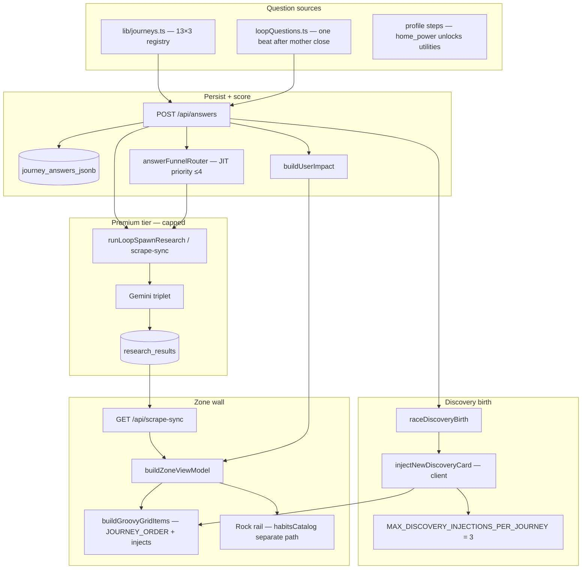

| Stage | What happens | Zone effect |
|-------|--------------|-------------|
| **Profile submit** | `POST /api/user` + `triggerOnboardingResearchBootstrap` | Up to **4** journeys researched first; all **13** mother slots render (`COMPUTING` until Neon rows land) |
| **Summary exit** | `runProfileResearchHandshake` | Deduped JIT — fills priority journeys from funnel |
| **Zone load** | `GET /api/scrape-sync` → `buildZoneViewModel` | Mothers get headlines/£ from `research_results`; empty → honest **pending** |
| **Solo Focus MC answer** | `POST /api/answers` validates registry id | Persists answer; optional category scrape; **`raceDiscoveryBirth`** returns `new_card_data` |
| **Client inject** | `injectNewDiscoveryCard` in `app/zone/page.tsx` | Discovery tip nests **after** parent journey in `buildGroovyGridItems` (max **2** cells/category on wall) |
| **Loop close (mother)** | `DiscoveryTakeover` → one `loopQuestions` beat | Same `POST /api/answers` path — canonical discovery birth |
| **Supplemental** | `POST /api/zone/injections`, `POST /api/research/question-card` | Trap / Ask paths — capped; **not** primary MC birth |

**Rock rail is parallel:** habits come from `lib/rock/habitsCatalog.ts` via `prepareRockHabitsForRail` — not from MC answers directly. Answers can still influence Rock indirectly when journey Neon `offer_url` merges topic-safely (`mergeRockHabitWithJourneyOffer`).

**Wall sort vs journey registry:** `JOURNEY_ORDER` in `lib/journeys.ts` is the canonical domain list. On screen, `gridOrder.ts` may **re-rank** mothers by goal-weighted £ and offer preference, but discovery tips always nest under their parent `journey_key`.

---

#### 2. Profile onboarding

| Step | Code | Persistence |
|------|------|-------------|
| Route | `app/profile/page.tsx` → `ProfilePageClient.tsx` | — |
| Name step | `InputField` `autocomplete="given-name"`; `firstNameFromAutofill` on change/blur | `profile_name` — **first token only** (browser may autofill full name) |
| Postcode step | `autocomplete="postal-code"`; **`lib/geocode/ukPostcode.ts`** validates format before submit (`isValidUkPostcode`, `checkUkPostcode`); **h4 locality** under input uses outcode fallback (e.g. `SW12`) until parish resolves; optional **house number** on same step (`autocomplete="address-line2"`, `profile_house_number`) · hydrate from `profile_postcode` (`localStorage`, intro geolocation, `SessionStateRehydrate`) · `POST /api/local-intelligence` with `{ postcode, house_number? }` | Council, ward, `localCarbonG`, grant context; OpenEPC row matched to address when house number set (`addressMatched` on `OpenEpcProfile`) |
| Profile fields | name, postcode, optional house number, `home_type`, **`power type`** (profile step `powerType` → GAS / ELECTRIC / MIX / OTHER), transport, household, employment, goal | `users` + `AppContext` + `localStorage` (`profile_home_power`, `profile_house_number`); seeds journey answers + **unlocks 13th Zone card (UTILITIES)** via `lib/profile/homePower.ts` + `lib/zone/utilitiesZoneUnlock.ts` |
| Motion | Full-sentence fade per step (`STACCATO_TWEEN`, y 10→0) | [HANDBOOK.md](HANDBOOK.md) Motion table |
| After profile | `/profile/summary` → `/zone` | Summary uses `lib/brains/summaryLogic.ts` + `buildUserImpact` (no UK_2026 back-fill) |

##### Utilities free APIs (server-only)

| API | Auth | Used for |
|-----|------|----------|
| [postcodes.io](https://postcodes.io) | none | Council / region anchor |
| [get-energy-performance-data.communities.gov.uk](https://get-energy-performance-data.communities.gov.uk/api-technical-documentation) | Bearer (`OPENEPC_BEARER_TOKEN`) | Domestic EPC search by postcode; optional house-number filter (`lib/intelligence/epcAddressMatch.ts`). Migrated from `epc.opendatacommunities.org` (shut down May 2026) — old `OPENEPC_EMAIL`/`OPENEPC_API_KEY` vars are dead, confirmed `OPENEPC_BEARER_TOKEN` is what `lib/intelligence/openEpcClient.ts` actually reads |
| [carbonintensity.org.uk](https://api.carbonintensity.org.uk) | none | `GET /intensity` (live gCO₂/kWh), `GET /generation` (fuel mix %), regional postcode |
| [environment.data.gov.uk](https://environment.data.gov.uk/flood-monitoring) | none | Water lane — latest station readings (`/data/readings?_limit=N`) |
| [api.octopus.energy](https://api.octopus.energy) | none | Indicative Agile p/kWh (electric / mixed homes) |
| Ofgem price-cap hub | none (HTML via `/api/pulse/living`) | Cap + unit-rate citations |

Full matrix + usefulness: **[PUBLIC-UK-APIS.md](PUBLIC-UK-APIS.md)**. Registry: `lib/data/utilitiesFreeApis.ts` · `lib/data/ukPublicInfrastructureApis.ts` · `lib/data/octopusPublicApis.ts` · `lib/data/publicUkApisUsage.ts`. Live smoke: `npm run test:uk-apis`.

**Intro:** `/` and `/intro` — kinetic words → stacked lockup **CREATE A / PROFILE TO / START.** at **profile question H2 scale** (not desktop H1). **CREATE** only (no SKIP). `?skip=1` skips logo. Intro may set `profile_postcode` via geolocation + `/api/geocode`.

---

#### 3. Journey answers (Solo Focus & embedded)

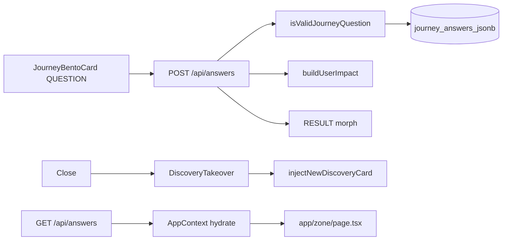

| Piece | Location |
|-------|----------|
| Solo Focus Q | `lib/zone/questionHandler.ts` → `getSoloFocusNextQuestion` |
| UI | `app/components/JourneyBentoCard.tsx` |
| Loop after close | `app/components/DiscoveryTakeover.tsx` + `lib/zone/loopQuestions.ts` |
| Server handler | `app/api/answers/route.ts` |
| Validation | `isValidJourneyId` + `isValidJourneyQuestion` from `lib/journeys.ts` |
| Persist | `upsertJourneyAnswerJsonb`, `upsertUserGenomeFromAnswer` (`lib/db/neon.ts`) |
| Discovery birth | `raceDiscoveryBirth` → response `new_card_data` / `grid_pulse_card` → client `injectNewDiscoveryCard` |
| Supplemental | `POST /api/research/question-card` (Ask), `POST /api/zone/injections` (trap) — capped |

Answers **refine** impact when stream data exists; they **do not** fabricate Zone wall £ when Neon is empty (see §4).

---

#### 4. Mechanical truth on the Zone

##### Rule

**If `research_results` / `scraped_summary` / per-journey Neon row has no stream for a journey → that tile shows £0, carbon 0, title `COMPUTING — <JOURNEY>`, metrics `—`, and a “Computing…” strip.**

##### Data path

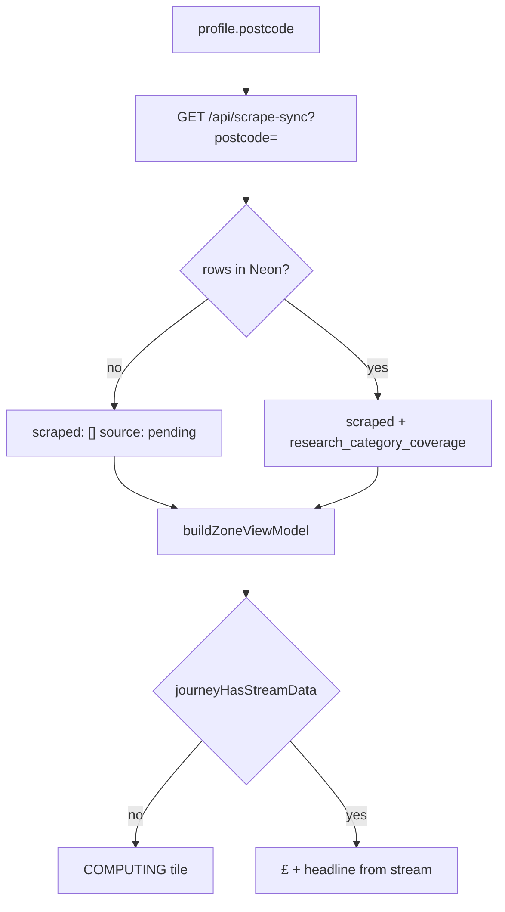

| File | Role |
|------|------|
| `lib/scraper/uk2026Defaults.ts` | Shape-only defaults: **all zeros**, labels **Computing...** (not shown as fake savings) |
| `lib/brains/buildUserImpact.ts` | **No** `UK_2026_MONEY_LEAD` back-fill when money/carbon are 0 |
| `lib/zone/mechanicalTruth.ts` | `journeyHasStreamData`, `hasAnyStreamData`, `computingJourneyTitle` |
| `lib/zone/buildZoneViewModel.ts` | Skips formula £ for journeys without stream; hero **Analyzing your postcode...** when totals are 0 |
| `app/zone/page.tsx` | Grid always visible; `LoadingHeartbeat` + skeleton cards until scrape-sync resolves (`vmResolved`); `streamPending` → `insightGenerationPending` on cards |
| `app/api/scrape-sync/route.ts` | With postcode + empty DB → `{ scraped: [], source: "pending" }` (not fake defaults) |

##### Filling the screen (only path)

1. **POST** `/api/scrape-sync?postcode=BN17&force=true` (Bearer `SCRAPER_SECRET` or `CRON_SECRET`) — regional research + persist repair.
2. Or **Hermes** cron → `/api/cron/zone-research` for queued users.
3. Or user **answers** in Solo Focus → discovery + supplemental research (capped).

**Verify API (honest empty):**

```bash
curl -sS "https://www.00-00.online/api/scrape-sync?postcode=BN17" | jq '.source, (.scraped | length)'
### expect: "pending" and 0 until Neon has rows
```

**Verify DB:**

```bash
npm run db:log-research
npm run db:columns
```

---

#### 5. What you should see in the browser

| State | Zone hero | Journey tiles |
|-------|-----------|---------------|
| Clean Neon, first load | “Analyzing your postcode…”, £0 total | 13× **COMPUTING — …**, **—** for SAVE/CARBON, pulsing “Computing…” |
| After pulse / research rows | Personalised hero when totals &gt; 0 | Real £, headlines, LIVE/ESTIMATED audit badges |
| Stale client cache | Old £ may flash briefly | Hard refresh; `DATA_VERSION` in app clears journey cache on bump |

---

#### 6. Deploy & prep

```bash
npm run verify
npm run prep:live           # db:test + db:evolve-13-domains + build:clean
npm run deploy              # verify + remote build + auto-promote
npm run promote             # if Vercel Staged but build green
npm run dev:pipeline-ready  # local env + health; optional -- --seed POSTCODE
```

See [DEPLOY-VERCEL.md](DEPLOY-VERCEL.md) and [USER-FLOW-AND-DATA-PIPELINE.md](USER-FLOW-AND-DATA-PIPELINE.md) §6.

If `git push` says “no upstream”, run once: `git push -u origin main`.

---

#### 7. Presentation (after stream exists)

Once `research_results` rows exist, see **[ZONE-CONTENT-AND-DATA.md](ZONE-CONTENT-AND-DATA.md)** for headlines, Solo Focus triplets (deduped payoff, per-journey expanded hooks), Today's Tips rail, offer URLs, grid reveal stability, and warm UK auditor tone.

---

## Annex: Zai, Deep Dive & question registry {#annex-zai-deep-dive--question-registry}

*Source file: `ZAI-AND-QUESTIONS-RULES.md`*


Single reference for **Ask Zai chat**, **Ask Zai Deep Dive**, **profile onboarding**, **journey questions** (13 domains × 3), **Zone loop beats**, and **tip verification (+1)**.

**Code sources:** `lib/zai/chatRules.ts`, `lib/zai/chatBoundaries.ts`, `lib/zai/chatPrompts.ts`, `lib/zai/deepDiveAudit.ts`, `lib/zai/loadResearchSourceHint.ts`, `lib/zai/scrapeAreaHint.ts`, `app/zai/page.tsx`, `app/components/AskZaiDeepDiveSheet.tsx`, `app/profile/ProfilePageClient.tsx`, `lib/journeys.ts`, `lib/zone/loopQuestions.ts`, `lib/zone/tipVerification.ts`, `lib/zone/visitedCards.ts`, `lib/brains/zai/prompts.ts`, `lib/brains/zai/boundaries.ts`.

Related: [GUARDRAILS-AND-PIPELINE.md](GUARDRAILS-AND-PIPELINE.md), [HANDBOOK.md](HANDBOOK.md), [ZONE-CONTENT-AND-DATA.md](ZONE-CONTENT-AND-DATA.md), [SENTINEL.md](SENTINEL.md), [SUPPLEMENTAL-SYSTEMS.md](SUPPLEMENTAL-SYSTEMS.md), [ULM-APPLICATION-LOOP.md](ULM-APPLICATION-LOOP.md), [PROFILE-ANSWERS-ZONE-TECH.md](PROFILE-ANSWERS-ZONE-TECH.md), [INTELLIGENCE-PIPELINE-FINAL.md](INTELLIGENCE-PIPELINE-FINAL.md).

---

#### Part 0 — Mechanical Truth boundaries (no overlap)

##### Hybrid data pipeline (cost)

| Tier | Surface | Premium APIs |
|------|---------|--------------|
| A | Profile postcode step | **None** — Postcodes.io + Carbon Intensity (+ optional OpenEPC → `user_genome.open_data_anchor`) |
| B | Zone grid tile £/kg | **None** — `buildUserImpact` only |
| C | Solo Focus answer | **Hybrid spawn** when `MODEL_STRATEGY=bucket_failover` — `lib/zone/engineDataRouter.ts` locks £/kg, Gemini prose only |
| D | `/zai` | **None** — read-only matrix |

Hermes cron unchanged (repair backfill only). See [HYBRID-DATA-PIPELINE.md](HYBRID-DATA-PIPELINE.md).

##### Global data matrix — who owns what

```
                  ┌──────────────────────────────────────────┐
                  │     ONBOARDING BASICS (Part 3)           │
                  │  Postcode, name, core habits, goal       │
                  │  → buildUserImpact → Neon / localStorage │
                  └────────────────────┬─────────────────────┘
                                       │ initial baseline
                                       ▼
┌────────────────────────────────────────────────────────────────────────┐
│                    ZONE GRID & LIVE DATABASE                         │
│  12 journey bentos · 24-cell ceiling · ≤3 injects / domain           │
│  1 card = 1 active question (journey Q or loop beat)                 │
│  Visited → pink / yellow (`visited_cards`)                           │
│  Canonical birth: POST /api/answers → injectNewDiscoveryCard (×1)    │
└──────────────────────────────┬─────────────────────────────────────────┘
                               │ read-only context
                               ▼
                  ┌──────────────────────────────────────────┐
                  │         ZAI CHAT (/zai)                  │
                  │  Transcript + Neon/profile only          │
                  │  NO scrape on chat turns                 │
                  │  3-beat · no markdown · no AI apology    │
                  └──────────────────────────────────────────┘
```

| Layer | Owns | Must not |
|-------|------|----------|
| **Onboarding** (8 steps) | Profile fields, postcode locality, `buildUserImpact` baseline | Zone loop questions, free Zai scrape |
| **Zone** | Journey + loop answers, card visit state, discovery inject (capped), GET scrape-sync hydrate | Duplicate questions on one card; inject on visited close |
| **Zai chat** | Interpret verified context + transcript (max 20 turns) | Broad Firecrawl, cron, `triggerScrapeSyncForCategory` |
| **Deep dive sheet** | In-card audit; **Search deeper** = only Zai-adjacent JIT scrape | Scrape on **Continue in Zai** (handoff only) |
| **Sentinel** | Live grid + home deck + `inject-sentinel-*` tips on Zone | **Not** Zai chat — see [SENTINEL.md](SENTINEL.md) |

**Enforced in code:** `lib/zai/chatBoundaries.ts`, `lib/zone/visitedCards.ts` (`shouldSkipInjectionOnCardClose`), `app/api/zai/route.ts` (read-only comment + no scrape calls), `lib/researchSyncClient.ts` (doc guard).

##### Onboarding hydration flow

1. Eight profile steps (`ProfilePageClient.tsx`) capture demographics and goal.
2. On completion, answers feed **`buildUserImpact(profile, postcode)`** → approximate money/carbon baseline.
3. Payload persists to Neon / `localStorage` mirrors; **`GET /api/scrape-sync`** on Zone load hydrates cards from **`research_results`** — not a loose broad scrape at profile redirect.

##### Zone card loop rules

| Rule | Implementation |
|------|----------------|
| **1 card = 1 question** | One active `EmbeddedJourneyQuestion` or loop beat per card surface; no stacked inputs. |
| **Single spawn** | User answers → targeted state → `POST /api/answers` → exactly **one** discovery card per answer → `injectNewDiscoveryCard`. |
| **Injection budget** | Up to **`MAX_DISCOVERY_INJECTIONS_PER_JOURNEY` = 3** per domain (`lib/intelligence/manifest.ts`). |
| **Visited flip (pink)** | **Mother journey:** pink only after **one** loop answer + `completeCleanBirth` (`markCardVisited` on closed card id — **not** on first Solo Focus close). **Discovery inject (`inject-*`):** pink on close (`shouldCloseMarkPinkOnly`). **Rock / tip +1:** may mark on open or verify path. UI: `.zone-card--visited` via `isZoneCardPink` + `visited_cards`. |
| **Offer URLs** | `sanitizeZoneOfferUrl` (`lib/zone/offerUrlGuard.ts`): block 404 gov paths (e.g. great-british-insulation-scheme), bare `gov.uk` homepages, home↔grants cross-landing; fall back to `TRUSTED_JOURNEY_URLS` (EST, MSE, WRAP, railcards — not regulator homepages). |
| **Copy voice** | Content architect + True Tip: calm UK mate tone; **home ≠ grants** mechanism; `dedupeTrueTipParagraphs`, `isMechanicalScaffoldParagraph`, `collapseDuplicateProseParagraphs`, `isRawResearchDump`. Full pipeline: **[ZONE-CONTENT-AND-DATA.md](ZONE-CONTENT-AND-DATA.md)**. |
| **Close credit guard** | If card already visited, close calls `onPatternShiftClose` with `visitedClose: true` → **no** loop takeover, **no** `spawnAchievementWhenLoopPoolExhausted`, **no** `/api/zone/injections` path from close (`lib/zone/patternShiftClose.ts`). |

##### Zai chat sandbox

| Allowed JIT scrape surfaces | Forbidden on Zai chat |
|---------------------------|------------------------|
| `POST /api/answers` (server) | `POST /api/zai` turns |
| Tip +1 `runTipVerificationDeepScrape` | `Continue in Zai` navigation (context only) |
| Deep dive **Search deeper** only | Closing Zai (`ZAI_AUDIT_COMPLETE` = VM refresh only) |
| Zone `GET /api/scrape-sync` hydrate | Re-opening visited card close |

##### Zai editorial contract (“active auditor with a pint”)

| Rule | Detail |
|------|--------|
| **Voice** | Calm UK mate; lowercase where natural; short phrases; dry irony OK; no `!` cheer or “Sure!” openers. |
| **3-beat** | Detection → Proof → Directive (embedded in prose, **not** labeled headings). |
| **Label-free** | No `#` / `##`, no `**What:**` — `stripZaiChatMarkdown()` on server + client. |
| **Thin context** | No postcode, answers, or £/kg totals → `i don't have enough information to be confident on that one. let's stick to your bills or travel moves.` |
| **Forbidden topics** | Financial / legal / medical → `i cannot offer financial, legal, or medical advice. let's stay focused on your home energy or travel moves.` |
| **Prompt matrix** | `ZAI_PERFORMANCE_AUDITOR_V3_MATRIX` in `lib/brains/zai/prompts.ts` (re-exported from `lib/zai/chatPrompts.ts`). |
| **UI** | `/zai` uses `postZaiChat` + stream reader (not a second widget bot); pills hide while loading. |
| **Fallback (empty/stream fail)** | `give me a sec — still checking what's live near you.` |

##### API sketch (read-only turn)

```typescript
// lib/zai/chatBoundaries.ts — pattern; live handler: app/api/zai/route.ts POST
// 1. getZaiDeclineForQuestion(userMessage) → early JSON (no Gemini)
// 2. Load Neon journey_answers + profile + research rows (no scrape)
// 3. Gemini stream with ZAI_EDITORIAL_AUDITOR_DNA + 3-beat matrix
// 4. stripZaiChatMarkdown(polish(reply))
```

---

#### How it all works together (integrated flow)

This section is the **wiring diagram**: how profile onboarding, Zone questions, answers, discovery cards, Deep Dive, and Zai chat share data **without** double-scraping or duplicate question banks.

##### One-line summary

| Step | What happens |
|------|----------------|
| 1 | **Profile (8 questions)** → baseline money/carbon + Neon user row |
| 2 | **Zone** loads hero + 12 journey bentos from `research_results` (GET scrape-sync) |
| 3 | User opens a card → **Solo Focus** shows **one** journey question (Q1 from `lib/journeys.ts`) or a **loop beat** after close |
| 4 | User answers → **`POST /api/answers`** persists `journey_answers_jsonb`, may return **one** new discovery card → grid inject |
| 5 | Optional **Tip +1** or **Deep Dive** deepen that card; only **Search deeper** triggers a category scrape |
| 6 | **Zai chat** reads profile + journey answers + transcript + Neon research — **no scrape** on chat turns |
| 7 | **Continue in Zai** passes context into `/zai` once; next messages stay read-only |

All layers are gated in code (`chatBoundaries`, `visitedCards`, `perCategoryCardCap`, `ulmLimits`, `MAX_DISCOVERY_INJECTIONS_PER_JOURNEY = 3`).

##### End-to-end user journey

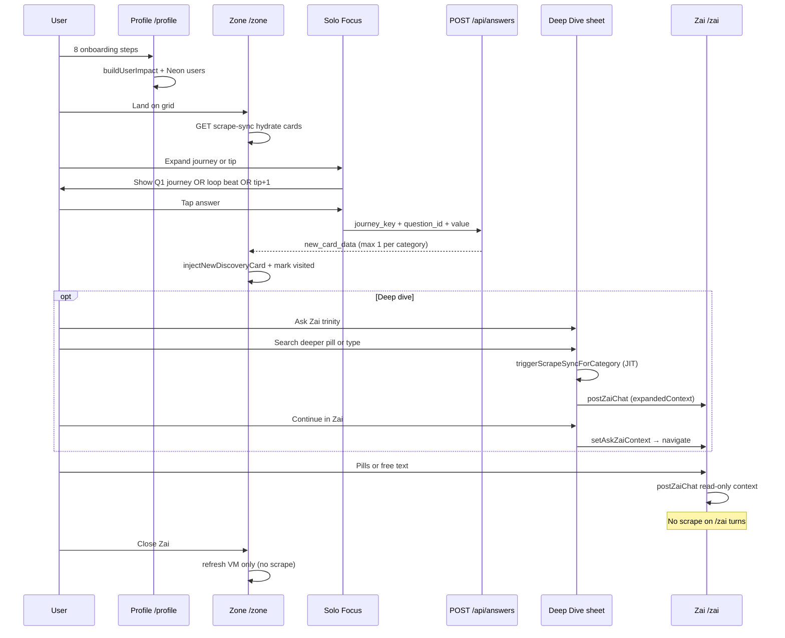

##### Which questions appear where (no overlap)

| When | Question source | Persisted as | Spawns discovery card? |
|------|-----------------|--------------|-------------------------|
| First time through profile | Part 3 — 8 steps only | `profile_*` keys + `users` | No |
| Solo Focus (first open on category) | Part 5 — journey **Q1** (`FUNKY_QUESTION_LABEL`) | `journey_{id}_answers` | Yes — via **`POST /api/answers`** |
| Full journey depth (profile/API path) | Part 4 — up to **3** per domain | `journey_{id}_answers` | Yes — same API, capped inject |
| After Solo Focus **close** (unvisited) | Part 6 — **loop beat** (`LOOP_QUESTION_BANK`) | `zz_loop_answers_log` + journey keys | Yes — if answer committed to API |
| After Solo Focus **close** (visited) | — | — | **No** — close credit guard |
| Tip card **+1** verify | Part 7 — verification follow-up | `targetField` in answers | Triggers **scoped scrape**, not free inject |
| Deep Dive pills | Part 2 — 3 fixed strings | Last question in sheet state | No inject — only Zai reply + optional JIT scrape |
| Zai chat pills | Part 1 — 5 suggested prompts | Chat transcript only | No — read-only turn |

**Rule:** Loop question IDs (`lifestyle_shift_pattern`, etc.) are **not** the same as journey registry IDs (`property_type`, etc.). Both validate through `isValidLoopOrJourneyQuestion` on `POST /api/answers`.

##### Shared data bus (what Zai reads)

| Store | Keys / tables | Written by | Read by Zai |
|-------|---------------|----------|-------------|
| `localStorage` | `profile_*`, `journey_{id}_answers`, `heroTotals`, `visited_cards` | Profile, answers, visits | `postZaiChat` + `getJourneyAnswersFromClient()` |
| `sessionStorage` | `AskZaiContext` (handoff) | Deep Dive **Continue in Zai** | `/zai` mount once, then cleared |
| `localStorage` | `zz_recent_chat_history` (20 turns) | `/zai` chat | `/zai` reload |
| Neon | `users`, `journey_answers_jsonb`, `research_results` | Profile, answers, scrape-sync | `/api/zai` when logged in |
| Zone VM | `buildZoneViewModel` + injections | scrape-sync, inject cap | Zai via totals + expandedContext |

Zai **never** re-runs onboarding questions or loop beats in chat — it only **interprets** answers already stored.

##### Deep Dive ↔ Zai chat ↔ Zone answers

| Action | UI | API / side effect | Injects grid card? |
|--------|-----|-------------------|-------------------|
| Answer in Solo Focus | Embedded question | `POST /api/answers` | Yes (canonical, max 1/category) |
| **Search deeper** in Deep Dive | Sheet pill / submit | `postZaiChat` + `triggerScrapeSyncForCategory` | No — answer stays in sheet |
| **Continue in Zai** | Sheet button | `setAskZaiContext` → `/zai` auto-send | No — uses handoff question as first user turn |
| Type in `/zai` | Chat input / 5 pills | `postZaiChat` only | No |
| Close visited card | × on pink card | `visitedClose` — skip loop/inject | No |

Handoff question shape (`lib/expandStorage.ts`):

`{user label} — I'm on "{card title}" in Zero Zero. Help me save or cut carbon for this.`

##### Close behaviour (visited vs fresh)

```
User taps close on Solo Focus (journey tile)
        │
        ├─ loop beat already answered for this journey? ──YES──► close only (visitedClose)
        │
        └─ NO ──► pickNextLoopQuestion(journey)
                    ├─ beat available ──► DiscoveryTakeover (loop UI) → injectNewDiscoveryCard
                    └─ bank exhausted ──► spawnAchievementWhenLoopPoolExhausted (pink hero card)

inject-* tips: visited_cards contains tip id ──► close only (no loop)
```

Visited cards on the grid stay **pink/yellow**; re-open does not call `/api/zone/injections` on close.

##### Enforcement checklist (working together now)

| Integration | Status | Where |
|-------------|--------|-------|
| Profile → hero baseline → Zone | Wired | `buildUserImpact`, `app/zone/page.tsx` hydrate |
| Journey answer → one discovery inject | Wired | `POST /api/answers`, `MAX_DISCOVERY_INJECTIONS_PER_JOURNEY = 3`, `perCategoryCardCap`, `engineDataRouter` |
| Loop answers → same API validator | Wired | `isValidLoopOrJourneyQuestion` |
| Visited close → no inject | Wired | `shouldSkipInjectionOnCardClose`, `PatternShiftCloseHandler` |
| Deep Dive scrape → Search deeper only | Wired | `AskZaiDeepDiveSheet.submit` |
| Continue in Zai → handoff, no scrape | Wired | `continueInZai` → `setAskZaiContext` only |
| Zai chat → read-only, no scrape | Wired | `app/api/zai/route.ts`, `chatBoundaries` |
| Zai close → Zone refresh only | Wired | `ZAI_AUDIT_COMPLETE_EVENT` → `refreshKey` |
| Chat + deep dive share `postZaiChat` | Wired | `lib/zai/chatClient.ts`, expandedContext on handoff |
| 3-beat + no markdown + no apology | Wired | `prompts.ts`, `stripZaiChatMarkdown` |

##### Troubleshooting “feels disconnected”

| Symptom | Likely cause | Check |
|---------|--------------|-------|
| Zai invents £ not on grid | Chat not reading Neon stream | Logged-in session; `research_results` for postcode |
| Two cards same category | Old client cache | Bump `NEXT_PUBLIC_DATA_VERSION`; clear `visited_cards` |
| Scrape on every Zai message | Should not happen | Confirm no `triggerScrapeSync` in `app/zai/page.tsx` |
| Loop question after pink close | Credit guard bypass | `visited_cards` contains card id |
| Deep Dive + chat duplicate scrape | Continue pressed after Search deeper | Continue does not scrape; only submit does |

---

#### Part 1 — Ask Zai chat (`/zai`)

##### Layout & turn-taking (`lib/zai/chatRules.ts`)

| Rule | Behaviour |
|------|-----------|
| Intro | Always visible (`ZAI_INTRO_LINES`); thread appends below |
| Page title | `<h3 className="zz-page-title">` — global H3, left-aligned |
| Close | Viewport-locked × → Zone; `dispatchZaiAuditComplete()` |
| Scroll | `zai-page-scroll` scrolls; composer fixed at bottom (transparent, no gradient scrim) |
| Pills | Under intro if no Zai reply yet; else under **last non-empty Zai** bubble |
| Pills hidden | While loading, or when last turn is **user** |
| `connect` | Fixed dock only while streaming |
| Input | Fixed dock; 2px shadow on field |
| Bubbles | 30px radius, 15px padding (intro + Zai + user) |

##### Intro copy (`lib/zai/chatPrompts.ts`)

1. `i read your zone — money, carbon, and what you actually do at home.`
2. `pick a prompt or ask your own. one uk move, this week.`

##### Cold-start hook (first Zai bubble when no handoff)

- With hero totals: `i've got £{money}/yr and {carbon}kg on your board in {place}. pick a lane — bills, travel, or grants — and i'll narrow it to one move.`
- Without totals: `i'm zai — your uk savings mate. tell me one bill or trip that nags you in {place}; i'll find a real lever.`

##### Suggested prompt pills (`ZAI_CHAT_SUGGESTED_PROMPTS`)

| # | Prompt |
|---|--------|
| 1 | `where should i start?` |
| 2 | `cut home energy bills` |
| 3 | `travel without the guilt` |
| 4 | `what grant fits me?` |
| 5 | `one change this week` |

##### Session flow

1. **Cold start** — intro + hook (above) when no `AskZaiContext`.
2. **Handoff** — `sessionStorage` `AskZaiContext` consumed once on mount → auto user message → streamed Zai reply.
3. **Free chat** — user types or pill → `POST /api/zai` with transcript, `journey_*_answers`, postcode, hero totals.
4. **History** — last 20 messages → `zz_recent_chat_history`.
5. **Fallback** — `give me a sec — still checking what's live near you.`

##### Handoff question template (`lib/expandStorage.ts`)

- With journey label: `{label} — I'm on "{cardTitle}" in Zero Zero. Help me save or cut carbon for this.`
- Default: `I want to know more about "{cardTitle}" and how I can save. Can you help?`
- Deep dive default if empty: `How can I close the saving gap for this category?`

##### AI voice & boundaries

**Persona:** Zai — UK savings mate; **Detection → Proof → Directive** (3 beats). See `lib/brains/zai/prompts.ts` (`ZAI_EDITORIAL_AUDITOR_DNA`, `ZAI_PERFORMANCE_AUDITOR_V3_MATRIX`).

**Allowed:** explain sustainability; reference card data; small actions; footprint; tradeoffs.

**Forbidden:** financial / medical / legal advice; promised savings; invented products/stats/brands; absolute claims.

**When unsure:** `I don't have enough information to be confident.`

**API:** `POST /api/zai` (streaming). Client guard: `isForbiddenQuestion()` in `lib/brains/zai/boundaries.ts`.

##### Reply chrome (`lib/zai/zaiChatUi.ts`)

On recommendation-shaped replies: **Like**, **source** (URL in prose), **profile answer** link when journey answers exist. Handoff replies always get Like meta.

---

#### Part 2 — Ask Zai Deep Dive sheet

**Component:** `app/components/AskZaiDeepDiveSheet.tsx`  
**Audit helpers:** `lib/zai/deepDiveAudit.ts`  
**Opened from:** Solo Focus or expanded bento — **Ask Zai** in action trinity.

##### UI rules

| Piece | Rule |
|-------|------|
| Shell | Bottom sheet (portal); zip-up; max ~85dvh; scrim closes; **ULM yellow** field (`#FFD700`), **ULM dark** ink (`#1A1A1A`) |
| Header | Category label + **Audit trail** + card headline |
| Audit block | **Calculation summary** + read-only trail (profile genome, journey answers, card £/kg signals, source URL) |
| Pills | **3 category-specific** prompts from `buildDeepDiveQuestionPills(journeyKey)` → **Continue in Zai** (no scrape) |
| Zai replies in sheet | Yellow bubble + dark text (same tokens as `/zai`) |
| Input placeholder | `Ask about this shift…` |
| Submit | **Search deeper** — `postZaiChat` + `triggerScrapeSyncForCategory` (JIT; locality from profile, not hardcoded counties) |
| Continue | **Continue in Zai** — `setAskZaiContext` (includes `shift_title`) → `/zai` read-only handoff |

##### Deep dive pills (per journey)

Generated by `buildDeepDiveQuestionPills` — e.g. home: `show me the math`, `why does this beat the april cap?`, `what do i do this week?`.  
Tapping a pill opens `/zai` with context pre-loaded; it does **not** run a scrape.

User may also type a **free-form** question in the sheet input (**Search deeper** path).

##### Submit behaviour

1. Build API question via `buildSoloFocusAskZaiQuestion(headline, userLabel)`.
2. POST `/api/zai` with `expandedContext` (category journey key, spend, regional avg, `shift_title`, scraped source, journey answers).
3. **`POST /api/zai`** enriches prompts from latest **`research_results`** row (`source_url` / `offer_url` / `saving_amount_gbp` only — never `architect_prose`; Zai explains why/how, not card copy).
4. JIT scrape when postcode ≥ 4 chars; scrape hint uses `scrapeAreaHintFromLocality` (`lib/zai/scrapeAreaHint.ts`).

---

#### Part 3 — Profile onboarding questions

**Route:** `/profile` → `ProfilePageClient.tsx` (`PROFILE_QUESTIONS`)  
**Not** the 13-domain journey bank — those are in Part 4.

| Step | ID | Prompt | Type | Options / placeholder |
|------|-----|--------|------|------------------------|
| 1 | `name` | `name` | text input | placeholder: `alex` |
| 2 | `postcode` | `postcode` | text input | placeholder: `postcode` |
| 3 | `livingSituation` | `who do you live with?` | options | `ALONE`, `COUPLE`, `FAMILY`, `SHARED` |
| 4 | `homeType` | `your home?` | options | `FLAT`, `HOUSE` |
| 5 | `transport` | `how do you get around?` | options | `WALK`, `BIKE`, `PUBLIC`, `CAR`, `MIX` |
| 6 | `age` | `how old are you?` | options | `JUNIOR`, `MID`, `RETIRED` |
| 7 | `employmentStatus` | `employment status?` | options | `EMPLOYED`, `SELF_EMPLOYED`, `UNEMPLOYED` |
| 8 | `goal` | `what is your goal?` | options | `SAVE` → money, `REDUCE` → carbon, `BOTH` → balanced |

After profile: `/profile/summary` → `/zone`.

---

#### Part 4 — Journey questions (13 domains × 3)

**Source of truth:** `lib/journeys.ts` (`JOURNEYS`, `QUESTIONS_PER_JOURNEY = 3`).

- **Profile / API:** all three per domain (`getJourneyQuestionsForProfile`).
- **Solo Focus:** first question only per domain (`SOLO_FOCUS_QUESTIONS_PER_JOURNEY = 1`) — see Part 5.
- **Validation:** `isValidJourneyQuestion(journeyId, questionId)` on `POST /api/answers`.

##### Home

| ID | Label | Options |
|----|-------|---------|
| `property_type` | Is your property detached or semi-detached? | `DETACHED`, `SEMI`, `TERRACED`, `FLAT` |
| `insulation_level` | Current insulation (loft / cavity)? | `FULL`, `PARTIAL`, `NONE`, `UNKNOWN` |
| `glazing_type` | Double or triple glazed? | `TRIPLE`, `DOUBLE`, `SINGLE`, `UNKNOWN` |

##### Grants

| ID | Label | Options |
|----|-------|---------|
| `boiler_age` | Is your boiler over 10 years old? | `OVER_10YR`, `UNDER_10YR`, `UNKNOWN` |
| `income_benefits` | Are you on any income-related benefits? | `YES`, `NO`, `PREFER_NOT` |
| `prior_eco_bus` | Have you had previous ECO4 or BUS grants? | `YES`, `NO`, `UNSURE` |

##### Solar

| ID | Label | Options |
|----|-------|---------|
| `roof_orientation` | Roof pitch orientation (S / E / W)? | `SOUTH`, `EAST`, `WEST`, `MIXED`, `FLAT` |
| `roof_shading` | Do you have a chimney or significant shading? | `NONE`, `CHIMNEY`, `TREES`, `BOTH` |
| `daytime_occupancy` | Average daytime occupancy at home? | `HIGH`, `MEDIUM`, `LOW`, `OUT_MOST_DAYS` |

##### Travel

| ID | Label | Type | Options / notes |
|----|-------|------|-----------------|
| `commute_distance` | Daily commute distance (miles)? | number | repeat: `Even a rough estimate helps — miles per day?` |
| `ev_hybrid` | Do you own an EV or hybrid? | options | `EV`, `HYBRID`, `PETROL_DIESEL`, `NONE` |
| `public_transport` | Public transport access near you? | options | `EXCELLENT`, `LIMITED`, `NONE` |

##### Holidays

| ID | Label | Options |
|----|-------|---------|
| `annual_flights` | Annual flight count? | `NONE`, `ONE_TWO`, `THREE_PLUS` |
| `flight_duration` | Average flight duration (hours)? | `SHORT`, `MEDIUM`, `LONG_HAUL` |
| `carbon_offsets` | Do you buy carbon offsets? | `YES`, `NO`, `SOMETIMES` |

##### Food

| ID | Label | Options |
|----|-------|---------|
| `diet_profile` | Meat-heavy or plant-based? | `MEAT_HEAVY`, `FLEXI`, `PLANT_BASED` |
| `organic_shopping` | Percentage of organic shopping? | `HIGH`, `SOME`, `RARELY`, `NEVER` |
| `own_produce` | Do you grow any of your own produce? | `YES`, `NO`, `STARTING` |

##### Shopping

| ID | Label | Options |
|----|-------|---------|
| `retail_channel` | High-street or second-hand first? | `HIGH_STREET`, `SECOND_HAND`, `MIXED` |
| `repair_mindset` | Repair vs replace mindset? | `REPAIR_FIRST`, `REPLACE`, `MIXED` |
| `online_deliveries` | Frequency of online deliveries? | `DAILY`, `WEEKLY`, `MONTHLY`, `RARELY` |

##### Money

| ID | Label | Type | Options / notes |
|----|-------|------|-----------------|
| `monthly_energy_bill` | Monthly energy bill (£)? | number | repeat: `Rough figure is fine — what do you pay per month?` |
| `tariff_type` | Fixed or variable tariff? | options | `FIXED`, `VARIABLE`, `UNKNOWN` |
| `green_investments` | Interest in green investments? | options | `HIGH`, `SOME`, `NONE` |

##### Tech

| ID | Label | Options |
|----|-------|---------|
| `smart_thermostat` | Smart thermostat (Nest / Hive)? | `YES`, `NO`, `PLANNED` |
| `smart_home` | Home Assistant or smart plugs? | `YES`, `NO`, `PARTIAL` |
| `smart_meter` | Smart meter installed? | `YES`, `NO`, `UNKNOWN` |

##### Water

| ID | Label | Options |
|----|-------|---------|
| `garden_butt` | Garden size suitable for water butts? | `LARGE`, `SMALL`, `NONE` |
| `wash_preference` | Shower or bath preference? | `SHOWER`, `BATH`, `BOTH` |
| `rainwater_harvest` | Rainwater harvesting setup? | `YES`, `NO`, `PLANNED` |

##### Waste

| ID | Label | Options |
|----|-------|---------|
| `food_waste_collection` | Access to food waste collection? | `YES`, `NO`, `PARTIAL` |
| `composting` | Composting on-site? | `YES`, `NO`, `SHARED` |
| `soft_plastics` | Soft plastic recycling habit? | `ALWAYS`, `SOMETIMES`, `NEVER` |

##### Carbon

| ID | Label | Options |
|----|-------|---------|
| `footprint_awareness` | Are you aware of your total footprint? | `YES`, `ROUGH`, `NO` |
| `carbon_removal` | Interest in carbon removal? | `HIGH`, `SOME`, `NONE` |
| `tonne_reduction_timeline` | Timeline for 1t reduction? | `THIS_YEAR`, `ONE_TO_THREE`, `LONGER` |

---

#### Part 5 — Solo Focus (one journey question per session)

**Cap:** `SOLO_FOCUS_MAX_QUESTIONS_PER_SESSION = 3` in `lib/animations.ts` (embedded chamber); registry exposes **one** high-leverage question per open (`getSoloFocusQuestions`).

**Displayed label on Zone bento (first question only):** `FUNKY_QUESTION_LABEL` in `lib/journeys.ts`:

| Journey | Solo Focus prompt (Q1 label) |
|---------|------------------------------|
| home | Is your property detached or semi-detached? |
| grants | Is your boiler over 10 years old? |
| solar | Roof pitch orientation (S / E / W)? |
| travel | Daily commute distance (miles)? |
| holidays | Annual flight count? |
| food | Meat-heavy or plant-based? |
| shopping | High-street or second-hand first? |
| money | Monthly energy bill (£)? |
| tech | Smart thermostat (Nest / Hive)? |
| water | Garden size suitable for water butts? |
| waste | Access to food waste collection? |
| carbon | Are you aware of your total footprint? |

---

#### Part 6 — Zone loop questions (post–Solo Focus beats)

**Source:** `lib/zone/loopQuestions.ts` (`LOOP_QUESTION_BANK`).  
**Rules:** each `questionId` shown **at most once** per browser profile; `pickNextLoopQuestion(journeyId)` prefers beats tagged for that journey (or global beats with empty `journeyKeys`).

| questionId | Prompt (UI) | Journey tags | Answer options (value) |
|------------|-------------|--------------|-------------------------|
| `lifestyle_shift_pattern` | swap your annual / flight for rail? | (any) | YES — RAIL & LOCAL · MAYBE — SHOW ME · NO — KEEP FLYING |
| `travel_rail_vs_flight` | rail instead / of flying? | travel | YES — RAIL · SHOW ME THE MATH · KEEP FLYING |
| `travel_ev_commute` | ev for your / commute? | travel, money | YES — EV · COMPARE COSTS · KEEP PETROL |
| `holidays_local_vs_longhaul` | uk staycations / not long-haul? | holidays | YES — LOCAL · MAYBE · KEEP LONG-HAUL |
| `holidays_train_not_plane` | train to europe / not short flights? | holidays, travel | YES — TRAIN · SHOW ROUTES · KEEP FLYING |
| `food_plant_shift` | two plant-based / meals a week? | food | YES · TRY IT · NOT YET |
| `food_waste_cut` | cut food waste / by half? | food, waste | YES · SHOW TIPS · NOT YET |
| `money_ev_swap` | swap petrol / for an ev? | money | YES — EV · COMPARE COSTS · KEEP PETROL |
| `money_smart_tariff` | switch to a / smart tariff? | money, home | YES — SWITCH · COMPARE · STAY PUT |
| `home_heat_pump` | heat pump / not gas? | home | YES · CHECK ELIGIBILITY · STAY ON GAS |
| `home_loft_insulate` | loft insulation / this year? | home, grants | YES · GET QUOTE · NOT YET |
| `grants_bus_boiler` | check bus grant / for your boiler? | grants, home | YES · MORE INFO · NOT ELIGIBLE |
| `solar_roof_fit` | solar on your / roof? | solar, home | YES · FREE SURVEY · NOT YET |
| `shopping_repair_first` | repair before / you replace? | shopping | YES · SHOW LOCAL · BUY NEW |
| `tech_standby_off` | kill standby / at night? | tech | YES · SHOW HOW · NOT YET |
| `water_meter_save` | water meter / save water? | water | YES · CHECK · NO METER |
| `waste_compost` | compost food / scraps? | waste, food | YES · TRY IT · NOT YET |
| `carbon_offset_cut` | cut direct / emissions first? | carbon | YES · SHOW PLAN · OFFSET ONLY |

Answers persist to `zz_loop_answers_log` and `journey_{id}_answers` (loop ids). Valid on `POST /api/answers` via `isValidLoopOrJourneyQuestion`.

---

#### Part 7 — Tip verification (+1) questions

**Source:** `lib/zone/tipVerification.ts` — one follow-up per journey before earned deep scrape (Solo Focus tip path). Card may override with its own `followUp`.

| Journey | Question | Options |
|---------|----------|---------|
| home | Is your loft insulated to 270mm? | YES, PARTLY, NO |
| grants | Are you on any income-related benefits? | YES, NO, PREFER NOT |
| solar | Do you have a south-facing roof? | YES, PARTLY, NO |
| travel | Could you switch one flight to rail this year? | YES, MAYBE, NO |
| holidays | Could your next break stay in the UK? | YES, MAYBE, NO |
| food | Do you batch-cook to cut food waste? | YES, SOMETIMES, NO |
| shopping | Do you delay non-essential buys 48 hours? | YES, SOMETIMES, NO |
| money | Are you on a smart or time-of-use tariff? | YES, NOT SURE, NO |
| tech | Do you leave devices on standby overnight? | YES, SOMETIMES, NO |
| water | Do you have a water meter? | YES, NO, NOT SURE |
| waste | Do you compost food scraps at home? | YES, SOMETIMES, NO |
| carbon | Could you shift heavy use off-peak? | YES, MAYBE, NO |

---

#### Quick map — where questions appear

See **How it all works together** above for the full sequence. Compact view:

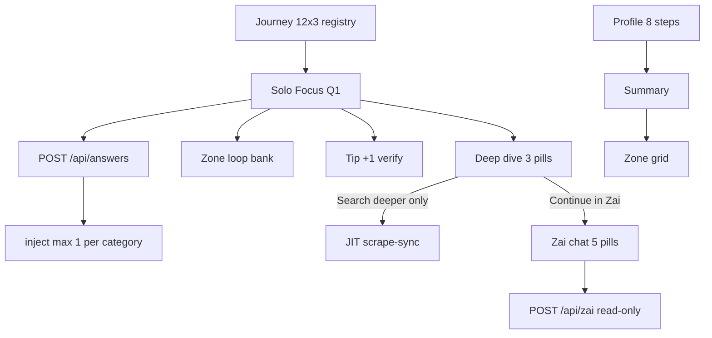

| Surface | Count | File |
|---------|-------|------|
| Profile onboarding | 8 | `ProfilePageClient.tsx` |
| Journey registry | 36 (12×3) | `lib/journeys.ts` |
| Solo Focus (shown) | 12 (Q1 each) | `lib/journeys.ts` |
| Zone loop bank | 18 beats | `lib/zone/loopQuestions.ts` |
| Tip verification | 12 | `lib/zone/tipVerification.ts` |
| Deep dive pills | 3 | `SoloFocusOverlay.tsx`, `JourneyBentoCard.tsx` |
| Zai chat pills | 5 | `lib/zai/chatPrompts.ts` |

---

*Last synced with repo registry files — update **How it all works together** when changing handoff, inject caps, or scrape gates. Update question tables when editing `journeys.ts`, `loopQuestions.ts`, or `chatPrompts.ts`. Zone content: **[ZONE-CONTENT-AND-DATA.md](ZONE-CONTENT-AND-DATA.md)** · Sentinel: **[SENTINEL.md](SENTINEL.md)** · Gary/rebirth/pattern shift: **[SUPPLEMENTAL-SYSTEMS.md](SUPPLEMENTAL-SYSTEMS.md)**.*

---

## Annex: ULM ceilings & spawn {#annex-ulm-ceilings--spawn}

*Source file: `ULM-APPLICATION-LOOP.md`*


Production blueprint: **free API intercept → deterministic engine → surgical premium tier**.  
Zai is the **only** product bot (no secondary chat widget).

**Code map:** `lib/zone/ulmLimits.ts`, `lib/zone/engineDataRouter.ts`, `lib/intelligence/freeTierHydration.ts`, [HYBRID-DATA-PIPELINE.md](HYBRID-DATA-PIPELINE.md), [ZONE-CONTENT-AND-DATA.md](ZONE-CONTENT-AND-DATA.md), [SENTINEL.md](SENTINEL.md), [SUPPLEMENTAL-SYSTEMS.md](SUPPLEMENTAL-SYSTEMS.md), [ZAI-AND-QUESTIONS-RULES.md](ZAI-AND-QUESTIONS-RULES.md).

---

#### Credit guardrails (enforced)

| Layer | Cost | Modules |
|-------|------|---------|
| Free intercept | 0 tokens | `openEpcClient`, `nesoGridClient`, `pvgisClient`, `defraWasteClient`, `getLocalData` |
| Deterministic £/kg | 0 tokens | `buildUserImpact`, `engineDataRouter` deltas |
| Premium | Gemini + capped Firecrawl | `premiumEditorialExtraction`, Deep Dive **Search deeper** only |

**Hermes:** weekly `repair=1` backfill only — no change when ULM ships.

---

#### Hard ceilings (`lib/zone/ulmLimits.ts`)

| Constant | Value |
|----------|-------|
| `MAX_ZONE_BENTO_CELLS` | **24** (journey + tip cells; hero excluded) — `clipGroovyGridToCeiling` |
| `MAX_DISCOVERY_INJECTIONS_PER_JOURNEY` | **3** per `journey_key` |
| `INITIAL_ROCK_SAVING_TIPS` | **6** (rotation seeds) |
| `MAX_ROCK_SAVING_TIPS_RAIL` | **12** |
| `ULM_KWH_PER_TONNE_CO2E` | **12_000** (12k/1t auditor copy) |

Grid discovery tips on wall: still **1 earned inject per category** via `perCategoryCardCap` (13 journeys + injects ≤ 24).

---

#### 1. Profile (`/profile`)

- 8 steps → `buildUserImpact` baseline; no Gemini/Firecrawl on onboarding.
- Postcode step: optional **house number** (`profile_house_number`) on the same screen — disambiguates OpenEPC rows when a postcode has multiple dwellings.
- Postcode (+ optional house number) → `POST /api/local-intelligence` (`house_number` in body; GET `?house_number=`) → `hydrateFreeStructuralContext` → `fetchOpendataEpcProfile(postcode, { houseNumber })` → `user_genome.open_data_anchor`.
- When EPC `addressMatched` and `home_type` unset, onboarding may pre-select **FLAT** / **HOUSE** from register `propertyType` (`lib/epc/mapEpcToProfileHints.ts`) — user can override on the next step.
- Motion: `STACCATO_TWEEN` questions; summary uses `IntroWordCycle` / `opacityTicker`.

---

#### 2. Zone (`/zone`)

- **Vertical stack (DOM):** welcome → profile hero card → **today's tips** heading + Rock rail → **recommendations** heading + category bento → mobile signup. Headings live in `zone-rock-strip` / `zone-category-wall` — **not** inside `groovy-zone-grid`. Gates: `wallSectionsReady` + `zoneRevealCount >= 1` (`app/zone/page.tsx`). Test ids: `zone-section-welcome`, `zone-section-today-tips`, `zone-section-recommendations`, `zone-section-signup`.
- **13 domains:** `JOURNEY_ORDER` in `lib/journeys.ts` (`home` → `utilities` → … → `carbon`). All 13 mother tiles render in the recommendations grid; **utilities** stays `COMPUTING` until profile **power type** is set (`lib/zone/utilitiesZoneUnlock.ts`).
- **Grid order:** `buildGroovyGridItems` (`lib/zone/gridOrder.ts`) — hero excluded; mothers sorted by goal-weighted £ then `JOURNEY_ORDER`; discovery `inject-*` tips nest after parent; **max 2 cells/category**, **24 cells** total ceiling.
- **Mechanical truth:** empty Neon → `COMPUTING — JOURNEY` / `—`; no fake £.
- **Visited:** `visited_cards` → pink `#FF00FF` / yellow `#FDFD00` (`.zone-card--visited`).
- **Rock rail:** navy + yellow; 6-slot rotation; display capped at 12; grid titles from catalog (`clampRockTipHeadline`); rail excludes wall headline duplicates (`prepareRockHabitsForRail`).
- **Nav:** `ZoneDesktopNavRail` + `<Link>` routes from **768px**; floating nav hidden on Zone at same breakpoint.

---

#### 3. Loop & spawn

- **1 card = 1 question** — Solo Focus isolation.
- **POST /api/answers** → exactly **one** discovery card in JSON; hybrid race when `MODEL_STRATEGY=bucket_failover`.
- **Zip-shut** → next loop beat (`ZIP_SHUTTER_SPRING`).
- **Visited close guard:** `shouldSkipInjectionOnCardClose` — no inject/scrape on tip close.

---

#### 4. Headlines (`lib/soloFocusCopy.ts`)

| Surface | Words |
|---------|-------|
| Zone bento | **5–8** — `enforceHeadlineWordLimits(text, false)` |
| Today's Tips grid | **3–10** — `clampRockTipHeadline` (catalog title; not wall hook) |
| Solo Focus / expanded hook (mother) | **20–24** — `headlineFromExpandedHook` + `EXPANDED_JOURNEY_HOOK` when weak; else `enforceHeadlineWordLimits(text, true)` |
| Solo Focus / expanded hook (Rock) | **20–24** — `headlineFromRockHabit(title, insight)` — **no** `EXPANDED_JOURNEY_HOOK` |
| Solo Focus Marvin lead | **≤30** — `resolveSoloFocusDisplayProse`; `buildAuditorDetectionParagraph` when lead lacks town opener |
| Prose beats | ≤ **40** words / paragraph |

Full scrape → copy → presentation pipeline: **[ZONE-CONTENT-AND-DATA.md](ZONE-CONTENT-AND-DATA.md)**.

---

#### 5. Zai (`/zai`)

- **Persona:** active auditor with a pint — `ZAI_PERFORMANCE_AUDITOR_V3_MATRIX` in `lib/brains/zai/prompts.ts`.
- **Read-only chat:** no Firecrawl on `POST /api/zai`.
- **JIT scrape exception:** `AskZaiDeepDiveSheet` → **Search deeper** only.
- **Stream UI:** `postZaiChat` + `readZaiStream` (not a floating third-party bot).
- **Fallback:** `i don't have enough information to be confident on that one. let's stick to your bills or travel moves.`

---

#### Env

```env
MODEL_STRATEGY=bucket_failover
HYBRID_DATA_PIPELINE=1
OPENEPC_EMAIL=
OPENEPC_API_KEY=
```

---

#### Verify

```bash
npm run verify
npm run db:audit
```

---

## Annex: Hybrid data pipeline (cost tiers) {#annex-hybrid-data-pipeline-cost-tiers}

*Source file: `HYBRID-DATA-PIPELINE.md`*


Full product loop: **[ULM-APPLICATION-LOOP.md](ULM-APPLICATION-LOOP.md)**. **How scraped data becomes card copy and Solo Focus prose:** **[ZONE-CONTENT-AND-DATA.md](ZONE-CONTENT-AND-DATA.md)**.

**Principle:** Math and structure are free; raw scrape and LLM analysis cost money.

| Tier | Surface | Premium (Gemini / Firecrawl) |
|------|---------|------------------------------|
| **A** | Profile onboarding (8 steps + postcode; optional house number) | **None** — Postcodes.io, Carbon Intensity API, optional OpenEPC |
| **B** | Zone grid (`buildZoneViewModel`) | **None** for baseline £/kg on 13 journey tiles |
| **B′** | Cached `research_results` tip copy | **Only if row empty** — surgical seed URL + Gemini triplet |
| **C** | Solo Focus answer (`POST /api/answers`) | **Hybrid spawn** when `MODEL_STRATEGY=bucket_failover` — locked £/kg + editorial Gemini |
| **D** | `/zai` chat | **None** — read-only Neon + genome; no Firecrawl |

#### Code map

| Module | Role |
|--------|------|
| `lib/intelligence/nesoGridClient.ts` | Regional gCO₂/kWh (Carbon Intensity API) |
| `lib/intelligence/openEpcClient.ts` | EPC register (needs `OPENEPC_EMAIL` + `OPENEPC_API_KEY`); optional `houseNumber` filters by register address |
| `lib/intelligence/epcAddressMatch.ts` | Address-token filter before `pickLatestRow` when house number set |
| `lib/intelligence/freeTierHydration.ts` | Tier A parallel hydrate → `user_genome.open_data_anchor` (stores `houseNumber` on anchor) |
| `lib/zone/engineDataRouter.ts` | `processCalculatedLoopSpawn` — deterministic deltas + one discovery card |
| `lib/agents/premiumEditorialExtraction.ts` | Gemini prose only; £/kg passed in as locked facts |
| `lib/brains/buildUserImpact.ts` | Single source of truth for Zone tile £/kg |
| `lib/intelligence/scrapeBoundaries.ts` | `bucket_failover` gates broad scrape |

#### Env

```env
MODEL_STRATEGY=bucket_failover   # enables hybrid Solo Focus spawn + scrape gates
### Optional explicit toggle (also on when bucket_failover):
HYBRID_DATA_PIPELINE=1

### OpenEPC (England & Wales) — skip silently if unset
OPENEPC_EMAIL=you@example.com
OPENEPC_API_KEY=your-register-key
```

#### Hermes

No VPS change. Hermes still calls `GET/POST /api/cron/zone-research?repair=1` for **backfill** on incomplete `research_results`. Day-to-day discovery is earned in-app (Tier C), not cron.

#### Neon

- **`user_genome.open_data_anchor`** — EPC + grid snapshot at postcode hydrate (`houseNumber` when provided)
- **`research_results`** — premium editorial rows with `invokePayload.trigger: hybrid-pipeline`
- Keep **`journey_answers`** + **`journey_answers_jsonb`** (dual-write)

#### Run audit

```bash
npm run db:audit
npm run verify
```

---

## Annex: Full app spec (architecture, APIs, DB) {#annex-full-app-spec-architecture-apis-db}

*Source file: `FULL-APP-SPEC.md`*


Operational architecture for the UK postcode-driven energy auditor: what talks to what, where data lives, and how Profile, Zone, Solo Focus, and Neon research fit together.

**Related docs:** [GUARDRAILS-AND-PIPELINE.md](GUARDRAILS-AND-PIPELINE.md) · [HANDBOOK.md](HANDBOOK.md) · [ZONE-CONTENT-AND-DATA.md](ZONE-CONTENT-AND-DATA.md) · [SENTINEL.md](SENTINEL.md) · [INTELLIGENCE-PIPELINE-FINAL.md](INTELLIGENCE-PIPELINE-FINAL.md) · [PROFILE-ANSWERS-ZONE-TECH.md](PROFILE-ANSWERS-ZONE-TECH.md) · [PROFILE-FIELDS-GRID-UNLOCKS.md](PROFILE-FIELDS-GRID-UNLOCKS.md) · [ZAI-AND-QUESTIONS-RULES.md](ZAI-AND-QUESTIONS-RULES.md)

**Production:** https://www.00-00.online · **Repo:** https://github.com/00app/00-ULM

---

#### 1. Product overview

Zero Zero is a UK-first web app. A user provides a **postcode** and a short **profile** (household, transport, goals). The app shows a **Zone** — a bento grid of 13 journey domains (home, grants, solar, travel, etc.) with savings and carbon hints. Tapping a card opens **Solo Focus**: answer embedded questions, see a researched recommendation, then optionally **spawn** a sharper “child” insight.

##### 1.1 Metaphor: brain, stomach, memory, nervous system

| Metaphor | Role | Implementation |
|----------|------|----------------|
| **Brain** | Reasoning and copy | **Gemini** — audits, headlines, three prose paragraphs, discovery cards |
| **Stomach** | Ingestion | **Firecrawl** — scrapes trusted UK pages (Ofgem, GOV.UK, grants, tariffs) |
| **Memory** | Persistence | **Neon Postgres** — users, answers, `research_results` per category/postcode |
| **Nervous system** | Orchestration | **Next.js on Vercel** — API routes: scrape → model → persist → JSON to browser |
| **Cron trigger** | External clock | **Vercel Cron** (`vercel.json`) hits `/api/cron/zone-research` daily at 05:00 UTC; does not run AI itself |

The cron trigger only **wakes** the app. The app uses `DATABASE_URL`, `GEMINI_API_KEY`, and `FIRE_CRAWL_KEY_2` (or `FIRECRAWL_API_KEY`) to execute the pipeline.

**2026-07-07:** Hermes (the Oracle Cloud free-trial VPS that used to make this call) was retired after its trial credit expired — see §11.

---

#### 2. High-level architecture

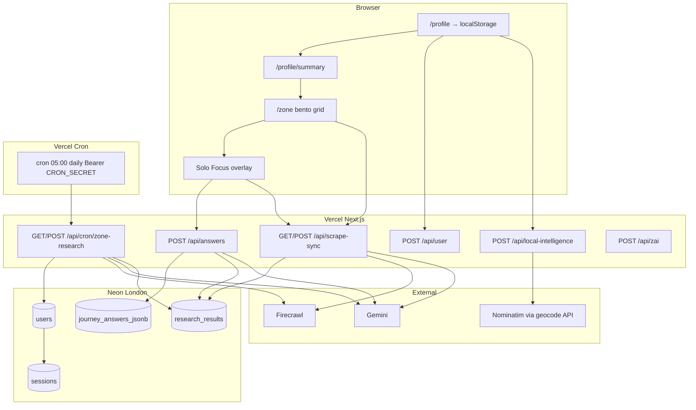

##### 2.1 End-to-end intelligence loop

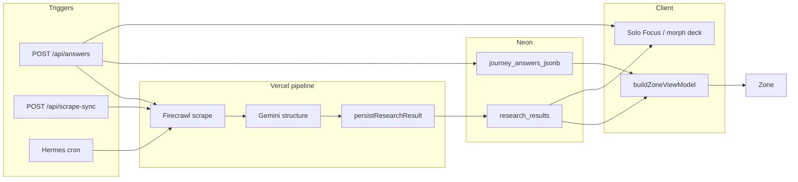

---

#### 3. User journey (routes)

| Step | Route | What happens |
|------|--------|----------------|
| Intro | `/`, `/intro` | Logo glitch (Style A) → kinetic words → lockup **CREATE A / PROFILE TO / START.** at **profile H2 scale** → CREATE → profile. Geolocation may seed `profile_postcode`. `?skip=1` skips logo. |
| Profile | `/profile` | Stepped onboarding: name (**given-name**, first token only), **postcode** (+ optional house number), household, home type, **power type**, transport, age, employment. **Goal** from intro (`profile_goal`). Full-sentence fade per step. **`POST /api/user`** on submit → session + capped JIT scrapes. |
| Summary | `/profile/summary` | Kinetic **HELLO → name → locality** (`IntroWordCycle`, opacity ticker only). Impact totals. Handshake scrape. |
| Zone | `/zone` | 13 journey cards + Saving Tips; hydrates from Neon via scrape-sync. |
| Solo Focus | Overlay on Zone | Questions → answer → zip-shut → result / morph card. |
| Zai | `/zai` | Free-form chat (Gemini), separate from MC answer birth path. |
| Other | `/likes`, `/settings` | Saved cards, reset/session. |

There is no separate `/journeys` product route — journeys live on Zone.

**Canonical Zone path:** `app/zone/page.tsx` → `lib/zone/buildZoneViewModel.ts` (facade: `lib/logic/zone.ts`).

##### 3.1 Personalization — how questions influence Zone

Every signed-in user who completes profile + summary hits the same **staged** intelligence loop. Questions influence Zone through **four channels** (not every question changes every tile’s £):

| Channel | What moves | Primary inputs |
|---------|------------|----------------|
| **JIT scrape selection** | Which journeys get Firecrawl+Gemini first (cap 4) | Goal, power type, employment seeds |
| **£ / kg maths** | Journey tile SAVE/CARBON when stream exists | Profile + journey MC answers → `buildUserImpact` |
| **Sort / filter / copy** | Hero order, grants headline, Rock tip filter | Goal, employment, age persona, council |
| **Neon synthesis** | Headlines, prose, `offer_url` on mother tiles | Postcode DNA, profile snapshot, answers in prompts |

**Authoritative matrices:** [PROFILE-FIELDS-GRID-UNLOCKS.md](PROFILE-FIELDS-GRID-UNLOCKS.md) (profile + pipeline) · [PROFILE-ANSWERS-ZONE-TECH.md](PROFILE-ANSWERS-ZONE-TECH.md) §1–2 (39 MC questions) · [INTELLIGENCE-PIPELINE-FINAL.md](INTELLIGENCE-PIPELINE-FINAL.md) (triggers + offer URL precedence).

**Offer URL precedence (journey mother tiles):** Neon `offer_url` → formula `claimOfferUrl` (Octopus, EV grant, etc.) → `trustedJourneyUrls` → Ask Zai deep link. **Rock Today's Tips:** habit slug/provider map via `resolveRockHabitLearnUrl` — Neon journey offer merged only when `mergeRockHabitWithJourneyOffer` passes topic shield (no e-bike → Eurostar bleed).

---

#### 4. Postcode, profile, and identity

##### 4.1 Postcode as geographic anchor

- Stored in **`localStorage`** as `profile_postcode` and on `users.postcode` after signup.
- Zone reads via `readProfilePostcode()` / `AppContext`; passed on every research call.
- Geocoding never runs in the browser:
  - `POST /api/local-intelligence` — council, ward, grant context
  - `GET /api/geocode/postcode` — locality cached as `profile_locality_name`

**Postcode change** → `clearZoneVmLocalCache()` wipes journey answers, hero totals, Solo Focus session keys, locality cache.

**Read order:** URL `?postcode=` → `localStorage profile_postcode` (`lib/zone/safeProfileStorage.ts`).

##### 4.2 Profile onboarding → server user

1. User completes steps in `ProfilePageClient.tsx`.
2. **`POST /api/user`** creates `users` row (`gen_random_uuid()`), sets **httpOnly session cookie**, returns locality from `getLocalData(postcode)`.
3. Client mirrors to `localStorage` and `AppContext.refreshProfile()`.

If signup fails, client keeps localStorage and can use a **browser research UUID** (`ensureClientResearchUserId`) for scrape-sync and answers without session.

##### 4.3 Research user id (Neon row ownership)

| Priority | Source |
|----------|--------|
| 1 | Session (`users.id` + `sessions` cookie) after successful `/api/user` |
| 2 | Client research id: Gary UUID for BN17, or `crypto.randomUUID()` in `zz_research_user_id` |

Passed as `?user_id=` on **GET scrape-sync** and in **POST** bodies for trigger/answers.

##### 4.4 Gary / demo mode (BN17 only)

- Postcode starting with **BN17** pins research to UUID `00000000-0000-4000-a000-000000000000`.
- All scrape-sync calls append `user_id` when active (`lib/zone/garyMode.ts`).
- Links pre-seeded Neon rows to demo — **not** a default for unknown postcodes.

##### 4.5 Locality (Summary header)

- `resolveProfileLocalityForPostcode` + Nominatim via geocode API.
- Summary uses current postcode locality, not a fixed demo string (`lib/brains/summaryLogic.ts`).

---

#### 5. Journey questions and answers (13 × 3)

**Source of truth:** `lib/journeys.ts`

| Journey key | Example question ids |
|-------------|----------------------|
| `home` | `property_type`, `insulation_level`, `glazing_type` |
| `utilities` | `tariff_type`, `supplier_switch`, `monthly_energy_band` |
| `grants` | `boiler_age`, `income_benefits`, `prior_eco_bus` |
| `solar` | `roof_orientation`, `roof_shading`, `daytime_occupancy` |
| `travel` | `commute_distance`, `ev_hybrid`, `public_transport` |
| `holidays` | `annual_flights`, `flight_duration`, `carbon_offsets` |
| `food` | `diet_profile`, `organic_shopping`, `own_produce` |
| `shopping` | `retail_channel`, `repair_mindset`, `online_deliveries` |
| `money` | `monthly_energy_bill`, `tariff_type`, `green_investments` |
| `tech` | `smart_thermostat`, `smart_home`, `smart_meter` |
| `water` | `garden_butt`, `wash_preference`, `rainwater_harvest` |
| `waste` | `food_waste_collection`, `composting`, `soft_plastics` |
| `carbon` | `footprint_awareness`, `carbon_removal`, `tonne_reduction_timeline` |

- **13 domains**, **3 questions each** (`JOURNEY_ORDER`).
- Question labels are **behavioural** — no £/kg in copy.
- **Next question:** `lib/zone/questionHandler.ts` → `getNextQuestion(journeyId, answers)`.

##### 5.1 Where answers are stored

| Layer | Storage |
|-------|---------|
| Browser | `localStorage` → `journey_{journeyId}_answers` |
| Server | `journey_answers_jsonb` — one JSONB blob per user (all journeys) |
| Legacy | `journey_answers` normalized rows |
| Mirror | `user_profiles.journey_answers_jsonb` (optional Hermes/audit) |
| Pre-login | `guest_sessions` by `zz_sid` cookie |

##### 5.2 Answer flow diagram

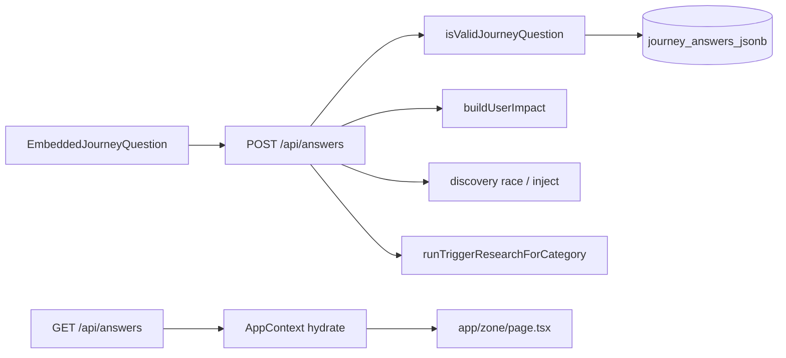

---

#### 6. API reference

##### 6.1 Identity and profile

| API | Method | Role |
|-----|--------|------|
| `/api/user` | POST | Create user + session from profile payload |
| `/api/user` | GET | Return session user or `null` |
| `/api/auth/login`, `signup`, `logout` | — | Session auth |
| `/api/local-intelligence` | POST | Postcode → council, ward, carbon context, grant hints |
| `/api/geocode/postcode` | GET | Server Nominatim proxy → locality name |

##### 6.2 Twilio SMS (Rock mobile signup)

| API | Method | Role | Auth |
|-----|--------|------|------|
| `/api/profile/mobile` | POST | Save E.164 mobile; **welcome SMS** on first/changed number; **Today's Tips + Recommendations** SMS when Twilio ready | **Session required** (401 if guest) |
| `/api/webhooks/twilio` | POST | Inbound STOP / START / delivery status; persists `mobile_sms_opt_in` on `users` | Twilio webhook |

**Request body:** `{ mobile, sms_opt_in: true, tips?, tipSlugs?, recommendations?, userName? }` — **`sms_opt_in` required** (explicit PECR consent; checkbox on `RockMobileSignupCard`).

**Signup SMS copy:** `lib/messaging/signupZoneSms.ts` — dashed sections: Hello + first name → Today's tips (Rock habits via `resolveRockHabitLearnUrl`) → Recommendations (journey mother titles + `resolveJourneyCardUrl` from Zone VM).

**Welcome SMS (separate send):** `lib/messaging/welcomeSms.ts` — opt-in confirmation; fires before tips SMS when mobile is new or changed.

**UI entry:** `RockMobileSignupCard` below Today's Tips — passes `tips`, `tipSlugs`, `recommendations`, `userName` from `app/zone/page.tsx` (`zoneSignupTips`, `zoneSignupTipSlugs`, `zoneSignupRecommendations`).

**Env (Vercel Production + Preview, and `.env.local` for dev):** `TWILIO_ACCOUNT_SID`, `TWILIO_AUTH_TOKEN`, `TWILIO_PHONE_NUMBER`. Optional: `TWILIO_WEBHOOK_URL`, `TWILIO_MESSAGING_ENABLED=0` (kill sends).

**DB:** `users.mobile` · `users.mobile_sms_opt_in` (default **`false`**; STOP sets `false`, START sets `true`). Migration: `db/migrations/020_users_mobile_sms_opt_in.sql`.

**Hermes:** not involved — signup SMS is synchronous on `POST /api/profile/mobile`. Hermes only triggers weekly research repair (`/api/cron/zone-research`).

**Not in env:** User personal mobiles — Neon `users.mobile` per account. Upgrade Twilio off Trial for outbound to any signup mobile (trial = verified numbers only).

**Code:** `lib/messaging/twilioConfig.ts` · `lib/messaging/twilioClient.ts` · `lib/messaging/outboundGate.ts` · `lib/messaging/signupZoneSms.ts` · `lib/rock/resolveRockHabitLearnUrl.ts` · `app/api/webhooks/twilio/route.ts`

##### 6.3 Zone hydration

| API | Method | Role |
|-----|--------|------|
| `/api/scrape-sync` | GET | Primary Zone load: `scraped[]`, `research_category_coverage`, unit rates; Tier 2: `category`, `answer`, `question_id` |
| `/api/scrape-sync` | POST | Trigger research: `{ trigger, postcode, category, user_id, profileData }` |
| `/api/scrape-sync` | GET `?repair=1` | Backfill missing headlines/prose without full Firecrawl loop |
| `/api/scrape-sync` | GET `?force=true` | Heavy full research run (slow) |

**Auth for POST scrape-sync:** Bearer `CRON_SECRET` / `SCRAPER_SECRET`, session, or **postcode + valid `user_id`**.

##### 6.4 Answer loop (canonical discovery birth)

| API | Method | Role |
|-----|--------|------|
| `/api/answers` | POST | Save answer; recompute impact; discovery race; `runTriggerResearchForCategory`; returns `new_card_data`, `morphCards`, totals |
| `/api/answers` | GET | Hydrate journey answers for logged-in user |

**Auth for POST answers:** session **or** valid `user_id` in body (`lib/answers/resolveAnswersUser.ts`).

**Handler:** `app/api/answers/route.ts`

##### 6.5 Supplemental (capped)

| API | Role |
|-----|------|
| `/api/research/question-card` | Free-form Ask → new card (**not** MC answer birth) |
| `/api/zone/injections` | Trap follow-up cards |
| `/api/zone/tips-refresh` | Refresh injected tip tiles |
| `/api/zone/content-architect` | Optional Gemini polish on architect prose |
| `/api/discovery/pulse` | Economy fingerprint for tip £ patches |
| `/api/zone/generate-next` | Morph / next-win hints |

**Cap:** `MAX_DISCOVERY_INJECTIONS_PER_JOURNEY` = **3** per user per journey (`lib/intelligence/manifest.ts`).

##### 6.6 Scheduled and operations

| API | Role |
|-----|------|
| `/api/cron/zone-research` | Hermes: batch `runZeroResearchWithProfile` for users with postcode (Bearer `CRON_SECRET`) |
| `/api/health` | DB ping; `?live=1` for liveness only |
| `/api/health/diagnostics` | Neon / Gemini / Firecrawl booleans; session or Bearer gate |

##### 6.7 Chat and misc

| API | Role |
|-----|------|
| `/api/zai` | Zai assistant (Gemini + profile/answer context) |
| `/api/pulse/living` | Living pulse proxy (Ofgem + grid; CORS-safe) |
| `/api/summary` | Summary narrative support |
| `/api/likes`, `/api/actioned` | Saved / actioned cards |
| `/api/reset` | Session / cache reset |

##### 6.8 CORS rule

The browser must **not** call Ofgem or Nominatim directly. Use `/api/pulse/living`, `/api/geocode/postcode`, `/api/scrape-sync` only.

---

#### 7. Zone page — data and view model

**Files:** `app/zone/page.tsx` · `lib/zone/buildZoneViewModel.ts` · `lib/brains/buildUserImpact.ts` · `lib/zone/mechanicalTruth.ts`

##### 7.1 Load sequence

1. Hydrate client state — `AppContext`, `localStorage` profile, journey answers, postcode.
2. **`GET /api/scrape-sync?postcode=…&user_id=…`**
   - Reads `research_results` (by `user_id` and/or postcode).
   - Builds `research_category_coverage` per category.
   - Builds `scraped[]` journey rows.
3. **`buildZoneViewModel`** merges profile, answers, Neon coverage, scraped overlay.
4. **Mechanical truth:** no stream → `COMPUTING — <JOURNEY>`, metrics `—`.
5. **Optional:** auto-trigger `POST /api/scrape-sync` for up to 4 unsettled categories (background seed).
6. **Saving Tips** — static habit catalog (`lib/rock/habitsCatalog.ts`) + rotation.

##### 7.2 Collapsed bento card fields

| UI field | Source |
|----------|--------|
| Category label | Journey key (`SOLAR`, `TRAVEL`) |
| Headline | `agent_headline` (cleaned via `cleanZonePreviewHeadline`) → `profileDrivenJourneyTitle` → short fallback |
| SAVE / CARBON | Neon `saving_amount_gbp` + impact formulas when `journeyHasStreamData` |
| “Computing…” strip | `!journeyResearchSettled(coverage[journey])` |
| Audit badge | `LIVE_AUDIT` vs `ESTIMATED_AUDIT` when genome incomplete vs research-backed |

**Headline priority:** Neon `agent_headline` only for grid preview — **not** `deep_content_tip` or raw audit prose (avoids kWh/tariff dumps on tiles).

##### 7.3 Grid layout

**Wall order:** `WALL_JOURNEY_ORDER` in `app/zone/page.tsx` — same 13 keys, bento grid.

**Motion:** Style B mechanical snap (`STACCATO_*` stagger). See `lib/animations.ts` and `.cursor/rules/mechanical-pulse.mdc`.

---

#### 8. Solo Focus and expanded view

**Components:** `JourneyBentoCard` / `ZoneCard` · `SoloFocusOverlay` · `EmbeddedJourneyQuestion`

##### 8.1 States

1. User taps card → overlay with **mother** content from Zone VM + coverage.
2. **QUESTION** — `EmbeddedJourneyQuestion` shows next MC question (`getNextQuestion`).
3. User answers → **zip-shut** (`ZIP_SHUTTER_SPRING` / `SOLO_FOCUS_ZIP_SHUT_SEC`).
4. Next question **fade-open** (opacity + y) when `soloFocusZipShut` — no intro shimmer on handoff.

**Addressable card URL:** an open journey card gets a real URL, `/zone/card/[journeyKey]`, so a spawned offer tab closing back to this tab lands on the same card instead of a bare Zone refresh. Implemented as a Next.js intercepting route from `/zone` (`app/zone/@modal/(.)card/[journeyKey]/page.tsx`, renders nothing — the already-mounted `/zone` page reacts to the URL) with a full-page fallback for direct loads/deep links (`app/zone/card/[journeyKey]/page.tsx`, renders `ZonePage` pre-opened on that card). Two effects in `app/zone/page.tsx` sync `expandedCardId` ↔ pathname both ways (open pushes the URL, close/back-button pops it); a `suppressNextPathnameSyncRef` guard stops the two effects re-triggering each other on the push they themselves caused. Scoped to `journey-*` cards only — Today's Tips / achievement / discovery cards keep the URL-less overlay behavior.

**Session cap:** `SOLO_FOCUS_MAX_QUESTIONS_PER_SESSION` in `lib/animations.ts`.

##### 8.2 On answer — server sequence

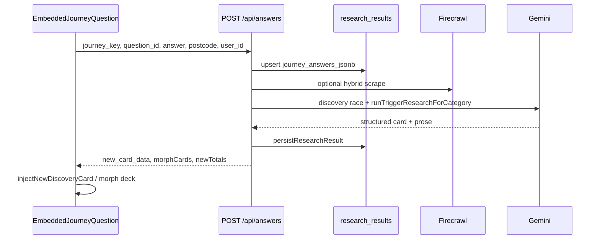

##### 8.3 Expanded view content

| Piece | Source / code |
|-------|----------------|
| H1 (**20–24 words**) | `headlineFromExpandedHook` + `EXPANDED_JOURNEY_HOOK` when DB title weak; `stripExpandedCardTitleNoise` |
| Lead (H4, **≤30 words**) | `resolveSoloFocusDisplayProse` + `buildAuditorDetectionParagraph` (`lib/zone/localityCopy.ts`) |
| Body (optional) | `architect_prose` via `buildResearchResultsTrueTipBody` — max 1 Roboto block when lead present |
| SAVE / CARBON | Verified £ from `research_results` when settled |
| CTA | `offer_url` → `IndustrialHandoffButton` (`resolveRevenueCtaLabel`) |
| Source link | `source_url` / `verifiedAuditSourceUrl` |
| No-offer footer | Calm UK line when no HTTPS partner URL (not “Fresh Audit…”) |
| Fallback CTA | `/zai` if no offer URL |

**Layout:** Marvin hook H1 (20–24 words) + Marvin H4 lead (≤30 words) + optional Roboto body — max 2 prose blocks; metrics row owns £/CO₂. Guards: `isRawResearchDump`, `dedupeTrueTipParagraphs`, `isMechanicalScaffoldParagraph`, `ensureLocalityAuditorLead`.

**Copy resolver:** `resolveExpandedTrueTipInsight` · `buildResearchResultsTrueTipBody` · `toThreeTrueTipParagraphs` · `resolveSoloFocusInsightDisplay`.

**Affiliate monetization (Awin):** `lib/monetization/awinAffiliateLink.ts` wraps the resolved destination URL at the moment of the three click sites (`IndustrialHandoffButton`, `openZoneExternalHandoff`, `openOfferUrlInNewTab`) — not a URL source, applied after `offerUrlGuard.ts` has already validated the destination. Requires `NEXT_PUBLIC_AWIN_PUBLISHER_ID` env var (must be `NEXT_PUBLIC_` — every call site runs in a browser click handler) **and** a host entry in `AWIN_MERCHANT_IDS` (populate per-merchant as Awin programs get approved — do not guess merchant IDs); genuinely a no-op, URLs pass through unchanged, until both exist. `clickref` carries journey/card id through for Awin-side attribution.

---

#### 9. Mother card vs child card (Tier 2)

| | Mother card | Child / Tier 2 card |
|--|-------------|---------------------|
| **When** | First open of journey tile | After user answers a question in Solo Focus |
| **Data** | Latest `research_results` for journey category | Scoped re-research for category + specific answer |
| **Trigger** | Zone load / cron / profile handshake | `POST /api/answers` and/or Tier 2 `GET /api/scrape-sync` |
| **UI** | Same tile; journey-level insight | **Morph deck** — new card with sharper offer |
| **Code** | `buildZoneViewModel` | `runTier2MotherChildSwap` (`lib/zone/tier2RecursiveSpawner.ts`) |

##### 9.1 Tier 2 sequence

1. User answers child question in Solo Focus.
2. Client: **`runTier2MotherChildSwap`** — persist answer locally + **`GET /api/scrape-sync?postcode&category&answer&question_id&user_id`**.
3. Server: persists to `journey_answers` when `user_id` + valid `question_id`; runs **`runTriggerResearchForCategory`**; returns updated `research_category_coverage`.
4. UI: morph deck append + `zz-tier2-profile-refresh` event → Zone hero totals refresh.

**Canonical birth (server):** `POST /api/answers` → discovery race → `injectNewDiscoveryCard` when API returns `new_card_data` / `grid_pulse_card`.

**Tier 2 fallback:** If POST answers returns 401 (stale bundle / no `user_id`), client can still run Tier 2 GET scrape-sync.

---

#### 10. Firecrawl and Gemini

##### 10.1 Firecrawl (stomach)

- Crawls configured UK URLs (Ofgem, GOV.UK, council grants, tariff pages).
- Returns **markdown + URLs** for the research pipeline.
- Used in: `runZeroResearchWithProfile`, `runTriggerResearchForCategory`, `runHybridLiveZoneTipForAnswer`, Sentinel, cron batch.
- **Env:** `FIRE_CRAWL_KEY_2` or `FIRECRAWL_API_KEY` (`lib/sentinel/api-config.ts` — primary name wins).

Without Firecrawl configured, trigger routes return **503 Scraper not configured**.

##### 10.2 Gemini (brain)

Structures scraped text into:

| Field | Constraint |
|-------|------------|
| `agent_headline` | ~20 words, Zai Senior Auditor voice |
| `architect_prose` | Exactly three paragraphs (what / why / how in prose only) |
| `saving_amount_gbp` | Headline £ saving |
| `offer_url` | HTTPS CTA where possible |
| `source_url` | Verified citation |
| `category` | Journey key |

**Discovery race** on answer: structured pipeline, Zero Hunter, Rebirth vault (`lib/agents/rebirthVaultDiscovery.ts`).

**Persona:** Industrial, direct, UK grants/tariffs — lowercase where natural (`lib/agents/researchAgent.ts`).

**Env:** `GEMINI_API_KEY` (server-only).

##### 10.3 Persist

`persistResearchResult` → `research_results` + optional `research_snapshot` JSONB (invoke metadata).

On persist, `saving_amount_gbp` and `verified_saving` are aligned.

---

#### 11. Cron trigger (formerly Hermes / Oracle VPS)

The scheduled trigger is just an **authenticated HTTP call**, not a separate AI runtime.
It used to come from Hermes — an Oracle Cloud free-trial VPS (`ubuntu@140.238.100.237`,
`zerozero-auditor`) — but that trial's credit expired on 2026-07-07 and the instance is now
unreachable (confirmed via ping/SSH timeout). It has been replaced with **Vercel's own Cron
Jobs feature**, configured in `vercel.json`:

```json
"crons": [{ "path": "/api/cron/zone-research?limit=3", "schedule": "0 5 * * *" }]
```

Vercel auto-injects `Authorization: Bearer <CRON_SECRET>` on trigger — the same header
`authorizeCron()` in `app/api/cron/zone-research/route.ts` already checked, so no route
changes were needed. Schedule is now **daily** (was weekly, `0 5 * * 1`, under Hermes) so
Zone's Personalised Recommendation content refreshes more often. No VPS, no free-trial
account, nothing that can run out of credit again. See [HERMES-VPS-SETUP.md](HERMES-VPS-SETUP.md)
and [HERMES-ULM-JIT-BRIEF.md](HERMES-ULM-JIT-BRIEF.md) for the retired VPS runbook.

##### 11.1 Typical setup

1. **05:00 UTC daily** — Vercel Cron calls:
   ```
   GET https://www.00-00.online/api/cron/zone-research?limit=3
   Authorization: Bearer <CRON_SECRET>   (auto-injected by Vercel)
   ```
2. Handler (`app/api/cron/zone-research/route.ts`) loads users from **`users`** where postcode is set.
3. For each user: **`runZeroResearchWithProfile`** → Firecrawl + Gemini → Neon.
4. Zone clients read rows via **`GET /api/scrape-sync`**.

Nothing extra to host or provision — `CRON_SECRET` was already set in the Vercel production
env, and `maxDuration = 300` on the route caps execution the same regardless of trigger source.

##### 11.2 Manual triggers

```bash
### Fast: liveness + CRON_SECRET auth (no Firecrawl run)
npm run hermes:ping

### Full smoke: one user through zone-research (~2–5 min)
npm run hermes:pulse

bash scripts/curl-scrape-sync-trigger.sh https://www.00-00.online BN17
```

Or `POST /api/scrape-sync` with `{ trigger: true, postcode, category, user_id }`.

To change cadence or per-run limit, edit the `crons` entry in `vercel.json` and redeploy —
no crontab, SSH, or secret file to manage.

##### 11.3 Four-step loop

1. **Trigger (Vercel Cron):** daily hit on `/api/cron/zone-research`.
2. **Extraction:** Firecrawl scrape → Gemini maps to thirteen journey categories → persist.
3. **Consumption (Zone):** Bento tiles + Solo Focus expanded copy from Neon.
4. **Expansion (user):** `POST /api/answers` → discovery → `injectNewDiscoveryCard`; supplemental Ask/inject paths capped at 3 per journey.

---

#### 12. Database schema (Neon)

**Init:** `npm run init-db` applies `lib/schema.sql` + `research_snapshot` migration.

**Pooler:** `DATABASE_URL` host must match `MANIFEST_NEON_POOLER_HOST` in `lib/intelligence/manifest.ts`.

##### 12.1 Hot-path tables

###### `users`

| Column | Use |
|--------|-----|
| `id` | UUID primary key |
| `name`, `postcode` | Identity + geography |
| `household`, `home_type`, `transport_baseline` | Profile |
| `age_group`, `employment_status` | Persona |
| `user_genome` | JSONB — goal, Hermes memory, profile_goal |

###### `sessions`

| Column | Use |
|--------|-----|
| `token`, `user_id`, `expires_at` | httpOnly cookie auth |

###### `journey_answers_jsonb`

| Column | Use |
|--------|-----|
| `user_id` | FK to users |
| `answers` | JSONB: all journey question maps |

###### `research_results` (source of truth for cards)

| Column | Use |
|--------|-----|
| `postcode` | Geographic filter |
| `user_id` | Personalization (nullable) |
| `category` | Journey key |
| `saving_amount_gbp`, `verified_saving` | £ on cards |
| `agent_headline` | Short H1 |
| `architect_prose` | Expanded three paragraphs |
| `offer_url` | CTA |
| `source_url` | Verified source link |
| `markdown`, `citations` | Raw scrape |
| `research_snapshot` | JSONB invoke metadata |
| `provider_name` | Attribution (Ofgem, GOV.UK) |
| `elec_unit_rate_gbp_per_kwh`, etc. | Tariff rates when extracted |
| `is_high_impact`, `carbon_impact_kg` | Rebirth / high-impact rows |
| `created_at` | Latest row wins per category lookup |

**Lookup order:** prefer `user_id`, then `postcode` for guest/postcode-only rows.

###### `user_profiles`

Optional mirror of `journey_answers_jsonb` for Hermes / audit-complete flows.

###### `discovery_injections`

Tracks injected discovery cards per user per journey (enforces cap).

###### `scraped_summary`

Legacy hero aggregates when populated.

###### `guest_sessions`

Pre-login profile + answers by `zz_sid` cookie.

##### 12.2 Secondary / legacy tables

| Table | Note |
|-------|------|
| `journey_answers` | Normalized per-question rows; dual-write in some paths |
| `journey_questions` | Seeded via `npm run db:evolve-13-domains` |
| `cards`, `micro_answers` | Legacy — not on Zone hot path |
| `user_actioned_cards`, `likes` | User actions |
| `activity_status` | SSO activity visibility |

##### 12.3 `insightReady` (scrape-sync)

True when a category row has prose, headline, £, or offer URL — Zone hides “Computing…” once settled.

---

#### 13. Mechanical truth

The Zone wall must **not** show placeholder savings when Neon has no research stream.

| Layer | Behaviour |
|-------|-----------|
| `uk2026Defaults` | All `money_value` / `carbon_value` = **0**; leads = **Computing...** |
| `buildUserImpact` | Does **not** back-fill from UK defaults when totals are 0 |
| `mechanicalTruth.ts` | `journeyHasStreamData` — true only when stream has £, prose, or tip |
| `buildZoneViewModel` | Formula £ only if stream exists; else **COMPUTING — JOURNEY** |
| `GET /api/scrape-sync` | Postcode + empty DB → `{ scraped: [], source: "pending" }` |

##### 13.1 Data path


##### 13.2 Filling the screen

1. `POST /api/scrape-sync` trigger or `?force=true`
2. Hermes cron → `/api/cron/zone-research`
3. User answers in Solo Focus → discovery + category research
4. Zone auto-seed (up to 4 categories after load)

##### 13.3 Browser states

| State | Zone hero | Journey tiles |
|-------|-----------|---------------|
| Clean Neon, first load | "Analyzing your postcode…", £0 | 13× **COMPUTING — …**, **—** metrics |
| After research rows | Personalised totals | Real £, headlines, LIVE/ESTIMATED badges |
| Stale client cache | May flash old £ | Hard refresh; `DATA_VERSION` bump clears cache |

---

#### 14. Client identity without full login

| Mechanism | Purpose |
|-----------|---------|
| Session cookie | Full POST/GET `/api/answers`, hydrate |
| `zz_research_user_id` | Minted UUID or Gary UUID for scrape-sync triggers |
| `user_id` on scrape-sync GET | Links Neon rows |
| `profile_postcode` | Drives all geography |

---

#### 15. Motion DNA (UI contract)

| Surface | Style | Rule |
|---------|-------|------|
| `/` + `/intro` | Style A (Glitch) + decision lockup | ~469ms glitch; decision headline = `.profile-question-headline` H2 (uppercase stack, not desktop H1) |
| `/profile/summary` | Staccato word ticker | `IntroWordCycle` + `opacityTicker`: one word, opacity 0→1 only |
| `/profile` questions | Full-sentence fade | y: 10→0, opacity, `STACCATO_TWEEN` |
| Zone grid | Style B (Mechanical Snap) | `STACCATO_*` stagger; 60px card radius |
| Solo Focus | Zip-shut → fade-open | Answer collapses chamber; next question opacity + y |

**Springs:** `KINETIC_SPRING` + `LAYOUT_SPRING` only.

---

#### 16. Environment variables

| Variable | Required for | Notes |
|----------|--------------|-------|
| `DATABASE_URL` | All Neon paths | Pooler host = `MANIFEST_NEON_POOLER_HOST` |
| `GEMINI_API_KEY` | Research, Zai, discovery | Server-only |
| `FIRE_CRAWL_KEY_2` or `FIRECRAWL_API_KEY` | Scraping | Primary name wins |
| `CRON_SECRET` | Hermes cron, diagnostics gate | Min 16 chars |
| `SCRAPER_SECRET` | Optional scrape triggers | |
| `GATEWAY_TOKEN` | Internal inject/pulse webhooks | |
| `NEXT_PUBLIC_APP_URL` | Client URL hints + Twilio webhook base | Must match production domain (`https://www.00-00.online`) |
| `TWILIO_ACCOUNT_SID` | Outbound SMS + webhook auth | Server-only; Vercel Production + Preview |
| `TWILIO_AUTH_TOKEN` | Twilio API + signature validation | Server-only; rotate if exposed |
| `TWILIO_PHONE_NUMBER` | SMS **from** number (E.164) | Not user handsets — Twilio-owned number only |
| `TWILIO_WEBHOOK_URL` | Optional full webhook URL override | Default: `{NEXT_PUBLIC_APP_URL}/api/webhooks/twilio` |
| `TWILIO_MESSAGING_ENABLED` | Optional kill switch | `0` disables sends; credentials may stay loaded |

See `.env.example`. Never commit `.env.local`.

---

#### 17. Verification commands

```bash
npm run db:log-research      # latest research_results row
npm run db:test              # Neon connectivity
npm run db:columns           # column listing
npm run db:evolve-13-domains # journey_questions for all 13 keys
bash scripts/verify-env-and-health.sh
npm run twilio:ping          # Twilio credentials (no SMS)
npm run twilio:configure-webhook  # point FROM number at /api/webhooks/twilio
```

**Honest empty Zone:**

```bash
curl -sS "https://www.00-00.online/api/scrape-sync?postcode=BN17" | jq '.source, (.scraped | length), .research_category_coverage'
### pending + 0 scraped + {} coverage ⇒ COMPUTING tiles, not fake £
```

**Health:**

```bash
curl -sS "https://www.00-00.online/api/health"
```

---

#### 18. Key source files (index)

| Area | Path |
|------|------|
| Zone page | `app/zone/page.tsx` |
| Zone VM | `lib/zone/buildZoneViewModel.ts` |
| Impact math | `lib/brains/buildUserImpact.ts` |
| Mechanical truth | `lib/zone/mechanicalTruth.ts` |
| Journeys | `lib/journeys.ts` |
| Scrape-sync API | `app/api/scrape-sync/route.ts` |
| Answers API | `app/api/answers/route.ts` |
| Cron / Hermes | `app/api/cron/zone-research/route.ts` |
| Research agent | `lib/agents/researchAgent.ts` |
| Rebirth vault | `lib/agents/rebirthVaultDiscovery.ts` |
| Tier 2 spawner | `lib/zone/tier2RecursiveSpawner.ts` |
| Gary mode | `lib/zone/garyMode.ts` |
| Solo Focus copy | `lib/soloFocusCopy.ts` |
| Solo Focus UI | `app/components/SoloFocusOverlay.tsx`, `EmbeddedJourneyQuestion.tsx`, `JourneyBentoCard.tsx` |
| Profile | `app/profile/ProfilePageClient.tsx` |
| Summary | `lib/brains/summaryLogic.ts` |
| Neon DB | `lib/db/neon.ts` |
| Manifest | `lib/intelligence/manifest.ts` |
| Animations | `lib/animations.ts` |
| Twilio SMS | `lib/messaging/welcomeSms.ts`, `app/api/webhooks/twilio/route.ts`, `app/api/profile/mobile/route.ts` |

---

#### 19. Deploy and prep

```bash
npm run prep:live          # db:test + db:evolve-13-domains + build:clean
npm run deploy:force       # vercel deploy --prod (scripts/deploy-production.sh)
```

**Gary DB repair (when needed):** `npx tsx scripts/repair-gary-db-handshake.ts` (uses `DATABASE_URL` only).

---

*Last updated: 2026-05-26 — Twilio SMS (Rock mobile signup, webhook, Vercel env). Prior: 2026-05-30 calc engine fix. For motion and product rules, see `.cursor/rules/zero-zero-prime-directive.mdc` and [HANDBOOK.md](HANDBOOK.md).*

---

## Annex: Gary mode, pattern shift, rebirth vault {#annex-gary-mode-pattern-shift-rebirth-vault}

*Source file: `SUPPLEMENTAL-SYSTEMS.md`*


Short reference for **systems that sit beside** the main Zone content pipeline ([ZONE-CONTENT-AND-DATA.md](ZONE-CONTENT-AND-DATA.md)) and Sentinel ([SENTINEL.md](SENTINEL.md)). No duplicate of those specs — only what is easy to miss.

---

#### 1. Research path matrix

| Path | Trigger | Births discovery card? | Cap |
|------|---------|------------------------|-----|
| **`POST /api/answers`** → `raceDiscoveryBirth` / `injectNewDiscoveryCard` | Solo Focus / bento answer | **Yes — canonical** | `MAX_DISCOVERY_INJECTIONS_PER_JOURNEY` (3) |
| **`triggerSupplementalResearch`** | After answer (sync or void), tips-refresh, gateway | Persists `research_results`; may feed VM, not always grid inject | Same manifest caps when inject |
| **`POST /api/research/question-card`** | Free-form Ask | Supplemental inject | Capped |
| **`POST /api/zone/injections`** | Trap / pattern follow-up | Supplemental | Capped |
| **`runRebirthVaultDiscovery`** | Discovery race participant in answers route | Optional high-impact tip card | Race winner only |
| **Sentinel `inject-sentinel-*`** | `useSentinel` on Zone | Tip rail only | Not loop-answer birth (`perCategoryCardCap`) |
| **Hermes cron** | `repair-mechanical` / `zone-research` | Backfill Neon rows | Server batch |

---

#### 2. Gary / demo mode

**Module:** `lib/zone/garyMode.ts`

| Constant | Value |
|----------|--------|
| `GARY_RESEARCH_USER_ID` | `00000000-0000-4000-a000-000000000000` |
| Activation | Postcode **`BN17*`** or `zz_gary_mode=1` in localStorage |

**Behaviour:**

- Scrape-sync GET/POST append **`user_id`** so BN17 testers share one Neon research partition
- `ensureClientResearchUserId` mints or reuses UUID for trigger POSTs without session
- **`ZoneIntelligenceStrip`** (dev FAB) polls with Gary `user_id` when active

**Ops:** `npx tsx scripts/link-gary-bn17-research.ts` — relink orphan `research_results` rows (uses `DATABASE_URL` only).

**Handbook:** [HANDBOOK.md](HANDBOOK.md) § Data & view model (Gary / demo identity).

---

#### 3. Pattern shift close

**Module:** `lib/zone/patternShiftClose.ts`

When user closes Solo Focus from a **visited** card (`visitedClose: true`):

- **No** loop takeover question on the Zone shell
- **No** `spawnAchievementWhenLoopPoolExhausted`
- **No** `/api/zone/injections` from close path

**UI:** `app/zone/page.tsx` — `patternShiftJourneyId` overlay for non-visited close flow; `JourneyBentoCard` / `SoloFocusOverlay` pass `onPatternShiftClose`.

Credit guard aligned with [ZAI-AND-QUESTIONS-RULES.md](ZAI-AND-QUESTIONS-RULES.md) (visited flip + close credit guard).

---

#### 4. Rebirth vault discovery

**Module:** `lib/agents/rebirthVaultDiscovery.ts`

Optional **discovery race** entrant from `POST /api/answers` (`discoveryBirthRace.ts`):

- Firecrawl **Action Vault** URLs per journey (`lib/agents/actionVaults.ts`)
- Gemini pro profile (**12k/1t** auditor framing) → high-impact `ZoneTipCard`
- Persists `research_results` with **`is_high_impact`**
- Models: `GEMINI_REBIRTH_MODEL` or fallback `gemini-1.5-flash`

**Not** the default birth path — runs in parallel race; first valid payload wins inject.

---

#### 5. Tier 2 mother/child swap

**Module:** `lib/zone/tier2RecursiveSpawner.ts`

After a **child** Solo Focus answer (mother/child morph deck):

1. `persistTier2AnswerLocal`
2. Scoped **`GET /api/scrape-sync`** with `category`, `answer`, `question_id`, optional `repair=1`
3. `buildTier2MorphCard` → morph deck append
4. `refreshZoneTotalsAfterTier2` + `zz-tier2-profile-refresh` event

**Tip +1:** `lib/zone/tipVerificationDeepScrape.ts` — same scrape-sync with **repair** pass (Estimated → Verified).

**Handbook:** [HANDBOOK.md](HANDBOOK.md) § Tier 2 mother/child swap.

---

#### 6. Discovery birth race

**Module:** `lib/agents/discoveryBirthRace.ts`

`POST /api/answers` may race:

- Standard discovery pipeline
- Optional **`rebirthVault`** callback
- Hybrid spawn (`lib/zone/engineDataRouter.ts` when `bucket_failover`)

First successful **`DiscoveryBirthPayload`** → response `new_card_data` / `grid_pulse_card` → client **`injectNewDiscoveryCard`**.

---

#### 7. Content Architect (async polish)

Not supplemental — **primary presentation polish** after VM build. Documented in **[ZONE-CONTENT-AND-DATA.md](ZONE-CONTENT-AND-DATA.md)** §9.

Client: fingerprinted batch per Zone load (`architectBatchKeyRef`) to avoid duplicate Gemini spend.

---

#### 8. Zone UI adjuncts

| Component | Role |
|-----------|------|
| **`ZoneAskZaiDock`** | Fixed Ask Zai entry on Zone (portal / dock) |
| **`AppFloatingNav`** | Likes, Zai, Settings — portaled nav |
| **`FixedViewportPortal`** | Overlay mounting for fixed UI |
| **`ZoneIntelligenceStrip`** | Dev scrape-sync poll (Gary-aware) |

---

#### 9. Fallback tips

**Module:** `lib/zone/fallbackZoneTips.ts`

Server-only tip payloads when research/inject paths fail — used by `app/api/zone/tips-refresh` and `injections` (not exported from route files — Next.js 16 route export rule).

---

#### 10. Related docs

| Doc | Topic |
|-----|--------|
| [ZONE-CONTENT-AND-DATA.md](ZONE-CONTENT-AND-DATA.md) | Scrape, copy, cards, tone |
| [SENTINEL.md](SENTINEL.md) | Sentinel live layer |
| [HYBRID-DATA-PIPELINE.md](HYBRID-DATA-PIPELINE.md) | Cost tiers |
| [ULM-APPLICATION-LOOP.md](ULM-APPLICATION-LOOP.md) | Ceilings, spawn |
| [ZAI-AND-QUESTIONS-RULES.md](ZAI-AND-QUESTIONS-RULES.md) | Boundaries + questions |
| [HANDBOOK.md](HANDBOOK.md) | Index + ops |

---

*Update when adding new inject paths, demo modes, or discovery race entrants.*

---

## Annex: Sentinel live layer {#annex-sentinel-live-layer}

*Source file: `SENTINEL.md`*


Sentinel is a **parallel layer** to the main Zone content pipeline (`GET /api/scrape-sync` → `research_results` → Content Architect). It does **not** replace Hermes, scrape-sync, or the canonical **`POST /api/answers`** discovery birth path.

**Main content spec:** [ZONE-CONTENT-AND-DATA.md](ZONE-CONTENT-AND-DATA.md) · **Boundaries:** [ZAI-AND-QUESTIONS-RULES.md](ZAI-AND-QUESTIONS-RULES.md) Part 0.

---

#### 1. What Sentinel does

| Capability | Purpose |
|------------|---------|
| **Live-Impact** | Ofgem-locked July 2026 rates + regional grid intensity (`app/lib/skills/liveImpact.ts`) |
| **Home mother/child deck** | P1–P3 slides in `journey_state` for `home`; advances after each home answer (max 3) |
| **Client priorities** | Top 3 heuristic tips (home / travel / waste-shopping) from answers + goal + chat keywords |
| **Rural grant signal** | Remote postcode prefixes + Firecrawl grant extract → optional `inject-sentinel-rural-support` tip |
| **Grid low pulse** | When intensity &lt; 50 g/kWh, Zone can pulse the carbon journey card |
| **Zone sync** | `syncUserZone` builds home mother/child state from profile + local intelligence |

Sentinel copy is **direct, no pleasantries** (bear/wolf tip lines on client-built priorities). It is **not** the Zai chat persona (“auditor with a pint”) — see [ZAI-AND-QUESTIONS-RULES.md](ZAI-AND-QUESTIONS-RULES.md).

---

#### 2. Architecture

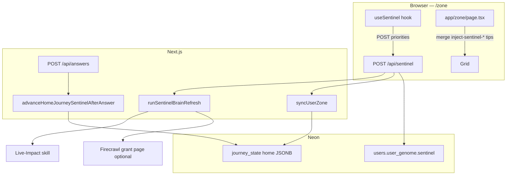

---

#### 3. Code map

| Module | Role |
|--------|------|
| `app/hooks/useSentinel.ts` | Client: build priorities, throttle refresh (5 min), optional 24h scrape via API |
| `app/api/sentinel/route.ts` | Auth session: brain refresh + `syncUserZone` + persist `user_genome.sentinel` |
| `lib/agents/sentinel.ts` | `runSentinelBrainRefresh` — Gemini tool calling via AI Gateway (Live-Impact + structured Firecrawl extract), mechanical fallback when the gateway isn't configured or the call fails |
| `lib/sentinel/runner.ts` | `advanceHomeJourneySentinelAfterAnswer`, `syncUserZone`, mother/child slide builders |
| `lib/sentinel/scraper.ts` | Soft-save cards (flow temp, phantom standby, food waste) |
| `lib/sentinel/liveGrounding.ts` | Gemini grounding for mother copy; also used by **`/api/local-offers`** |
| `lib/sentinel/recardTypes.ts` | `SentinelMotherRecardPayload`, `MotherChildSlide`, view states `LIVE` / `RESULT` |
| `lib/sentinel/api-config.ts` | Shared Firecrawl + Gemini clients (`FIRE_CRAWL_KEY_2` wins) |
| `app/lib/skills/liveImpact.ts` | Auditable baseline £/kWh + grid intensity |
| `scripts/test-sentinel-runner.ts` | Local integration test for runner + advance |

---

#### 4. Client hook (`useSentinel`)

**Used on:** `app/zone/page.tsx` only.

##### Inputs

- `userAnswers` — journey answer map from AppContext
- `impactTotals` — hero `totalMoney` / `totalCarbon` from VM
- `recentChatHistory` — last messages for keyword bias (heat / commute / waste)

##### Outputs

| Field | Meaning |
|-------|---------|
| `priorities` | Up to 3 `SentinelPriority` rows → mapped to **`inject-sentinel-{journey}-{index}`** tip cards |
| `gridLowPulse` | Server flag when grid intensity low |
| `grantFound` + `firecrawlGrant` | Rural remote + grant scrape → **`inject-sentinel-rural-support`** |
| `liveImpact` | Home idle 24h cost/carbon + intensity |
| `pulseColor` | Optional carbon card pulse colour |

##### Refresh policy

| Interval | Behaviour |
|----------|-----------|
| **5 minutes** | Skip duplicate `POST /api/sentinel` if `zz_sentinel_last_refreshed` is fresh |
| **24 hours** | Pass `run_scrape_sync: true` → server may POST scrape-sync; client then POSTs **`/api/zone/tips-refresh`** |

Priorities are **heuristic** (20% of impact totals + answer count), re-sorted by profile goal (`profile_goal`: money / carbon / balanced).

---

#### 5. Server API — `POST /api/sentinel`

| Auth | Behaviour |
|------|-----------|
| **Guest** | Echo priorities back; no brain refresh |
| **Signed in** | Full pipeline |

**Body (optional):** `priorities[]`, `system_prompt`, `region`, `run_scrape_sync`.

**Steps:**

1. `runSentinelBrainRefresh({ region, postcode, runScrapeSync })`
2. `syncUserZone({ userId, location, genome, appOrigin })`
3. Tune priority `savingsGbp` with live baseline cost
4. If `run_scrape_sync` + remote postcode (`KW`, `IV`, `HS`, …) → internal POST `/api/scrape-sync` → `grant_found` from markdown/citations
5. Merge snapshot into `users.user_genome.sentinel` + `last_refreshed`

**Remote postcode prefixes:** `KW`, `IV`, `HS`, `ZE`, `PH`, `PA`, `AB`, `TR`, `LL` (see `REMOTE_POSTCODE_PREFIX` in route).

---

#### 6. Home journey deck (`advanceHomeJourneySentinelAfterAnswer`)

**Trigger:** `POST /api/answers` when `journey_key === 'home'` and logged-in `user_id` (`app/api/answers/route.ts`).

**Storage:** `journey_state` row `journey_key = 'home'` — JSON `MotherChildJourneyState`:

| Field | Meaning |
|-------|---------|
| `slides` | P1–P3 mother/child slides (tenure + grid tier steer EST affiliate links) |
| `slideCursor` | Current slide index |
| `sessionAnswerCount` | 0–3 home answers this deck |
| `viewState` | `LIVE` until 3 answers → `RESULT` |
| `laneJourneyKey` | Always `home` today |

**Returns:** `SentinelMotherRecardPayload` (headline, description, money/carbon, `source_url`, `verified_date`) for client mother recard UI.

**Affiliate links (UTM `utm_medium=sentinel`):** EST advice URLs vary by grid tier (`reg_gb_base`, `reg_urban_lez`, `reg_hi_rural`).

---

#### 7. `syncUserZone`

Builds initial or refreshed **home** mother/child slides from:

- User postcode + `user_genome`
- `GET /api/local-intelligence` (when `appOrigin` passed) or `getLocalData`
- `runLiveGrounding` for prose grounding
- Soft-save cards from `lib/sentinel/scraper.ts`

Upserts **`journey_state`** and **`journeys`** for zone waterfall population. Called from **`POST /api/sentinel`** after brain refresh.

---

#### 8. Zone grid integration

`app/zone/page.tsx`:

- Merges **`sentinelTipCards`** (`inject-sentinel-*`) into tip rail / inject list
- Optional **`sentinelSupportTipCard`** when rural grant found
- **`sentinelHeroPing`** / **`sentinelPingJourneyKeys`** for grid pulse UX
- Home card can show **`homeSupportTitle`** / **`homeSupportOfferUrl`** from Sentinel grant

##### Inject ID rules

`lib/zone/perCategoryCardCap.ts` — **`inject-sentinel-*`** and **`inject-fallback-*`** are **not** loop-answer discovery births (do not count toward earned inject cap the same way as `injectNewDiscoveryCard`).

---

#### 9. vs main research pipeline

| | **Scrape-sync / research_results** | **Sentinel** |
|--|--------------------------------------|--------------|
| **Primary output** | Per-journey headlines, `architect_prose`, `offer_url` | Home deck state + 3 client priorities + rural grant tip |
| **Trigger** | Zone load, answers, cron, tip+1 | Zone mount hook, `POST /api/sentinel`, home answers |
| **Neon table** | `research_results` | `journey_state`, `user_genome.sentinel` |
| **Content Architect** | Yes | No |
| **Hermes cron** | `zone-research` / `repair-mechanical` | Not required |

Both may use **Firecrawl** — shared keys via `lib/sentinel/api-config.ts` and `lib/agents/researchAgent.ts`.

---

#### 10. Living pulse “Safe Sentinel fallback”

`lib/logic/pulse.ts` logs **`[pulse] Safe Sentinel fallback active`** when living pulse (`GET /api/pulse/living`) fails. That is a **degraded pulse path label**, not a call into `lib/sentinel/runner.ts`.

---

#### 11. Env & verification

| Variable | Sentinel use |
|----------|----------------|
| `AI_GATEWAY_API_KEY` (or Vercel OIDC) | Brain refresh tool calling via `generateText` + Vercel AI Gateway (`SENTINEL_REASONING_MODEL` = `GEMINI_GATEWAY_ZONE`, same Flash-tier standard as research — no preview/Pro models). Falls back to the deterministic path (direct `getLiveBaseline` + conditional Firecrawl scrape, `model: "mechanical"` in the result) when the gateway isn't configured or the call errors — Sentinel never fails a request over this. |
| `FIRE_CRAWL_KEY_2` / `FIRECRAWL_API_KEY` | Grant page extract |
| `DATABASE_URL` | `journey_state`, `users` updates |
| Session cookie | `POST /api/sentinel` (signed-in path) |

```bash
### Local runner smoke (needs DATABASE_URL)
npx tsx scripts/test-sentinel-runner.ts

npm run verify
```

---

#### 12. When to change Sentinel vs main docs

| Change | Update |
|--------|--------|
| Home deck slides, `journey_state` shape | This doc + `lib/sentinel/runner.ts` |
| Inject tip IDs / cap rules | [ZONE-CONTENT-AND-DATA.md](ZONE-CONTENT-AND-DATA.md) + `perCategoryCardCap.ts` |
| scrape-sync / Architect / Zai boundaries | [ZONE-CONTENT-AND-DATA.md](ZONE-CONTENT-AND-DATA.md), [ZAI-AND-QUESTIONS-RULES.md](ZAI-AND-QUESTIONS-RULES.md) |

---

*Last synced with `useSentinel`, `app/api/sentinel/route.ts`, `lib/sentinel/runner.ts`, `app/api/answers/route.ts`.*

---

## Annex: Hermes vs JIT scrape {#annex-hermes-vs-jit-scrape}

*Source file: `HERMES-ULM-JIT-BRIEF.md`*


**2026-07-07 update:** the Oracle VPS described below is retired (free-trial credit expired,
instance unreachable) and the trigger now runs on **Vercel's own Cron Jobs feature**, **daily**
at 05:00 UTC (was weekly) — see §11 of [FULL-APP-SPEC.md](FULL-APP-SPEC.md) and the banner in
[HERMES-VPS-SETUP.md](HERMES-VPS-SETUP.md). Everything below this point describes the retired
VPS setup and the May 2026 daily→weekly change; kept for history, not current operation.

**Audience (historical):** whoever ran the Oracle VPS cron (`ubuntu@140.238.100.237`) and anyone testing from a Mac.  
**App:** `https://www.00-00.online` — Zero Zero intelligence loop.

This is **not** the Python `hermes` chat CLI schedule. VPS cron used **`bash scripts/hermes-pulse.sh`** (see [HERMES-VPS-SETUP.md](HERMES-VPS-SETUP.md)).

**Product docs:** [ZONE-CONTENT-AND-DATA.md](ZONE-CONTENT-AND-DATA.md) (main scrape/copy) · [SENTINEL.md](SENTINEL.md) (parallel live layer — not Hermes) · [SUPPLEMENTAL-SYSTEMS.md](SUPPLEMENTAL-SYSTEMS.md) (inject paths, Gary mode).

---

#### What changed (tell Hermes / the VPS)

| Before | Now (Ulm / “use less, more”) |
|--------|------------------------------|
| Daily broad scrape for many users | **Weekly** pulse — Monday **05:00 UTC** (`0 5 * * 1`) |
| Gemini Pro / 2.5 multi-model | **`gemini-2.5-flash`** everywhere (surgical; not 1.5/2.0/lite on new keys) |
| Pre-scrape whole Zone | **JIT:** Firecrawl/Gemini only after user answers Tip +1 in Solo Focus |
| `limit=12` full cron | **Times out** on Vercel (~300s). Weekly job uses **`limit=3`** full OR **`repair=1`** backfill |

**Hermes does not run Gemini locally.** It only HTTP-triggers Vercel with `CRON_SECRET`.

##### UTILITIES lane (13th Zone card — May 2026)

- **Profile** captures `home_power` (GAS / ELECTRIC / MIX / OTHER) — not a Solo Focus MC question.
- **UTILITIES** tile unlocks on the Zone wall only after profile power type is set (`lib/zone/utilitiesZoneUnlock.ts`).
- **JIT scrape** for `category=utilities` uses free server APIs (no keys): Postcodes.io, Carbon Intensity, optional Octopus public Agile feed — see `lib/data/utilitiesFreeApis.ts` + `lib/intelligence/utilitiesLaneRules.ts`.
- **Gemini / Firecrawl** still cite Ofgem price-cap pages for £/yr; lane lock blocks re-asking power type and blocks category drift into `grants`/`home` unless the CTA is scheme-specific.
- **Hermes config:** no VPS change — same `repair-mechanical` weekly line; utilities rows backfill with other journeys when `repair=1`.

---

#### Correct weekly cron line (VPS)

```cron
### 00-00 hermes-pulse — weekly surgical pulse (Monday 05:00 UTC)
0 5 * * 1 /usr/bin/bash /home/ubuntu/00-00/scripts/hermes-pulse.sh --secret-file=/home/ubuntu/.hermes/cron.secret --weekly >> /home/ubuntu/hermes-pulse.log 2>&1
```

Install from repo:

```bash
bash scripts/install-hermes-crontab.sh --install
### default schedule is now 0 5 * * 1 (Monday)
```

---

#### Mac commands (from git repo)

```bash
npm run hermes:ping
npm run hermes:repair-pulse
```

**Do not** put comments on the same line as `npm run` — npm forwards `#` to the script (`Unknown arg: #`).

```bash
bash scripts/hermes-pulse.sh --smoke --secret-file ~/.hermes/cron.secret
npm run db:log-gary
npm run db:repair-gary
```

---

#### Do **not** do this (your terminal showed why)

##### 1. `curl` with `limit=12` and no `repair=1` only

```bash
### BAD — FUNCTION_INVOCATION_TIMEOUT (12 × full Firecrawl+Gemini per user)
curl -X POST "https://www.00-00.online/api/cron/zone-research?limit=12" \
  -H "Authorization: Bearer YOUR_SECRET"
```

Use **repair backfill** instead:

```bash
### GOOD — backfill agent_headline / architect_prose / saving_amount_gbp on incomplete rows
curl -sS -X POST "https://www.00-00.online/api/cron/zone-research?repair=1&limit=6" \
  -H "Authorization: Bearer $(grep '^CRON_SECRET=' .env.local | cut -d= -f2- | tr -d '\"')"
```

Or load secret safely (avoids zsh `!` / `(BN17)` glob bugs):

```bash
SECRET=$(grep '^CRON_SECRET=' .env.local | cut -d= -f2- | tr -d '"' | tr -d "'")
curl -sS -X POST "https://www.00-00.online/api/cron/zone-research?repair=1&limit=6" \
  -H "Authorization: Bearer ${SECRET}"
```

**Never** put `(BN17)` or other parentheses on the same line as `# comment` in zsh — it triggers `unknown file attribute: B`.

##### 2. `hermes cron create … --model gemini-1.5-flash`

That is the **Python Hermes assistant** CLI. It does **not** schedule this app’s Vercel cron. Wrong flag: use **`-m gemini-1.5-flash`**, not `--model`.

For **this product**, use `install-hermes-crontab.sh` on the VPS, not `hermes cron create`.

##### 3. Expecting `npm run db:repair-research` to fix production row 726 immediately

Local repair uses your **`.env.local`** `GEMINI_*` models. If logs still show `gemini-2.5-flash-lite`, set:

```env
GEMINI_ZONE_MODEL=gemini-1.5-flash
GEMINI_ARTICLE_MODEL=gemini-1.5-flash
GEMINI_CHAT_MODEL=gemini-1.5-flash
```

Row **726** (grants / BUS) can still get a **mechanical** £7,500 triplet without Gemini when repair runs against Neon. Latest row **728** is a junk ingest (null category) — repair skips until category is set; JIT scrapes are **per journey_key** after Tip +1.

---

#### What Hermes should expect on Monday pulse

1. `GET /api/health?live=1` → 200  
2. `GET /api/health/diagnostics` + Bearer → neon, gemini, firecrawl booleans  
3. `GET /api/cron/zone-research?limit=3` with `--weekly` (or `repair=1` if you add `--repair-only` flag to script) → at most **3** full user scrapes  

Day-to-day user research is **not** Hermes’s job anymore — it is **earned** in the app when Gary answers one Solo Focus question.

---

#### Neon truth check (Gary / BN17)

```bash
npm run db:log-research
```

- Exit **0** = latest row has £ + headline + 3-paragraph prose  
- Exit **2** = incomplete (Zone uses mechanical fallbacks until Tip +1 or repair)

Target for grants row 726 after repair: `saving_amount_gbp` 7500, `agent_headline` set, `architect_prose` three paragraphs.

---

#### Vercel env (production)

Ensure Production has:

- `CRON_SECRET` (same as `~/.hermes/cron.secret` on VPS)  
- `GEMINI_API_KEY`  
- `FIRE_CRAWL_KEY_2`  
- Optional: `GEMINI_ZONE_MODEL=gemini-1.5-flash` (defaults in code if unset)

**use less, more.**

---

## Annex: Hermes VPS setup {#annex-hermes-vps-setup}

*Source file: `HERMES-VPS-SETUP.md`*


**This VPS is decommissioned.** Its Oracle Cloud free-trial credit expired on 2026-07-07;
the instance (`ubuntu@140.238.100.237`) is unreachable (ping/SSH both time out) and Oracle's
"Always Free" tier does not cover it. The daily `/api/cron/zone-research` trigger now runs on
**Vercel's own Cron Jobs feature** (`vercel.json` → `crons`), which needed zero extra hosting
and can't run out of free-trial credit the same way. See §11 of
[FULL-APP-SPEC.md](FULL-APP-SPEC.md) for the current setup.

The rest of this document is kept as a historical/operator reference for the retired VPS
runbook — do not follow the SSH/crontab steps below expecting them to affect production.

Reference for `ubuntu@140.238.100.237` — Hermes only **HTTP-triggers** Vercel; it does not run Gemini/Firecrawl locally.

**Production target:** `https://www.00-00.online/api/cron/zone-research`

**Operator brief (read first):** [`HERMES-ULM-JIT-BRIEF.md`](./HERMES-ULM-JIT-BRIEF.md) — Ulm JIT, schedule history, why `limit=12` timed out, correct curl/Mac commands.

---

#### Ulm JIT (May 2026) — what Hermes used to trigger; now runs via Vercel Cron

| Job | Schedule | Command |
|-----|----------|---------|
| **Daily pulse** | 05:00 UTC daily `0 5 * * *` (was weekly, `0 5 * * 1`, until 2026-07-07) | Vercel Cron → `GET /api/cron/zone-research?limit=3` (max 3 full user scrapes) |
| **Repair backfill** | Manual / optional | `hermes-pulse.sh --repair-only` → `?repair=1&limit=12` (headline/£/prose only) |
| **Auth smoke** | Anytime | `hermes-pulse.sh --auth-only` (~2s) |

Day-to-day research is **not** bulk-croned. Users earn a **surgical scrape** after answering one Solo Focus Tip +1 question in the app (`gemini-1.5-flash`, topic-locked by `journey_key`).

**Do not** run `limit=12` without `repair=1` on production — Vercel will **FUNCTION_INVOCATION_TIMEOUT**.

---

#### What your terminal showed

| Observation | Meaning |
|---------------|---------|
| `tail /var/log/hermes-cron.log` → no file | Cron never ran (or log path was wrong). Use **`~/hermes-pulse.log`**, not `/var/log/…`. |
| `crontab -l` only comments | **`crontab -e` saved with no job line** — Hermes is not scheduled yet. |
| Mac `curl` → 401 | `$CRON_SECRET` empty in shell, or wrong value. Use `npm run hermes:ping` on Mac. |

---

#### Fastest path (from Mac, one command)

```bash
cd ~/Documents/00-00
bash scripts/deploy-hermes-to-vps.sh
```

This rsyncs `hermes-pulse.sh`, writes `~/.hermes/cron.secret` from `.env.production.local`, runs `--auth-only`, and leaves your existing crontab line in place.

---

#### One-time setup on the VPS (manual)

##### 1. SSH in (from Mac)

```bash
ssh -i ~/Downloads/ssh-key-2026-05-08.key ubuntu@140.238.100.237
```

##### 2. Get the repo (if missing)

```bash
git clone https://github.com/00app/00-ULM.git ~/00-00
cd ~/00-00
git pull
```

Or sync only the scripts from your Mac:

```bash
ssh -i ~/Downloads/ssh-key-2026-05-08.key ubuntu@140.238.100.237 'mkdir -p ~/00-00/scripts'
rsync -avz -e "ssh -i ~/Downloads/ssh-key-2026-05-08.key" \
  scripts/hermes-pulse.sh scripts/install-hermes-crontab.sh scripts/setup-hermes-vps.sh \
  ubuntu@140.238.100.237:~/00-00/scripts/
```

##### 3. Secret file (same as Vercel `CRON_SECRET`)

```bash
mkdir -p ~/.hermes && chmod 700 ~/.hermes
### Paste production secret — use single quotes if it contains !
printf '%s' 'YOUR_VERCEL_CRON_SECRET' > ~/.hermes/cron.secret
chmod 600 ~/.hermes/cron.secret
```

##### 4. Run setup + install cron

```bash
cd ~/00-00
bash scripts/setup-hermes-vps.sh --install-cron
```

Or manually:

```bash
bash scripts/hermes-pulse.sh --secret-file ~/.hermes/cron.secret --auth-only
bash scripts/install-hermes-crontab.sh --install
crontab -l   # must show ONE line starting with 0 5 * * 1 (weekly)
```

##### 5. Verify crontab (non-empty)

```bash
crontab -l | grep hermes-pulse
```

Expected (either form is fine):

```cron
### 00-00 hermes-pulse
0 5 * * 1 /usr/bin/bash /home/ubuntu/00-00/scripts/hermes-pulse.sh --secret-file=/home/ubuntu/.hermes/cron.secret --weekly >> /home/ubuntu/hermes-pulse.log 2>&1
```

Or (what you installed):

```cron
0 5 * * * /usr/bin/bash /home/ubuntu/00-00/scripts/hermes-pulse.sh --secret-file=/home/ubuntu/.hermes/cron.secret >> /home/ubuntu/hermes-pulse.log 2>&1
```

Prefer **`/usr/bin/bash`** in cron so the job does not depend on the script’s execute bit alone.

##### 6. Test on VPS (do **not** use `npm` on the server)

`npm run hermes:ping` only works on your **Mac** inside the git repo. On the VPS there is no `package.json` in `~` — use **bash** directly:

```bash
/usr/bin/bash /home/ubuntu/00-00/scripts/hermes-pulse.sh \
  --secret-file=/home/ubuntu/.hermes/cron.secret --auth-only
```

Full smoke (~2–5 min):

```bash
/usr/bin/bash /home/ubuntu/00-00/scripts/hermes-pulse.sh \
  --secret-file=/home/ubuntu/.hermes/cron.secret --smoke
tail -30 ~/hermes-pulse.log
```

If `No such file` for `hermes-pulse.sh`, clone or rsync the repo first (§2).

---

#### crontab -e tips

- Add **one line** at the bottom (do not paste into zsh on Mac).
- Save and exit (`nano`: Ctrl+O, Enter, Ctrl+X).
- `crontab -l` must show the `0 5 * * *` line — not only `#` comments.

---

#### Mac vs VPS

| | Mac (dev) | Oracle VPS (Hermes) |
|--|-----------|---------------------|
| Schedule | Optional `install-hermes-crontab.sh --install` | Was **required** for the weekly pulse (`0 5 * * 1`) — retired, see banner above |
| Secret | `~/.hermes/cron.secret` | Same path under `/home/ubuntu/` |
| Log | `~/hermes-pulse.log` | `/home/ubuntu/hermes-pulse.log` |
| Quick test | `npm run hermes:ping` (in repo on Mac) | `bash …/hermes-pulse.sh --secret-file … --auth-only` (**no npm**) |

---

#### Troubleshooting

| Symptom | Fix |
|---------|-----|
| HTTP 401 | Secret ≠ Vercel Production `CRON_SECRET`; redeploy after rotating on Vercel. |
| `zsh: event not found` | Secret contains `!` — use **single quotes** or `set +H` before export. |
| Empty `crontab -l` | Re-run `bash scripts/install-hermes-crontab.sh --install`. |
| No log file | Cron not run yet; run manual `--smoke` once or wait until 05:00 UTC. |

See also: [HANDBOOK.md](HANDBOOK.md) · [FULL-APP-SPEC.md](FULL-APP-SPEC.md) §11 · `scripts/hermes-pulse.sh`

---

## Annex: Motion DNA {#annex-motion-dna}

*Source file: `MOTION-FAMILY.md`*


Delivery-only motion vocabulary. **Does not** change profile questions, summary word order, zone loop logic, or `lib/brains`. Sequence is frozen in **`lib/zone/directorsOrder.ts`** + **`docs/HANDBOOK.md`** (Director's Order).

**Unified material (vibe-lock):** every surface uses the same crystallize physics — Intro/loading (`AtomicLogo`), Profile/Settings steps, Summary/Architectural Pulse ticker, Zone grid + Rock, Zai messages, loop takeover, discovery snap-in.

#### Tokens (`lib/motion-family.ts`)

| Token | Value | Use |
|-------|-------|-----|
| `FAMILY_EASE` | `cubic-bezier(0.22, 1, 0.36, 1)` | All family tweens |
| `FAMILY_DUR_LONG` | `0.8s` | Chapter changes (profile step, page shell) |
| `FAMILY_DUR_ATOMIC` | `1.0s` | Crystallize: blur cloud → sharp lock |
| `FAMILY_DUR_SHORT` | `0.4s` | Likes, hovers, word exit, controls |
| `familyAtomicAssembly` | blur + letter-spacing + scale | Summary ticker, Architectural Pulse, loop question |
| `familyReveal` | blur → sharp (no letter-spacing) | Profile headline, settings cells |
| `familyGlide` | 15px **vertical rise** + blur | Profile step swap (legacy name) |
| `familyAtomicSurface` | rise + blur + scale | Cards, screens, zone cells, Solo Focus |
| `familyAtomicTextProps` | surface + letter-spacing | Intro / summary opacity ticker |
| `ZONE_ATOMIC_BENTO_VARIANTS` | blur cloud → card | Zone grid ripple (exported as `ZONE_BENTO_CELL_VARIANTS`) |

#### Reading-speed contract

- `FAMILY_READ_MS_PER_WORD` = **200ms** minimum sharp dwell per word after assembly.
- `atomicWordHoldMs(text)` = **1000ms** assembly + `readingSpeedDwellMs(text)`.
- Wired on `/profile/summary`, Architectural Pulse, and `IntroWordCycle` + `opacityTicker`.

#### Surfaces

| Surface | Motion |
|---------|--------|
| `/` + `/intro` | `AtomicLogo` power-on + atomic `IntroWordCycle` (`opacityTicker`) |
| Loading routes | `AppBootGlitch` → `AtomicLogo` loop |
| `/profile` | Centered atomic cross-fade (`familyProfileStepProps` = atomic) |
| `/profile/summary` | Atomic ticker + `atomicWordHoldMs` read buffer |
| Zone | Pulse words → atomic grid ripple (rise + blur, **0.12s** stagger) → expand shell |
| Loop / discovery | Atomic headline; discovery tip atomic snap-in |
| `/zai` | Page + messages `familyAtomicProps` |
| `/likes`, `/settings` | `familyPageEnterProps` + atomic cells |

#### Director's order (Zone)

1. Summary atomic ticker completes (`pulseWordsComplete`).
2. Bento grid ripples (crystallize, stagger `ZONE_GRID_STAGGER_CHILD_DELAY_SEC`; reveal interval **2×** child delay in `app/zone/page.tsx`).
3. `revealedCardCount` stays stable when scrape-sync adds rows — no reset-to-zero flash mid-session.
4. Today's tips (Rock) last — **no loop** on close.

Journey loop: expand → close → **one** loop → discovery → **pink** (`markCardVisited` in `completeCleanBirth` only).

#### Zone expand (Solo Focus)

Industrial zip-shut / opacity snap on `ExpandedCardShell` — **no `layoutId` morph** (morph broke close → loop handoff). `FAMILY_MOTION_SCALE` (0.7) speeds all family durations ~30%.

#### Protected

Boot / intro glitch keyframes in `globals.css`. Industrial tokens in `lib/animations.ts` for Solo Focus zip-shut.

#### Hover

- `.zz-family-bloom` — scale 1.02 + gold drop-shadow (likes/settings/profile CTAs).
- `.zz-atomic-hover` + `FAMILY_ATOMIC_HOVER` — 1px jitter on zone journey cards.

---

## Annex: Vercel deploy & checks {#annex-vercel-deploy--checks}

*Source file: `DEPLOY-VERCEL.md`*


When the dashboard shows **Checks Failed**, **Environment: Production**, **Staged**, and Lint/Typecheck say *“An internal error occurred”* — the **Next.js build often already succeeded**. Your commit is deployed to a preview URL; production alias was not promoted because optional checks failed.

#### 1. Confirm the real build passed

On the deployment page, open **Build Logs** (not Deployment Checks).

Look for:

```text
> npm run verify
> node scripts/build-with-manifest-fix.js
...
Build complete. Output in .next
```

If that finished without `Error: Command "npm run verify && …" exited with 1`, **your code is fine**.

#### 2. Promote to production (fastest)

1. Vercel → project **00-ulm** → **Deployments**
2. Open deployment **`4924d2f`** (or latest **Staged**)
3. **⋯** menu → **Promote to Production** (or **Assign to Production Domain**)

Production alias **`https://www.00-00.online`** should then serve this build.

#### 3. Stop the false failures (repo + dashboard)

**Repo (automatic):**

| Layer | What runs |
| --- | --- |
| **`vercel.json` `buildCommand`** | `node scripts/vercel-build-gate.mjs` — serial typecheck, lint, then `build-with-manifest-fix.js` (verify runs without build `NODE_OPTIONS` to avoid OOM) |
| **`.npmrc`** | `include=dev` — native Lint/Typecheck jobs get `@types/*` + eslint |
| **`scripts/vercel-check.mjs`** | Check entry: `next typegen` + explicit eslint/tsc binaries |
| **`package.json` `lint:ci` / `typecheck:ci`** | GitHub Actions + `npm run verify` + `vercel-build-gate.mjs` |
| **`npm run fix:vercel-checks`** | Fails if `lint`/`typecheck` scripts exist in package.json |
| **`next.config.js`** | No `eslint` key (Next 16 removed it — native Vercel Lint crashes). `typescript.ignoreBuildErrors` only. |
| **`vercel.json` `installCommand`** | `npm ci --include=dev` (checks + build see eslint/tsc) |
| **`npm run deploy`** | verify → `vercel deploy --prod` → wait Ready → **`scripts/vercel-promote-latest.sh`** |

**Permanent repo fix (native checks):** Do **not** define `lint` or `typecheck` in `package.json`. Vercel skips native checks when those scripts are absent; `vercel-build-gate.mjs` already runs the same gate serially during build. `npm run fix:vercel-checks` enforces absence.

**Dashboard (required once):**

1. **Project 00-ulm** → **Settings** → **Build and Deployment** → **Deployment Checks**
2. **Remove** built-in **Lint** and **Typecheck** (Native or Next.js) if they show *failed unexpectedly* / *internal error*
3. **Add** → **GitHub Actions** → require jobs **`Lint`** and **`Typecheck`** from `.github/workflows/vercel-production-gate.yml` (exact job names)
4. **GitHub** → repo **Settings** → **Secrets** → add **`VERCEL_TOKEN`** so `.github/workflows/promote-production.yml` can auto-promote when checks block alias assignment

Until step 3 is done, a green **build** can still show **Checks Failed** — run `npm run promote` so `www.00-00.online` serves the Ready deployment.

**Staged but build green:** run `npm run promote` (promotes latest Ready prod deployment to `www.00-00.online`).

Optional smoke check: **`GET /api/health?live=1`** (no DB, returns 200).

#### 4. Align Node 24 everywhere

| File | Value |
|------|--------|
| `package.json` `engines.node` | `24.x` |
| `.node-version` | `24` |
| `.nvmrc` | `24` |
| Vercel **Project Settings → Node.js Version** | **24.x** |

Mismatch (e.g. `.nvmrc` on 22) can break native check jobs while the main build uses 24.

#### 5. CLI deploy (recommended — remote build + auto-promote)

From repo root (linked to **00-ulm**):

```bash
npm run deploy
```

This runs **`npm run verify`**, then **`vercel deploy --prod`** (build on Vercel — **not** `--prebuilt`), then **auto-promote** via `scripts/vercel-promote-latest.sh` so **`www.00-00.online`** is not left on an old build when dashboard checks fail.

**Staged only (build already green):** `npm run promote`

Do **not** use `vercel deploy --prebuilt` unless you ran **`vercel build --prod`** in the same session seconds earlier.

#### 6. After production is live

```bash
npm run hermes:ping
npm run hermes:repair-pulse
```

`hermes:repair-pulse` needs **`/api/cron/repair-mechanical`** on the promoted deployment (included in builds after the Ulm/Hermes commit).

#### 7. Twilio SMS (Rock mobile signup)

Set on **Vercel → Project 00-ulm → Environment Variables → Production + Preview** (server-only — never `NEXT_PUBLIC_*` for secrets):

| Variable | Value | Notes |
| --- | --- | --- |
| `TWILIO_ACCOUNT_SID` | Live `AC…` | **Live** credentials tab — not Test |
| `TWILIO_AUTH_TOKEN` | Live auth token | Rotate if pasted in chat; never commit |
| `TWILIO_PHONE_NUMBER` | `+447576569100` | Twilio **from** number only |
| `NEXT_PUBLIC_APP_URL` | `https://www.00-00.online` | Webhook base; must match console |

**Do not** add user personal mobiles to Vercel — those land in Neon (`users.mobile`) when saved via **`POST /api/profile/mobile`**.

**Do not** use Twilio **Test** credentials (`ACc6…` / test auth token) in Vercel — those are for Twilio magic test numbers, not production SMS.

**Twilio console (Messaging on `+447576569100`):**

- **A message comes in** → Webhook → `https://www.00-00.online/api/webhooks/twilio` → HTTP POST
- **Primary handler fails** → same URL (optional)

Or from repo root after env is set: `npm run twilio:configure-webhook`

**Smoke (after promote):**

```bash
npm run twilio:ping
```

- **Inbound:** text `STOP` from your phone to the Twilio FROM number
- **Outbound:** save mobile on Today's Tips rail (signed-in) or `POST /api/profile/mobile`

**Trial account note:** Your account is still on Twilio **Trial** until upgraded. Outbound SMS to signup mobiles requires a **paid/upgraded** account — Verified Caller IDs are not part of app config (remove any personal test numbers from that page if you are going live).

#### Local proof (before you trust Vercel checks)

```bash
npm run verify
npm run build
```

Both must pass locally; if they do and Vercel only shows *internal error* on Lint/Typecheck, promote anyway.

#### GitHub Actions (`ci.yml`) vs partial pushes

`main` **zone/page.tsx** imports modules that must land in the **same push** or CI typecheck fails:

- `lib/zone/categoryIntent.ts`
- `lib/zone/tipVerification.ts`
- `lib/zone/tipVerificationDeepScrape.ts`
- `lib/architecturalPulse.ts` (`ZoneWelcomeCopy.savingsMoneyLine` / `savingsCarbonLine`)
- `lib/zone/buildZoneViewModel.ts` (`categoryIntentWeights` param)
- `app/components/SoloFocusOverlay.tsx` (`tipVerificationMode`, `onTipVerificationComplete`)

If `researchAgent.ts` is on `main`, also push in the **same commit**:

- `lib/intelligence/topicShield.ts`
- `lib/intelligence/aiGateway.ts` (`GEMINI_PRECISION_TEMPERATURE` re-export)
- `lib/intelligence/researchProfilePayload.ts` (`surgical` on seed URLs)
- `lib/soloFocusCopy.ts` (`headlineFromArchitectProse`)
- `lib/zone/questionHandler.ts` (`getSoloFocusNextQuestion`)
- `lib/zone/tier2RecursiveSpawner.ts` (`repair` on `fetchTier2ScrapeSync`)
- `lib/journeys.ts` (`getSoloFocusQuestions`)

Commit **verify + build green locally**, then push the full set — not `zone/page.tsx` alone.

#### Security go-live checklist

1. **Rotate secrets** if ever pasted in chat or committed: `TWILIO_AUTH_TOKEN`, `CRON_SECRET`, `GATEWAY_TOKEN`, `SESSION_SECRET` (Vercel → Environment Variables → Production, then redeploy).
2. **Upstash Redis** — set `UPSTASH_REDIS_REST_URL` + `UPSTASH_REDIS_REST_TOKEN` so login/signup/SMS rate limits apply globally (not per serverless instance).
3. **Neon migration** — `npm run db:apply-pending` or `psql "$DATABASE_URL" -f db/migrations/020_users_mobile_sms_opt_in.sql` before SMS signup.
4. **Twilio webhook** — `npm run twilio:configure-webhook` with `NEXT_PUBLIC_APP_URL=https://www.00-00.online`.
5. **Session restore** — production requires `restore_proof` (HMAC from `SESSION_SECRET`); issued on profile create / login / signup. Users who only have old `userId` in localStorage must complete profile again once after deploy.

---

## Annex: Dev test & audit runbook {#annex-dev-test--audit-runbook}

*Source file: `DEV-TEST-AUDIT.md`*


Quick runbook for local work on Zero Zero (00-00) after ULM / hybrid pipeline changes.

---

#### UAT gate (pre-ship)

Run in order from repo root. **All green locally** before browser UAT; **production Neon** must be fixed separately (see blockers below).

| # | Check | Command | Pass criteria |
|---|--------|---------|----------------|
| 1 | Static gate | `npm run verify` | Exit 0 — typecheck + lint |
| 2 | Neon CLI | `npm run db:test` | Ping + 15 public tables |
| 3 | Local app DB | `curl -s http://127.0.0.1:3000/api/health` | `"database":"connected"` (dev running) |
| 4 | Env probe | `npm run verify:env` | Keys present; diagnostics 200 if `CRON_SECRET` set |
| 5 | Hermes auth | `npm run hermes:ping` | Liveness + diagnostics **200** (hits production URL) |
| 6 | Research gates | `npm run zone:audit-gates -- YOURPOSTCODE` | Know settled vs missing (seed if needed) |
| 7 | Pipeline ready | `npm run dev:pipeline-ready` | verify + env + health (optional `--seed POSTCODE`) |

**Browser UAT checklist**

| Surface | Verify |
|---------|--------|
| `/profile` → `/profile/summary` → `/zone` | Postcode-driven locality; atomic summary ticker; **`POST /api/user`** creates session |
| Onboarding JIT | After profile submit, `research_category_coverage` gains `home` + goal journeys within ~2 min |
| Zone grid | 13 journeys; utilities unlocked when power type set; purple/yellow hover swap; visited pink |
| COMPUTING vs LIVE | Fresh postcode → COMPUTING titles until Neon stream; no fake £ without `research_results` |
| Solo Focus | Marvin H1 + **lead only**; SAVE/CARBON stamp; MC answer updates grants/solar/travel £ where mapped |
| Solo Focus URL | Opening a journey card pushes `/zone/card/[journeyKey]` (back button + tab restore return to the same card); closing (X / loop / discovery) pops back to `/zone` — no full Zone refresh |
| Rock strip | TECH/HOLIDAYS labels **same colour as headline** at rest + hover |
| Rock / SMS URLs | e-bike habit → gov.uk cycle-to-work, **not** Eurostar; water butt → Waterwise, not Recyclenow |
| Mobile signup | Checkbox opt-in required; welcome SMS + tips/recs SMS; STOP opts out |
| Settings | Circle CTAs; WIRING diagnostics; pencil icons visible on card hover |
| Ask Zai dock | Yellow pill; portaled above nav |
| Loop answer | One MC → one discovery card birth |

##### E2E personalization gate (signed-in user)

| # | Test | Pass |
|---|------|------|
| E1 | Complete profile (all fields + intro goal) | Session cookie; `users` row; JIT fires ≤4 journeys |
| E2 | Summary exit handshake | `GET /api/scrape-sync` returns coverage object |
| E3 | Goal = money vs carbon | Different JIT journey keys in coverage |
| E4 | Employment employed vs not | Grants Rock tips filter means-tested for employed |
| E5 | Answer `grants` `boiler_age` OVER_10YR | Grants tile £/URL updates after scrape |
| E6 | SMS signup | Recommendations match journey cards; tip URLs topic-aligned |

See [PROFILE-FIELDS-GRID-UNLOCKS.md](PROFILE-FIELDS-GRID-UNLOCKS.md) for field→grid matrix.

**Mechanical truth CI:** `npm run test:mechanical-truth` — includes Rock habit URL alignment (`mechanicalTruthEval.ts`).

##### Agent loop preflight (Cursor / long autonomous runs)

Before letting an agent run for many turns, overnight, or until “done” — check every box. **Never run uncapped.** Success is a command exit code, not the model saying it finished.

| Check | Rule |
|-------|------|
| **Done condition** | Binary and runnable — e.g. `npm run verify` passes, or `npm run deploy:green` smoke is green |
| **Iteration / time cap** | Agree a max (turns, hours, or deploy attempts); stop when hit |
| **Branch** | Work on a feature branch — not direct commits to `main` unless you explicitly want that |
| **Scope** | One task with a testable outcome — not open-ended design or production incident response |
| **Ship gate** | Multi-file or deploy work ends with `npm run verify` before `npm run deploy:green` |
| **Review** | Skim the diff before merge; don’t merge blind after unattended runs |

**Cursor-native loops:** recurring local work → Cursor `/loop` skill; PR/CI babysit → `babysit` skill; one-shot ship → `deploy:green`. Product intelligence (scrapes, SMS, Zone) is governed by [INTELLIGENCE-PIPELINE-FINAL.md](INTELLIGENCE-PIPELINE-FINAL.md) — not a generic coding loop.

##### Env files (one source of truth)

| File | Use |
|------|-----|
| **`.env.local`** | **Local dev only** — edit this day-to-day |
| `.env.example` | Template (committed, no secrets) |
| `.env.vercel.pull` | Snapshot from `vercel env pull` — reference / merge source |
| `.env.production.local` | Hermes ping auth file; prod DB repair scripts — **not** for `next dev` |
| `.env.production` | Legacy dump — safe to delete |

**Refresh local secrets:**

```bash
vercel pull --yes --environment=production
vercel env pull .env.local --environment=production --yes
### Paste fresh Neon pooler DATABASE_URL if password rotated
npm run env:merge   # optional — merges exported shell vars into .env.local
```

**Stale shell `DATABASE_URL`:** if `db:test` passes but `/api/health` fails locally, run `unset DATABASE_URL`. `next.config.js` loads `.env.local` with `preferLocal: true` so the file wins over exported vars.

**Corrupted key values (literal `\n`):** a key pasted as `KEY="value\n"` or `KEY="value\\n"` bakes a literal backslash-n into the string — `.trim()` does not strip it. This reads as a totally valid, non-empty env var, so the failure looks like a revoked/invalid API key (Gemini returned `400 API key not valid` from a genuinely correct key) with no hint the `.env.local` file itself is the problem. Symptom: a provider that "should work" always fails, and every call silently falls through to a fallback provider (bucket_failover), masking the real cause. Fix: re-paste the value with no surrounding quotes and no trailing `\n`/`\\n`; verify with `node -e "console.log(JSON.stringify(process.env.KEY.slice(-6)))"` after loading the file — the last few characters should be plain text, not `\n"` or similar. Check every key in the file when you find one, not just the one that's failing (they tend to come in from the same paste/export batch).

##### Known blockers (audit snapshot)

| Layer | Status | Action |
|-------|--------|--------|
| Local Neon | ✅ when `.env.local` pooler matches `MANIFEST_NEON_POOLER_HOST` | `npm run db:test` · project **00-ULM** |
| Production `/api/health` | ✅ when `DATABASE_URL` on Vercel matches 00-ULM pooler | `curl -sS https://www.00-00.online/api/health` |
| Twilio SMS | ✅ when env set; trial = verified numbers only | `describeOutboundReadiness()` |
| Hermes auth bridge | ✅ CRON_SECRET → 200 | Weekly `/api/cron/zone-research` |
| `zone:audit-gates` | ✅ script fixed | Requires postcode arg; exit 1 if journeys missing |

---

#### Do you need new SQL?

| Change | SQL required? |
|--------|----------------|
| Hybrid pipeline (`open_data_anchor` in `users.user_genome`) | **No** — JSONB key inside existing `user_genome` column |
| `MAX_DISCOVERY_INJECTIONS_PER_JOURNEY = 3` | **No** — app-level cap only |
| 24-card ceiling, Rock 6→12 | **No** — client + `ulmLimits.ts` |
| Legacy table cleanup (`card_views`, `micro_answers`, `zai_messages`) | **Optional** — run `db/migrations/20260521_drop_legacy_unused_tables.sql` in Neon SQL Editor **only after** `npm run db:audit` shows 0 rows |

**Fresh branch / empty Neon:** run once:

```bash
npm run init-db
npm run db:evolve-13-domains
```

**Existing production:** no mandatory migration for ULM. Refresh `DATABASE_URL` in Vercel if auth fails.

---

#### Do you need to update Hermes?

**No** for ULM, Zai read-only, or hybrid spawn.

Hermes only HTTP-triggers Vercel (`scripts/hermes-pulse.sh` + `CRON_SECRET`). Keep:

- VPS: `bash scripts/install-hermes-crontab.sh --install` (weekly **repair-only** or `--weekly`)
- Mac smoke: `npm run hermes:ping` · `npm run hermes:repair-pulse`

See [HERMES-ULM-JIT-BRIEF.md](HERMES-ULM-JIT-BRIEF.md) and [HERMES-VPS-SETUP.md](HERMES-VPS-SETUP.md).

User-facing research is **in-app** (answer loop / Deep Dive), not Hermes cron.

---

#### Prerequisites

1. `cp .env.example .env.local` and fill at minimum:
   - `DATABASE_URL` (Neon **pooler** URI — refresh from console if `28P01` auth fails)
   - `GEMINI_API_KEY`
   - `FIRE_CRAWL_KEY_2` (optional locally; needed for full scrape paths)
   - `CRON_SECRET` (matches VPS `~/.hermes/cron.secret` if testing cron)
2. `npm install`
3. For hybrid Solo Focus spawn locally:

```env
MODEL_STRATEGY=bucket_failover
### or
HYBRID_DATA_PIPELINE=1
```

---

#### Clean build (zero TS/lint errors)

```bash
### 0) Optional — drop stale .next / Turbopack caches
npm run purge:disk

### 1) Static gate (must pass; fix any eslint *errors* before ship)
npm run verify

### 2) Production build (verify is included in `npm run build`)
npm run build

### Or wipe .next first:
npm run build:clean
```

**Launch smoke after build:** see **Launch verification** in [HANDBOOK.md](HANDBOOK.md) (Summary atomic ticker → Zone ripple → one loop → pink; Rock = no loop).

**Full prep (Neon + journey_questions + clean build):**

```bash
npm run prep:live
```

Expected: `verify` exit 0, Next build “Compiled successfully”, no TypeScript errors.

---

#### Dev server

```bash
### First time or after weird HMR:
npm run dev:clean

### Normal:
npm run dev
### → http://127.0.0.1:3000
```

After deploy or data-version bumps (`DATA_VERSION` default `2026-05-24-profile-baseline`), returning users auto-reset via `SessionStateRehydrate` then rehydrate from `/api/session-state`. Manual: DevTools → Application → clear site data, or complete profile again.

##### Final test reset (local)

```bash
npm run purge:disk
npm run verify
npm run build:clean
npm run dev:clean
```

**Browser (127.0.0.1:3000):** Settings → **RESET DATA**, or DevTools → Application → **Clear site data**.

**Partial journey/loop cache only** (keep profile): paste the snippet from `npm run clear:learning`.

| Settings edit | Behaviour |
|---------------|-----------|
| Profile row (pencil) | `/profile?q={id}&returnTo=/settings` — one question, then back to Settings |
| Loop row (pencil) | In-place loop beat overlay — if answer **unchanged**, back to Settings; if **changed**, `POST /api/answers` + navigate to Zone and scroll to journey mother tile |
| Journey card (pencil) | `SettingsJourneyEditOverlay` — MC re-answer; unchanged → Settings; changed → Zone scroll to `#zone-journey-{key}` |

##### Neon `Connection terminated due to connection timeout` (prep / migrations)

| Cause | Fix |
|-------|-----|
| Compute suspended (cold start) | Run `npm run db:test` first (HTTP wake), then `npm run db:apply-pending` or `npm run prep:live`. Scripts retry automatically via `scripts/neon-wake.ts`. |
| Forced TCP `pg` | Do **not** set `DATABASE_USE_NEON_SERVERLESS=0` for local CLI unless you need raw `pg`. |
| SSL mode warning in terminal | Informational for `pg` v9; optional: add `sslmode=verify-full` to `DATABASE_URL` in Neon console. |

##### Vercel CLI `ETIMEDOUT` after “Deployment completed”

Harmless — build and deploy finished; CLI lost the polling connection. Confirm in [Vercel dashboard](https://vercel.com) or `curl https://www.00-00.online/api/health?live=1`.

##### `Cannot find the middleware module` (Next 16 + Webpack)

| Cause | Fix |
|-------|-----|
| Stale `.next` after purge / crash | `npm run dev:clean` (purge + manifests + dev). Do not run bare `next dev` — use `npm run dev` or `dev:clean`. |
| Port 3000 still held by an old `node` process | `lsof -ti :3000 \| xargs kill` then `npm run dev:clean`. |
| Proxy not compiled yet (first request) | Wait for terminal `Compiled` / `proxy.ts` timing line, hard-refresh. |
| `next start` without a build | Run `npm run build:clean` first; `start` no longer stubs middleware manifests. |

Boundary file: root **`proxy.ts`** (`export function proxy`). Next 16 renamed `middleware.ts` → `proxy.ts`; the dev bundle still emits `.next/dev/server/middleware.js`.

##### `Internal Server Error` on every route (dev server still running)

**Cause:** running `npm run build` (production) while `npm run dev` is active in the same project — both write to `.next`, and the production build overwrites/deletes files the dev server needs (`.next/dev/routes-manifest.json`, `.next/dev/server/app-paths-manifest.json`). The dev server keeps running but every route 500s from that point on.

**Fix:** stop the dev server, `npm run purge:disk` (or `rm -rf .next`), restart with `npm run dev:clean`.

**Rule:** never run a verification `npm run build` against a live local dev server's `.next`. Either stop the dev server first, or skip the local production build entirely and trust the Vercel remote build / build gate as the source of truth — that's what it's for, and it runs in an isolated environment that can't corrupt your local session.

##### Idle dev server pinned at high CPU

If `next-server` sits at 150–250%+ CPU with no active browser tab hitting it, don't assume it's normal warm-up — check `ps -p <pid> -o pid,pcpu,etime` a second time a minute later. If CPU is climbing rather than settling, stop the server (frees CPU/RAM immediately) rather than letting it run in the background; a runaway dev server degrades the whole machine, not just the app. Re-check after a clean `.next` wipe + restart before assuming it's a real bug in application code.

##### Hydration + console noise (dev)

| Symptom | Fix / expectation |
|---------|-------------------|
| React **hydration mismatch** on `/` | `useHydrationSafeReducedMotion` on intro/logo/word cycle; **`suppressHydrationWarning`** on `<html>` / `<body>` (Grammarly injects `data-gr-ext-installed`). |
| **`name` vs `postcode` on `/profile`** | `ProfilePageClient` waits for `profileHydrated` after `useLayoutEffect` reads `localStorage` / `sessionStorage` — no SSR step label drift. |
| **AUDIT over bento on Zone handoff** | Summary → Zone uses **`.zone-handoff-overlay`** (fixed, 40px inset); wall hidden until `architecturalPulsePhase === 'done'`. |
| **Marvin / Roboto look like system fonts** | Marvin is local: `public/assets/Marvin Visions Bold.ttf` (`@font-face` in `globals.css`, **`font-weight: 700 900`** — must match `.intro-text-large` at 900). If missing from disk, run `git checkout -- "public/assets/Marvin Visions Bold.ttf"`. Roboto is `next/font/google` on `<html className={roboto.variable}>` + `<body className={roboto.className}>`. Summary waits on `preloadAppFonts()` (2s cap) before the ticker. Hard-refresh after restore. |
| **Unused font preload** warning | Single Marvin preload in `app/layout.tsx` (`/assets/Marvin%20Visions%20Bold.ttf`); `@font-face` in `globals.css`. |
| `runtime.lastError` / extension port | Browser extension — ignore unless reproducing in incognito without extensions. |
| **`[403] Lightning dunning … gemini`** | Google Cloud billing / quota on the Gemini project — not an app bug. Bucket failover uses Groq/Mistral; expect **`[429]`** if profile triggers many `scrape-sync` calls in one session. |

**Profile autofill smoke:** set `profile_postcode` in Application → Local Storage, reload `/profile?q=postcode` — field prefilled. Name step: browser `given-name` autofill should persist **first token only** (`lib/profile/firstNameFromInput.ts`).

---

#### Database audit

```bash
npm run db:test              # ping + table list
npm run db:verify-discovery  # Zai + inject tables
npm run db:audit             # row counts + legacy cleanup hints
npm run db:log-research      # latest research_results row
```

If `db:test` passes but pool scripts fail: save `.env.local`, remove stale `export DATABASE_URL=...` from your shell, or set `DATABASE_USE_NEON_SERVERLESS=0` for CLI scripts.

**Local dev loads `.env.local` first:** `next.config.js` calls `loadEnvLocal({ preferLocal: true })` so exported shell vars cannot mask the file during `next dev`.

---

#### App + API smoke

```bash
npm run verify
npm run stack:verify          # env + db:test + hermes:ping
npm run dev:pipeline-ready    # optional: -- --seed YOURPOSTCODE

npm run verify:env
### BASE_URL=https://www.00-00.online npm run verify:env

npm run hermes:ping
npm run deploy                # verify + remote build + auto-promote
### npm run promote             # if Vercel shows Staged but build green
```

**Manual checklist**

| Step | URL / action |
|------|----------------|
| Profile 8 steps | `/profile` — name `given-name` (first name only), postcode from `profile_postcode` + `/api/local-intelligence` |
| Zone grid | `/zone` — 13 journeys (`JOURNEY_ORDER`), visited pink/yellow; localhost one-shot bootstrap (`devResearchBootstrap.ts`). After pulse, cards should stagger in without flash/stall (no post-bootstrap `refreshKey` polls). |
| Research gates | `npm run zone:audit-gates -- YOURPOSTCODE` — per-journey settled / headline / prose failures from Neon |
| Solo Focus answer | one question → one discovery card; hybrid if bucket_failover |
| Solo Focus copy | Marvin H1 + **lead only** — no Roboto architect body (`SoloFocusProseStack`) |
| Rock strip | Category label colour = headline at rest + hover |
| Zai | `/zai` — stream, no scrape; pills under last Zai bubble |
| Deep Dive | unvisited card → **Search deeper** only (scrape) |

**E2E (optional):**

```bash
npm run test:e2e
```

---

#### zsh pitfalls (from real terminal sessions)

**Do not put `# comments` on the same line as npm scripts** — npm forwards `#` to the shell:

```bash
### BAD — fails with "Unknown arg: #"
npm run hermes:repair-pulse   # optional smoke

### GOOD — one command per line
npm run hermes:repair-pulse
```

**Do not paste multi-line blocks with `#` comment lines into zsh** — you get `command not found: #`.

**`rm` with a comment on the same line** breaks words into separate args:

```bash
### BAD
rm .env.vercel.production   # don't commit

### GOOD
rm .env.vercel.production
```

**Copy-paste one command at a time:**

```bash
npm install
npm run verify
npm run build
```

---

#### Vercel `MODEL_STRATEGY`

Production diagnostics already report `bucket_failover.enabled: true` when you curl with `CRON_SECRET` — good.

If `vercel env pull` shows `MODEL_STRATEGY=""`, set it explicitly in Vercel → Project → Environment Variables → Production:

```text
MODEL_STRATEGY=bucket_failover
```

Redeploy, then re-check:

```bash
export CRON_SECRET="$(grep '^CRON_SECRET=' .env.local | cut -d= -f2- | tr -d '\"')"
curl -sS -H "Authorization: Bearer ${CRON_SECRET}" \
  'https://www.00-00.online/api/health/diagnostics' | jq '.bucket_failover.enabled'
```

Local hybrid spawn also needs the same in `.env.local` (or `HYBRID_DATA_PIPELINE=1`).

---

#### Stop burning Gemini credits (free-tier / failover)

When AI Studio shows spend near the cap (£30 default), add to **`.env.local`** and restart dev:

```bash
MODEL_STRATEGY=bucket_failover
GEMINI_FREE_TIER=1
BUCKET_SKIP_GEMINI=1
GROQ_API_KEY=<your groq key>
GROQ_MODEL=llama-3.1-8b-instant
```

Optional: `MISTRAL_API_KEY`, `OPENROUTER_API_KEY` with `OPENROUTER_MODEL=meta-llama/llama-3.1-8b-instruct:free`.

- **Zai + Deep Dive** use the bucket chain (Groq first), not direct Gemini.
- **Discovery answers** use bucket when `MODEL_STRATEGY=bucket_failover`.
- Lower or pause spend in [AI Studio → Spend](https://aistudio.google.com/spend) if you keep `GEMINI_API_KEY` set.
- **Firecrawl** is separate — 402 means no scrape credits; hybrid free APIs (EPC/NESO) still work.

---

#### Troubleshooting

| Symptom | Fix |
|---------|-----|
| `password authentication failed` | Neon console → reset password → paste new pooler URL into `.env.local` + Vercel Production → redeploy |
| Production `neon: false` in diagnostics | Same — Vercel `DATABASE_URL` stale; local `.env.local` can be correct while prod is not |
| `verify` ESLint warning only | Pre-existing `SoloFocusOverlay` hooks — not a build blocker |

##### Local dev — stop credit burn

| Symptom | Fix |
|--------|-----|
| `[scraper] Ofgem Firecrawl scrape failed: 402` | Add `SKIP_FIRECRAWL=1` to `.env.local` (no Firecrawl calls) |
| Many `POST /api/zone/content-architect` ~20s | One batch per profile fingerprint; clear `sessionStorage` keys `zz_architect_*` to force refresh |
| `npm run hermes:repair-pulse # comment` → `Unknown arg: #` | Run **one command per line** — npm passes `#` to bash |
| Vercel Lint/Typecheck *internal error* | Build often OK — `npm run promote` or [DEPLOY-VERCEL.md](DEPLOY-VERCEL.md) |
| Staged deployment | `npm run promote` (alias latest Ready prod → `www.00-00.online`) |
| Zone stale cards | Clear localStorage; check `NEXT_PUBLIC_DATA_VERSION` in `.env.local` |
| Hermes 401 | `CRON_SECRET` in `.env.local` must match VPS secret file |
| `Unknown arg: #` after npm | Remove inline `# comments` on npm lines |
| `zsh: parse error near )` | Run commands separately; don't paste commented blocks |

---

#### Related docs

- [USER-FLOW-AND-DATA-PIPELINE.md](USER-FLOW-AND-DATA-PIPELINE.md) — flow, category contract, deploy checklist
- [DEPLOY-VERCEL.md](DEPLOY-VERCEL.md) — Staged / promote / native checks
- [ULM-APPLICATION-LOOP.md](ULM-APPLICATION-LOOP.md) — product ceilings
- [HYBRID-DATA-PIPELINE.md](HYBRID-DATA-PIPELINE.md) — free vs premium tiers
- [ZONE-CONTENT-AND-DATA.md](ZONE-CONTENT-AND-DATA.md) — scrape, card copy, Solo Focus, tone
- [SENTINEL.md](SENTINEL.md) — Sentinel hook + API + home deck
- [SUPPLEMENTAL-SYSTEMS.md](SUPPLEMENTAL-SYSTEMS.md) — Gary mode, pattern shift, rebirth vault
- [ZAI-AND-QUESTIONS-RULES.md](ZAI-AND-QUESTIONS-RULES.md) — Zai + questions
- [HANDBOOK.md](HANDBOOK.md) — full project reference

---

## Annex: UK public APIs {#annex-uk-public-apis}

*Source file: `PUBLIC-UK-APIS.md`*


All endpoints below require **no API keys**. The browser must **not** call them directly (CORS + policy). Use server routes and `lib/data/*` modules.

**Live smoke:** `npm run test:uk-apis`

**Catalog (usefulness + app wiring):** `lib/data/publicUkApisUsage.ts`

---

#### Are they all useful?

| # | API | Useful? | Why |
|---|-----|---------|-----|
| 1 | Carbon Intensity `/intensity` | **High** | Core mechanical truth — live gCO₂/kWh for electric heat, EV, and carbon tile. |
| 2 | Carbon Intensity `/generation` | **High** | Explains *why* intensity moves (wind/solar/gas mix). |
| 3 | EA flood readings | **Medium** | Water **journey** ambient signal only — not household bill £. |
| 4 | Octopus `/products/` | **Medium** | Tariff **catalogue** baseline for utilities JIT — one supplier, indicative. |
| 5 | Octopus Agile `standard-unit-rates` | **High** (electric/mixed) | Half-hourly p/kWh for time-shift copy; useless for gas-only homes. |
| 6 | Air quality (Open-Meteo EAQI fallback) | **Low** | Defra `current-aqi-regional.json` is **404**; app uses Open-Meteo at postcode for optional carbon/travel prose. |

**Skip or deprioritize:** Defra for utilities £ math; EA readings for tariff switching; Octopus products alone without Firecrawl/Gemini offers for verified `saving_amount_gbp`.

---

#### How the app uses them

```mermaid
flowchart TB
  subgraph profile [Profile]
    P[home_power GAS/ELECTRIC/MIX]
  end
  subgraph server [Server only]
    U[fetchUtilitiesPublicSnapshot]
    I[fetchUkInfrastructureFeed]
    O[fetchOctopusMarketSnapshot]
    G[formatUtilitiesPublicFeedBlock]
  end
  subgraph consumers [Consumers]
    SS[GET /api/scrape-sync]
    RA[runTriggerResearchForCategory utilities]
    PL[GET /api/pulse/living]
    LD[getLocalData / nesoGridClient]
  end
  P --> U
  U --> I
  U --> O
  U --> G
  G --> RA
  U --> SS
  I --> LD
  PL --> Ofgem HTML
```

##### UTILITIES lane (13th card)

1. User sets **power type** on `/profile` → unlocks UTILITIES on `/zone`.
2. **Zone load / JIT:** `GET /api/scrape-sync?postcode=…` returns `utilities_public_feed` when session has `home_power`.
3. Feed includes:
   - `ukInfrastructure` — carbon, generation mix, EA water sample, Defra AQI sample
   - `octopusMarket` — product count + Agile half-hourly slots (electric / mixed only)
   - Postcode-local grid via `nesoGridClient`
   - July 2026 **reference** cap (£1,862 typical dual-fuel) from `lib/brains/constants` (`TRUTH_2026_JULY`); unit p/kWh from same module (not invented from Octopus alone)
4. **Gemini / Firecrawl:** `formatUtilitiesPublicFeedBlock()` is prepended in `runTriggerResearchForCategory` via `buildUtilitiesResearchContext` — lane lock forbids re-asking power type.

##### Other journeys

| Journey | APIs loaded | Purpose |
|---------|-------------|---------|
| `carbon` | Infrastructure feed (carbon + mix + Defra) | Grid + air context in prose |
| `water` | EA readings sample | Hydrology ambient — not bill savings |
| `solar` | Generation mix + regional intensity | Export / yield timing |
| `home` | Postcodes + Ofgem constants / pulse | Fabric + cap citations |
| `gas-only utilities` | Infrastructure, **no** Octopus market bundle | Skip Agile when `home_power=GAS` |

##### Code map

| Module | Functions |
|--------|-----------|
| `lib/data/ukPublicInfrastructureApis.ts` | `getLiveCarbonIntensity`, `getGenerationMix`, `getLatestWaterReadings`, `getAirQualityData` |
| `lib/data/octopusPublicApis.ts` | `getActiveEnergyProducts`, `getLiveTariffHalfHourlyRates`, `fetchOctopusMarketSnapshot` |
| `lib/data/utilitiesFreeApis.ts` | `fetchUtilitiesPublicSnapshot`, `formatUtilitiesPublicFeedBlock`, `UTILITIES_FREE_API_REGISTRY` |
| `lib/data/publicUkApisUsage.ts` | `PUBLIC_UK_API_CATALOG`, `publicApiBundleForJourney` |

---

#### Terminal tests (Cursor)

```bash
npm run test:uk-apis
npm run test:utilities
```

No `.env` keys required for APIs 1–6. Firecrawl/Gemini still need keys for **scraped** £/yr and architect prose.

---

## Code index (quick)

| Path | Role |
|------|------|
| `app/zone/page.tsx` | Zone orchestrator |
| `app/components/JourneyBentoCard.tsx` | Bento + Solo Focus expand |
| `app/components/SoloFocusMotherStack.tsx` | Canonical expanded column |
| `app/components/AskZaiDeepDiveSheet.tsx` | Deep dive + Continue in Zai |
| `app/api/answers/route.ts` | Canonical discovery birth |
| `app/api/scrape-sync/route.ts` | Zone hydrate + trigger |
| `app/api/zai/route.ts` | Read-only Zai |
| `lib/journeys.ts` | 13×3 questions |
| `lib/zone/buildZoneViewModel.ts` | Zone VM |
| `lib/brains/buildUserImpact.ts` | £/kg engine |
| `lib/soloFocusCopy.ts` | Headlines, dedupe, True Tip |
| `lib/zone/auditorNarrative.ts` | Mechanical prose fallbacks |
| `lib/zone/zoneVoice.ts` | Warm Auditor voice |
| `lib/agents/researchAgent.ts` | Firecrawl + persist |
| `lib/zai/chatBoundaries.ts` | Zai scrape sandbox |

---

*End of Master Handbook. Regenerate annexes: `python3 scripts/consolidate-handbook.py`*
