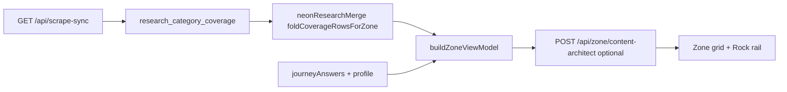

# Intelligence pipeline — final trigger matrix

Vercel Cron (formerly Hermes on an Oracle VPS, retired 2026-07-07 — see FULL-APP-SPEC.md §11) sits at the repair layer; the **browser onboarding path** below is what new users hit on first run.

**Ingestion (2026-07):** the free scraper (`lib/agents/freeScraper.ts` — plain `fetch` + Readability + linkedom, no API cost) is primary for the static gov.uk/Ofgem/MoneySavingExpert/EnergySavingTrust sources that make up most seed URLs. Firecrawl is the fallback for whatever it can't reach — its key is funded as of 2026-07 (`FIRE_CRAWL_KEY_3`), but the account currently has £0 credits (confirmed via a live API call: key authenticates, request fails on "Insufficient credits"), and `SKIP_FIRECRAWL=1` is separately still set in production, so Firecrawl calls remain disabled either way — the free scraper is effectively the sole ingestion path live. Per-category free-scraper seed URLs live in `JOURNEY_FREE_SEEDS` (`lib/intelligence/researchProfilePayload.ts`) and rot the same way `trustedJourneyUrls.ts` does — see the "Re-auditing offer/learn URL liveness" note in GUARDRAILS-AND-PIPELINE.md §1 for the verification method and a real 2026-07 incident (tech's 3 seeds all went dead, confirmed via zero scraped markdown on a live trigger, not curl).

LLM synthesis of scraped markdown into the £/kg/prose triplet runs through **bucket failover** (`lib/intelligence/bucketFailover.ts`): Gemini → Groq → Mistral → OpenRouter. As of 2026-07 all four provider keys are funded and configured — `GEMINI_API_KEY`, `GROQ_API_KEY`, `MISTRAL_API_KEY`, `OPENROUTER_API_KEY` — so OpenRouter is a genuine 4th tier now, not dormant. See GUARDRAILS-AND-PIPELINE.md §2 for the model-id staleness incident (`FLASH_DEFAULT` / `OPENROUTER_MODEL` both pointed at dated/deprecated model slugs that 404'd despite valid keys) — if a provider starts failing with a model-not-found error after previously working, check the model id before assuming the key regressed.

## 1. Profile complete (`ProfilePageClient.submitProfile`)

1. Persist profile to `localStorage` + unified memory.
2. **`POST /api/user`** — Neon row, session cookie, `restore_proof`.
3. **`triggerOnboardingResearchBootstrap`** — up to **4** surgical JIT scrapes (`ONBOARDING_JIT_CAP`):
   - Always: `home`
   - When power type set: `utilities`
   - Goal-aligned (+2): see `lib/zone/onboardingResearchBootstrap.ts`
4. Prefetch locality (≤2.6s) → navigate to `/profile/summary`.

Profile payload for Firecrawl/Gemini: `buildResearchProfilePayload()` — postcode, house number, home type, power, transport, household, employment, goal, **`age_group`**.

**Per-field grid unlock table:** [PROFILE-FIELDS-GRID-UNLOCKS.md](PROFILE-FIELDS-GRID-UNLOCKS.md).

## 2. Summary exit (`/profile/summary` phase `exit`)

`runProfileResearchHandshake()`:

| Call | Purpose |
| --- | --- |
| `GET /api/scrape-sync?postcode=` | Coverage + mechanical defaults |
| `POST /api/zone/tips-refresh` | Tip rail refresh (when AI route not blocked) |
| `triggerOnboardingResearchBootstrap` (deduped) | Fills any journeys not already fired at profile submit |

Session dedupe key: `sessionStorage.zz_onboarding_jit_journeys`.

## 3. Zone wall (`/zone`)

- View model from profile + journey answers + Neon `research_results`.
- Pink lock: visited cards do not re-trigger scrape.
- Loop questions → `POST /api/answers` → discovery birth (canonical MC path).

## 4. Solo Focus — earned scrape

| Trigger | API |
| --- | --- |
| Tip +1 / deep scrape | `POST /api/scrape-sync` with **`journey_key`** (Topic Shield) |
| Tier-2 answer pivot | `GET /api/scrape-sync?tier2=…` |
| Trap follow-up (capped) | `POST /api/zone/injections` |
| Free-form Ask card (capped) | `POST /api/research/question-card` |

All JIT POST bodies must include `journey_key` (or `category` resolved to one).

## 5. Hermes repair (scheduled)

| Job | Schedule | Route |
| --- | --- | --- |
| Zone research pulse | Weekly Mon 05:00 UTC | `GET/POST /api/cron/zone-research` |
| Mechanical repair | Hermes script | `GET/POST /api/cron/repair-mechanical` |

Local verify: `npm run hermes:ping`, `npm run hermes:repair-pulse` (requires `CRON_SECRET`).

## Free-tier filters (refined curation)

- **Topic Shield** — one journey domain per Firecrawl pass (`resolveSurgicalJourneyKey`).
- **Employment / income** — seed URLs via `buildEmploymentAwareResearchSeeds` (grants vs agile tariffs).
- **Goal** — onboarding journey pick + Zone tip sort (`goalSortWeights`).
- **House number + postcode** — EPC address match in local-intelligence + research context.
- **ULM caps** — 24 bento cells, 3 discovery injects/journey (`lib/zone/ulmLimits.ts`).

## Key modules

| Module | Role |
| --- | --- |
| `lib/profile/buildResearchProfilePayload.ts` | Shared profile → research context |
| `lib/zone/onboardingResearchBootstrap.ts` | Goal → onboarding journey list |
| `lib/researchSyncClient.ts` | Browser triggers + handshake |
| `lib/agents/researchAgent.ts` | Firecrawl + Gemini synthesis |
| `app/api/scrape-sync/route.ts` | JIT gate + session profile merge |

## 6. Content retrieval (read path)

| Step | What happens |
| --- | --- |
| Zone mount | `GET /api/scrape-sync?postcode=` + optional `user_id` |
| Coverage fold | `bills`→`money`, `general`→`home` aliases |
| VM build | `buildUserImpact` + Neon overlay + goal/employment filters |
| Architect batch | Polishes headlines; seeds trusted URL if Neon deep link missing |
| Rock rail | `prepareRockHabitsForRail` → `mergeRockHabitWithJourneyOffer` → `habitToTipCard` |

**Honest empty:** `source: "pending"`, `scraped: []` — tiles show **COMPUTING**, not fabricated £.

## 7. Offer URL precedence

| Surface | Order |
| --- | --- |
| Journey mother CTA | Neon `offer_url` → formula URL → `trustedUrlForJourney` → `/zai` audit |
| Rock habit learn | Topic-safe `learn_url` → `ROCK_SLUG_OFFER_URLS` → provider map → journey trusted |
| SMS tips | `resolveRockHabitLearnUrl` per habit (topic shield blocks journey bleed) |
| SMS recommendations | `resolveJourneyCardUrl` from journey VM rows |

## 8. Mobile SMS pipeline

| Step | Module |
| --- | --- |
| Opt-in + save | `POST /api/profile/mobile` (`sms_opt_in: true` required) |
| Welcome | `sendMobileWelcomeSms` |
| Tips + recs | `sendSignupZoneSms` ← `zoneSignupTips`, `zoneSignupRecommendations` from Zone |
| STOP/START | `POST /api/webhooks/twilio` |

## 9. Neon wake

`NeonWakePing` → `GET /api/health` on load, focus, and tab visibility — scales idle compute before DB routes.
