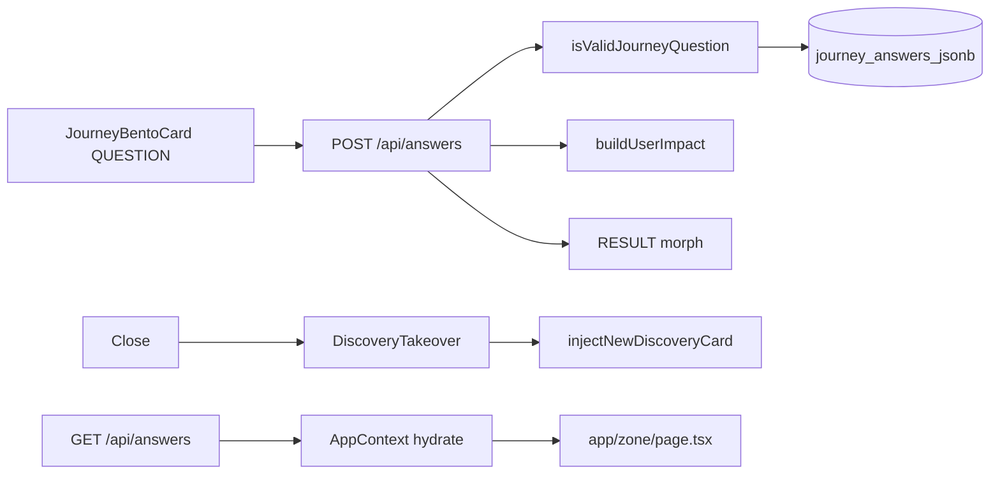
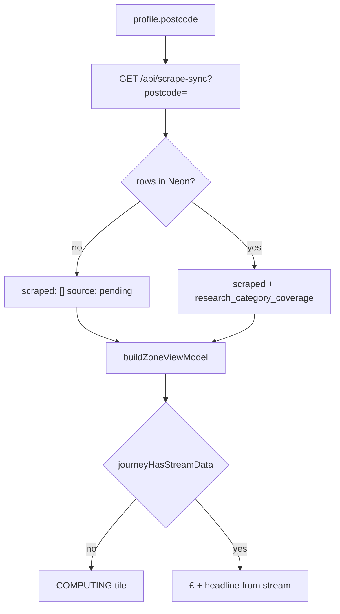

# Profile, journey questions & Zone data — technical reference

What ships in **`main`** after the **mechanical truth** pass: the UI only shows £/kg and headlines when Neon or scrape-sync has **stream data**. No UK placeholder back-fill on the Zone wall.

Cross-links: **[HANDBOOK.md](HANDBOOK.md)**, **[ZONE-CONTENT-AND-DATA.md](ZONE-CONTENT-AND-DATA.md)** (scrape, copy, presentation), **[HYBRID-DATA-PIPELINE.md](HYBRID-DATA-PIPELINE.md)**, **[INTELLIGENCE-LOOP-MANIFEST.md](INTELLIGENCE-LOOP-MANIFEST.md)**, **[PROFILE-FIELDS-GRID-UNLOCKS.md](PROFILE-FIELDS-GRID-UNLOCKS.md)** (profile → JIT → grid), **`lib/journeys.ts`**.

---

## 1. Thirteen domains × three questions

| Journey key | Profile / Solo Focus questions (ids) |
|-------------|--------------------------------------|
| `home` | `property_type`, `insulation_level`, `glazing_type` |
| `utilities` | `tariff_type`, `supplier_switch`, `monthly_energy_band` ( **`home_power` / power type = profile only** — unlocks UTILITIES tile on Zone) |
| `grants` | `boiler_age`, `income_benefits`, `prior_eco_bus` |
| `solar` | `roof_orientation`, `roof_shading`, `daytime_occupancy` |
| `travel` | `commute_distance`, `ev_hybrid`, `public_transport` |
| `holidays` | `annual_flights`, `flight_duration`, `carbon_offsets` |
| `food` | `diet_profile`, `organic_shopping`, `own_produce` |
| `shopping` | `retail_channel`, `repair_mindset`, `online_deliveries` |
| `money` | `monthly_energy_bill`, `tariff_type`, `green_investments` |
| `tech` | `smart_thermostat`, `smart_home`, `smart_meter` |
| `water` | `garden_butt`, `wash_preference`, `rainwater_harvest` |
| `waste` | `food_waste_collection`, `composting`, `soft_plastics` |
| `carbon` | `footprint_awareness`, `carbon_removal`, `tonne_reduction_timeline` |

- **Source of truth:** `lib/journeys.ts` — `JOURNEY_ORDER`, `JOURNEYS`, `isValidJourneyQuestion`, `isJourneyComplete`.
- **Wall order:** `JOURNEY_ORDER` in `lib/journeys.ts` (13 keys including `utilities` after `home`).
- **DB sync:** `npm run db:evolve-13-domains` seeds `journey_questions` for all keys in `JOURNEY_ORDER`.

Question copy is **behavioural** (no hardcoded £/carbon in labels). Money on cards comes from **research / scrape**, not from question text.

### 1.1 How MC answers influence Zone

| Influence type | Mechanism |
|----------------|-----------|
| **£ / kg on journey tile** | `buildUserImpact` → per-journey calculators in `lib/brains/calculations.ts` (when stream data exists) |
| **Headline / title tweaks** | `profileDrivenJourneyTitle`, `grantsJourneyTitleForProfile`, Neon `agent_headline` when settled |
| **Scrape context** | Every answer → `runLoopSpawnResearch`; journey 3/3 → `triggerSupplementalResearch` |
| **Discovery birth** | `POST /api/answers` → `injectNewDiscoveryCard` → tip slot on wall |
| **Genome modifier** | +0.08 per answered Q → wall formula via `getGenomeModifier` |

**Strong calculator mapping:** grants (`boiler_age`, `income_benefits`, `prior_eco_bus`), solar trio, travel (`commute_distance`, `ev_hybrid`), utilities `tariff_type`, money trio, tech/water/waste/food/holidays/carbon as documented in `calculations.ts`.

**Weak / scrape-only (known gaps):** home `property_type` / `insulation_level` / `glazing_type`; utilities `supplier_switch` / `monthly_energy_band`; travel `public_transport`; food `own_produce`. These still persist, trigger research, and bump genome modifier.

Full matrix: [PROFILE-FIELDS-GRID-UNLOCKS.md](PROFILE-FIELDS-GRID-UNLOCKS.md) § Journey MC questions.

---

## 2. Profile onboarding

| Step | Code | Persistence |
|------|------|-------------|
| Route | `app/profile/page.tsx` → `ProfilePageClient.tsx` | — |
| Name step | `InputField` `autocomplete="given-name"`; `firstNameFromAutofill` on change/blur | `profile_name` — **first token only** (browser may autofill full name) |
| Postcode step | `autocomplete="postal-code"`; optional **house number** on same step (`autocomplete="address-line2"`, `profile_house_number`) · hydrate from `profile_postcode` (`localStorage`, intro geolocation, `SessionStateRehydrate`) · `POST /api/local-intelligence` with `{ postcode, house_number? }` | Council, ward, `localCarbonG`, grant context; OpenEPC row matched to address when house number set (`addressMatched` on `OpenEpcProfile`) |
| Profile fields | name, postcode, optional house number, `home_type`, **`power type`** (profile step `powerType` → GAS / ELECTRIC / MIX / OTHER), transport, household, employment, goal | `users` + `AppContext` + `localStorage` (`profile_home_power`, `profile_house_number`); seeds journey answers + **unlocks 13th Zone card (UTILITIES)** via `lib/profile/homePower.ts` + `lib/zone/utilitiesZoneUnlock.ts` |
| Motion | Full-sentence fade per step (`STACCATO_TWEEN`, y 10→0) | [HANDBOOK.md](HANDBOOK.md) Motion table |
| After profile | `/profile/summary` → `/zone` | Summary uses `lib/brains/summaryLogic.ts` + `buildUserImpact` (no UK_2026 back-fill) |

### Utilities free APIs (server-only)

| API | Auth | Used for |
|-----|------|----------|
| [postcodes.io](https://postcodes.io) | none | Council / region anchor |
| [epc.opendatacommunities.org](https://epc.opendatacommunities.org/docs/api/domestic) | HTTP Basic (`OPENEPC_EMAIL` + `OPENEPC_API_KEY`) | Domestic EPC search by postcode; optional house-number filter (`lib/intelligence/epcAddressMatch.ts`) |
| [carbonintensity.org.uk](https://api.carbonintensity.org.uk) | none | `GET /intensity` (live gCO₂/kWh), `GET /generation` (fuel mix %), regional postcode |
| [environment.data.gov.uk](https://environment.data.gov.uk/flood-monitoring) | none | Water lane — latest station readings (`/data/readings?_limit=N`) |
| [api.octopus.energy](https://api.octopus.energy) | none | Indicative Agile p/kWh (electric / mixed homes) |
| Ofgem price-cap hub | none (HTML via `/api/pulse/living`) | Cap + unit-rate citations |

Full matrix + usefulness: **[PUBLIC-UK-APIS.md](PUBLIC-UK-APIS.md)**. Registry: `lib/data/utilitiesFreeApis.ts` · `lib/data/ukPublicInfrastructureApis.ts` · `lib/data/octopusPublicApis.ts` · `lib/data/publicUkApisUsage.ts`. Live smoke: `npm run test:uk-apis`.

**Intro:** `/` and `/intro` — kinetic words → stacked lockup **CREATE A / PROFILE TO / START.** at **profile question H2 scale** (not desktop H1). **CREATE** only (no SKIP). `?skip=1` skips logo. Intro may set `profile_postcode` via geolocation + `/api/geocode`.

---

## 3. Journey answers (Solo Focus & embedded)



| Piece | Location |
|-------|----------|
| Solo Focus Q | `lib/zone/questionHandler.ts` → `getSoloFocusNextQuestion` |
| UI | `app/components/JourneyBentoCard.tsx` |
| Loop after close | `app/components/DiscoveryTakeover.tsx` + `lib/zone/loopQuestions.ts` |
| Server handler | `app/api/answers/route.ts` |
| Validation | `isValidJourneyId` + `isValidJourneyQuestion` from `lib/journeys.ts` |
| Persist | `upsertJourneyAnswerJsonb`, `upsertUserGenomeFromAnswer` (`lib/db/neon.ts`) |
| Discovery birth | `raceDiscoveryBirth` → response `new_card_data` / `grid_pulse_card` → client `injectNewDiscoveryCard` |
| Supplemental | `POST /api/research/question-card` (Ask), `POST /api/zone/injections` (trap) — capped |

Answers **refine** impact when stream data exists; they **do not** fabricate Zone wall £ when Neon is empty (see §4).

---

## 4. Mechanical truth on the Zone

### Rule

**If `research_results` / `scraped_summary` / per-journey Neon row has no stream for a journey → that tile shows £0, carbon 0, title `COMPUTING — <JOURNEY>`, metrics `—`, and a “Computing…” strip.**

### Data path



| File | Role |
|------|------|
| `lib/scraper/uk2026Defaults.ts` | Shape-only defaults: **all zeros**, labels **Computing...** (not shown as fake savings) |
| `lib/brains/buildUserImpact.ts` | **No** `UK_2026_MONEY_LEAD` back-fill when money/carbon are 0 |
| `lib/zone/mechanicalTruth.ts` | `journeyHasStreamData`, `hasAnyStreamData`, `computingJourneyTitle` |
| `lib/zone/buildZoneViewModel.ts` | Skips formula £ for journeys without stream; hero **Analyzing your postcode...** when totals are 0 |
| `app/zone/page.tsx` | Grid always visible; `LoadingHeartbeat` + skeleton cards until scrape-sync resolves (`vmResolved`); `streamPending` → `insightGenerationPending` on cards |
| `app/api/scrape-sync/route.ts` | With postcode + empty DB → `{ scraped: [], source: "pending" }` (not fake defaults) |

### Filling the screen (only path)

1. **POST** `/api/scrape-sync?postcode=BN17&force=true` (Bearer `SCRAPER_SECRET` or `CRON_SECRET`) — regional research + persist repair.
2. Or **Hermes** cron → `/api/cron/zone-research` for queued users.
3. Or user **answers** in Solo Focus → discovery + supplemental research (capped).

**Verify API (honest empty):**

```bash
curl -sS "https://www.00-00.online/api/scrape-sync?postcode=BN17" | jq '.source, (.scraped | length)'
# expect: "pending" and 0 until Neon has rows
```

**Verify DB:**

```bash
npm run db:log-research
npm run db:columns
```

---

## 5. What you should see in the browser

| State | Zone hero | Journey tiles |
|-------|-----------|---------------|
| Clean Neon, first load | “Analyzing your postcode…”, £0 total | 13× **COMPUTING — …**, **—** for SAVE/CARBON, pulsing “Computing…” |
| After pulse / research rows | Personalised hero when totals &gt; 0 | Real £, headlines, LIVE/ESTIMATED audit badges |
| Stale client cache | Old £ may flash briefly | Hard refresh; `DATA_VERSION` in app clears journey cache on bump |

---

## 6. Deploy & prep

```bash
npm run verify
npm run prep:live           # db:test + db:evolve-13-domains + build:clean
npm run deploy              # verify + remote build + auto-promote
npm run promote             # if Vercel Staged but build green
npm run dev:pipeline-ready  # local env + health; optional -- --seed POSTCODE
```

See [DEPLOY-VERCEL.md](DEPLOY-VERCEL.md) and [USER-FLOW-AND-DATA-PIPELINE.md](USER-FLOW-AND-DATA-PIPELINE.md) §6.

If `git push` says “no upstream”, run once: `git push -u origin main`.

---

## 7. Presentation (after stream exists)

Once `research_results` rows exist, see **[ZONE-CONTENT-AND-DATA.md](ZONE-CONTENT-AND-DATA.md)** for headlines, Solo Focus triplets (deduped payoff, per-journey expanded hooks), Today's Tips rail, offer URLs, grid reveal stability, and warm UK auditor tone.
