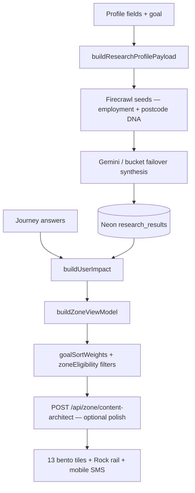

# Profile fields → grid unlocks (every user)

Maps each onboarding answer to **what activates** in the intelligence loop and **what moves** on the Zone wall. Applies to every signed-in user who completes profile + summary (canonical path).

Cross-links: [INTELLIGENCE-PIPELINE-FINAL.md](INTELLIGENCE-PIPELINE-FINAL.md), [PROFILE-ANSWERS-ZONE-TECH.md](PROFILE-ANSWERS-ZONE-TECH.md), [ZONE-CONTENT-AND-DATA.md](ZONE-CONTENT-AND-DATA.md).

---

## Universal sequence (every user)

| Phase | Trigger | What runs |
| --- | --- | --- |
| **0 — Connect** | Any page load | `NeonWakePing` → `GET /api/health` wakes Neon compute |
| **1 — Profile submit** | Last profile step + goal | `POST /api/user` (session) → `triggerOnboardingResearchBootstrap` (≤4 JIT scrapes) |
| **2 — Summary exit** | Ticker completes → exit phase | `runProfileResearchHandshake` — coverage GET, tips refresh, deduped JIT fill |
| **3 — Zone load** | `/zone` | `GET /api/scrape-sync?postcode=` → `buildZoneViewModel` → 13 tiles + Rock rail |
| **4 — Earned depth** | Solo Focus Tip +1, MC answers | `POST /api/scrape-sync` / `POST /api/answers` → discovery birth (capped) |
| **5 — Repair** | Weekly Hermes | `GET /api/cron/zone-research` refreshes stale rows |

**Requirement:** profile must finish with a valid postcode (≥4 chars) and **`POST /api/user`** must succeed (session cookie). Without session, scrapes persist anonymously and mobile SMS is blocked.

**Goal** is set on intro (`profile_goal` in localStorage) or profile; it is required for `isProfileOnboardingComplete`.

---

## Profile field matrix

| Field | Question / source | Storage key | Neon / genome | Onboarding JIT | Zone grid & curation |
| --- | --- | --- | --- | --- | --- |
| **Name** | `name` | `profile_name` | `users.name` | — | Summary ticker; Rock mobile SMS greeting |
| **Postcode** | `postcode` | `profile_postcode` | `users.postcode` | **Anchor for all scrapes** | Hero locality; council/region via geocode; scrape-sync scope |
| **House number** | optional on postcode step | `profile_house_number` | `user_genome.house_number` | EPC address match in research context | Home/grants precision; OpenEPC row match |
| **Household** | who do you live with? | `profile_household` | `user_genome.household` | Research seed context | Impact baselines; affluence auditor tone |
| **Home type** | flat / house | `profile_home_type` | `user_genome.home_type` | `home` journey seeds | Home tile baseline; insulation/EPC framing |
| **Power type** | gas / electric / mix / other | `profile_home_power` | `user_genome.home_power` | Adds **`utilities`** to onboarding JIT list | **Unlocks UTILITIES tile** (13th card); Agile/Octopus + tariff lane |
| **Transport** | walk / bike / public / car / mix | `profile_transport` | `user_genome.transport_baseline` | `travel` priority when goal-aligned | Travel tile sort; commute impact |
| **Age** | junior / mid / retired | `profile_age` | `user_genome.age` | Affluence auditor block in Gemini prompts | Summary staccato; persona hints |
| **Employment** | employed / self-employed / not in work | `profile_employment_status` | `user_genome.employment_status` | **`buildEmploymentAwareResearchSeeds`** — grants vs agile tariffs | Grants **title** rewrite; **filters means-tested tips** off Rock rail for employed users |
| **Goal** | intro: save money / reduce carbon / both | `profile_goal` | `users.primary_goal` | Picks **+2 goal-aligned JIT journeys** (see below) | **`goalSortWeights`** — hero tile order; tip rail ranking |

Payload assembly: `buildResearchProfilePayload()` / `buildResearchProfileFromStorage()` → every Firecrawl + Gemini pass.

---

## Goal → onboarding JIT journeys (cap 4)

Always **`home`**. If power type set → **`utilities`**. Then goal fills remaining slots:

| Goal | Priority order (first unsettled wins) |
| --- | --- |
| **money** | grants → money → shopping → travel |
| **carbon** | carbon → solar → travel → food |
| **balanced** | grants → travel → food → money |

Examples:

- Money + electric home → `home`, `utilities`, `grants`, `money`
- Carbon + gas home → `home`, `utilities`, `carbon`, `solar`
- Balanced + no power yet → `home`, `grants`, `travel`, `food` (utilities skipped until power answered)

Dedupe: `sessionStorage.zz_onboarding_jit_journeys` — profile submit + summary handshake do not double-fire.

---

## What each profile field does *not* do

- **No field fabricates £ on the wall** without Neon stream data (`journeyHasStreamData`).
- **Onboarding JIT does not scrape all 13 journeys** — remaining domains are **earned** in Solo Focus (Tip +1) or Hermes repair.
- **Journey MC answers** (3× per domain in Solo Focus) refine impact and birth discovery cards; they are separate from profile fields (see [PROFILE-ANSWERS-ZONE-TECH.md](PROFILE-ANSWERS-ZONE-TECH.md) §1).

---

## After profile — per-user curation stack



| Layer | Module | Sort / filter behaviour |
| --- | --- | --- |
| Mechanical £/kg | `buildUserImpact` | Only from stream + answers — zero when pending |
| Hero order | `goalSortWeights(profile.goal)` | Money-heavy vs carbon-heavy tile weights |
| Grants copy | `grantsJourneyTitleForProfile` | Employed vs not; affluent postcode districts |
| Rock tips | `filterTipsForEmployment` | Hides means-tested grant tips for employed users |
| Headlines | `content-architect` + `researchAgent` | Category-locked; wrong lane → COMPUTING until valid row |

---

## Mobile signup (post-Zone)

Requires session + explicit SMS opt-in. Uses visible Rock rail tips + journey recommendations from the curated VM — not raw profile fields alone.

---

## Verify one user end-to-end

```bash
# After profile + summary in browser (signed in)
curl -sS -b cookies.txt "https://www.00-00.online/api/scrape-sync?postcode=YOURPC" | jq '.research_category_coverage, .source'
npm run db:log-research
```

Expect onboarding JIT keys in `research_category_coverage` within minutes; unsettled journeys stay **COMPUTING** until earned scrape or Hermes pulse.
