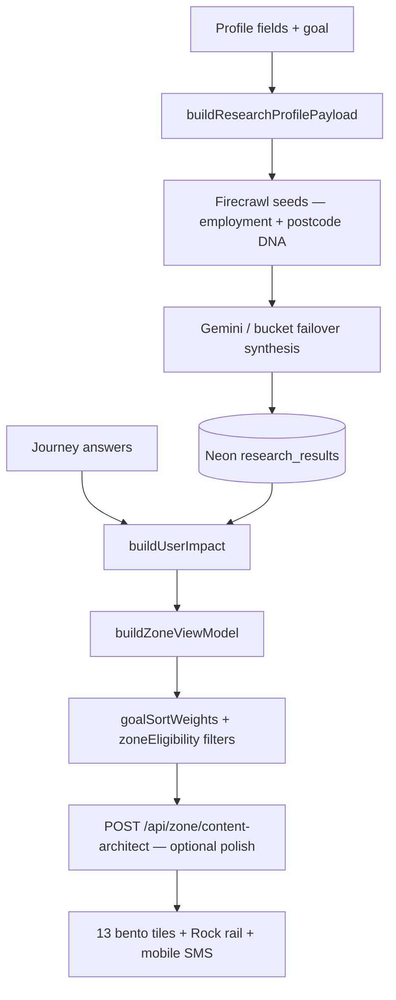

# Profile fields → grid unlocks (every user)

Maps each onboarding answer to **what activates** in the intelligence loop and **what moves** on the Zone wall. Applies to every signed-in user who completes profile + summary (canonical path).

Cross-links: [INTELLIGENCE-PIPELINE-FINAL.md](INTELLIGENCE-PIPELINE-FINAL.md), [PROFILE-ANSWERS-ZONE-TECH.md](PROFILE-ANSWERS-ZONE-TECH.md), [ZONE-CONTENT-AND-DATA.md](ZONE-CONTENT-AND-DATA.md).

---

## Universal sequence (every user)

| Phase | Trigger | What runs |
| --- | --- | --- |
| **0 — Connect** | Any page load | `NeonWakePing` → `GET /api/health` wakes Neon compute |
| **1 — Profile submit** | Last profile step + goal | `POST /api/user` (session) → `triggerOnboardingResearchBootstrap` (≤4 JIT scrapes) |
| **2 — Summary exit** | Ticker completes → exit phase | `runProfileResearchHandshake` — coverage GET, tips refresh, deduped JIT fill |
| **3 — Zone load** | `/zone` | `GET /api/scrape-sync?postcode=` → `buildZoneViewModel` → 13 tiles + Rock rail |
| **4 — Earned depth** | Solo Focus Tip +1, MC answers | `POST /api/scrape-sync` / `POST /api/answers` → discovery birth (capped) |
| **5 — Repair** | Weekly Hermes | `GET /api/cron/zone-research` refreshes stale rows |

**Requirement:** profile must finish with a valid postcode (≥4 chars) and **`POST /api/user`** must succeed (session cookie). Without session, scrapes persist anonymously and mobile SMS is blocked.

**Goal** is set on intro (`profile_goal` in localStorage) or profile; it is required for `isProfileOnboardingComplete`.

---

## Profile field matrix

| Field | Question / source | Storage key | Neon / genome | Onboarding JIT | Zone grid & curation |
| --- | --- | --- | --- | --- | --- |
| **Name** | `name` | `profile_name` | `users.name` | — | Summary ticker; Rock mobile SMS greeting |
| **Postcode** | `postcode` | `profile_postcode` | `users.postcode` | **Anchor for all scrapes** | Hero locality; council/region via geocode; scrape-sync scope |
| **House number** | optional on postcode step | `profile_house_number` | `user_genome.house_number` | EPC address match in research context | Home/grants precision; OpenEPC row match |
| **Household** | who do you live with? | `profile_household` | `user_genome.household` | Research seed context | Impact baselines; affluence auditor tone |
| **Home type** | flat / house | `profile_home_type` | `user_genome.home_type` | `home` journey seeds | Home tile baseline; insulation/EPC framing |
| **Power type** | gas / electric / mix / other | `profile_home_power` | `user_genome.home_power` | Adds **`utilities`** to onboarding JIT list | **Unlocks UTILITIES tile** (13th card); Agile/Octopus + tariff lane |
| **Transport** | walk / bike / public / car / mix | `profile_transport` | `user_genome.transport_baseline` | `travel` priority when goal-aligned | Travel tile sort; commute impact |
| **Age** | junior / mid / retired | `profile_age` | `users.age_group` | `age_group` in `buildResearchProfilePayload` → Gemini persona | `personaBoost` tip sort (JUNIOR→tech, RETIRED→home) |
| **Employment** | employed / self-employed / not in work | `profile_employment_status` | `user_genome.employment_status` | **`buildEmploymentAwareResearchSeeds`** — grants vs agile tariffs | Grants **title** rewrite; **filters means-tested tips** off Rock rail for employed users |
| **Goal** | intro: save money / reduce carbon / both | `profile_goal` | `users.primary_goal` | Picks **+2 goal-aligned JIT journeys** (see below) | **`goalSortWeights`** — hero tile order; tip rail ranking |
| **How's money?** (added 2026-08) | TIGHT / GETTING BY / DOING OK | `profile_financial_pressure` | `users.financial_pressure` | — | **Required** to complete onboarding. Is what *switches* Zone from the 13-tile category wall to the ranked action wall (below); sets the hard cost ceiling on every action shown — TIGHT sees FREE only |
| **Any kids at home?** (added 2026-08) | NO / UNDER 5 / SCHOOL AGE / BOTH | `profile_children` | `users.children` | — | Hard-gates child-linked entitlements (Healthy Start, free school meals) on the ranked wall only — deliberately separate from **Household**, which is a living arrangement, not a children question |

Payload assembly: `buildResearchProfilePayload()` / `buildResearchProfileFromStorage()` → every Firecrawl + Gemini pass (`postcode`, `house_number`, `home_type`, `home_power`, `transport_baseline`, `household`, `employment_status`, `goal`, `age_group`).

---

## Journey MC questions → Zone influence (39 total)

Source: `lib/journeys.ts` · £/kg: `lib/brains/calculations.ts` via `buildUserImpact`. Every valid **`POST /api/answers`** also triggers `runLoopSpawnResearch` and can birth discovery cards.

| Domain | Strong £ / headline influence | Weak or scrape-only |
| --- | --- | --- |
| **home** | Legacy keys `electricity_provider`, `gas_provider`, `green_tariff` if present | `property_type`, `insulation_level`, `glazing_type` — synthetic baselines only; `calculateHome` ignores fabric trio |
| **utilities** | `tariff_type` → April 2026 policy savings | `supplier_switch`, `monthly_energy_band` — not mapped to `monthly_cost` |
| **grants** | `boiler_age`, `income_benefits`, `prior_eco_bus`; OVER_10YR → hybrid scrape | — |
| **solar** | `roof_orientation`, `roof_shading`, `daytime_occupancy` | — |
| **travel** | `commute_distance`, `ev_hybrid` | `public_transport` — not in `calculateTravel`; VM titles read `fuel_type` not `ev_hybrid` |
| **holidays** | `annual_flights`, `flight_duration`, `carbon_offsets` | — |
| **food** | `diet_profile`, `organic_shopping` | `own_produce` — unmapped |
| **shopping** | `retail_channel`, `repair_mindset`, `online_deliveries` | — |
| **money** | `monthly_energy_bill`, `tariff_type`, `green_investments` | — |
| **tech** | `smart_thermostat`, `smart_home`, `smart_meter` | — |
| **water** | `garden_butt`, `wash_preference`, `rainwater_harvest` | — |
| **waste** | `food_waste_collection`, `composting`, `soft_plastics` | — |
| **carbon** | `footprint_awareness`, `carbon_removal`, `tonne_reduction_timeline` | — |

**Indirect (all MC answers):** `getGenomeModifier` +0.08 per answered Q on wall formula; discovery inject into tip slots; supplemental scrape at journey 3/3 complete.

---

## Goal → onboarding JIT journeys (cap 4)

Always **`home`**. If power type set → **`utilities`**. Then goal fills remaining slots:

| Goal | Priority order (first unsettled wins) |
| --- | --- |
| **money** | grants → money → shopping → travel |
| **carbon** | carbon → solar → travel → food |
| **balanced** | grants → travel → food → money |

Examples:

- Money + electric home → `home`, `utilities`, `grants`, `money`
- Carbon + gas home → `home`, `utilities`, `carbon`, `solar`
- Balanced + no power yet → `home`, `grants`, `travel`, `food` (utilities skipped until power answered)

Dedupe: `sessionStorage.zz_onboarding_jit_journeys` — profile submit + summary handshake do not double-fire.

---

## Ranked action wall (2026-08) — a second unlock path

Everything in the matrix above still describes the **13-tile category wall**, which is what guests and partially-profiled users see. Once `financial_pressure` is answered, `buildZoneViewModel` switches to a different model entirely: instead of one calculator-driven card per journey, it ranks a 63-entry tagged action library (`lib/actions/actionLibrary.ts`) against the full profile and shows the twelve highest-scoring, eligible actions. No LLM call — deterministic, same profile in, same twelve out.

| Field feeding the ranker | Role |
| --- | --- |
| `financial_pressure` | **Trigger** for the switch, and the hard cost ceiling (TIGHT → FREE only) |
| `home_ownership` (tenure) | Eligibility for owner-only actions (green mortgage, capital works) and exclusion of renter-inapplicable ones |
| `household` | Relevance gate (soft) |
| `children` | Hard eligibility for Healthy Start / free school meals |
| `employment_status` | Unlocks STUDENT (council tax exemption, hardship funds) and BETWEEN_JOBS (debt grants, New Style JSA) actions |
| `age` | Unlocks RETIRED actions (Pension Credit, Attendance Allowance, free bus pass) |
| `home_power`, `transport_baseline`, `wash_preference` | Relevance gates (soft) |
| Loop-question answers (`journey_*_answers`) | Gate identically to onboarding fields — answering a loop nudge widens the eligible pool and the newly-unlocked top action becomes the next card shown, drawn from the vetted library rather than generated on the spot |

Full mechanics (gates vs requires vs excludes, cost ceiling, recurrence-aware completion, the diversity-cap-sharing fix, and the string of follow-up bugs caught after ship): [GUARDRAILS-AND-PIPELINE.md §2c](GUARDRAILS-AND-PIPELINE.md#2c-ranked-action-library-2026-08--replaces-one-card-per-category). Content/copy side: [ZONE-CONTENT-AND-DATA.md](ZONE-CONTENT-AND-DATA.md) §6.

---

## What each profile field does *not* do

- **No field fabricates £ on the wall** without Neon stream data (`journeyHasStreamData`).
- **Onboarding JIT does not scrape all 13 journeys** — remaining domains are **earned** in Solo Focus (Tip +1) or Hermes repair.
- **Journey MC answers** (3× per domain in Solo Focus) refine impact and birth discovery cards; they are separate from profile fields (see [PROFILE-ANSWERS-ZONE-TECH.md](PROFILE-ANSWERS-ZONE-TECH.md) §1).

---

## After profile — per-user curation stack



| Layer | Module | Sort / filter behaviour |
| --- | --- | --- |
| Mechanical £/kg | `buildUserImpact` | Only from stream + answers — zero when pending |
| Hero order | `goalSortWeights(profile.goal)` | Money-heavy vs carbon-heavy tile weights |
| Grants copy | `grantsJourneyTitleForProfile` | Employed vs not; affluent postcode districts |
| Rock tips | `filterTipsForEmployment` | Hides means-tested grant tips for employed users |
| Headlines | `content-architect` + `researchAgent` | Category-locked; wrong lane → COMPUTING until valid row |

---

## Offer URL precedence

| Surface | Resolution order | Module |
| --- | --- | --- |
| **Journey mother tile CTA** | Neon `offer_url` → formula `claimOfferUrl` → council grant URL → `trustedUrlForJourney` → Ask Zai | `buildZoneViewModel`, `resolveSoloFocusHandoffUrls` |
| **Rock Today's Tips** | Habit `learn_url` if topic-safe → slug map → provider map → journey trusted URL | `resolveRockHabitLearnUrl` |
| **Rock + Neon merge** | Journey `latestOfferUrl` only when `mergeRockHabitWithJourneyOffer` passes topic shield | `lib/rock/resolveRockHabitLearnUrl.ts` |
| **SMS tips** | Same as Rock — `resolveRockHabitLearnUrl(h)` per habit (not blind journey URL) | `zoneSignupTips` in `app/zone/page.tsx`, `signupZoneSms.ts` |
| **SMS recommendations** | Journey card `resolveJourneyCardUrl` from VM | `signupZoneSmsShared.ts` |

**Anti-pattern (fixed):** stamping one journey-level Neon URL on every Rock habit in that category (e.g. e-bike + Eurostar). Topic conflicts: Eurostar vs e-bike/motorway habits; Recyclenow vs water butt; WRAP food vs preloved fashion.

---

## Mobile signup (post-Zone)

Requires **session** + explicit **`sms_opt_in: true`** (checkbox). Flow:

1. `POST /api/profile/mobile` persists `users.mobile` + `mobile_sms_opt_in`
2. `sendMobileWelcomeSms` — first-time or changed number
3. `sendSignupZoneSms` — Today's tips (`zoneSignupTips` + `tipSlugs`) + recommendations (`zoneSignupRecommendations`)

Payload built from visible Rock rail + journey mother cards on Zone — not profile fields alone.

---

## Verify one user end-to-end

```bash
# After profile + summary in browser (signed in)
curl -sS -b cookies.txt "https://www.00-00.online/api/scrape-sync?postcode=YOURPC" | jq '.research_category_coverage, .source'
npm run db:log-research
```

Expect onboarding JIT keys in `research_category_coverage` within minutes; unsettled journeys stay **COMPUTING** until earned scrape or Hermes pulse.

---

## Known gaps (engineering backlog)

| Item | Impact |
| --- | --- |
| Home fabric MC trio not in `calculateHome` | Answers affect scrape context only, not home £ |
| `utilities.monthly_energy_band` not wired to spend model | Band is scrape-only |
| Travel VM titles use `fuel_type`; registry uses `ev_hybrid` | EV headline may not reflect MC answer until genome derives `fuel_type` |
| Onboarding JIT cap = 4 | Remaining 9 journeys earned in Solo Focus or Hermes |
| Content Architect may use trusted catalog URL when Neon deep link thin | Prose personalised; URL may be generic |
| Mechanical triplet fallback | Can look “live” with `trustedUrlForJourney` before full Firecrawl pass |

**Fixed in code (ship with next deploy):** `vmLive` profile includes `home_power` (utilities tile after living pulse); `age_group` in client research payload; Rock/SMS topic-aligned URLs via `mergeRockHabitWithJourneyOffer`.
