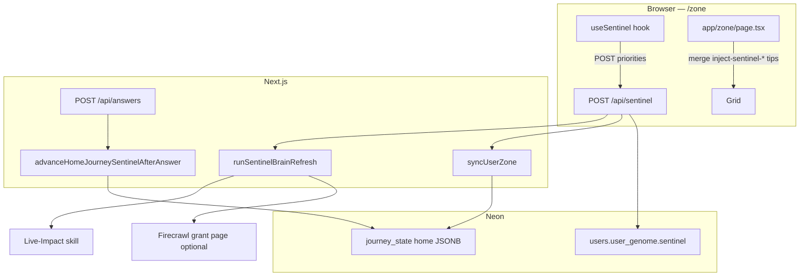

# Sentinel — live signals, home deck, and inject tips

Sentinel is a **parallel layer** to the main Zone content pipeline (`GET /api/scrape-sync` → `research_results` → Content Architect). It does **not** replace Hermes, scrape-sync, or the canonical **`POST /api/answers`** discovery birth path.

**Main content spec:** [ZONE-CONTENT-AND-DATA.md](ZONE-CONTENT-AND-DATA.md) · **Boundaries:** [ZAI-AND-QUESTIONS-RULES.md](ZAI-AND-QUESTIONS-RULES.md) Part 0.

---

## 1. What Sentinel does

| Capability | Purpose |
|------------|---------|
| **Live-Impact** | Ofgem-locked July 2026 rates + regional grid intensity (`app/lib/skills/liveImpact.ts`) |
| **Home mother/child deck** | P1–P3 slides in `journey_state` for `home`; advances after each home answer (max 3) |
| **Client priorities** | Top 3 heuristic tips (home / travel / waste-shopping) from answers + goal + chat keywords |
| **Rural grant signal** | Remote postcode prefixes + Firecrawl grant extract → optional `inject-sentinel-rural-support` tip |
| **Grid low pulse** | When intensity &lt; 50 g/kWh, Zone can pulse the carbon journey card |
| **Zone sync** | `syncUserZone` builds home mother/child state from profile + local intelligence |

Sentinel copy is **direct, no pleasantries** (bear/wolf tip lines on client-built priorities). It is **not** the Zai chat persona (“auditor with a pint”) — see [ZAI-AND-QUESTIONS-RULES.md](ZAI-AND-QUESTIONS-RULES.md).

---

## 2. Architecture



---

## 3. Code map

| Module | Role |
|--------|------|
| `app/hooks/useSentinel.ts` | Client: build priorities, throttle refresh (5 min), optional 24h scrape via API |
| `app/api/sentinel/route.ts` | Auth session: brain refresh + `syncUserZone` + persist `user_genome.sentinel` |
| `lib/agents/sentinel.ts` | `runSentinelBrainRefresh` — Gemini tool calling via AI Gateway (Live-Impact + structured Firecrawl extract), mechanical fallback when the gateway isn't configured or the call fails |
| `lib/sentinel/runner.ts` | `advanceHomeJourneySentinelAfterAnswer`, `syncUserZone`, mother/child slide builders |
| `lib/sentinel/scraper.ts` | Soft-save cards (flow temp, phantom standby, food waste) |
| `lib/sentinel/liveGrounding.ts` | Gemini grounding for mother copy; also used by **`/api/local-offers`** |
| `lib/sentinel/recardTypes.ts` | `SentinelMotherRecardPayload`, `MotherChildSlide`, view states `LIVE` / `RESULT` |
| `lib/sentinel/api-config.ts` | Shared Firecrawl + Gemini clients (`FIRE_CRAWL_KEY_2` wins) |
| `app/lib/skills/liveImpact.ts` | Auditable baseline £/kWh + grid intensity |
| `scripts/test-sentinel-runner.ts` | Local integration test for runner + advance |

---

## 4. Client hook (`useSentinel`)

**Used on:** `app/zone/page.tsx` only.

### Inputs

- `userAnswers` — journey answer map from AppContext
- `impactTotals` — hero `totalMoney` / `totalCarbon` from VM
- `recentChatHistory` — last messages for keyword bias (heat / commute / waste)

### Outputs

| Field | Meaning |
|-------|---------|
| `priorities` | Up to 3 `SentinelPriority` rows → mapped to **`inject-sentinel-{journey}-{index}`** tip cards |
| `gridLowPulse` | Server flag when grid intensity low |
| `grantFound` + `firecrawlGrant` | Rural remote + grant scrape → **`inject-sentinel-rural-support`** |
| `liveImpact` | Home idle 24h cost/carbon + intensity |
| `pulseColor` | Optional carbon card pulse colour |

### Refresh policy

| Interval | Behaviour |
|----------|-----------|
| **5 minutes** | Skip duplicate `POST /api/sentinel` if `zz_sentinel_last_refreshed` is fresh |
| **24 hours** | Pass `run_scrape_sync: true` → server may POST scrape-sync; client then POSTs **`/api/zone/tips-refresh`** |

Priorities are **heuristic** (20% of impact totals + answer count), re-sorted by profile goal (`profile_goal`: money / carbon / balanced).

---

## 5. Server API — `POST /api/sentinel`

| Auth | Behaviour |
|------|-----------|
| **Guest** | Echo priorities back; no brain refresh |
| **Signed in** | Full pipeline |

**Body (optional):** `priorities[]`, `system_prompt`, `region`, `run_scrape_sync`.

**Steps:**

1. `runSentinelBrainRefresh({ region, postcode, runScrapeSync })`
2. `syncUserZone({ userId, location, genome, appOrigin })`
3. Tune priority `savingsGbp` with live baseline cost
4. If `run_scrape_sync` + remote postcode (`KW`, `IV`, `HS`, …) → internal POST `/api/scrape-sync` → `grant_found` from markdown/citations
5. Merge snapshot into `users.user_genome.sentinel` + `last_refreshed`

**Remote postcode prefixes:** `KW`, `IV`, `HS`, `ZE`, `PH`, `PA`, `AB`, `TR`, `LL` (see `REMOTE_POSTCODE_PREFIX` in route).

---

## 6. Home journey deck (`advanceHomeJourneySentinelAfterAnswer`)

**Trigger:** `POST /api/answers` when `journey_key === 'home'` and logged-in `user_id` (`app/api/answers/route.ts`).

**Storage:** `journey_state` row `journey_key = 'home'` — JSON `MotherChildJourneyState`:

| Field | Meaning |
|-------|---------|
| `slides` | P1–P3 mother/child slides (tenure + grid tier steer EST affiliate links) |
| `slideCursor` | Current slide index |
| `sessionAnswerCount` | 0–3 home answers this deck |
| `viewState` | `LIVE` until 3 answers → `RESULT` |
| `laneJourneyKey` | Always `home` today |

**Returns:** `SentinelMotherRecardPayload` (headline, description, money/carbon, `source_url`, `verified_date`) for client mother recard UI.

**Affiliate links (UTM `utm_medium=sentinel`):** EST advice URLs vary by grid tier (`reg_gb_base`, `reg_urban_lez`, `reg_hi_rural`).

---

## 7. `syncUserZone`

Builds initial or refreshed **home** mother/child slides from:

- User postcode + `user_genome`
- `GET /api/local-intelligence` (when `appOrigin` passed) or `getLocalData`
- `runLiveGrounding` for prose grounding
- Soft-save cards from `lib/sentinel/scraper.ts`

Upserts **`journey_state`** and **`journeys`** for zone waterfall population. Called from **`POST /api/sentinel`** after brain refresh.

---

## 8. Zone grid integration

`app/zone/page.tsx`:

- Merges **`sentinelTipCards`** (`inject-sentinel-*`) into tip rail / inject list
- Optional **`sentinelSupportTipCard`** when rural grant found
- **`sentinelHeroPing`** / **`sentinelPingJourneyKeys`** for grid pulse UX
- Home card can show **`homeSupportTitle`** / **`homeSupportOfferUrl`** from Sentinel grant

### Inject ID rules

`lib/zone/perCategoryCardCap.ts` — **`inject-sentinel-*`** and **`inject-fallback-*`** are **not** loop-answer discovery births (do not count toward earned inject cap the same way as `injectNewDiscoveryCard`).

---

## 9. vs main research pipeline

| | **Scrape-sync / research_results** | **Sentinel** |
|--|--------------------------------------|--------------|
| **Primary output** | Per-journey headlines, `architect_prose`, `offer_url` | Home deck state + 3 client priorities + rural grant tip |
| **Trigger** | Zone load, answers, cron, tip+1 | Zone mount hook, `POST /api/sentinel`, home answers |
| **Neon table** | `research_results` | `journey_state`, `user_genome.sentinel` |
| **Content Architect** | Yes | No |
| **Hermes cron** | `zone-research` / `repair-mechanical` | Not required |

Both may use **Firecrawl** — shared keys via `lib/sentinel/api-config.ts` and `lib/agents/researchAgent.ts`.

---

## 10. Living pulse “Safe Sentinel fallback”

`lib/logic/pulse.ts` logs **`[pulse] Safe Sentinel fallback active`** when living pulse (`GET /api/pulse/living`) fails. That is a **degraded pulse path label**, not a call into `lib/sentinel/runner.ts`.

---

## 11. Env & verification

| Variable | Sentinel use |
|----------|----------------|
| `AI_GATEWAY_API_KEY` (or Vercel OIDC) | Brain refresh tool calling via `generateText` + Vercel AI Gateway (`SENTINEL_REASONING_MODEL` = `GEMINI_GATEWAY_ZONE`, same Flash-tier standard as research — no preview/Pro models). Falls back to the deterministic path (direct `getLiveBaseline` + conditional Firecrawl scrape, `model: "mechanical"` in the result) when the gateway isn't configured or the call errors — Sentinel never fails a request over this. |
| `FIRE_CRAWL_KEY_2` / `FIRECRAWL_API_KEY` | Grant page extract |
| `DATABASE_URL` | `journey_state`, `users` updates |
| Session cookie | `POST /api/sentinel` (signed-in path) |

```bash
# Local runner smoke (needs DATABASE_URL)
npx tsx scripts/test-sentinel-runner.ts

npm run verify
```

---

## 12. When to change Sentinel vs main docs

| Change | Update |
|--------|--------|
| Home deck slides, `journey_state` shape | This doc + `lib/sentinel/runner.ts` |
| Inject tip IDs / cap rules | [ZONE-CONTENT-AND-DATA.md](ZONE-CONTENT-AND-DATA.md) + `perCategoryCardCap.ts` |
| scrape-sync / Architect / Zai boundaries | [ZONE-CONTENT-AND-DATA.md](ZONE-CONTENT-AND-DATA.md), [ZAI-AND-QUESTIONS-RULES.md](ZAI-AND-QUESTIONS-RULES.md) |

---

*Last synced with `useSentinel`, `app/api/sentinel/route.ts`, `lib/sentinel/runner.ts`, `app/api/answers/route.ts`.*
