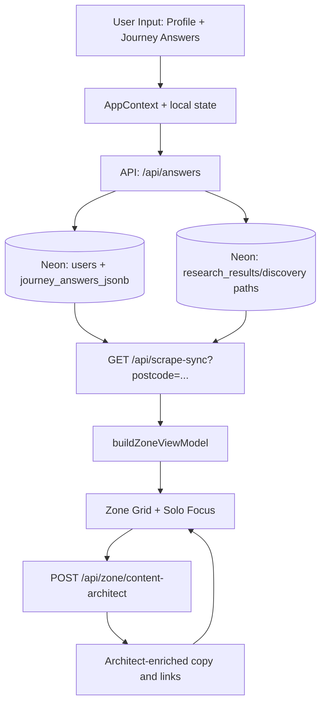

# User Flow And Data Pipeline

This document gives a single view of how users move through the app and how data flows through the system.

Related references:
- `docs/HANDBOOK.md`
- `docs/ZONE-CONTENT-AND-DATA.md`
- `docs/PROFILE-ANSWERS-ZONE-TECH.md`
- `docs/SENTINEL.md`

---

## 1) User Flow (End To End)

| Step | Route / Surface | What user does | What system does |
| --- | --- | --- | --- |
| 1 | `/` / `/intro` | Lands on intro and starts profile | Loads intro motion, optional postcode prefill from browser/geocode path |
| 2 | `/profile` | Completes onboarding questions | Saves profile answers to local state and session paths |
| 3 | `/profile/summary` | Reviews summary headline and totals framing | Builds summary words and transitions into Zone |
| 4 | `/zone` | Sees hero + 13 category cards | Fetches scrape snapshot, merges deterministic impact + research coverage, then renders cards |
| 5 | Zone card open (Solo Focus) | Opens a journey/tip card | Opens expanded card shell, loads question/result state |
| 6 | Solo Focus answer | Answers embedded question | Sends `POST /api/answers`, persists answer, recalculates impact, may trigger discovery/research paths |
| 7 | Solo Focus close | Returns to Zone | Uses visited/loop guardrails: visited (pink) cards close to grid only, no loop takeover |
| 8 | Ask Zai / tips interactions | Opens deeper guidance and CTA links | Uses existing context and trusted URL routing; no direct browser scraping |

---

## 2) Runtime Pipeline (High Level)

---

## 3) Data Pipeline By Layer

### Copy voice (warm auditor)

- **Persona:** trusted UK mate — calm, empathetic, data-honest; one line of dry humour per card at most (`lib/zone/zoneVoice.ts`). Numbers still from Neon / `buildUserImpact` only.
- **Write path:** scrape-sync / `researchAgent` → Neon `architect_prose` + `agent_headline` → optional `content-architect` batch → `buildZoneViewModel` + `contentProseSanitize` on read.
- **Expanded Solo Focus:** `resolveExpandedTrueTipInsight` uses per-**parent** `journey_key` coverage (`focusCategoryJourneyId`); short rows pad with `payoffSentence` (hands off to stamped £ / CO₂e).
- **Postcode:** all locality strings from profile/postcode APIs — never hardcoded area labels in `app/` or `lib/` UI paths.

### Client Layer
- **State hub:** `app/context/AppContext.tsx`
- **Zone orchestrator:** `app/zone/page.tsx`
- **Solo Focus UI:** `app/components/SoloFocusOverlay.tsx`
- **Visited/pink behavior:** local visited cards + journey-visited merge guardrails

### API Layer
- `POST /api/answers`: canonical answer commit path
- `GET /api/scrape-sync`: hydrates category coverage and latest research-backed snapshot
- `POST /api/zone/content-architect`: batch card copy generation/enrichment
- `GET /api/pulse/living`: live cap/rates/grid pulse data
- `POST /api/sentinel`: parallel signal layer (not the primary content source)

### Data Layer (Neon)
- `journey_answers_jsonb`: user answers by journey
- `research_results`: headlines, prose, saving values, source/offer URLs
- `guest_sessions`: pre-auth continuity
- `users`: profile and genome anchors

---

## 4) Category contract (what each journey must say)

Each Zone card only accepts Neon copy that passes `sanitizeArchitectProseForJourney` + `isAcceptableZoneJourneyHeadline` for that journey key. Wrong-category rows (e.g. BUS grant prose on `grants` with an e-bike headline) are treated as **unsettled** → Solo Focus shows **Computing…** until a valid scrape or `content-architect` row exists.

| Journey | Headline / topic lane | Prose must cover |
| --- | --- | --- |
| `home` | Fabric, heating, draughts, insulation | Loft, draught-proofing, heating waste — not e-bike or pure tariff-only dumps |
| `utilities` | Tariff, standing charge, direct debit | Ofgem cap / supplier switch maths for the user's fuel type |
| `grants` | BUS, ECO, local authority grants | Grant eligibility + installer path — not generic e-bike retail |
| `solar` | MCS install, export, self-use | Generation ROI — not boiler upgrade or BUS-only copy |
| `travel` | Commute, fuel, rail, EV | Transport swap — not loft or heat-pump grants |
| `holidays` | Flights, rail vs air, trip frequency | Holiday travel carbon — not home energy or e-bike schemes |
| `food` | Waste, basket, local outlets | Food waste / diet shift — not heat pumps |
| `shopping` | Repair, circular, durable goods | Purchase habits — not energy audit tables |
| `money` | Green finance, bills, direct debits | Household money moves — not shower heads or BUS |
| `tech` | Standby, smart heat, meters | Plug/load discipline — not loft insulation |
| `water` | Metering, Southern/regional water saves | Water volume — not gas boiler grants |
| `waste` | Council recycling, compost | Local waste rules — not tariff cap essays |
| `carbon` | Footprint tracking vs 12k kWh ≈ 1t | Audit framing — not meal planners or e-bike |

**Settled** means: per-journey coverage has verified £ **and** journey-valid headline or three-paragraph `architect_prose` (see `journeyResearchSettled` in `lib/researchSyncClient.ts`).

---

## 5) Flow Rules That Matter

- **Postcode-first:** locality-aware paths must derive from user postcode.
- **Mechanical truth first:** no fake money/carbon if research stream is absent.
- **Pink visited cards:** reopening is allowed, but close should return to grid without loop takeover.
- **Category boundaries:** generated copy must stay inside the active journey domain.
- **Trusted source links:** use valid absolute HTTPS sources for CTA and citations.

---

## 6) Operational Pipeline (Deploy + Health)

1. Verify app integrity (`npm run verify`).
2. Deploy with remote build + promote (`npm run deploy` → `scripts/deploy-production.sh`).
4. Validate health:
   - `GET /api/health?live=1`
   - `GET /api/health/diagnostics`
   - `GET /api/pulse/living?postcode=...`
6. Local dev: `vercel pull --yes --environment=production && cp .vercel/.env.production.local .env.local` then restart `npm run dev:3000` (fixes `/api/health` 503 and `/api/session-state` errors).
7. Dev pipeline gate: `npm run dev:pipeline-ready` (verify + health). Seed all 13 categories: `npm run dev:pipeline-ready -- --seed YOURPOSTCODE` or `bash scripts/seed-zone-research-all.sh http://127.0.0.1:3000 YOURPOSTCODE`.
8. Localhost `/zone` auto-bootstraps unsettled journeys via `lib/zone/devResearchBootstrap.ts` (staggered `POST /api/scrape-sync`). Production remains JIT unless `NEXT_PUBLIC_ZONE_DEV_BOOTSTRAP=1`.
9. Validate content hydration:
   - `GET /api/scrape-sync?postcode=...`
   - optional authenticated trigger `POST /api/scrape-sync` with `trigger` + `journey_key`

