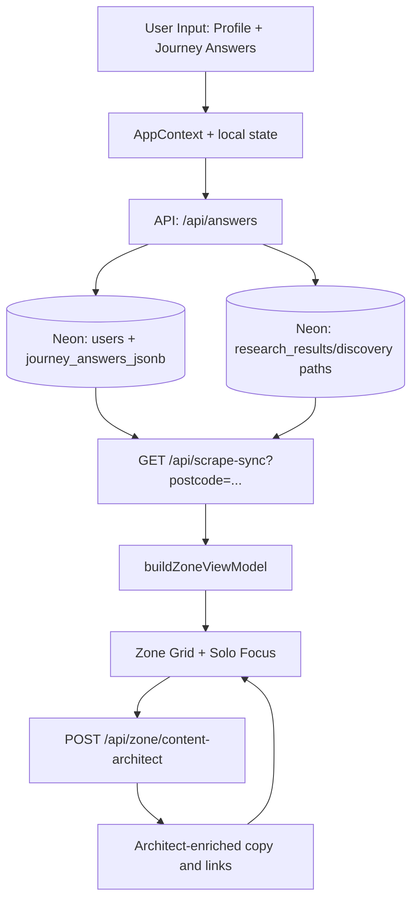

# User Flow And Data Pipeline

This document gives a single view of how users move through the app and how data flows through the system.

Related references:
- `docs/HANDBOOK.md`
- `docs/ZONE-CONTENT-AND-DATA.md`
- `docs/PROFILE-ANSWERS-ZONE-TECH.md`
- `docs/SENTINEL.md`

---

## 1) User Flow (End To End)

| Step | Route / Surface | What user does | What system does |
| --- | --- | --- | --- |
| 1 | `/` / `/intro` | Lands on intro and starts profile | Loads intro motion, optional postcode prefill from browser/geocode path |
| 2 | `/profile` | Completes onboarding questions | Saves profile answers to local state and session paths |
| 3 | `/profile/summary` | Reviews summary headline and totals framing | Builds summary words and transitions into Zone |
| 4 | `/zone` | Sees hero + 13 category cards | Fetches scrape snapshot, merges deterministic impact + research coverage, then renders cards |
| 5 | Zone card open (Solo Focus) | Opens a journey/tip card | Opens expanded card shell, loads question/result state |
| 6 | Solo Focus answer | Answers embedded question | Sends `POST /api/answers`, persists answer, recalculates impact, may trigger discovery/research paths |
| 7 | Solo Focus close | Returns to Zone | Uses visited/loop guardrails: visited (pink) cards close to grid only, no loop takeover |
| 8 | Ask Zai / tips interactions | Opens deeper guidance and CTA links | Uses existing context and trusted URL routing; no direct browser scraping |

---

## 2) Runtime Pipeline (High Level)

---

## 3) Data Pipeline By Layer

### Client Layer
- **State hub:** `app/context/AppContext.tsx`
- **Zone orchestrator:** `app/zone/page.tsx`
- **Solo Focus UI:** `app/components/SoloFocusOverlay.tsx`
- **Visited/pink behavior:** local visited cards + journey-visited merge guardrails

### API Layer
- `POST /api/answers`: canonical answer commit path
- `GET /api/scrape-sync`: hydrates category coverage and latest research-backed snapshot
- `POST /api/zone/content-architect`: batch card copy generation/enrichment
- `GET /api/pulse/living`: live cap/rates/grid pulse data
- `POST /api/sentinel`: parallel signal layer (not the primary content source)

### Data Layer (Neon)
- `journey_answers_jsonb`: user answers by journey
- `research_results`: headlines, prose, saving values, source/offer URLs
- `guest_sessions`: pre-auth continuity
- `users`: profile and genome anchors

---

## 4) Flow Rules That Matter

- **Postcode-first:** locality-aware paths must derive from user postcode.
- **Mechanical truth first:** no fake money/carbon if research stream is absent.
- **Pink visited cards:** reopening is allowed, but close should return to grid without loop takeover.
- **Category boundaries:** generated copy must stay inside the active journey domain.
- **Trusted source links:** use valid absolute HTTPS sources for CTA and citations.

---

## 5) Operational Pipeline (Deploy + Health)

1. Verify app integrity (`npm run verify`).
2. Build prod artifacts (`vercel build --prod`).
3. Deploy prebuilt output (`vercel deploy --prebuilt --prod --force`).
4. Validate health:
   - `GET /api/health?live=1`
   - `GET /api/health/diagnostics`
   - `GET /api/pulse/living?postcode=...`
5. Validate content hydration:
   - `GET /api/scrape-sync?postcode=...`
   - optional authenticated trigger `POST /api/scrape-sync` with `trigger` + `journey_key`

