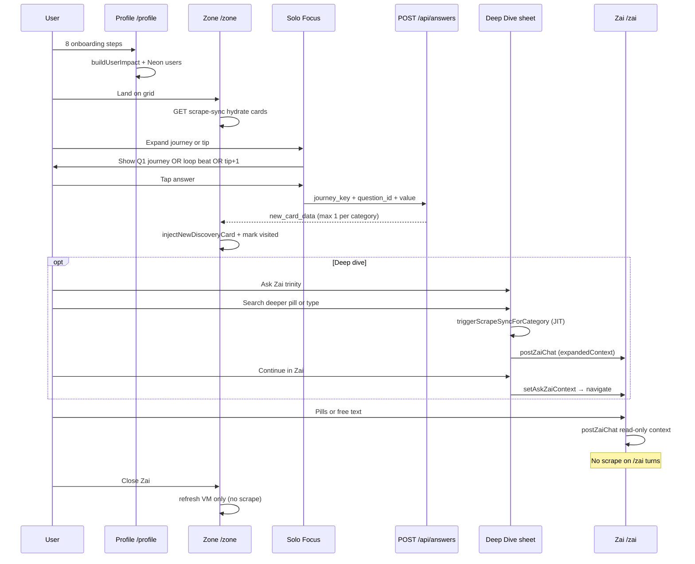
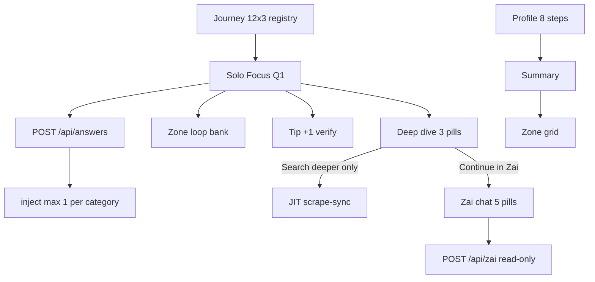

# Zai rules & complete question registry

Single reference for **Ask Zai chat**, **Ask Zai Deep Dive**, **profile onboarding**, **journey questions** (12 domains × 3), **Zone loop beats**, and **tip verification (+1)**.

**Code sources:** `lib/zai/chatRules.ts`, `lib/zai/chatBoundaries.ts`, `lib/zai/chatPrompts.ts`, `app/zai/page.tsx`, `app/components/AskZaiDeepDiveSheet.tsx`, `app/profile/ProfilePageClient.tsx`, `lib/journeys.ts`, `lib/zone/loopQuestions.ts`, `lib/zone/tipVerification.ts`, `lib/zone/visitedCards.ts`, `lib/brains/zai/prompts.ts`, `lib/brains/zai/boundaries.ts`.

Related: [HANDBOOK.md](HANDBOOK.md), [ZONE-CONTENT-AND-DATA.md](ZONE-CONTENT-AND-DATA.md) (scrape, card copy, Solo Focus, tone), [SENTINEL.md](SENTINEL.md), [SUPPLEMENTAL-SYSTEMS.md](SUPPLEMENTAL-SYSTEMS.md), [ULM-APPLICATION-LOOP.md](ULM-APPLICATION-LOOP.md), [PROFILE-ANSWERS-ZONE-TECH.md](PROFILE-ANSWERS-ZONE-TECH.md), [HYBRID-DATA-PIPELINE.md](HYBRID-DATA-PIPELINE.md), [INTELLIGENCE-LOOP-MANIFEST.md](INTELLIGENCE-LOOP-MANIFEST.md).

---

## Part 0 — Mechanical Truth boundaries (no overlap)

### Hybrid data pipeline (cost)

| Tier | Surface | Premium APIs |
|------|---------|--------------|
| A | Profile postcode step | **None** — Postcodes.io + Carbon Intensity (+ optional OpenEPC → `user_genome.open_data_anchor`) |
| B | Zone grid tile £/kg | **None** — `buildUserImpact` only |
| C | Solo Focus answer | **Hybrid spawn** when `MODEL_STRATEGY=bucket_failover` — `lib/zone/engineDataRouter.ts` locks £/kg, Gemini prose only |
| D | `/zai` | **None** — read-only matrix |

Hermes cron unchanged (repair backfill only). See [HYBRID-DATA-PIPELINE.md](HYBRID-DATA-PIPELINE.md).

### Global data matrix — who owns what

```
                  ┌──────────────────────────────────────────┐
                  │     ONBOARDING BASICS (Part 3)           │
                  │  Postcode, name, core habits, goal       │
                  │  → buildUserImpact → Neon / localStorage │
                  └────────────────────┬─────────────────────┘
                                       │ initial baseline
                                       ▼
┌────────────────────────────────────────────────────────────────────────┐
│                    ZONE GRID & LIVE DATABASE                         │
│  12 journey bentos · 24-cell ceiling · ≤3 injects / domain           │
│  1 card = 1 active question (journey Q or loop beat)                 │
│  Visited → pink / yellow (`visited_cards`)                           │
│  Canonical birth: POST /api/answers → injectNewDiscoveryCard (×1)    │
└──────────────────────────────┬─────────────────────────────────────────┘
                               │ read-only context
                               ▼
                  ┌──────────────────────────────────────────┐
                  │         ZAI CHAT (/zai)                  │
                  │  Transcript + Neon/profile only          │
                  │  NO scrape on chat turns                 │
                  │  3-beat · no markdown · no AI apology    │
                  └──────────────────────────────────────────┘
```

| Layer | Owns | Must not |
|-------|------|----------|
| **Onboarding** (8 steps) | Profile fields, postcode locality, `buildUserImpact` baseline | Zone loop questions, free Zai scrape |
| **Zone** | Journey + loop answers, card visit state, discovery inject (capped), GET scrape-sync hydrate | Duplicate questions on one card; inject on visited close |
| **Zai chat** | Interpret verified context + transcript (max 20 turns) | Broad Firecrawl, cron, `triggerScrapeSyncForCategory` |
| **Deep dive sheet** | In-card audit; **Search deeper** = only Zai-adjacent JIT scrape | Scrape on **Continue in Zai** (handoff only) |
| **Sentinel** | Live grid + home deck + `inject-sentinel-*` tips on Zone | **Not** Zai chat — see [SENTINEL.md](SENTINEL.md) |

**Enforced in code:** `lib/zai/chatBoundaries.ts`, `lib/zone/visitedCards.ts` (`shouldSkipInjectionOnCardClose`), `app/api/zai/route.ts` (read-only comment + no scrape calls), `lib/researchSyncClient.ts` (doc guard).

### Onboarding hydration flow

1. Eight profile steps (`ProfilePageClient.tsx`) capture demographics and goal.
2. On completion, answers feed **`buildUserImpact(profile, postcode)`** → approximate money/carbon baseline.
3. Payload persists to Neon / `localStorage` mirrors; **`GET /api/scrape-sync`** on Zone load hydrates cards from **`research_results`** — not a loose broad scrape at profile redirect.

### Zone card loop rules

| Rule | Implementation |
|------|----------------|
| **1 card = 1 question** | One active `EmbeddedJourneyQuestion` or loop beat per card surface; no stacked inputs. |
| **Single spawn** | User answers → targeted state → `POST /api/answers` → exactly **one** discovery card per answer → `injectNewDiscoveryCard`. |
| **Injection budget** | Up to **`MAX_DISCOVERY_INJECTIONS_PER_JOURNEY` = 3** per domain (`lib/intelligence/manifest.ts`). |
| **Visited flip** | `markCardVisited` on grid open (`onExpand` / tip click) → `.zone-card--visited`: journey tiles **purple→pink**, tips **pink→yellow** (or purple baseline tips → yellow when visited). |
| **Offer URLs** | `sanitizeZoneOfferUrl` (`lib/zone/offerUrlGuard.ts`): block 404 gov paths (e.g. great-british-insulation-scheme), bare `gov.uk` homepages, home↔grants cross-landing; fall back to `TRUSTED_JOURNEY_URLS` (EST, MSE, WRAP, railcards — not regulator homepages). |
| **Copy voice** | Content architect + True Tip: family kitchen-table tone; **home ≠ grants** mechanism; `collapseDuplicateProseParagraphs` + `isRawResearchDump` strip tariff/policy dumps. Full pipeline: **[ZONE-CONTENT-AND-DATA.md](ZONE-CONTENT-AND-DATA.md)**. |
| **Close credit guard** | If card already visited, close calls `onPatternShiftClose` with `visitedClose: true` → **no** loop takeover, **no** `spawnAchievementWhenLoopPoolExhausted`, **no** `/api/zone/injections` path from close (`lib/zone/patternShiftClose.ts`). |

### Zai chat sandbox

| Allowed JIT scrape surfaces | Forbidden on Zai chat |
|---------------------------|------------------------|
| `POST /api/answers` (server) | `POST /api/zai` turns |
| Tip +1 `runTipVerificationDeepScrape` | `Continue in Zai` navigation (context only) |
| Deep dive **Search deeper** only | Closing Zai (`ZAI_AUDIT_COMPLETE` = VM refresh only) |
| Zone `GET /api/scrape-sync` hydrate | Re-opening visited card close |

### Zai editorial contract (“active auditor with a pint”)

| Rule | Detail |
|------|--------|
| **Voice** | Calm UK mate; lowercase where natural; short phrases; dry irony OK; no `!` cheer or “Sure!” openers. |
| **3-beat** | Detection → Proof → Directive (embedded in prose, **not** labeled headings). |
| **Label-free** | No `#` / `##`, no `**What:**` — `stripZaiChatMarkdown()` on server + client. |
| **Thin context** | No postcode, answers, or £/kg totals → `i don't have enough information to be confident on that one. let's stick to your bills or travel moves.` |
| **Forbidden topics** | Financial / legal / medical → `i cannot offer financial, legal, or medical advice. let's stay focused on your home energy or travel moves.` |
| **Prompt matrix** | `ZAI_PERFORMANCE_AUDITOR_V3_MATRIX` in `lib/brains/zai/prompts.ts` (re-exported from `lib/zai/chatPrompts.ts`). |
| **UI** | `/zai` uses `postZaiChat` + stream reader (not a second widget bot); pills hide while loading. |
| **Fallback (empty/stream fail)** | `give me a sec — still checking what's live near you.` |

### API sketch (read-only turn)

```typescript
// lib/zai/chatBoundaries.ts — pattern; live handler: app/api/zai/route.ts POST
// 1. getZaiDeclineForQuestion(userMessage) → early JSON (no Gemini)
// 2. Load Neon journey_answers + profile + research rows (no scrape)
// 3. Gemini stream with ZAI_EDITORIAL_AUDITOR_DNA + 3-beat matrix
// 4. stripZaiChatMarkdown(polish(reply))
```

---

## How it all works together (integrated flow)

This section is the **wiring diagram**: how profile onboarding, Zone questions, answers, discovery cards, Deep Dive, and Zai chat share data **without** double-scraping or duplicate question banks.

### One-line summary

| Step | What happens |
|------|----------------|
| 1 | **Profile (8 questions)** → baseline money/carbon + Neon user row |
| 2 | **Zone** loads hero + 12 journey bentos from `research_results` (GET scrape-sync) |
| 3 | User opens a card → **Solo Focus** shows **one** journey question (Q1 from `lib/journeys.ts`) or a **loop beat** after close |
| 4 | User answers → **`POST /api/answers`** persists `journey_answers_jsonb`, may return **one** new discovery card → grid inject |
| 5 | Optional **Tip +1** or **Deep Dive** deepen that card; only **Search deeper** triggers a category scrape |
| 6 | **Zai chat** reads profile + journey answers + transcript + Neon research — **no scrape** on chat turns |
| 7 | **Continue in Zai** passes context into `/zai` once; next messages stay read-only |

All layers are gated in code (`chatBoundaries`, `visitedCards`, `perCategoryCardCap`, `ulmLimits`, `MAX_DISCOVERY_INJECTIONS_PER_JOURNEY = 3`).

### End-to-end user journey



### Which questions appear where (no overlap)

| When | Question source | Persisted as | Spawns discovery card? |
|------|-----------------|--------------|-------------------------|
| First time through profile | Part 3 — 8 steps only | `profile_*` keys + `users` | No |
| Solo Focus (first open on category) | Part 5 — journey **Q1** (`FUNKY_QUESTION_LABEL`) | `journey_{id}_answers` | Yes — via **`POST /api/answers`** |
| Full journey depth (profile/API path) | Part 4 — up to **3** per domain | `journey_{id}_answers` | Yes — same API, capped inject |
| After Solo Focus **close** (unvisited) | Part 6 — **loop beat** (`LOOP_QUESTION_BANK`) | `zz_loop_answers_log` + journey keys | Yes — if answer committed to API |
| After Solo Focus **close** (visited) | — | — | **No** — close credit guard |
| Tip card **+1** verify | Part 7 — verification follow-up | `targetField` in answers | Triggers **scoped scrape**, not free inject |
| Deep Dive pills | Part 2 — 3 fixed strings | Last question in sheet state | No inject — only Zai reply + optional JIT scrape |
| Zai chat pills | Part 1 — 5 suggested prompts | Chat transcript only | No — read-only turn |

**Rule:** Loop question IDs (`lifestyle_shift_pattern`, etc.) are **not** the same as journey registry IDs (`property_type`, etc.). Both validate through `isValidLoopOrJourneyQuestion` on `POST /api/answers`.

### Shared data bus (what Zai reads)

| Store | Keys / tables | Written by | Read by Zai |
|-------|---------------|----------|-------------|
| `localStorage` | `profile_*`, `journey_{id}_answers`, `heroTotals`, `visited_cards` | Profile, answers, visits | `postZaiChat` + `getJourneyAnswersFromClient()` |
| `sessionStorage` | `AskZaiContext` (handoff) | Deep Dive **Continue in Zai** | `/zai` mount once, then cleared |
| `localStorage` | `zz_recent_chat_history` (20 turns) | `/zai` chat | `/zai` reload |
| Neon | `users`, `journey_answers_jsonb`, `research_results` | Profile, answers, scrape-sync | `/api/zai` when logged in |
| Zone VM | `buildZoneViewModel` + injections | scrape-sync, inject cap | Zai via totals + expandedContext |

Zai **never** re-runs onboarding questions or loop beats in chat — it only **interprets** answers already stored.

### Deep Dive ↔ Zai chat ↔ Zone answers

| Action | UI | API / side effect | Injects grid card? |
|--------|-----|-------------------|-------------------|
| Answer in Solo Focus | Embedded question | `POST /api/answers` | Yes (canonical, max 1/category) |
| **Search deeper** in Deep Dive | Sheet pill / submit | `postZaiChat` + `triggerScrapeSyncForCategory` | No — answer stays in sheet |
| **Continue in Zai** | Sheet button | `setAskZaiContext` → `/zai` auto-send | No — uses handoff question as first user turn |
| Type in `/zai` | Chat input / 5 pills | `postZaiChat` only | No |
| Close visited card | × on pink card | `visitedClose` — skip loop/inject | No |

Handoff question shape (`lib/expandStorage.ts`):

`{user label} — I'm on "{card title}" in Zero Zero. Help me save or cut carbon for this.`

### Close behaviour (visited vs fresh)

```
User taps close on Solo Focus (journey tile)
        │
        ├─ loop beat already answered for this journey? ──YES──► close only (visitedClose)
        │
        └─ NO ──► pickNextLoopQuestion(journey)
                    ├─ beat available ──► DiscoveryTakeover (loop UI) → injectNewDiscoveryCard
                    └─ bank exhausted ──► spawnAchievementWhenLoopPoolExhausted (pink hero card)

inject-* tips: visited_cards contains tip id ──► close only (no loop)
```

Visited cards on the grid stay **pink/yellow**; re-open does not call `/api/zone/injections` on close.

### Enforcement checklist (working together now)

| Integration | Status | Where |
|-------------|--------|-------|
| Profile → hero baseline → Zone | Wired | `buildUserImpact`, `app/zone/page.tsx` hydrate |
| Journey answer → one discovery inject | Wired | `POST /api/answers`, `MAX_DISCOVERY_INJECTIONS_PER_JOURNEY = 3`, `perCategoryCardCap`, `engineDataRouter` |
| Loop answers → same API validator | Wired | `isValidLoopOrJourneyQuestion` |
| Visited close → no inject | Wired | `shouldSkipInjectionOnCardClose`, `PatternShiftCloseHandler` |
| Deep Dive scrape → Search deeper only | Wired | `AskZaiDeepDiveSheet.submit` |
| Continue in Zai → handoff, no scrape | Wired | `continueInZai` → `setAskZaiContext` only |
| Zai chat → read-only, no scrape | Wired | `app/api/zai/route.ts`, `chatBoundaries` |
| Zai close → Zone refresh only | Wired | `ZAI_AUDIT_COMPLETE_EVENT` → `refreshKey` |
| Chat + deep dive share `postZaiChat` | Wired | `lib/zai/chatClient.ts`, expandedContext on handoff |
| 3-beat + no markdown + no apology | Wired | `prompts.ts`, `stripZaiChatMarkdown` |

### Troubleshooting “feels disconnected”

| Symptom | Likely cause | Check |
|---------|--------------|-------|
| Zai invents £ not on grid | Chat not reading Neon stream | Logged-in session; `research_results` for postcode |
| Two cards same category | Old client cache | Bump `NEXT_PUBLIC_DATA_VERSION`; clear `visited_cards` |
| Scrape on every Zai message | Should not happen | Confirm no `triggerScrapeSync` in `app/zai/page.tsx` |
| Loop question after pink close | Credit guard bypass | `visited_cards` contains card id |
| Deep Dive + chat duplicate scrape | Continue pressed after Search deeper | Continue does not scrape; only submit does |

---

## Part 1 — Ask Zai chat (`/zai`)

### Layout & turn-taking (`lib/zai/chatRules.ts`)

| Rule | Behaviour |
|------|-----------|
| Intro | Always visible (`ZAI_INTRO_LINES`); thread appends below |
| Page title | `<h3 className="zz-page-title">` — global H3, left-aligned |
| Close | Viewport-locked × → Zone; `dispatchZaiAuditComplete()` |
| Scroll | `zai-page-scroll` scrolls; composer fixed at bottom (transparent, no gradient scrim) |
| Pills | Under intro if no Zai reply yet; else under **last non-empty Zai** bubble |
| Pills hidden | While loading, or when last turn is **user** |
| `connect` | Fixed dock only while streaming |
| Input | Fixed dock; 2px shadow on field |
| Bubbles | 30px radius, 15px padding (intro + Zai + user) |

### Intro copy (`lib/zai/chatPrompts.ts`)

1. `i read your zone — money, carbon, and what you actually do at home.`
2. `pick a prompt or ask your own. one uk move, this week.`

### Cold-start hook (first Zai bubble when no handoff)

- With hero totals: `i've got £{money}/yr and {carbon}kg on your board in {place}. pick a lane — bills, travel, or grants — and i'll narrow it to one move.`
- Without totals: `i'm zai — your uk savings mate. tell me one bill or trip that nags you in {place}; i'll find a real lever.`

### Suggested prompt pills (`ZAI_CHAT_SUGGESTED_PROMPTS`)

| # | Prompt |
|---|--------|
| 1 | `where should i start?` |
| 2 | `cut home energy bills` |
| 3 | `travel without the guilt` |
| 4 | `what grant fits me?` |
| 5 | `one change this week` |

### Session flow

1. **Cold start** — intro + hook (above) when no `AskZaiContext`.
2. **Handoff** — `sessionStorage` `AskZaiContext` consumed once on mount → auto user message → streamed Zai reply.
3. **Free chat** — user types or pill → `POST /api/zai` with transcript, `journey_*_answers`, postcode, hero totals.
4. **History** — last 20 messages → `zz_recent_chat_history`.
5. **Fallback** — `give me a sec — still checking what's live near you.`

### Handoff question template (`lib/expandStorage.ts`)

- With journey label: `{label} — I'm on "{cardTitle}" in Zero Zero. Help me save or cut carbon for this.`
- Default: `I want to know more about "{cardTitle}" and how I can save. Can you help?`
- Deep dive default if empty: `How can I close the saving gap for this category?`

### AI voice & boundaries

**Persona:** Zai — UK savings mate; **Detection → Proof → Directive** (3 beats). See `lib/brains/zai/prompts.ts` (`ZAI_EDITORIAL_AUDITOR_DNA`, `ZAI_PERFORMANCE_AUDITOR_V3_MATRIX`).

**Allowed:** explain sustainability; reference card data; small actions; footprint; tradeoffs.

**Forbidden:** financial / medical / legal advice; promised savings; invented products/stats/brands; absolute claims.

**When unsure:** `I don't have enough information to be confident.`

**API:** `POST /api/zai` (streaming). Client guard: `isForbiddenQuestion()` in `lib/brains/zai/boundaries.ts`.

### Reply chrome (`lib/zai/zaiChatUi.ts`)

On recommendation-shaped replies: **Like**, **source** (URL in prose), **profile answer** link when journey answers exist. Handoff replies always get Like meta.

---

## Part 2 — Ask Zai Deep Dive sheet

**Component:** `app/components/AskZaiDeepDiveSheet.tsx`  
**Opened from:** Solo Focus or expanded bento — **Ask Zai** in action trinity.

### UI rules

| Piece | Rule |
|-------|------|
| Shell | Bottom sheet (portal); zip-up; max ~80dvh; scrim closes |
| Header | Category label + **Deep dive** + card headline |
| Pills | Parent-supplied `suggestedQuestions` (see below) |
| Answer | Streamed below pills |
| Input placeholder | `Ask about this shift…` |
| Submit | **Search deeper** — `postZaiChat` + optional `triggerScrapeSyncForCategory` |
| Continue | **Continue in Zai** — `setAskZaiContext` → `/zai` |

### Deep dive suggested questions (fixed — Solo Focus & bento)

| # | Question |
|---|----------|
| 1 | `Why this shift saves money` |
| 2 | `What is the carbon trade-off` |
| 3 | `What is the next concrete step` |

User may also type a **free-form** question in the sheet input (same API path as submit).

### Submit behaviour

1. Build API question via `buildSoloFocusAskZaiQuestion(headline, userLabel)`.
2. POST `/api/zai` with `expandedContext` (category, spend, regional avg, shift title, scraped source, journey answers).
3. JIT scrape when postcode ≥ 4 chars (`triggerScrapeSyncForCategory`).

---

## Part 3 — Profile onboarding questions

**Route:** `/profile` → `ProfilePageClient.tsx` (`PROFILE_QUESTIONS`)  
**Not** the 12-domain journey bank — those are in Part 4.

| Step | ID | Prompt | Type | Options / placeholder |
|------|-----|--------|------|------------------------|
| 1 | `name` | `name` | text input | placeholder: `alex` |
| 2 | `postcode` | `postcode` | text input | placeholder: `postcode` |
| 3 | `livingSituation` | `who do you live with?` | options | `ALONE`, `COUPLE`, `FAMILY`, `SHARED` |
| 4 | `homeType` | `your home?` | options | `FLAT`, `HOUSE` |
| 5 | `transport` | `how do you get around?` | options | `WALK`, `BIKE`, `PUBLIC`, `CAR`, `MIX` |
| 6 | `age` | `how old are you?` | options | `JUNIOR`, `MID`, `RETIRED` |
| 7 | `employmentStatus` | `employment status?` | options | `EMPLOYED`, `SELF_EMPLOYED`, `UNEMPLOYED` |
| 8 | `goal` | `what is your goal?` | options | `SAVE` → money, `REDUCE` → carbon, `BOTH` → balanced |

After profile: `/profile/summary` → `/zone`.

---

## Part 4 — Journey questions (12 domains × 3)

**Source of truth:** `lib/journeys.ts` (`JOURNEYS`, `QUESTIONS_PER_JOURNEY = 3`).

- **Profile / API:** all three per domain (`getJourneyQuestionsForProfile`).
- **Solo Focus:** first question only per domain (`SOLO_FOCUS_QUESTIONS_PER_JOURNEY = 1`) — see Part 5.
- **Validation:** `isValidJourneyQuestion(journeyId, questionId)` on `POST /api/answers`.

### Home

| ID | Label | Options |
|----|-------|---------|
| `property_type` | Is your property detached or semi-detached? | `DETACHED`, `SEMI`, `TERRACED`, `FLAT` |
| `insulation_level` | Current insulation (loft / cavity)? | `FULL`, `PARTIAL`, `NONE`, `UNKNOWN` |
| `glazing_type` | Double or triple glazed? | `TRIPLE`, `DOUBLE`, `SINGLE`, `UNKNOWN` |

### Grants

| ID | Label | Options |
|----|-------|---------|
| `boiler_age` | Is your boiler over 10 years old? | `OVER_10YR`, `UNDER_10YR`, `UNKNOWN` |
| `income_benefits` | Are you on any income-related benefits? | `YES`, `NO`, `PREFER_NOT` |
| `prior_eco_bus` | Have you had previous ECO4 or BUS grants? | `YES`, `NO`, `UNSURE` |

### Solar

| ID | Label | Options |
|----|-------|---------|
| `roof_orientation` | Roof pitch orientation (S / E / W)? | `SOUTH`, `EAST`, `WEST`, `MIXED`, `FLAT` |
| `roof_shading` | Do you have a chimney or significant shading? | `NONE`, `CHIMNEY`, `TREES`, `BOTH` |
| `daytime_occupancy` | Average daytime occupancy at home? | `HIGH`, `MEDIUM`, `LOW`, `OUT_MOST_DAYS` |

### Travel

| ID | Label | Type | Options / notes |
|----|-------|------|-----------------|
| `commute_distance` | Daily commute distance (miles)? | number | repeat: `Even a rough estimate helps — miles per day?` |
| `ev_hybrid` | Do you own an EV or hybrid? | options | `EV`, `HYBRID`, `PETROL_DIESEL`, `NONE` |
| `public_transport` | Public transport access near you? | options | `EXCELLENT`, `LIMITED`, `NONE` |

### Holidays

| ID | Label | Options |
|----|-------|---------|
| `annual_flights` | Annual flight count? | `NONE`, `ONE_TWO`, `THREE_PLUS` |
| `flight_duration` | Average flight duration (hours)? | `SHORT`, `MEDIUM`, `LONG_HAUL` |
| `carbon_offsets` | Do you buy carbon offsets? | `YES`, `NO`, `SOMETIMES` |

### Food

| ID | Label | Options |
|----|-------|---------|
| `diet_profile` | Meat-heavy or plant-based? | `MEAT_HEAVY`, `FLEXI`, `PLANT_BASED` |
| `organic_shopping` | Percentage of organic shopping? | `HIGH`, `SOME`, `RARELY`, `NEVER` |
| `own_produce` | Do you grow any of your own produce? | `YES`, `NO`, `STARTING` |

### Shopping

| ID | Label | Options |
|----|-------|---------|
| `retail_channel` | High-street or second-hand first? | `HIGH_STREET`, `SECOND_HAND`, `MIXED` |
| `repair_mindset` | Repair vs replace mindset? | `REPAIR_FIRST`, `REPLACE`, `MIXED` |
| `online_deliveries` | Frequency of online deliveries? | `DAILY`, `WEEKLY`, `MONTHLY`, `RARELY` |

### Money

| ID | Label | Type | Options / notes |
|----|-------|------|-----------------|
| `monthly_energy_bill` | Monthly energy bill (£)? | number | repeat: `Rough figure is fine — what do you pay per month?` |
| `tariff_type` | Fixed or variable tariff? | options | `FIXED`, `VARIABLE`, `UNKNOWN` |
| `green_investments` | Interest in green investments? | options | `HIGH`, `SOME`, `NONE` |

### Tech

| ID | Label | Options |
|----|-------|---------|
| `smart_thermostat` | Smart thermostat (Nest / Hive)? | `YES`, `NO`, `PLANNED` |
| `smart_home` | Home Assistant or smart plugs? | `YES`, `NO`, `PARTIAL` |
| `smart_meter` | Smart meter installed? | `YES`, `NO`, `UNKNOWN` |

### Water

| ID | Label | Options |
|----|-------|---------|
| `garden_butt` | Garden size suitable for water butts? | `LARGE`, `SMALL`, `NONE` |
| `wash_preference` | Shower or bath preference? | `SHOWER`, `BATH`, `BOTH` |
| `rainwater_harvest` | Rainwater harvesting setup? | `YES`, `NO`, `PLANNED` |

### Waste

| ID | Label | Options |
|----|-------|---------|
| `food_waste_collection` | Access to food waste collection? | `YES`, `NO`, `PARTIAL` |
| `composting` | Composting on-site? | `YES`, `NO`, `SHARED` |
| `soft_plastics` | Soft plastic recycling habit? | `ALWAYS`, `SOMETIMES`, `NEVER` |

### Carbon

| ID | Label | Options |
|----|-------|---------|
| `footprint_awareness` | Are you aware of your total footprint? | `YES`, `ROUGH`, `NO` |
| `carbon_removal` | Interest in carbon removal? | `HIGH`, `SOME`, `NONE` |
| `tonne_reduction_timeline` | Timeline for 1t reduction? | `THIS_YEAR`, `ONE_TO_THREE`, `LONGER` |

---

## Part 5 — Solo Focus (one journey question per session)

**Cap:** `SOLO_FOCUS_MAX_QUESTIONS_PER_SESSION = 3` in `lib/animations.ts` (embedded chamber); registry exposes **one** high-leverage question per open (`getSoloFocusQuestions`).

**Displayed label on Zone bento (first question only):** `FUNKY_QUESTION_LABEL` in `lib/journeys.ts`:

| Journey | Solo Focus prompt (Q1 label) |
|---------|------------------------------|
| home | Is your property detached or semi-detached? |
| grants | Is your boiler over 10 years old? |
| solar | Roof pitch orientation (S / E / W)? |
| travel | Daily commute distance (miles)? |
| holidays | Annual flight count? |
| food | Meat-heavy or plant-based? |
| shopping | High-street or second-hand first? |
| money | Monthly energy bill (£)? |
| tech | Smart thermostat (Nest / Hive)? |
| water | Garden size suitable for water butts? |
| waste | Access to food waste collection? |
| carbon | Are you aware of your total footprint? |

---

## Part 6 — Zone loop questions (post–Solo Focus beats)

**Source:** `lib/zone/loopQuestions.ts` (`LOOP_QUESTION_BANK`).  
**Rules:** each `questionId` shown **at most once** per browser profile; `pickNextLoopQuestion(journeyId)` prefers beats tagged for that journey (or global beats with empty `journeyKeys`).

| questionId | Prompt (UI) | Journey tags | Answer options (value) |
|------------|-------------|--------------|-------------------------|
| `lifestyle_shift_pattern` | swap your annual / flight for rail? | (any) | YES — RAIL & LOCAL · MAYBE — SHOW ME · NO — KEEP FLYING |
| `travel_rail_vs_flight` | rail instead / of flying? | travel | YES — RAIL · SHOW ME THE MATH · KEEP FLYING |
| `travel_ev_commute` | ev for your / commute? | travel, money | YES — EV · COMPARE COSTS · KEEP PETROL |
| `holidays_local_vs_longhaul` | uk staycations / not long-haul? | holidays | YES — LOCAL · MAYBE · KEEP LONG-HAUL |
| `holidays_train_not_plane` | train to europe / not short flights? | holidays, travel | YES — TRAIN · SHOW ROUTES · KEEP FLYING |
| `food_plant_shift` | two plant-based / meals a week? | food | YES · TRY IT · NOT YET |
| `food_waste_cut` | cut food waste / by half? | food, waste | YES · SHOW TIPS · NOT YET |
| `money_ev_swap` | swap petrol / for an ev? | money | YES — EV · COMPARE COSTS · KEEP PETROL |
| `money_smart_tariff` | switch to a / smart tariff? | money, home | YES — SWITCH · COMPARE · STAY PUT |
| `home_heat_pump` | heat pump / not gas? | home | YES · CHECK ELIGIBILITY · STAY ON GAS |
| `home_loft_insulate` | loft insulation / this year? | home, grants | YES · GET QUOTE · NOT YET |
| `grants_bus_boiler` | check bus grant / for your boiler? | grants, home | YES · MORE INFO · NOT ELIGIBLE |
| `solar_roof_fit` | solar on your / roof? | solar, home | YES · FREE SURVEY · NOT YET |
| `shopping_repair_first` | repair before / you replace? | shopping | YES · SHOW LOCAL · BUY NEW |
| `tech_standby_off` | kill standby / at night? | tech | YES · SHOW HOW · NOT YET |
| `water_meter_save` | water meter / save water? | water | YES · CHECK · NO METER |
| `waste_compost` | compost food / scraps? | waste, food | YES · TRY IT · NOT YET |
| `carbon_offset_cut` | cut direct / emissions first? | carbon | YES · SHOW PLAN · OFFSET ONLY |

Answers persist to `zz_loop_answers_log` and `journey_{id}_answers` (loop ids). Valid on `POST /api/answers` via `isValidLoopOrJourneyQuestion`.

---

## Part 7 — Tip verification (+1) questions

**Source:** `lib/zone/tipVerification.ts` — one follow-up per journey before earned deep scrape (Solo Focus tip path). Card may override with its own `followUp`.

| Journey | Question | Options |
|---------|----------|---------|
| home | Is your loft insulated to 270mm? | YES, PARTLY, NO |
| grants | Are you on any income-related benefits? | YES, NO, PREFER NOT |
| solar | Do you have a south-facing roof? | YES, PARTLY, NO |
| travel | Could you switch one flight to rail this year? | YES, MAYBE, NO |
| holidays | Could your next break stay in the UK? | YES, MAYBE, NO |
| food | Do you batch-cook to cut food waste? | YES, SOMETIMES, NO |
| shopping | Do you delay non-essential buys 48 hours? | YES, SOMETIMES, NO |
| money | Are you on a smart or time-of-use tariff? | YES, NOT SURE, NO |
| tech | Do you leave devices on standby overnight? | YES, SOMETIMES, NO |
| water | Do you have a water meter? | YES, NO, NOT SURE |
| waste | Do you compost food scraps at home? | YES, SOMETIMES, NO |
| carbon | Could you shift heavy use off-peak? | YES, MAYBE, NO |

---

## Quick map — where questions appear

See **How it all works together** above for the full sequence. Compact view:



| Surface | Count | File |
|---------|-------|------|
| Profile onboarding | 8 | `ProfilePageClient.tsx` |
| Journey registry | 36 (12×3) | `lib/journeys.ts` |
| Solo Focus (shown) | 12 (Q1 each) | `lib/journeys.ts` |
| Zone loop bank | 18 beats | `lib/zone/loopQuestions.ts` |
| Tip verification | 12 | `lib/zone/tipVerification.ts` |
| Deep dive pills | 3 | `SoloFocusOverlay.tsx`, `JourneyBentoCard.tsx` |
| Zai chat pills | 5 | `lib/zai/chatPrompts.ts` |

---

*Last synced with repo registry files — update **How it all works together** when changing handoff, inject caps, or scrape gates. Update question tables when editing `journeys.ts`, `loopQuestions.ts`, or `chatPrompts.ts`. Zone content: **[ZONE-CONTENT-AND-DATA.md](ZONE-CONTENT-AND-DATA.md)** · Sentinel: **[SENTINEL.md](SENTINEL.md)** · Gary/rebirth/pattern shift: **[SUPPLEMENTAL-SYSTEMS.md](SUPPLEMENTAL-SYSTEMS.md)**.*
