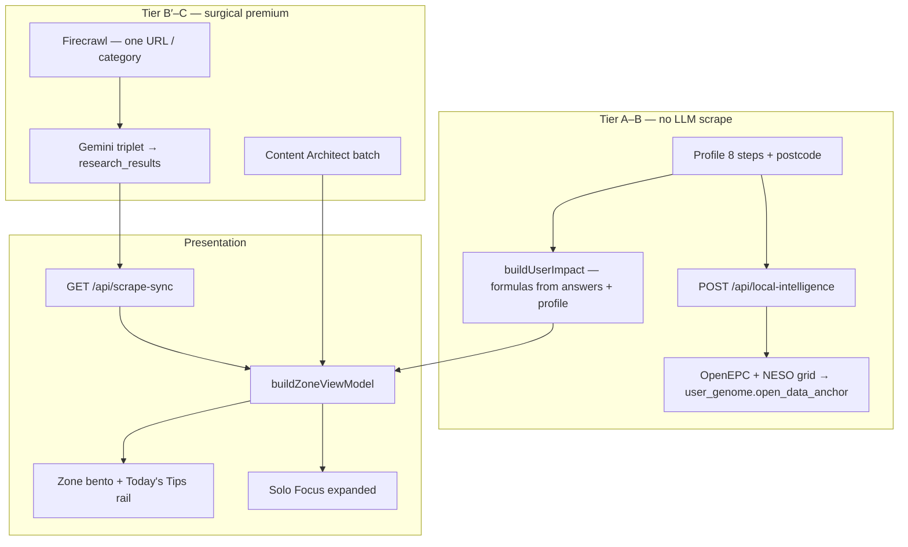

# Zone content, data, scrape & presentation

Canonical reference for **where Zone copy and numbers come from**, **what we scrape and why**, **how cards and Solo Focus present it**, and **tone of voice** across Architect, True Tip, and Zai.

**Related:** [HANDBOOK.md](HANDBOOK.md) · [PROFILE-ANSWERS-ZONE-TECH.md](PROFILE-ANSWERS-ZONE-TECH.md) (12×3 + mechanical truth) · [HYBRID-DATA-PIPELINE.md](HYBRID-DATA-PIPELINE.md) (cost tiers) · [ZAI-AND-QUESTIONS-RULES.md](ZAI-AND-QUESTIONS-RULES.md) (boundaries + question registry) · [INTELLIGENCE-LOOP-MANIFEST.md](INTELLIGENCE-LOOP-MANIFEST.md) (Hermes + persist) · [ULM-APPLICATION-LOOP.md](ULM-APPLICATION-LOOP.md) (ceilings + spawn) · [SENTINEL.md](SENTINEL.md) (parallel live layer) · [SUPPLEMENTAL-SYSTEMS.md](SUPPLEMENTAL-SYSTEMS.md) (Gary mode, pattern shift, rebirth vault, research paths).

**Code map:** `lib/zone/buildZoneViewModel.ts` · `lib/brains/buildUserImpact.ts` · `lib/agents/researchAgent.ts` · `lib/agents/contentArchitect.ts` · `lib/soloFocusCopy.ts` · `lib/zone/offerUrlGuard.ts` · `lib/zone/trustedJourneyUrls.ts` · `app/components/JourneyBentoCard.tsx` · `app/components/RockSavingTips.tsx`.

---

## 1. Mental model

Zero Zero is **postcode-first**. The Zone wall should read as a **local audit**, not a generic savings blog.

| Layer | Owns | Premium cost |
|--------|------|--------------|
| **Profile onboarding** | Who you are, postcode, habits, goal | **Free** — Postcodes.io, Carbon Intensity, optional OpenEPC |
| **Deterministic engine** | Annual £ and kg CO₂e per journey | **Zero** — `buildUserImpact` |
| **Research stream** | Headlines, three-paragraph prose, offer URLs | **Firecrawl + Gemini** (surgical, capped) |
| **Content Architect** | Polishes grid + expanded copy from **locked** £/kg | **Gemini batch** — `POST /api/zone/content-architect` |
| **Zai chat** | Explains stored context | **No scrape** on `POST /api/zai` |

### Mechanical truth

If Neon has **no stream** for a journey, the bento tile shows **COMPUTING — HOME** (etc.), metrics **—**, and **£0** — not marketing placeholder totals.

- Empty DB + postcode → `GET /api/scrape-sync` → `{ source: "pending", scraped: [] }`
- Shape defaults in `lib/scraper/uk2026Defaults.ts` are **zero**, labels **Computing...**
- `buildUserImpact` does **not** back-fill UK marketing leads when totals are 0
- `journeyHasStreamData` in `lib/zone/mechanicalTruth.ts` gates live £/headlines

Details: **[PROFILE-ANSWERS-ZONE-TECH.md](PROFILE-ANSWERS-ZONE-TECH.md)** §4.

---

## 2. End-to-end data flow



### Cost tiers (summary)

| Tier | Surface | Premium APIs |
|------|---------|--------------|
| **A** | Profile postcode step | None |
| **B** | Zone grid baseline £/kg | None — `buildUserImpact` only |
| **B′** | Cached `research_results` copy | Only if row empty — surgical seed + Gemini triplet |
| **C** | Solo Focus `POST /api/answers` | Hybrid spawn when `MODEL_STRATEGY=bucket_failover` |
| **D** | `/zai` chat | None — read-only Neon |

Full table: **[HYBRID-DATA-PIPELINE.md](HYBRID-DATA-PIPELINE.md)**.

---

## 3. Storage (Neon + client)

### Neon hot path

| Table / column | Role |
|----------------|------|
| **`research_results`** | Per `category` (journey key): `saving_amount_gbp`, `verified_saving`, `agent_headline`, `architect_prose`, `offer_url`, `source_url`, `user_id`, postcode |
| **`research_snapshot`** (JSONB) | Invoke metadata (Hermes / hybrid-pipeline / repair flags) — not user-facing prose |
| **`journey_answers_jsonb`** | 13 domains × 3 behavioural answers |
| **`users.user_genome`** | `open_data_anchor` (EPC + grid snapshot at hydrate) |
| **`scraped_summary`** | Legacy hero aggregates when populated |
| **`discovery_injections`** | Capped supplemental cards |
| **`guest_sessions`** | Pre-login profile + answers (`zz_sid`) |

### Client mirrors

- **`AppContext`** + **`localStorage`**: `profile_postcode`, journey answers, `visited_cards`
- **`GET /api/answers`** on boot — server wins over stale client cache
- **`GET /api/scrape-sync`** on Zone load — hydrates `research_category_coverage` + scraped overlay inputs

### `insightReady` (scrape-sync)

True when a category row has prose, headline, £, or offer URL — bento face hides “Computing…” once settled. **`GET ?repair=1`** backfills missing headlines/prose without a full `force` research run.

---

## 4. What we scrape, why, and when

Scraping is **never** “crawl the whole web for this postcode.” It is **surgical**: one **journey category** at a time, anchored to postcode + profile + (often) a specific answer.

| Trigger | Entry | Why |
|---------|--------|-----|
| **Zone load hydrate** | `GET /api/scrape-sync?postcode=` | Read existing rows; if empty → honest **pending** |
| **Solo Focus answer** | `POST /api/answers` → optional `triggerScrapeSyncForCategory` | User earned context for that journey |
| **Tip +1 verification** | `runTipVerificationDeepScrape` → scrape-sync `repair=1` | Estimated → verified after user confirms |
| **Deep Dive “Search deeper”** | JIT inside `AskZaiDeepDiveSheet` | Only Zai-adjacent surface allowed fresh fetch |
| **Hermes / cron (weekly)** | `GET /api/cron/zone-research?repair=1` | **Backfill** incomplete rows — not day-to-day discovery |
| **Broad force** | `POST /api/scrape-sync?force=true` | **Blocked** in `bucket_failover` unless `ALLOW_BROAD_SCRAPE=1` |

### Firecrawl

- **Module:** `lib/agents/researchAgent.ts` — `scrapeFirecrawlZoneResearchStructured`
- **Shape:** `schemas/firecrawl-zone-research.v2.json` structured extract + markdown
- **Skip:** `SKIP_FIRECRAWL=1`, missing `FIRE_CRAWL_KEY_2` / `FIRECRAWL_API_KEY` → mechanical + Neon fallbacks

### Gemini on research persist

On `persistResearchResult`:

| Field | Use |
|-------|-----|
| **`agent_headline`** | Zone bento preview — target **6–8 words** |
| **`architect_prose`** | Solo Focus body — **three paragraphs**, label-free |
| **`offer_url`** | BUY / Claim CTA after sanitization |
| **`saving_amount_gbp`** | Verified £ on card + prose |

### Guards (credit + trust)

| Guard | Module |
|-------|--------|
| Visited card → no re-scrape on re-open | `lib/zone/visitedCards.ts`, `lib/researchSyncClient.ts` |
| Zai chat → read-only, no Firecrawl | `lib/zai/chatBoundaries.ts`, `app/api/zai/route.ts` |
| Category lane lock (one journey per request) | `lib/intelligence/scrapeBoundaries.ts` |
| Injection cap per journey | `MAX_DISCOVERY_INJECTIONS_PER_JOURNEY` in `lib/intelligence/manifest.ts` |
| Visited close → no inject on tip close | `lib/zone/patternShiftClose.ts` |

---

## 5. How £ and kg are calculated (vs copy)

**Numbers on tiles** come from **`buildUserImpact`** (`lib/brains/buildUserImpact.ts`) — the **only** place money and carbon are calculated. UI must not invent totals.

1. Profile + journey answers → per-journey functions in `lib/brains/calculations.ts` (annualized).
2. When Solo Focus answers were cleared (e.g. after `/profile/summary`) but postcode / home / transport remain, **`lib/brains/profileJourneyBaseline.ts`** supplies **synthetic mid-band answers** so tiles are not £0 — badge stays **`ESTIMATED_AUDIT`** until Neon stream + genome complete.
3. Optional **scraped overlay** (≤20% delta) when scrape-sync provides data points.
4. **`buildZoneViewModel`** shows SAVE/CARBON when stream, utilities seed, or **`profileHasImpactBaseline`** — not only Neon.

**Questions** in `lib/journeys.ts` are **behavioural only** — they refine the model; they do not embed “save £400” in labels.

### Audit badges

| Badge | When |
|-------|------|
| **`LIVE_AUDIT`** | Verified Neon money + genome complete enough |
| **`ESTIMATED_AUDIT`** | Stream exists but profile still thin |

Set in `buildZoneViewModel` via `vmAuditLive()`.

---

## 6. Zone wall — collapsed bento cards

Built in **`lib/zone/buildZoneViewModel.ts`**, rendered as **`JourneyBentoCard`** (`app/zone/page.tsx` groovy grid).

| UI element | Source |
|------------|--------|
| **Headline** | `zoneCardHeadlineFromRaw` ← Neon `agent_headline` → Content Architect → cleaned title; **5–8 words** on grid (`cleanZonePreviewHeadline`, `isZonePreviewHeadlineNoise`) |
| **SAVE / CARBON** | `formatZoneCardMoney` / carbon from impact + stream |
| **Insight strip** | **Estimated** — *“Estimated from your profile — local audit still loading.”* when `auditState === ESTIMATED_AUDIT'` and research not settled but profile £ shows (`lib/zone/zoneAuditUi.ts`). **Computing** — spark icon when still loading and no estimated strip. |
| **Category colour** | `lib/journeyColors.ts` |
| **Visited (pink)** | Mother tile: pink after loop + `completeCleanBirth`. Discovery inject: pink on close. `.zone-card--visited` — see **Director's Order** in [HANDBOOK.md](HANDBOOK.md) |
| **Source line** | `source. …` attribution — **not** long prose |

### Motion

**Atomic crystallize:** bento ripple via `ZONE_ATOMIC_BENTO_VARIANTS` + stagger (`lib/motion-family.ts`). Wall hidden until `revealedCardCount ≥ 1` and `pulseWordsComplete`.

**Grid reveal stability (`app/zone/page.tsx`):** after Architectural Pulse completes, cards stagger in at **2×** `ZONE_GRID_STAGGER_CHILD_DELAY_SEC` (not 3×). `revealedCardCount` only resets to **0** when pulse phase is not `done` — not when `displayItems` grows after scrape-sync (avoids flash-then-stall). Dev localhost bootstrap seeds unsettled journeys once; it does **not** schedule `refreshKey` poll timers (those used to re-hydrate the whole grid and interrupt reveal).

### Today's Tips rail (Rock)

Separate from 13 journey mother bentos — **not** duplicate wall headlines or journey audit copy.

| Concern | Rule | Code |
|---------|------|------|
| **Catalog** | Static habits + learn URLs | `lib/rock/habitsCatalog.ts` → `habitToTipCard` |
| **Card IDs** | `rock-{slug}` (e.g. `rock-radiator-bleed`) | `rockCardId()` |
| **Grid headline** | Short habit title (**3–10 words**) — **never** `ZONE_BENTO_HOOK` / wall mother hook | `clampRockTipHeadline` |
| **Rail fill** | Prefer journeys **not** on wall; one habit per `journey_key`; dedupe wall headline keys; **6** visible slots (rotation cap **12**) | `prepareRockHabitsForRail`, `filterRockHabitsAgainstWall` |
| **Fallback** | When every journey has a mother tile, still fill six tips from catalog if titles differ from wall hooks | `prepareRockHabitsForRail` second pass (`requireOffWall: false`) |
| **UI** | **`RockSavingTips`** — heading **Today's Tips** (`aria-label="Today's tips"`) | `app/components/RockSavingTips.tsx` |
| **Mobile signup** | E.164 → `POST /api/profile/mobile` with `tipSlugs` + `recommendations` from visible Zone → structured signup SMS | `RockMobileSignupCard`, `lib/messaging/signupZoneSms.ts` |
| **Visit** | Pink on close (`visitedClose`) — **no** loop, **no** tip verification scrape | Director's Order in [HANDBOOK.md](HANDBOOK.md) |
| **Label colour** | Category label uses `--journey-text` at rest and on hover — Rock grid excluded from main Zone `data-zone-surface='tip'` purple-header override | `app/globals.css` |

**Anti-pattern (fixed):** Rock habits share a `journey_key` with wall mothers (e.g. both `home`). Without the Rock-specific Solo Focus path below, expand reused **`EXPANDED_JOURNEY_HOOK[home]`**, Neon **`architect_prose`**, and mother **£/kg** — so “bleed radiators” opened as “seal draughts…” at £180.

### Discovery & injects

| Path | Role |
|------|------|
| **`POST /api/answers`** → `injectNewDiscoveryCard` | **Canonical** birth — one discovery per answer (JSON `new_card_data` / `grid_pulse_card`) |
| **`POST /api/zone/injections`** | Trap follow-up — supplemental, capped |
| **`POST /api/research/question-card`** | Free-form Ask — supplemental, capped |

Ceilings: **`MAX_DISCOVERY_INJECTIONS_PER_JOURNEY` = 3** · **`MAX_ZONE_BENTO_CELLS` = 24** (`lib/zone/ulmLimits.ts`).

---

## 7. Expanded card — Solo Focus

**Open:** `onExpand` → `rememberSoloFocusOpen` / `openSoloFocus` → **`JourneyBentoCard`** QUESTION chamber (inject tips + Rock: **`SoloFocusOverlay`**). Pink lock waits for loop birth — not expand.

### Two expand paths

| Path | Detect | H1 | £ / CO₂e | Lead prose |
|------|--------|-----|----------|------------|
| **Journey mother / discovery** | `journey-*`, `inject-*`, … | `headlineFromExpandedHook` → **`EXPANDED_JOURNEY_HOOK`** when title weak | Neon audit row when settled (`verifiedAuditMoneyGbp`) | `architect_prose` via `buildResearchResultsTrueTipBody` |
| **Today's Tips (Rock)** | `cardId.startsWith('rock-')` | **`headlineFromRockHabit(title, insight)`** — habit title + catalog insight; **never** journey hook | Catalog `money_gbp` / `carbon_kg` from `habitToTipCard` | Habit `insight` only — **no** `researchCategoryCoverage[journey_key]` |

Rock expand resolves the habit in `app/zone/page.tsx` via `ROCK_BY_SLUG` + `habitToTipCard`; passes `verifiedArchitectProse={null}` and `verifiedAuditMoneyGbp={null}` so journey audit cannot override habit numbers.

### Layout (Zai Architect)

| Zone | Content |
|------|---------|
| **H1 (Marvin)** | **20–24 word** hook — mother: `headlineFromExpandedHook`; Rock: `headlineFromRockHabit` |
| **Lead (Marvin H4)** | Locality audit opener — **≤30 words**; **town** from `locationState.locationName` (`lib/zone/localityCopy.ts`), never raw postcode |
| **Body** | **Not rendered in UI** (May 2026) — `SoloFocusProseStack` is **lead-only**; £/CO₂e live in the metrics row. Neon `architect_prose` still stored for polish / Zai context paths. |
| **Metrics** | Mother: verified £ + CO₂e from Neon when settled; Rock: catalog habit row |
| **Trinity** | Ask Zai → deep dive; Continue in Zai → handoff; RECLAIM / BUY → `MotherCardRenderer` + `IndustrialHandoffButton` |
| **Questions** | **One** registry Q per open — zip-shut MC answer → **RESULT**; close → loop question (`DiscoveryTakeover`). **Rock:** close only — no loop, no tip verification |

### Warm auditor voice (copy — 2026)

Persona: **trusted UK mate** — calm, empathetic, data-honest; at most one line of dry humour per card (`lib/zone/zoneVoice.ts`). Numbers only from Neon / `buildUserImpact`.

**Source of truth (no UI filler):**

| Layer | Owner | Rule |
|--------|--------|------|
| **Neon `research_results`** | `researchAgent` / scrape-sync | Three paragraphs from Gemini + surgical scrape; locality from geocode / profile |
| **Content Architect** | `POST /api/zone/content-architect` | Batch polish: friction / lever / action; category locks; `ZONE_CONTENT_ARCHITECT_VOICE` |
| **Solo Focus display** | `resolveSoloFocusDisplayProse` | Marvin **lead only** (H4); no Roboto body block — metrics row owns £/CO₂e |
| **Locality** | `lib/zone/localityCopy.ts` | `resolveSoloFocusPlaceLabel` + `personalizeTrueTipPlaceLead` — town in lead, not postcode |
| **Sanitizer** | `lib/zone/contentProseSanitize.ts` | Strip leakage, demo postcodes, cross-category pollution on read |

**Not used for card prose:** `lib/soloFocusCopy.ts` generic placeholders, demo postcodes, or static “local data” paragraphs in the client.

### Three prose beats (no UI labels)

Embedded in copy only — **never** `# What:` / `**Why:**` in the UI.

1. **Friction** — data-backed waste for the category (compact £ / kg).
2. **Leverage** — July 2026 Ofgem cap or grant fact from `lib/brains/constants.ts` when relevant (April figures kept for policy-step copy only).
3. **Payoff** — single closing line, e.g. *“We've put about £X a year and around Y CO₂e against your {topic} row — from your saved audit, not a guess.”* (`payoffSentence` in `lib/zone/auditorNarrative.ts` — deduped by `dedupeTrueTipParagraphs` / `paragraphRepeatsPayoffStamp`).

### Quality gates (`lib/soloFocusCopy.ts`)

| Function | Purpose |
|----------|---------|
| `stripExpandedCardTitleNoise` | Clean Solo Focus H1 |
| `clampRockTipHeadline` | Today's Tips **grid** — short catalog title; never wall `ZONE_BENTO_HOOK` |
| `headlineFromRockHabit` | Rock Solo Focus H1 — title + habit insight; **never** `EXPANDED_JOURNEY_HOOK` |
| `headlineFromExpandedHook` + `EXPANDED_JOURNEY_HOOK` | **20–24 word** Marvin hook for **journey mothers**; per-journey fallback when DB title is thin, jargon, or off-topic (e.g. travel: rail/bus commute swap — not generic “near you” padding) |
| `dedupeTrueTipParagraphs` / `paragraphRepeatsPayoffStamp` | Drop duplicate payoff / repeated blocks before render |
| `isMechanicalScaffoldParagraph` / `isBoilerplateProseParagraph` | Strip *Execute the…*, *We treat the ~£…*, *optimization plan*, *green funding frameworks*, thin *“Your X is high-value”* |
| `collapseDuplicateProseParagraphs` | No repeated sentences within a block |
| `polishTrueTipParagraphsForHeadline` | Dedupe + de-headline-echo on open paragraph |
| `isRawResearchDump` | Reject tariff/policy blobs |
| `pruneDuplicateLocalityInsight` | Don't repeat H1 locality in body |
| Category separation | **home ≠ grants** — insulation vs BUS/ECO wording |

### Headline word limits

| Surface | Limit | Enforcer |
|---------|-------|----------|
| Zone bento | **5–8** | `enforceHeadlineWordLimits(text, false)` |
| Today's Tips grid | **3–10** (catalog title) | `clampRockTipHeadline` |
| Solo Focus expanded hook (mother) | **20–24** (~3–4 lines) | `headlineFromExpandedHook` → per-journey `EXPANDED_JOURNEY_HOOK` when title is weak or generic spring filler (`isGenericSpringHeadline`); mechanical proof via `lib/zone/auditorNarrative.ts` (no shared “policy and tariff pressure…” block) |
| Solo Focus expanded hook (Rock) | **20–24** (~3–4 lines) | `headlineFromRockHabit` — habit title + insight; **no** journey hook substitution |
| Solo Focus Marvin lead (H4) | **≤30** words | `resolveSoloFocusDisplayProse` + `buildAuditorDetectionParagraph` when lead lacks town opener |
| Paragraph | ≤ **40** words each | `MAX_TRUE_TIP_PARAGRAPH_WORDS` |

### After an answer

```
POST /api/answers
  → upsert journey_answers_jsonb
  → buildUserImpact
  → (optional) discovery race → injectNewDiscoveryCard
  → zip-shut → next single question
  → optional Tier 2 mother/child morph (scoped scrape-sync)
```

**Visited close:** `shouldSkipInjectionOnCardClose` — no inject/scrape burn on tip close.

---

## 8. Offer URLs (BUY / source)

Pipeline: `research_results.offer_url` → **`sanitizeZoneOfferUrl`** (`lib/zone/offerUrlGuard.ts`) → CTA.

| Rule | Behaviour |
|------|-----------|
| Block 404 gov paths | e.g. great-british-insulation-scheme |
| Block bare `gov.uk` homepages | Fall back to trusted URL |
| Home ↔ grants cross-landing | BUS on home tile → EST home URL; warm-homes on grants → BUS apply URL |
| Fallback | **`TRUSTED_JOURNEY_URLS`** — EST, MSE, WRAP, railcards (`lib/zone/trustedJourneyUrls.ts`) |

CTA labels: **`resolveRevenueCtaLabel`** (`lib/zone/verifiedRevenue.ts`) — Claim / Buy / Get. If no HTTPS offer, handoff may use **`/zai`** audit URL.

---

## 9. Content Architect (polish layer)

Async after VM is built:

1. Client: `buildContentArchitectCardPayload(vm, journeyAnswers, locality, live unit rates, …)`
2. **`POST /api/zone/content-architect`** → `generateCardContextsBatch` (`lib/agents/contentArchitect.ts`)
3. **`applyArchitectEnrichment`** merges `headline`, `insight` (3 ¶), `actionLine`, `suppliedBy`

Architect receives **locked** £/kg — it does not recalculate totals.

### Architect tone (system prompt summary)

- **`ZONE_CONTENT_ARCHITECT_VOICE`** (`lib/zone/zoneVoice.ts`) — warm, caring, compact £ facts
- Uppercase functional headlines (5–8 words bento; expanded hook up to 20 words)
- No emojis, no cheerleading, no dev-speak (`tile`, `pipeline`, `morph`)
- Category locks enforced per `journey_key` (see [USER-FLOW-AND-DATA-PIPELINE.md](USER-FLOW-AND-DATA-PIPELINE.md) §4)
- **home** = insulation, draughts, heating — never grants/BUS wording
- **grants** = BUS, ECO, heat pump funding only
- Each journey: distinct mechanism — no reused opening sentence
- No dev-speak: tile, lane, anchored, component

---

## 10. Tone of voice by surface

| Surface | Persona | Scrape on turn? |
|---------|---------|-----------------|
| Zone bento + Solo Focus | Warm auditor (`zoneVoice.ts`) — Marvin hook + lead + Roboto body | On answer / tip+1 / hydrate; localhost bootstrap (dev) |
| Content Architect | Same warm voice (batch polish) | N/A (batch) |
| **`/zai` chat** | “Active auditor with a pint” — calm UK mate, dry irony OK | **Never** on `POST /api/zai` |
| Deep Dive sheet | Same matrix, in-card | **Search deeper** only |

### Zai chat contract

- **Matrix:** `ZAI_PERFORMANCE_AUDITOR_V3_MATRIX` — `lib/brains/zai/prompts.ts` (re-export `lib/zai/chatPrompts.ts`)
- **3-beat** in prose — Detection → Proof → Directive (no labeled headings)
- **`stripZaiChatMarkdown`** server + client
- Thin context → *“i don't have enough information to be confident on that one. let's stick to your bills or travel moves.”*
- Forbidden: financial / legal / medical advice
- No “Sure!”, cheer, exclamation spam

Full boundaries + question registry: **[ZAI-AND-QUESTIONS-RULES.md](ZAI-AND-QUESTIONS-RULES.md)**.

---

## 11. Content vs data — quick lookup

| User sees | Data source | Copy owner |
|-----------|-------------|------------|
| Grid headline | `agent_headline` + Architect + cleaners | `soloFocusCopy`, `contentArchitect` |
| Grid £/kg | `buildUserImpact` + `journeyHasStreamData` | `calculations.ts` |
| Expanded H1 (mother) | 20–24 word hook, 3–4 lines | `headlineFromExpandedHook`, `stripExpandedCardTitleNoise` |
| Expanded H1 (Rock) | 20–24 word hook from habit title + insight | `headlineFromRockHabit` |
| Today's Tips grid title | Short catalog habit title | `clampRockTipHeadline`, `habitsCatalog` |
| Expanded lead (H4) | ≤30 words; town from `locationState` | `resolveSoloFocusDisplayProse`, `buildAuditorDetectionParagraph`, `localityCopy.ts` |
| Expanded lead (H4) | Town from `locationState` | `localityCopy.ts`, `personalizeTrueTipPlaceLead` |
| Expanded body | `architect_prose` or auditor fallback | `buildResearchResultsTrueTipBody`, `toThreeTrueTipParagraphs` |
| No-offer footer | When no HTTPS partner URL | *“No live retailer link this week — figures still come from your saved audit row.”* (`JourneyBentoCard`, `SoloFocusOverlay`) — not “Fresh Audit…” dev-speak |
| BUY link | `offer_url` → sanitizer → trusted fallback | `offerUrlGuard`, `trustedJourneyUrls` |
| Questions | `lib/journeys.ts` | Static behavioural copy |
| Today's Tips grid | Rock catalog + rail filter | `RockSavingTips`, `prepareRockHabitsForRail`, `habitsCatalog` |
| Rock Solo Focus £/kg | Habit catalog row | `habitToTipCard` — not Neon `research_results` |
| Pink / yellow visit | `visited_cards` + `POST /api/zone/visit` | `.zone-card--visited` in `globals.css` |

---

## 12. Boundary diagram (who must not overlap)

```
                  ┌──────────────────────────────────────────┐
                  │     ONBOARDING (8 profile steps)       │
                  │  Postcode → buildUserImpact baseline     │
                  └────────────────────┬─────────────────────┘
                                       │
                                       ▼
┌────────────────────────────────────────────────────────────────────────┐
│                    ZONE GRID & research_results                        │
│  12 bentos · tips rail · ≤3 injects/journey · 1 Q per card             │
│  Visited → pink / yellow                                               │
│  Canonical birth: POST /api/answers → injectNewDiscoveryCard           │
└──────────────────────────────┬─────────────────────────────────────────┘
                               │ read-only
                               ▼
                  ┌──────────────────────────────────────────┐
                  │         ZAI CHAT (/zai)                  │
                  │  Transcript + Neon only — NO scrape        │
                  └──────────────────────────────────────────┘
```

| Layer | Must not |
|-------|----------|
| Onboarding | Zone loop questions, broad Zai scrape |
| Zone | Duplicate questions on one card; inject on visited close |
| Zai chat | Firecrawl, cron, `triggerScrapeSyncForCategory` |
| Deep dive | Scrape on **Continue in Zai** (context handoff only) |

---

## 13. Verification

```bash
# Local
npm run verify && npm run build

# Honest empty Zone (prod)
curl -sS "https://www.00-00.online/api/scrape-sync?postcode=BN17" | jq '.source, (.scraped | length)'

# Latest Neon row
npm run db:log-research
```

---

## 14. Sentinel (parallel layer — not main scrape copy)

Sentinel does **not** fill `research_results` headlines for all 12 journeys. It provides:

- **Live-Impact** grid/rates on Zone (`useSentinel` → `POST /api/sentinel`)
- **Home mother/child deck** in `journey_state` (`advanceHomeJourneySentinelAfterAnswer` after home answers)
- **`inject-sentinel-*`** priority tips + optional rural grant card

Full spec: **[SENTINEL.md](SENTINEL.md)**.

---

## 15. Supplemental systems

| System | Doc section |
|--------|-------------|
| Gary / BN17 demo `user_id` | [SUPPLEMENTAL-SYSTEMS.md](SUPPLEMENTAL-SYSTEMS.md) §2 |
| Pattern shift vs visited close | §3 |
| Rebirth vault discovery race | §4 |
| Tier 2 / tip +1 scrape | §5 |
| `triggerSupplementalResearch` vs canonical birth | §1 |
| Fallback zone tips | §9 |

---

## 16. Why it is designed this way

1. **Trust** — show £ only with a research stream or honest COMPUTING state.
2. **Cost** — surgical scrape, visited lock, bucket failover, Hermes repair-only cron.
3. **Clarity** — one question per card; one discovery spawn per answer; home ≠ grants.
4. **Action** — real HTTPS offers or trusted fallbacks, not dead gov homepages.
5. **Voice** — same auditor from grid → Solo Focus → Zai; chat stays read-only so it cannot invent £ not on the wall.

---

*Update this doc when changing `buildZoneViewModel`, `contentArchitect`, `soloFocusCopy`, scrape boundaries, or visit/inject rules.*
